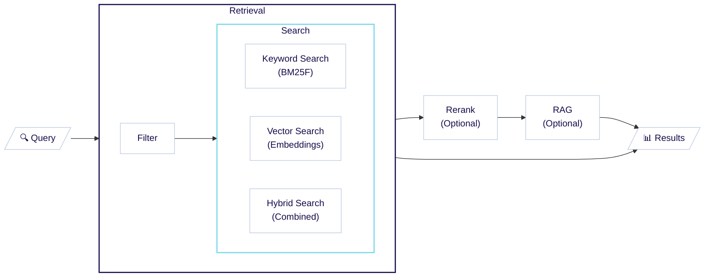

Weaviate は、柔軟で高速かつスケーラブルな検索を実現し、数十億規模のデータセットでもユーザーが目的のデータをすばやく見つけられるようにします。

Weaviate を使用すると、ニーズに合わせてさまざまな検索タイプを実行でき、検索設定を調整してパフォーマンスと精度を最適化できます。

以下のセクションでは、 [検索プロセスとその種類](#search-process) を含む Weaviate における検索の概念的な概要を説明します。

## 検索プロセス

次の表と図は、 Weaviate における検索プロセスを示しています。コアとなる検索プロセスの周囲には、検索結果を改善・操作するための複数のステップがあります。

| ステップ | 説明 | 任意 |
|------|-------------|----------|
| 1. [Retrieval](#retrieval-filter) | <strong>[Filter](#retrieval-filter):</strong> 条件に基づいて結果セットを絞り込み<br/><strong>[Search](#retrieval-search):</strong> [keyword](#keyword-search)・[vector](#vector-search)・[hybrid](#hybrid-search) のいずれかの検索タイプで最も関連性の高いエントリを取得<br/> | 必須 |
| 2. [Rerank](#rerank) | 別の（より複雑な）モデルで結果を再順位付け | 任意 |
| 3. [検索拡張生成](#retrieval-augmented-generation-rag) | 取得したデータとプロンプトを生成系 AI モデルへ送信します。 retrieval augmented generation (RAG) とも呼ばれます。 | 任意 |

<center>



</center>

各ステップの概要を簡単に示します。

### Retrieval: フィルタ

:::info 一文で言うと
<i class="fa-solid fa-filter"></i> フィルタは、特定の条件に基づいてオブジェクト数を減らします。
:::

フィルタは、以下のような条件に基づいてオブジェクト数を減らします。

- テキスト一致
- 数値のしきい値
- 日付範囲
- カテゴリ値
- 地理的位置

フィルタリングを活用することで、結果セットを正確に絞り込み、検索の関連性を大幅に向上させることができます。

:::info フィルタは検索とどのように連携するのですか？
Weaviate では [プレフィルタリング](../filtering.md) が適用され、フィルタは検索より前に実行されます。<br/>

これにより、検索結果がフィルタ条件と必ず重なり、適切なオブジェクトのみが取得されます。
:::

<details>
  <summary>フィルタ: 例</summary>

`animal_objs` のようなデータセットでは、特定の色でフィルタリングして条件に合致するオブジェクトのみを取得できます。<br/>

```json
[
    {"description": "brown dog"},
    {"description": "small domestic black cat"},
    {"description": "orange cheetah"},
    {"description": "black bear"},
    {"description": "large white seagull"},
    {"description": "yellow canary"},
]
```

`"description"` に `"black"` を指定してフィルタリングすると、黒色を示すオブジェクトのみが返されます。

- `{'description': 'black bear'}`
- `{'description': 'small domestic black cat'}`
<br/>

Weaviate では、他の順位付けが適用されていない場合、これらの結果の順序はオブジェクトの UUID に基づきます。したがって、フィルタは条件に合致するかどうかだけを判断するため、実質的に順序はランダムになります。
</details>

### Retrieval: 検索

:::info 一文で言うと
<i class="fa-solid fa-magnifying-glass"></i> 検索は、クエリとの関連性に基づいてオブジェクトを並べたリストを生成します。
:::

検索は、クエリに最も近い、または関連性の高いデータオブジェクトを見つけるプロセスです。 Weaviate は主要な 3 種類の検索をサポートしています: [keyword search](#keyword-search)、[vector search](#vector-search)、[hybrid search](#hybrid-search)。

| 検索タイプ | 説明 |
|-------------|-------------|
| Keyword Search | 「トークン」の頻度に基づく従来型のテキスト検索 |
| Vector Search | ベクトル埋め込みによる類似度検索 |
| Hybrid Search | ベクトル検索とキーワード検索を組み合わせた検索 |

:::tip Search と Filter の違い
フィルタは条件に合致するかどうかを判断するだけで、結果の順位付けは行いません。<br/>

検索では、結果がクエリへの関連性に基づいて **順位付け** されます。
:::

これらの検索タイプを詳しく見ていきましょう。

#### Keyword Search

Keyword Search は、キーワード一致の「スコア」に基づいて結果を順位付けします。このスコアは、クエリ内のトークンが各データオブジェクトにどの程度出現するかを評価し、 BM25 アルゴリズムで統合して算出します。

<details>
  <summary>Keyword Search: 例</summary>

`animal_objs` のようなデータセットでは、特定の色をキーワード検索して、その重要度を確認できます。<br/>

```json
[
    {"description": "brown dog"},
    {"description": "small domestic black cat"},
    {"description": "orange cheetah"},
    {"description": "black bear"},
    {"description": "large white seagull"},
    {"description": "yellow canary"},
]
```

`"black"` をキーワード検索すると、黒色を持つオブジェクトのみが返され、 BM25 アルゴリズムで順位付けされます。
1. `{'description': 'black bear'}`
1. `{'description': 'small domestic black cat'}`
<br/>

`{"description": "black bear"}` は、テキスト中で「black」が占める割合が高いため、 `{"description": "small domestic black cat"}` より高いスコアになります。
</details>

<details>
  <summary>Keyword Search を使うべきケース</summary>

Keyword Search は、特定の単語の出現がテキストの関連性を強く示す場合に有効です。

例えば:
- 医学・法律文献で特定の用語を含む文書を探す。
- 正確な用語が重要な技術ドキュメントや API リファレンスを検索する。
- EC データベースで特定の製品名や SKU を見つける。
- プログラミングの文脈でコードスニペットやエラーメッセージを探す。

</details>

:::info さらに詳しく
Keyword Search の詳細については、[keyword search](./keyword-search.md) ページをご覧ください。
:::

#### ベクトル検索

ベクトル埋め込みを用いた類似度ベースの検索です。この方法では、あらかじめ定義された [距離メトリック](../../config-refs/distances.md) に基づき、クエリのベクトル埋め込みと保存されたオブジェクトのベクトル埋め込みを比較し、最も近いものを見つけます。

 Weaviate では、ベクトル検索を複数の方法で実行できます。 [テキスト入力](../../search/similarity.md#search-with-text)、[ベクトル入力](../../search/similarity.md#search-with-a-vector)、あるいは[既存のオブジェクト](../../search/similarity.md#search-with-an-existing-object)を基に類似オブジェクトを検索可能です。さらに、[画像を使った検索](../../search/image.md)など他のモダリティでも類似オブジェクトを検索できます。

<details>
  <summary>ベクトル検索：例</summary>

以下のような `animal_objs` データセットでは、意味的に類似した単語を使ってベクトル検索を行い、それらがどれほど関連性が高いかを取得できます。  
<br/>

```json
[
    {"description": "brown dog"},
    {"description": "small domestic black cat"},
    {"description": "orange cheetah"},
    {"description": "black bear"},
    {"description": "large white seagull"},
    {"description": "yellow canary"},
]
```

ここで `"black"` を検索するとキーワード検索と同様に動作します。しかし、ベクトル検索では `"very dark"`、`"noir"`、`"ebony"` のようなクエリでも類似した結果が得られます。  
<br/>

これは、ベクトル検索が使用された単語の一致ではなく、テキストから抽出された意味に基づいているためです。ベクトル埋め込みはテキストの意味を捉えているため、より柔軟な検索が可能になります。  
<br/>

結果として、上位 3 件の結果は次のとおりです:  
1. `{'description': 'black bear'}`  
1. `{'description': 'small domestic black cat'}`  
1. `{'description': 'orange cheetah'}`

</details>

<details>
  <summary>ベクトル検索を使用するタイミング</summary>

ベクトル検索は、人間的な「類似度」の概念が結果品質の良い指標となる場面に最適です。

例えば:  
- セマンティックテキスト検索: 異なる単語を使っていても意味が近い文書を見つける。  
- マルチリンガル検索: 異なる言語間で関連するコンテンツを探す。  
- 画像類似検索: 大規模なデータベースから視覚的に類似した画像を探す。

</details>

:::info Read more
Weaviate におけるベクトル検索の詳細は、[ベクトル検索](./vector-search.md) ページをご覧ください。
:::

#### ハイブリッド検索

ベクトル検索とキーワード検索を組み合わせ、両者の強みを活かします。2 つの検索を実行し、ハイブリッド融合手法や alpha 値など選択したパラメータを用いて結果を統合します。

<details>
  <summary>ハイブリッド検索：例</summary>

以下の `animal_objs` データセットでは、ハイブリッド検索を行うことで両方の利点を活かし、関連オブジェクトを堅牢に見つけられます。  
<br/>

```json
[
    {"description": "brown dog"},
    {"description": "small domestic black cat"},
    {"description": "orange cheetah"},
    {"description": "black bear"},
    {"description": "large white seagull"},
    {"description": "yellow canary"},
]
```

`"black canine"` というハイブリッド検索では、キーワード検索により説明文に `"black"` を含むオブジェクトが高く評価されるため、`{"description": "small domestic black cat"}` と `{"description": "black bear"}` が上位に表示されます。  
<br/>

しかしベクトル検索が `"dog"` とクエリとの高い類似度を検出するため、`{"description": "brown dog"}` のように説明文に `"dog"` を含むオブジェクトもブーストされます。  
<br/>

結果として、上位 3 件の結果は次のとおりです:  
1. `{"description": "black bear"}`  
1. `{"description": "small domestic black cat"}`  
1. `{"description": "brown dog"}`

</details>

<details>
  <summary>ハイブリッド検索を使用するタイミング</summary>

ハイブリッド検索は堅牢な検索タイプであり、出発点として最適です。いずれか一方の検索で優れている結果をブーストする傾向があります。

例えば:  
- 学術論文検索: キーワードの関連性とクエリとのセマンティック類似度の両方に基づいて論文を見つける。  
- 求人マッチング: スキルのキーワード一致と職務記述のセマンティック理解を組み合わせて適切な候補者を特定する。  
- レシピ検索: 具体的な材料（キーワード）と料理全体の類似度（ベクトル）の両方を考慮してレシピを探す。  
- カスタマーサポート: 正確な用語一致と概念的な類似度の両面からサポートチケットやドキュメントを見つける。

</details>

:::info Read more
Weaviate におけるハイブリッド検索の詳細は、[ハイブリッド検索](./hybrid-search.md) ページをご覧ください。
:::

### 取得：順序なし

ランキング機構を使用せずにクエリを作成することもできます。

たとえば、クエリがフィルターだけで構成されている場合や、[cursor API](../../manage-objects/read-all-objects.mdx) を使用してデータセット全体を反復処理したい場合などです。

このように順序なしの取得要求を行った場合、 Weaviate は UUID の順序でオブジェクトを返します。そのため、実質的にはランダムに並んだオブジェクト一覧になります。

### リランキング

:::info In one sentence
<i class="fa-solid fa-sort"></i> リランカーは、より複雑なモデルまたは異なる基準を用いて初期取得結果を再順位付けします。
:::

リランキングは、初期結果を並べ替えることで検索の関連性を向上させます。

コレクションが [リランカー統合](../../model-providers/index.md) を設定している場合、 Weaviate は設定されたリランカー・モデルを使用して初期検索結果を再順位付けします。

これにより、より計算コストの高いモデルを少量の結果に対してのみ適用し、全体的な検索品質を向上できます。典型的には、[Cohere Rerank](../../model-providers/cohere/reranker.md) や [Hugging Face Reranker](../../model-providers/transformers/reranker.md) のようなクロスエンコーダーモデルが用いられ、テキストをより詳細に理解できます。

また、リランカーは取得に用いたものとは異なる入力クエリを提供できるため、より複雑な検索戦略を実現できます。

<details>
  <summary>リランキングを使用するタイミング</summary>

リランキングは、小さな結果集合に対してより複雑なモデルを適用し、検索結果の品質を高めたい場合に有用です。オブジェクト集合が非常に微妙または特定業界に特化している場合などに必要になることがあります。

例えば、法律・医療・科学文献の検索では、テキストをより詳細に理解する必要があります。リランキングは最も関連性の高い結果を表面化するのに役立ちます。
</details>

### 検索拡張生成 (RAG)

:::info In one sentence
<i class="fa-solid fa-robot"></i> 検索拡張生成は、検索と生成 AI モデルを組み合わせ、検索結果を基に新しいコンテンツを生成します。
:::

検索拡張生成 (RAG) は、生成検索 (generative search) とも呼ばれ、検索と生成 AI モデルを組み合わせて検索結果を基に新しいコンテンツを生成する強力な手法です。

 Weaviate は、[AWS](../../model-providers/aws/generative.md)、[Cohere](../../model-providers/cohere/generative.md)、[Google](../../model-providers/google/generative.md)、[OpenAI](../../model-providers/openai/generative.md)、[Ollama](../../model-providers/ollama/generative.md) など多くの人気ジェネレーティブモデルプロバイダーと統合できます。

その結果、 Weaviate では RAG を[簡単に設定](../../manage-collections/generative-reranker-models.mdx#specify-a-generative-model-integration)でき、[単一の統合クエリとして簡単に実行](../../search/generative.md#grouped-task-search)できます。

<details>
  <summary>RAG：例</summary>

以下の `animal_objs` データセットでは、検索拡張生成を他の検索方法と組み合わせて関連オブジェクトを取得し、その結果を変換できます。  
<br/>

```json
[
    {"description": "brown dog"},
    {"description": "small domestic black cat"},
    {"description": "orange cheetah"},
    {"description": "black bear"},
    {"description": "large white seagull"},
    {"description": "yellow canary"},
]
```

たとえば、`"black"` というキーワード検索と、RAG リクエスト `"What do these animal descriptions have in common?"` を実行するとします。  
<br/>

検索結果は `{"description": "black bear"}` と `{"description": "small domestic black cat"}` になります。その後、ジェネレーティブモデルがクエリを基に出力を生成します。一例として、次のような回答が得られました:  
<br/>

```text
"What these descriptions have in common are:

* **Color:** Both describe animals with a **black** color.
* **Species:**  One is an **animal**, the other describes a **breed** of animal (domesticated)."
```
</details>

## 検索スコアと評価指標

Weaviate では、クエリに対する検索結果をランキングするためにさまざまな指標を使用します。  
Weaviate で利用される主な指標は次のとおりです。

- ベクトル距離: クエリとオブジェクト間のベクトル距離指標。  
- BM25F スコア: BM25F アルゴリズムで計算されるキーワード検索スコア。  
- ハイブリッドスコア: ベクトル検索とキーワード検索を組み合わせたスコア。

## さらなるリソース

詳細については、以下のページをご参照ください。  
- [コンセプト: ベクトル検索](./vector-search.md)  
- [コンセプト: キーワード検索](./keyword-search.md)  
- [コンセプト: ハイブリッド検索](./hybrid-search.md).

これらの検索タイプの使用方法を示すコードスニペットは、[How-to: 検索](../../search/index.mdx) ページをご覧ください。

## 質問とフィードバック

import DocsFeedback from '/_includes/docs-feedback.mdx';

<DocsFeedback/>