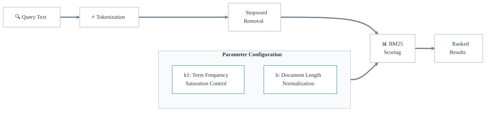

import ThemedImage from '@theme/ThemedImage';

キーワード検索は、文字列（トークン）を用いた厳密一致ベースの検索です。

これは検索クエリに対する関連度に基づいてドキュメントをランク付けする  BM25  アルゴリズムを使用します。高レベルでは、  BM25  アルゴリズムは、ドキュメント内のクエリ語の出現回数（term frequency）とデータセット全体での語の出現頻度（inverse document frequency）を用いて関連度スコアを計算します。

より具体的には、 Weaviate では複数フィールド対応版である  BM25F  アルゴリズムを使用します。

キーワード検索は、クエリに含まれる厳密なトークンと格納されたオブジェクトのトークンとの一致を基に最適な一致結果を決定します。そのため、キーワード検索は厳密一致（例: ドメイン固有の言語、正確なカテゴリやタグ）が重要な場面に適しています。例:

- 特定の技術用語を含むドキュメントの検索
- 正確なキーワードやタグによる記事の特定

これは、正確な語が一致しなくても意味的に類似した内容を見つける ベクトル 検索とは異なります。関連概念よりも精度が重要な場合にキーワード検索を使用できます。

## Weaviate におけるキーワード検索

Weaviate では、キーワード検索は [BM25F](https://en.wikipedia.org/wiki/Okapi_BM25) 「スコア」によって測定されたクエリとの最適一致オブジェクトを返します。

:::info BM25F と BM25 の違い
BM25F の「 F 」は「 field 」を意味し、フィールドごとに異なる重み付けを行える  BM25  のフィールド特化版です。これにより、オブジェクトの異なるフィールド（プロパティ）ごとに重みを設定できます。  
 

Weaviate ではキーワード検索のスコア計算に  BM25F  を使用しているため、両者は同義で扱われます。本ドキュメントでは一般に  BM25  と呼びます。
:::

 BM25  スコアは、オブジェクトのプロパティにおけるクエリトークンの出現頻度、およびオブジェクトプロパティとクエリの長さに基づいて計算されます。

たとえば `"A red Nike shoe"` のような入力文字列がクエリとして与えられた場合、 Weaviate は以下を行います。

1. 入力を [トークン化](#トークン化) する（例: `["a", "red", "nike", "shoe"]`）
2. [ストップワード](#ストップワード) を除去する（例: `a` を除き `["red", "nike", "shoe"]` となる）
3. [BM25 パラメータ](#bm25-パラメータ) と [プロパティブースト](#プロパティ-ブースト) を考慮し、データベースオブジェクトの [選択プロパティ](#選択プロパティ) に対して  BM25  スコアを算出する
4.  BM25  スコアが最も高いオブジェクトを検索結果として返す

### トークン化

キーワード検索におけるトークン化とは、各ソーステキストを比較・一致させるために個々の「トークン」へ分割する方法を指します。

デフォルトのトークン化方法は `word` です。

`whitespace`、`lowercase`、`field` などの他のトークン化方法に加え、他言語向けの `GSE` や `kagome_kr` なども利用できます（[詳細](../../config-refs/collections.mdx#tokenization)）。

トークン化オプションはコレクションの [転置インデックス設定](../../search/bm25.md#set-tokenization) で指定します。

:::info 異なる文脈でのトークン化
「トークン化」という用語は、ベクトル化や言語生成などの文脈でも使用されます。これらはそれぞれ異なる要件を満たすため通常異なるトークナイザーを使用するため、同じ入力テキストからでも異なるトークン集合が生成されます。
:::

### ストップワード

ストップワードとは、テキスト処理前に除外される単語です。

Weaviate は  BM25  スコア計算時に設定可能なストップワードを使用します。ストップワードリストに含まれるトークンは  BM25  スコア計算から除外されます。

詳細は [リファレンスページ](../../config-refs/indexing/inverted-index.mdx#stopwords) を参照してください。

### BM25 パラメータ

 BM25  は、クエリ語が出現するドキュメントをランク付けするためのスコアリング関数で、挙動を制御する 2 つの主要パラメータがあります。

- `k1` （デフォルト: 1.2）: term frequency の飽和を制御します。値が大きいほど、語が複数回出現した際にスコアがより増加します
- `b` （デフォルト: 0.75）: ドキュメント長の正規化を制御します。1 に近いほどドキュメント長の正規化が強くなります

コレクション単位でカスタム `k1` と `b` を設定できます（[設定方法](../../manage-collections/collection-operations.mdx#set-inverted-index-parameters)）。

<!-- Set custom `k1` and `b` values [for a collection](../../manage-data/collections.mdx#set-inverted-index-parameters), or override values for each property. -->

### キーワード検索オペレーター

:::info `v1.31` で追加
:::

検索オペレーターは、オブジェクトが返されるために含まれていなければならないクエリ [トークン](../../search/bm25.md#set-tokenization) の最小数を定義します。

概念的には、  BM25  スコア計算結果にフィルターを適用するように動作します。使用可能なオペレーターは次のとおりです。  
- `and` : すべてのトークンがオブジェクトに存在する必要があります  
- `or` : 少なくとも 1 つのトークンがオブジェクトに存在する必要があります。最小トークン数は `minimumOrTokensMatch` で設定可能です

例として、`computer networking guide` という  BM25  クエリを `and` オペレーターで実行した場合、`computer`、`networking`、`guide` のすべてのトークンを含むオブジェクトのみが返されます。対して、同じクエリを `or` オペレーターで実行すると、これらのトークンのうち少なくとも 1 つを含むオブジェクトが返されます。`or` オペレーターを `minimumOrTokensMatch` が `2` の設定で使用すると、少なくとも 2 つのトークンがオブジェクトに存在する必要があります。

指定がない場合、デフォルトのオペレーターは `or` で `minimumOrTokensMatch` は `1` です。つまり、オブジェクトが返されるには、少なくとも 1 つのトークンが存在する必要があります。

import BM25OperatorsLight from '../img/bm25_operators_light.png';
import BM25OperatorsDark from '../img/bm25_operators_dark.png';

<ThemedImage
  alt="BM25 operators"
  sources={{
    light: BM25OperatorsLight,
    dark: BM25OperatorsDark,
  }}
/>

使用方法の詳細は [ハウツーページ](../../search/bm25.md#search-operators) を参照してください。

### 選択プロパティ

 BM25  クエリでは、スコア計算に含めるオブジェクトプロパティをオプションで指定できます。

デフォルトでは、すべての `text` プロパティが  BM25  計算に含まれます。これを変更する方法は 2 つあります。

- コレクション設定でプロパティの [`indexSearchable` を `false` に設定](../../manage-collections/vector-config.mdx#property-level-settings) します。このプロパティはすべての  BM25  検索で無視されます。
- [クエリ時に検索対象プロパティを指定](../../search/bm25.md#search-on-selected-properties-only) します。これはそのクエリにのみ適用されます。

### プロパティ ブースト

プロパティブーストを使用すると、クエリが最終的な  BM25  スコアを計算する際にプロパティごとに異なる重みを設定できます。

これは、あるプロパティが他よりも検索において重要な場合に便利です。

例えば、 e-commerce カタログを検索する際、商品説明よりもタイトルやカテゴリに重みを付けることができます。

<!-- This would correspond with the intuition that token matches in the title or the categories would be more significant than matches in the description. -->

[プロパティの重み](../../search/bm25.md#use-weights-to-boost-properties) はクエリ時に設定します.
## ベクトル検索との組み合わせ

キーワード検索は、 Weaviate でベクトル検索と組み合わせることでハイブリッド検索を実行できます。これにより、次の両方を活用できます。  
- キーワード検索の厳密一致機能  
- ベクトル検索のセマンティック理解能力  

詳細は [ハイブリッド検索](./hybrid-search.md) をご覧ください。

## 注意点とベストプラクティス

キーワード検索を使用する際の主な考慮事項は次のとおりです。  

1. **トークナイザーの選択**  
   - データと検索要件に基づいて選択してください。たとえば、自然言語テキストには `word` トークナイザーを使用し、 URL やメールアドレスなどを丸ごと厳密一致させる必要がある場合は `field` を検討します。  
   - 多言語コンテンツの場合、中国語/日本語向けの `GSE`、韓国語向けの `kagome_kr` などの専用トークナイザーを検討してください。  
   - 特殊文字や大文字・小文字の区別の要否も考慮します。  
   - 特殊文字や大文字・小文字が期待どおりに処理されるか確認するため、データとクエリのサブセットでトークナイザーをテストしてください。ベクトル化とキーワード検索は独立しているため、実験時にはベクトル化を無効にしてリソース/コストを節約できます。  

2. **パフォーマンスの最適化**  
   - 検索に必要なプロパティだけをインデックス化します。  
   - ユーザーの行動を事前に予測できない場合は特に、キーワード検索とベクトル検索を組み合わせた [ハイブリッド検索](./hybrid-search.md) を出発点として検討してください。  

3. **クエリの最適化**  
   - 検索において重要度の高いプロパティ（例: タイトル、カテゴリ）には重み付けを行い、そうでないプロパティ（例: 説明）より優先させます。  
   - ほとんどのユースケースではデフォルト値が適しているため、 `k1` と `b` の値は正当な理由がある場合のみ変更してください。  

### 参考リソース

- [How-to: Search](../../search/index.mdx)  
- [How-to: Keyword search](../../search/bm25.md)  

## ご質問とフィードバック

import DocsFeedback from '/_includes/docs-feedback.mdx';

<DocsFeedback/>