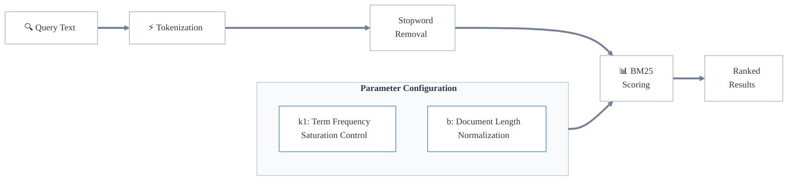

import ThemedImage from '@theme/ThemedImage';

キーワード検索は、トークン（文字列）の正確一致に基づく検索です。

この検索では、BM25 アルゴリズムを使用して、クエリに対する関連度に応じて一致したドキュメントをランキングします。大まかに言うと、BM25 アルゴリズムは、ドキュメント内でのクエリ語の出現回数（term frequency）と、データセット全体での語の頻度（inverse document frequency）を用いて関連度スコアを計算します。

より具体的には、Weaviate では BM25 を拡張し、複数のフィールドを検索インデックスに利用できる BM25F アルゴリズムを使用しています。

キーワード検索は、クエリに含まれるトークンと保存されたオブジェクト内のトークンを正確に照合して最適な一致を決定します。そのため、厳密な一致（例：特定のドメイン固有の用語、正確なカテゴリやタグ）が重要な場合に適しています。たとえば次のようなケースです。

- 特定の技術用語を含むドキュメントの検索
- 正確なキーワードやタグで記事を識別する

これは、正確な語が一致しなくても意味的に類似したコンテンツを探すベクトル検索とは異なります。関連概念よりも精度が重要な場合に、キーワード検索を利用できます。

## Weaviate におけるキーワード検索

Weaviate においては、キーワード検索は [BM25F](https://en.wikipedia.org/wiki/Okapi_BM25) の「スコア」によって、クエリと最も一致するオブジェクトを返します。

:::info BM25F vs BM25
BM25F の “F” は “field” を意味し、フィールドごとに異なる重み付けを行える BM25 のフィールド対応版です。 

Weaviate ではキーワード検索のスコア計算に BM25F アルゴリズムを使用しているため、実質的に BM25 と同義で扱われます。本ドキュメントでは総称して BM25 と呼びます。
:::

BM25 スコアは、オブジェクトのプロパティ内でのクエリトークンの頻度、オブジェクトプロパティおよびクエリの長さによって計算されます。

たとえば `"A red Nike shoe"` というクエリ文字列が与えられると、Weaviate は次の手順を実行します。

1. 入力を [トークナイズ](#tokenization) する（例：`["a", "red", "nike", "shoe"]`）
2. [ストップワード](#stopwords) を除去する（例：`a` を削除し `["red", "nike", "shoe"]` を生成）
3. [BM25 パラメーター](#bm25-parameters) と任意の [プロパティブースト](#property-boosting) に基づいて、データベースオブジェクトの [選択されたプロパティ](#selected-properties) との BM25 スコアを算出
4. 最も高い BM25 スコアを持つオブジェクトを検索結果として返す

### トークナイゼーション

キーワード検索におけるトークナイゼーションは、比較・照合するために各テキストを個々のトークンへ分割する方法を指します。

デフォルトのトークナイゼーション方式は `word` です。

`whitespace`、`lowercase`、`field` など他の方式や、他言語向けの `GSE` や `kagome_kr` などの特殊な方式も利用できます（[詳細](../../config-refs/schema/index.md#tokenization)）。

コレクション単位で [転置インデックス設定](../../search/bm25.md#set-tokenization) によりトークナイゼーションを指定します。

:::info Tokenization in different contexts
“トークナイゼーション” は、ベクトライゼーションや言語生成など他の文脈でも使用されますが、通常それぞれ異なるトークナイザーを用います。そのため、同じ入力テキストでも生成されるトークン集合は異なります。
:::

### ストップワード

ストップワードとは、テキスト処理前に除外される単語です。

Weaviate では、BM25 スコア計算時に設定可能なストップワードリストを使用します。ストップワードリストに含まれるトークンは BM25 スコア計算から無視されます。

詳細は [リファレンスページ](../../config-refs/schema/index.md#stopwords-stopword-lists) を参照してください。

### BM25 パラメーター

BM25 はクエリ語の出現に基づいてドキュメントをランク付けするスコアリング関数です。動作を制御する主なパラメーターは 2 つあります。

- `k1`（デフォルト: 1.2）: term frequency の飽和度を制御します。値が大きいほど、同じ語が複数回出現した際のスコア増加が大きくなります
- `b`（デフォルト: 0.75）: ドキュメント長正規化を制御します。1 に近いほど長さに対する正規化が強くなります

カスタムの `k1` と `b` を [コレクション](../../manage-collections/collection-operations.mdx#set-inverted-index-parameters) で設定できます。

<!-- Set custom `k1` and `b` values [for a collection](../../manage-data/collections.mdx#set-inverted-index-parameters), or override values for each property. -->

### キーワード検索オペレーター

:::info Added in `v1.31`
:::

検索オペレーターは、オブジェクトが返されるために必要なクエリ [トークン](../../search/bm25.md#set-tokenization) の最小数を定義します。

概念的には、BM25 スコア計算結果にフィルターをかけるような動作です。使用可能なオペレーターは次のとおりです。
- `and`: すべてのトークンがオブジェクトに含まれている必要があります
- `or`: 少なくとも 1 つのトークンがオブジェクトに含まれていればよく、必要最小数は `minimumOrTokensMatch` で設定可能です

例として、`and` オペレーターで `computer networking guide` を BM25 検索すると、`computer`、`networking`、`guide` のすべてを含むオブジェクトのみが返されます。対して `or` オペレーターでは、これらのうち 1 つでも含むオブジェクトが返されます。`or` と `minimumOrTokensMatch` を `2` に設定した場合は、少なくとも 2 つのトークンを含む必要があります。

指定がない場合、デフォルトは `or` で `minimumOrTokensMatch` は `1` です。つまり、少なくとも 1 トークンを含むオブジェクトが返されます。

import BM25OperatorsLight from '../img/bm25_operators_light.png';
import BM25OperatorsDark from '../img/bm25_operators_dark.png';

<ThemedImage
  alt="BM25 オペレーター"
  sources={{
    light: BM25OperatorsLight,
    dark: BM25OperatorsDark,
  }}
/>

使用方法の詳細は [How-to ページ](../../search/bm25.md#search-operators) を参照してください。

### 選択されたプロパティ

BM25 クエリでは、スコア計算に含めるオブジェクトのプロパティを任意で指定できます。

デフォルトでは、すべての `text` プロパティが BM25 計算に含まれます。これを変更する方法は 2 つあります。

- コレクション設定で [プロパティの `indexSearchable` を `false` に設定](../../manage-collections/vector-config.mdx#property-level-settings) する。これにより、そのプロパティはすべての BM25 検索から除外されます。
- [クエリ時に検索対象プロパティを指定](../../search/bm25.md#search-on-selected-properties-only) する。この指定はそのクエリにのみ適用されます。

### プロパティブースト

プロパティブーストを使うと、BM25 スコア計算時にプロパティごとに異なる重みを適用できます。

これは、検索において特定のプロパティを他より重要視したい場合に便利です。

たとえば EC カタログを検索する際、商品説明よりもタイトルやカテゴリを強調するようにブーストできます。

[クエリ時にプロパティの重み](../../search/bm25.md#use-weights-to-boost-properties) を設定してください。
## ベクトル検索との組み合わせ

キーワード検索は、 Weaviate のベクトル検索と組み合わせてハイブリッド検索を実行できます。これにより、次の両方を活用できます:
- キーワード検索の厳密一致機能
- ベクトル検索のセマンティック理解

詳細は [ハイブリッド検索](./hybrid-search.md) を参照してください。

## 注意点とベスト プラクティス

キーワード検索を使用する際の主な検討事項は次のとおりです:

1. **トークナイゼーションの選択**
   - データと検索要件に基づいて選択します。たとえば、自然言語テキストには `word` トークナイゼーションを使用し、 URL やメールアドレスなど全体を正確に一致させる必要がある場合は `field` を検討してください。
   - 多言語コンテンツの場合は、中国語/日本語向けの `GSE` や韓国語向けの `kagome_kr` など、専用のトークナイザーを検討してください
   - 特殊文字と大文字小文字の区別の必要性を考慮してください
   - データとクエリのサブセットでトークナイゼーションをテストし、特殊文字や大文字小文字を期待どおりに処理できるか確認してください。ベクトル化とキーワード検索は独立しているため、ベクトル化を無効にして実験すればリソース/コストを節約できます。

2. **パフォーマンス最適化**
   - 検索に必要なプロパティのみをインデックス化する
   - ユーザーの行動を予測しづらい場合の出発点として、キーワード検索とベクトル検索を組み合わせる（つまり [ハイブリッド検索](./hybrid-search.md) を実行する）ことを検討してください

3. **クエリ最適化**
   - 検索でより重要なプロパティ（例: タイトル、カテゴリ）を他のプロパティ（例: 説明）よりもブーストすることを検討してください
   - `k1` と `b` の値は、十分な理由がある場合のみ変更してください。デフォルト値はほとんどのユース ケースで適切に機能します

### 追加リソース

- [How-to: 検索](../../search/index.mdx)
- [How-to: キーワード検索](../../search/bm25.md)

## 質問とフィードバック

import DocsFeedback from '/_includes/docs-feedback.mdx';

<DocsFeedback/>