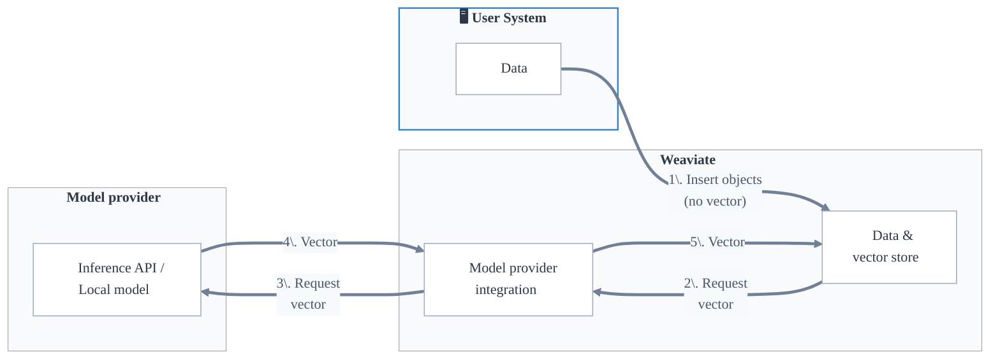
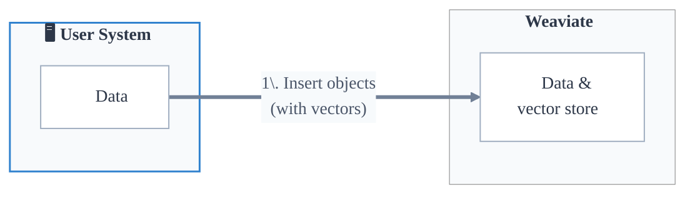

ベクトル検索は、ベクトル埋め込み ( embeddings ) を用いた類似度ベースの検索です。ベクトル検索は、意味的に類似したオブジェクトを見つけられることから、「セマンティック検索」とも呼ばれます。ただし、ベクトル検索はテキスト データに限定されません。画像、動画、音声など、他の種類のデータにも利用できます。

ベクトル埋め込みは、オブジェクトの意味をベクトル空間に捉えたものです。これは、オブジェクトの特徴を表す数値の集合で構成されます。ベクトル埋め込みは、この目的のために学習された ベクトライザー モデルによって生成されます。

ベクトル検索では、[格納されたオブジェクトの ベクトル](#object-vectors) と [クエリ ベクトル](#query-vectors) を比較し、最も近いものを見つけたうえで、上位 `n` 件の結果を返します。

:::tip ベクトル検索の概要
ベクトル検索が初めてですか？ 概念やユースケースを紹介したブログ記事「[Vector Search Explained](https://weaviate.io/blog/vector-search-explained)」をご覧ください。
:::

## オブジェクト ベクトル

ベクトル検索を行うには、各オブジェクトが代表となるベクトル埋め込みを持つ必要があります。

ベクトルを生成するモデルは ベクトライザー モデル、または埋め込みモデルと呼ばれます。

ユーザーは、オブジェクトとその ベクトル を  Weaviate  に取り込む方法として、次の 2 つを選択できます。

-  Weaviate の [ベクトライザー モデル プロバイダー統合](#model-provider-integration) を使用してベクトルを生成する
- ベクトルを [直接  Weaviate に提供](#bring-your-own-vector) する

### モデル プロバイダー統合

 Weaviate は、[Cohere](../../model-providers/cohere/index.md)、[Ollama](../../model-providers/ollama/index.md)、[OpenAI](../../model-providers/openai/index.md) などの一般的な ベクトライザー モデル プロバイダーと [ファーストパーティ統合](../../model-providers/index.md) を提供しています。

このワークフローでは、ユーザーが [コレクションに対して ベクトライザー を設定](../../manage-collections/vector-config.mdx#specify-a-vectorizer) すると、  Weaviate  がオブジェクトの挿入や検索時など必要に応じて自動的にベクトルを生成します。

この統合により、ベクトル生成プロセスがユーザーから抽象化され、ユーザーはベクトル生成を気にすることなく、アプリケーション開発や検索に集中できます。

:::info ベクトライザー設定は不変です

一度設定すると、そのコレクションの ベクトライザー は変更できません。これにより、ベクトルが一貫して生成され、互換性が保たれます。 ベクトライザー を変更する必要がある場合は、希望する ベクトライザー を設定した新しいコレクションを作成し、[データを新しいコレクションへ移行](../../manage-collections/migrate.mdx) してください。

:::

#### ベクトライザー設定時の手動ベクトル

コレクションに ベクトライザー モデルが設定されている場合でも、オブジェクトの挿入やクエリ実行時にユーザーが ベクトル を直接指定できます。その場合、  Weaviate  は新たにベクトルを生成せず、提供されたベクトルを使用します。

これは、他のシステムからオブジェクトをインポートするなど、同じモデルで既に生成されたベクトルをユーザーが保有している場合に便利です。同じベクトルを再利用することで、  Weaviate  が新たにベクトルを生成する必要がなくなり、時間とリソースを節約できます。

### 独自ベクトルの持ち込み

オブジェクトを挿入する際、ユーザーは ベクトル を  Weaviate  に直接アップロードできます。これは、ユーザーが既にモデルで生成したベクトルを持っている場合や、  Weaviate  と統合されていない特定の ベクトライザー モデルを利用したい場合に役立ちます。

このワークフローでは、ユーザーは  Weaviate  とは独立して任意の ベクトライザー モデルやプロセスを利用できます。

独自モデルを使用する場合は、ベクトライザー設定で `none` を明示的に指定し、誤って互換性のないベクトルを  Weaviate  で生成しないようにすることを推奨します。

### 名前付きベクトル

:::info Added in `v1.24`
:::

コレクションは設定により、各オブジェクトを複数のベクトル埋め込みで表現できるようにできます。

それぞれのベクトルは互いに独立した固有のベクトル空間として機能し、「名前付きベクトル」と呼ばれます。

名前付きベクトルは、[ベクトライザー モデル統合](#model-provider-integration) で設定することも、「[独自ベクトルの持ち込み](#bring-your-own-vector)」で提供することも可能です。

## クエリ ベクトル

 Weaviate  では、次の方法でクエリ ベクトルを指定できます。

- クエリ ベクトル（ `nearVector` ）
- クエリ オブジェクト（ `nearObject` ）
- クエリ テキスト（ `nearText` ）
- クエリ メディア（ `nearImage` または `nearVideo` ）

いずれの場合も、クエリと格納済みオブジェクトのベクトル埋め込みに基づいて、クエリに最も類似したオブジェクトが返されます。ただし、  Weaviate  へクエリ ベクトルを渡す方法が異なります。

### `nearVector`

`nearVector` クエリでは、ユーザーが ベクトル を  Weaviate  に直接渡します。このベクトルが格納されているオブジェクトのベクトルと比較され、最も類似したオブジェクトが検索されます。

### `nearObject`

`nearObject` クエリでは、ユーザーがオブジェクト ID を  Weaviate  に渡します。  Weaviate  はそのオブジェクトのベクトルを取得し、格納されているオブジェクトのベクトルと比較して、最も類似したオブジェクトを見つけます。

### `nearText` (and `nearImage`, `nearVideo`)

`nearText` クエリでは、ユーザーが入力テキストを  Weaviate  に渡します。  Weaviate  は指定された ベクトライザー モデルを使ってそのテキストのベクトルを生成し、格納されているオブジェクトのベクトルと比較して最も類似したオブジェクトを検索します。

そのため、`nearText` クエリは ベクトライザー モデルが設定されているコレクションでのみ利用できます。

`nearImage` や `nearVideo` クエリも `nearText` と同様に機能しますが、テキストの代わりに画像や動画を入力として使用します。

## マルチターゲット ベクトル検索

:::info Added in `v1.26`
:::

マルチターゲット ベクトル検索では、  Weaviate  が複数のシングルターゲット ベクトル検索を同時に実行します。

これらの検索は、ベクトル距離スコアを含む複数の結果セットを生成します。

 Weaviate は、これらの結果セットを["結合戦略"](#available-join-strategies) を利用して統合し、各結果の最終スコアを算出します。

対象 ベクトル のいずれかで検索上限または距離しきい値以内にあるオブジェクトは、検索結果に含まれます。

選択されたターゲット ベクトルのいずれに対してもベクトルを持たないオブジェクトは、  Weaviate  が無視し、検索結果に含めません。

### 利用可能な結合戦略

- **minimum** (*default*) すべてのベクトル距離の最小値を使用します。  
- **sum** ベクトル距離の合計を使用します。  
- **average** ベクトル距離の平均を使用します。  
- **manual weights** 各ターゲット ベクトルに指定された重みを掛けた距離の合計を使用します。  
- **relative score** 各ターゲット ベクトルに指定された重みを掛けた正規化距離の合計を使用します。
## ベクトル インデックス と 検索

Weaviate はベクトル検索を効率化するためにベクトル インデックス を使用します。ほかの種類のインデックスと同様に、ベクトル インデックス はベクトル埋め込みを整理し、高速な検索を実現しながら検索品質（例: リコール）、スループット、リソース使用量（例: メモリ）などの要件を最適化します。

Weaviate では `hnsw`、`flat`、`dynamic` など、複数種類のベクトル インデックス を利用できます。

Weaviate では、[コレクション](../data.md#collections) や [テナント](../data.md#multi-tenancy) ごとに専用のベクトル インデックス が作成されます。さらに、各コレクションやテナントは [複数のベクトル インデックス](../data.md#multiple-vector-embeddings-named-vectors) を、異なる設定で保持できます。

:::info
詳細はこちら:
- [コレクション](../data.md#collections)
- [マルチテナンシー](../data.md#multi-tenancy)
- [ベクトル インデックス](../indexing/vector-index.md)
- [複数の名前付きベクトル](../data.md#multiple-vector-embeddings-named-vectors)
:::

### 距離メトリクス

ベクトル距離を測定する方法には、コサイン距離、ドット積、ユークリッド距離など多数あります。Weaviate は [距離メトリクス](../../config-refs/distances.md) ページに記載されているように、さまざまな距離メトリクスをサポートしています。各ベクトライザー モデルは特定の距離メトリクスで学習されているため、検索時にはモデル学習時と同じ距離メトリクスを使用することが重要です。

Weaviate ではデフォルトの距離メトリクスとしてコサイン距離を使用します。これは多くのベクトライザー モデルで一般的に採用されているためです。

:::tip 距離 と 類似度
「距離」の場合、値が小さいほどベクトル同士が近いことを示します。一方、「類似度」や「確信度 (certainty)」スコアでは、値が大きいほど近いことを示します。コサイン距離のように距離と類似度の両方で表現できるメトリクスもあれば、ユークリッド距離のように距離でしか表現できないものもあります。
:::

## 注意点とベストプラクティス

互換性のあるベクトルは必ずある程度は互いに類似しています。

これには 2 つの影響があります。

1. 関連性にかかわらず、常に何らかの「トップ」検索結果が返されます。  
1. 常にデータセット全体が対象となります。

たとえば、「Red」「Crimson」「LightCoral」という色のベクトルを保持するデータベースに対し、「SkyBlue」のクエリ ベクトルで検索した場合でも、検索は結果（例: 「Red」）を返します。これはクエリと意味的に似ていなくても、最も近いものを返すためです。

このような理由から、Weaviate では検索結果を制限する複数の方法を提供しています。

- **Limit**: 返す結果数の最大値を指定します。  
  - 指定しない場合、システム既定値 [`QUERY_DEFAULTS_LIMIT`](/deploy/configuration/env-vars/index.md#general) の 10 が使用されます。
- **AutoCut**: ベクトル距離や検索スコアなどの結果メトリクスの不連続点を基準に結果数を絞ります。
- **Threshold**: 結果に対して最小類似度（例: 最大コサイン距離）を指定します。
- **フィルター適用**: [フィルター](../filtering.md) を使用してメタデータやプロパティに基づき結果を除外します。

これらの手法を組み合わせて、ユーザーにとって意味があり関連性の高い検索結果を提供してください。

一般的には、まず `limit` でユーザーに提示する最大件数を設定し、`threshold` を調整して無関係な結果が返されにくいようにします。

この設定により、検索は指定した `limit` 件まで結果を返しますが、`threshold` で指定した類似度を上回る場合に限られます。

### 参考資料

- [ハウツー: 検索](../../search/index.mdx)
- [ハウツー: ベクトル類似検索](../../search/similarity.md)

## 質問とフィードバック

import DocsFeedback from '/_includes/docs-feedback.mdx';

<DocsFeedback/>