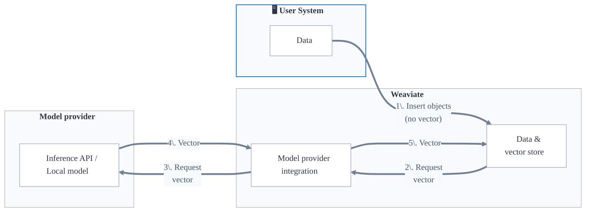
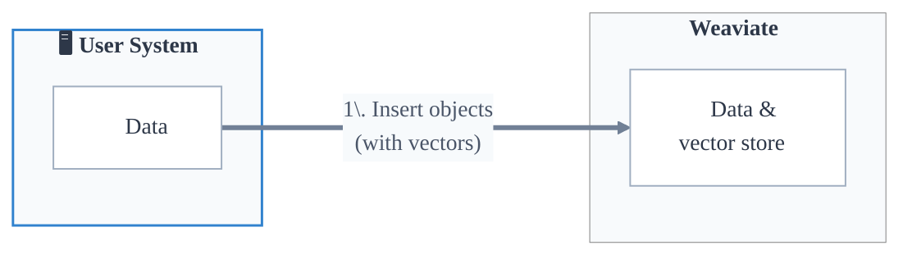

ベクトル検索は、ベクトル埋め込み（ embeddings ）を用いた類似度ベースの検索です。ベクトル検索は、そのセマンティック（意味的）な類似性を基にオブジェクトを見つける能力から「セマンティック検索」とも呼ばれます。ただし、ベクトル検索はテキスト データに限定されません。画像、動画、音声など他のデータ タイプにも利用できます。

ベクトル埋め込みは、オブジェクトの意味情報をベクトル空間で表現したものです。これはオブジェクトの特徴を示す数値の集合で、ベクトルはこの目的のために学習されたベクトライザー モデルによって生成されます。

ベクトル検索では、[保存済みオブジェクトのベクトル](#object-vectors)と[クエリ ベクトル](#query-vectors)を比較し、最も近いものを見つけて上位 `n` 件の結果を返します。

:::tip ベクトル検索入門
ベクトル検索が初めてですか？ブログ「[ベクトル検索の基礎](https://weaviate.io/blog/vector-search-explained)」で、ベクトル検索の概念とユースケースを紹介しています。
:::

## オブジェクト ベクトル

ベクトル検索を行うには、各オブジェクトが代表的なベクトル埋め込みを持っている必要があります。

ベクトルを生成するモデルはベクトライザー モデル、またはエンベディング モデルと呼ばれます。

ユーザーは次の 2 通りの方法で、オブジェクトとそのベクトルを Weaviate に登録できます。

- Weaviate の[ベクトライザー モデルプロバイダー統合](#model-provider-integration)を使用してベクトルを生成する  
- [ベクトルを直接提供](#bring-your-own-vector)して Weaviate に登録する  

### モデルプロバイダー統合

Weaviate は、[Cohere](../../model-providers/cohere/index.md)、[Ollama](../../model-providers/ollama/index.md)、[OpenAI](../../model-providers/openai/index.md) など、[主要なベクトライザー モデルプロバイダーとのファーストパーティ統合](../../model-providers/index.md)を提供します。

このワークフローでは、ユーザーが[コレクションにベクトライザーを設定](../../manage-collections/vector-config.mdx#specify-a-vectorizer)すると、オブジェクトの登録や検索時など必要に応じて Weaviate が自動的にベクトルを生成します。

この統合により、ベクトル生成プロセスがユーザーから抽象化され、ユーザーはベクトル生成を意識せずにアプリケーションの開発や検索に集中できます。

:::info ベクトライザー設定は不変です

一度設定すると、コレクションのベクトライザーは変更できません。これにより、ベクトルが一貫して生成され、互換性が保たれます。ベクトライザーを変更する必要がある場合は、目的のベクトライザーで新しいコレクションを作成し、[データを新しいコレクションへ移行](../../manage-collections/migrate.mdx)してください。

:::

#### ベクトライザー設定時の手動ベクトル

コレクションにベクトライザー モデルが設定されていても、オブジェクト登録やクエリ実行時にユーザーがベクトルを直接提供することが可能です。この場合、 Weaviate は新しいベクトルを生成せず、提供されたベクトルを使用します。

これは、同じモデルで既にベクトルを生成済みの場合（他システムからのインポートなど）に便利です。既存ベクトルを再利用することで、時間とリソースを節約できます。

### 独自ベクトルの持ち込み

オブジェクトを登録する際に、ユーザーがベクトルを直接 Weaviate にアップロードできます。既にモデルでベクトルを生成している場合や、 Weaviate と統合されていない特定のベクトライザー モデルを使用したい場合に有用です。

このワークフローでは、ユーザーは任意のベクトライザー モデルやプロセスを Weaviate とは独立して使用できます。

独自モデルを使用する場合、ベクトライザー設定で `none` を明示的に指定し、誤って互換性のないベクトルを生成しないようにすることを推奨します。

### 名前付きベクトル

:::info Added in `v1.24`
:::

コレクションは設定により、各オブジェクトを複数のベクトル埋め込みで表現できます。

それぞれのベクトルは互いに独立したベクトル空間として機能し、「名前付きベクトル」と呼ばれます。

名前付きベクトルは、[ベクトライザーモデル統合](#model-provider-integration)で設定することも、「[独自ベクトルの持ち込み](#bring-your-own-vector)」で提供することも可能です。

## クエリ ベクトル

 Weaviate では、次の方法でクエリ ベクトルを指定できます。

- クエリ ベクトル（ `nearVector` ）
- クエリ オブジェクト（ `nearObject` ）
- クエリ テキスト（ `nearText` ）
- クエリ メディア（ `nearImage` または `nearVideo` ）

いずれの場合も、クエリと保存済みオブジェクトのベクトルを基に、最も類似したオブジェクトが返されます。ただし、 Weaviate にクエリ ベクトルをどのように渡すかが異なります。

### `nearVector`

`nearVector` クエリでは、ユーザーがベクトルを直接 Weaviate に渡します。このベクトルと保存済みオブジェクトのベクトルを比較して、最も類似したオブジェクトを検索します。

### `nearObject`

`nearObject` クエリでは、ユーザーがオブジェクト ID を Weaviate に渡します。 Weaviate はそのオブジェクトのベクトルを取得し、保存済みオブジェクトのベクトルと比較して最も類似したオブジェクトを検索します。

### `nearText`（および `nearImage`、`nearVideo`）

`nearText` クエリでは、ユーザーがテキストを Weaviate に渡します。 Weaviate は指定されたベクトライザー モデルを使用してテキストのベクトルを生成し、保存済みオブジェクトのベクトルと比較して最も類似したオブジェクトを検索します。

そのため、 `nearText` クエリはベクトライザー モデルが設定されているコレクションでのみ利用できます。

`nearImage` や `nearVideo` クエリも `nearText` と同様ですが、テキストの代わりに画像や動画を入力します。

## マルチターゲット ベクトル検索

:::info Added in `v1.26`
:::

マルチターゲット ベクトル検索では、 Weaviate が複数のシングルターゲット ベクトル検索を同時に実行します。

これらの検索は、それぞれベクトル距離スコアを持つ複数の結果セットを生成します。

 Weaviate は、["結合戦略"]( #available-join-strategies )を用いてこれらの結果セットを結合し、各結果の最終スコアを算出します。

オブジェクトがいずれかのターゲット ベクトルで検索リミットまたは距離しきい値内に入る場合、そのオブジェクトは検索結果に含まれます。

オブジェクトが選択されたターゲット ベクトルのいずれについてもベクトルを含まない場合、 Weaviate はそのオブジェクトを無視し、検索結果に含めません。

### 利用可能な結合戦略

- **minimum** (*default*) すべてのベクトル距離の最小値を使用します。  
- **sum** ベクトル距離の合計を使用します。  
- **average** ベクトル距離の平均を使用します。  
- **manual weights** 各ターゲット ベクトルに指定された重みを掛けた距離の合計を使用します。  
- **relative score** 各ターゲット ベクトルに指定された重みを掛けた正規化距離の合計を使用します。
## ベクトルインデックスと検索

Weaviate は ベクトル検索 を効率化するために ベクトルインデックス を使用します。ほかの種類のインデックスと同様に、ベクトルインデックス は ベクトル埋め込み を高速に取得できるよう整理しつつ、検索品質（例: リコール）、スループット、メモリなどのリソース使用を最適化します。

Weaviate では `hnsw`、`flat`、`dynamic` など、複数種類の ベクトルインデックス を利用できます。

各 [コレクション](../data.md#collections) や [テナント](../data.md#multi-tenancy) は、それぞれ独自の ベクトルインデックス を持ちます。さらに、各コレクションまたはテナントは、異なる設定を持つ [複数の ベクトルインデックス](../data.md#multiple-vector-embeddings-named-vectors) を併用できます。

:::info
詳しくは次をご覧ください:
- [コレクション](../data.md#collections)
- [マルチテナンシー](../data.md#multi-tenancy)
- [ベクトルインデックス](../indexing/vector-index.md)
- [複数の名前付きベクトル](../data.md#multiple-vector-embeddings-named-vectors)
:::

### 距離指標

ベクトル間の距離を測定する方法には、コサイン距離、ドット積、ユークリッド距離など多くの種類があります。Weaviate は、[距離指標](../../config-refs/distances.md) ページに記載されているさまざまな距離指標をサポートします。各 ベクトライザー モデルは特定の距離指標で学習されているため、検索時にも同じ距離指標を使用することが重要です。

Weaviate では、一般的な距離指標である コサイン距離 がデフォルトで使用されます。

:::tip Distance vs Similarity
「距離」では値が小さいほどベクトル同士が近く、「類似度」または「確信度」では値が大きいほど近くなります。コサイン距離のように、距離を類似度として表現できる指標もあれば、ユークリッド距離のように距離でしか表現できない指標もあります。
:::

## 注意事項とベストプラクティス

互換性のあるベクトルは、程度の差こそあれ必ず何らかの類似性を持っています。

これには次の 2 つの影響があります。

1. 関連性に関係なく、常に「トップ」の検索結果が存在します。  
2. データセット全体が常に返されます。

たとえば、「Red」「Crimson」「LightCoral」という色のベクトルが保存されたデータベースに対して、「SkyBlue」のクエリベクトルで検索すると、たとえ意味的に近くなくても最も近い結果（例: 「Red」）が返ってきます。検索は絶対的に良い一致かどうかではなく、あくまで最も近い一致を返すためです。

そのため、Weaviate では検索結果を制限する複数の方法を提供しています。

- **Limit**: 返却する最大件数を指定します。  
  - 指定しない場合、システム既定の [`QUERY_DEFAULTS_LIMIT`](/deploy/configuration/env-vars/index.md#general) である 10 が使用されます。
- **AutoCut**: ベクトル距離や検索スコアなどの結果メトリクスの不連続性を基に結果を制限します。
- **Threshold**: 最小類似度（例: コサイン距離の最大値）を指定します。
- **フィルターを適用**: メタデータやプロパティなど、他の条件に基づいて結果を除外するために [フィルター](../filtering.md) を使用します。

これらの方法を組み合わせて、ユーザーにとって意味があり関連性の高い検索結果を提供してください。

一般的には、まず `limit` でユーザーに提示する最大件数を設定し、`threshold` を調整して無関係な結果が返りにくいようにします。

これにより、指定した件数（`limit`）まで、かつ指定した類似度（`threshold`）以上の結果のみが返されます。

### 参考リソース

- [How-to: Search](../../search/index.mdx)
- [How-to: Vector similarity search](../../search/similarity.md)

## 質問とフィードバック

import DocsFeedback from '/_includes/docs-feedback.mdx';

<DocsFeedback/>