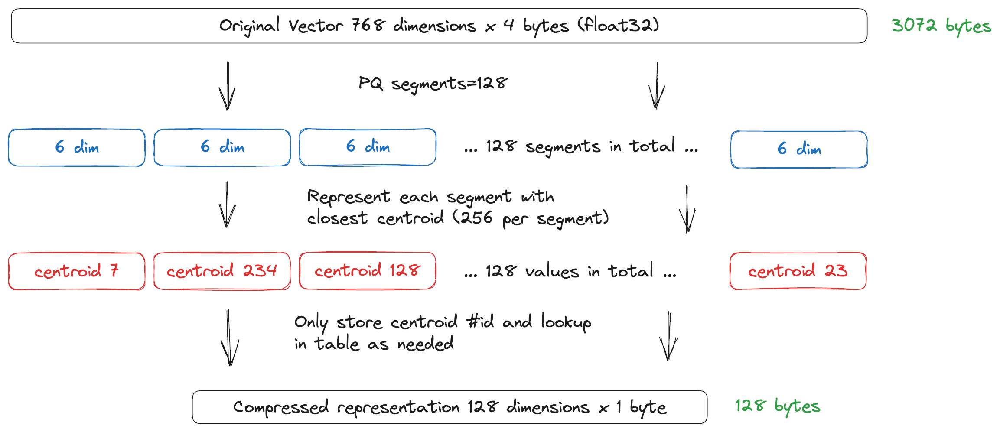

**ベクトル量子化** は、[ ベクトルインデックス ](./indexing/vector-index.md) のメモリ使用量を削減するためにベクトル埋め込みを圧縮し、その結果、デプロイコストを削減し、ベクトル類似度検索プロセスの速度を向上させます。

Weaviate では現在、4 種類のベクトル量子化手法を提供しています。

- [ バイナリ量子化 (BQ) ](#binary-quantization)
- [ 直積量子化 (PQ) ](#product-quantization)
- [ スカラー量子化 (SQ) ](#scalar-quantization)
- [ 回転量子化 (RQ) ](#rotational-quantization)

## 量子化とは

一般に、量子化手法は数値をより低い精度の数値で表現することでメモリ使用量を削減します。たとえば、数値を最も近い整数に丸めることなどです。ニューラルネットワークでは、量子化により 32-bit 浮動小数点数 (4 バイト) で保存されている重みや活性化値を、8-bit 整数 (1 バイト) などの低精度数値に変換します。

### ベクトル量子化とは

ベクトル量子化は、ベクトル埋め込みのメモリ使用量を削減する手法です。ベクトル埋め込みは通常 32-bit 浮動小数点数で表現されています。ベクトル量子化手法では、これらを 8-bit 整数やバイナリ数などのより小さな数値で表現し、必要に応じて次元数も削減します。

## 直積量子化

[ 直積量子化 ](https://ieeexplore.ieee.org/document/5432202) は複数段階の量子化手法で、Weaviate では `hnsw` インデックスで使用できます。

PQ は各ベクトル埋め込みのサイズを 2 段階で削減します。まずベクトルの次元を小さい数の「セグメント」に分割し、その後、各セグメントを元のビット数 (通常は 32-bit フロート) からより少ないビット数に量子化します。

import PQTradeoffs from '/_includes/pq-compression/tradeoffs.mdx' ;

<PQTradeoffs />

PQ では、元のベクトル埋め込みを「セグメント」または「サブスペース」と呼ばれる小さなベクトルの積として表現します。次に、各セグメントを独立に量子化して圧縮ベクトル埋め込みを生成します。

セグメント作成後、各セグメントの `centroids` を計算するためのトレーニングステップがあります。デフォルトでは、Weaviate は各セグメントを 256 個のセントロイドにクラスタリングします。これらのセントロイドはコードブックを構成し、後続の圧縮ステップで使用されます。

コードブックが準備できると、Weaviate は各ベクトルセグメントを最も近いセントロイドの id で表します。これによりメモリ消費量が大幅に削減されます。たとえば、各ベクトル埋め込みが 768 個の 4 バイト要素を持つコレクションを考えます。PQ 圧縮前は各ベクトルに `768 x 4 = 3072` バイト必要ですが、PQ 圧縮後は `128 x 1 = 128` バイトしか必要ありません。元の表現は PQ 圧縮版の約 24 倍のサイズです (コードブック分のわずかなオーバーヘッドは含まず)。

PQ を有効化する方法については、[ PQ 圧縮を有効にする ](/weaviate/configuration/compression/pq-compression#enable-pq-compression) をご覧ください。

### セグメント

PQ の `segments` はメモリ使用量とリコールのトレードオフを制御します。`segments` が大きいほどメモリ使用量とリコールが高くなります。なお、セグメント数は元のベクトル次元を割り切れる必要があります。

以下は一般的なベクトライザーモジュールにおけるセグメント値の一覧です。

| Module      | Model                                   | Dimensions | Segments                    |
|-------------|-----------------------------------------|------------|-----------------------------|
| openai      | text-embedding-ada-002                  | 1536       | 512, 384, 256, 192, 96      |
| cohere      | multilingual-22-12                      | 768        | 384, 256, 192, 96           |
| huggingface | sentence-transformers/all-MiniLM-L12-v2 | 384        | 192, 128, 96                |

### PQ 圧縮プロセス

PQ にはコードブックを生成するためのトレーニング段階があります。コードブック作成にはシェードあたり 10,000 ～ 100,000 レコードの使用を推奨します。トレーニングステップは手動または自動でトリガーできます。詳細は [ 設定: 直積量子化 ](../configuration/compression/pq-compression.md) を参照してください。

トレーニングが開始されると、バックグラウンドジョブがインデックスを圧縮インデックスへと変換します。変換中はインデックスは読み取り専用です。変換が完了するとシャード状態は `READY` に戻ります。

Weaviate はトレーニングに `trainingLimit` 個 (シェードあたり) までのオブジェクトを使用します。それ以上のオブジェクトがあっても使用しません。

PQ 変換が完了した後は、通常どおりクエリおよび書き込みを行えます。量子化の影響で距離がわずかに異なる場合があります。

:::info Which objects are used for training?
- (`v1.27` 以降) コレクション内のオブジェクト数がトレーニングリミットを超える場合、Weaviate はコレクションからランダムにオブジェクトを選択してコードブックを学習します。  
    - (`v1.26` 以前) Weaviate はコレクションの最初の `trainingLimit` 個のオブジェクトを使用してコードブックを学習します。
- コレクション内のオブジェクト数がトレーニングリミット未満の場合、Weaviate はコレクション内のすべてのオブジェクトを使用します。
:::

### エンコーダー

前述の設定では `encoder` オブジェクトを指定してコードブックのセントロイド生成方法を設定できます。Weaviate の PQ では 2 種類のエンコーダーをサポートしています。デフォルトは `kmeans` で、従来のセントロイド生成方法に対応します。

これに加え、`tile` エンコーダーも利用できます。このエンコーダーは現在実験的ですが、SIFT や GIST などのデータセットでインポート時間が短縮され、リコールも向上するケースがあります。`tile` エンコーダーには、セントロイド生成時に使用する分布を制御する `distribution` パラメーターがあります。`type` を `tile` または `kmeans` に設定してエンコーダーを選択してください。設定の詳細は [ 設定: ベクトルインデックス ](../config-refs/schema/vector-index.md) をご覧ください。

### 距離計算

直積量子化では、クエリベクトルに対して非対称に距離を計算し、距離計算時にクエリベクトルの情報をすべて保持することを目標としています。

:::tip
[ Weaviate での直積量子化設定方法 ](../configuration/compression/pq-compression.md) を学びましょう。  
   
ブログ記事「[ How to Reduce Memory Requirements by up to 90%+ using Product Quantization ](https://weaviate.io/blog/pq-rescoring)」もぜひご覧ください。
:::

## バイナリ量子化

**バイナリ量子化 (BQ)** は、各ベクトル埋め込みをバイナリ表現に変換する量子化手法です。バイナリ表現は元のベクトル埋め込みより大幅に小さくなります。通常、各ベクトル次元は 32 ビットを必要としますが、バイナリ表現は 1 ビットしか必要とせず、ストレージ要求を 32 倍削減します。これにより、読み込むデータ量が減り、距離計算も単純になるため、ベクトル検索が高速化されます。

ただし、BQ はロスのある手法です。バイナリ表現は本質的に多くの情報を省略するため、距離計算の精度は元のベクトル埋め込みより低下します。

ベクトライザーによって BQ との相性は異なります。経験的に、Cohere の V3 モデル (例: `embed-multilingual-v3.0` や `embed-english-v3.0`) や OpenAI の `ada-002` モデルでは、BQ を有効にしても良好なリコールが得られることを確認しています。ご自身のデータと好みのベクトライザーで BQ をテストし、用途に適しているか確認することをお勧めします。

BQ を有効にした場合、ベクトルキャッシュを利用してクエリ性能を向上させることができます。ベクトルキャッシュは、量子化済みベクトル埋め込みのディスク読み込み回数を減らしてクエリを高速化します。ただし、各ベクトルが `n_dimensions` ビットを消費するため、メモリ使用量とのバランスを取る必要があります。

## スカラー量子化

**スカラー量子化 (SQ)** では、ベクトル埋め込みの各次元を通常 32-bit フロートで表現しているところを、8-bit 整数に変換します。これによりサイズが 4 倍圧縮されます。

SQ は BQ と同様にロスのある圧縮手法ですが、表現範囲がはるかに広いです。SQ アルゴリズムはデータを解析し、次元値を 256 個のバケット (8 ビット) に分配します。

SQ で圧縮したベクトルは、BQ 圧縮ベクトルより高精度であり、非圧縮ベクトルより大幅に小さくなります。

バケット境界は、トレーニングセット内の最小値と最大値を求め、その範囲を 256 個のバケットに等間隔で分割して決定します。8-bit 整数はバケット番号を表します。

トレーニングセットのサイズは設定可能で、デフォルトはシェードあたり 100,000 オブジェクトです。

SQ を有効にすると、Weaviate は圧縮結果を多めに取得してリコールを向上させます。圧縮結果を取得した後、対応する元の非圧縮ベクトルをクエリと比較します。この 2 回目の検索は検索対象ベクトルが少ないため非常に高速です。

## 回転量子化

:::caution Technical preview

回転量子化 (RQ) は **`v1.32`** で **テクニカルプレビュー** として追加されました。  
   
この機能は現在開発中であり、将来のリリースで変更される可能性があります (破壊的変更を含む)。  
**現時点では本番環境での使用を推奨しません。**

:::

**回転量子化 (RQ)** はトレーニング不要の 8-bit 量子化手法で、4 倍の圧縮率を実現しつつ、ほとんどのデータセットで 98～99% のリコールを維持します。SQ と異なり、RQ にはトレーニングフェーズがなく、インデックス作成時にすぐ有効化できます。RQ は以下の 2 ステップで動作します。

1. **高速疑似ランダム回転**: 入力ベクトルに Walsh Hadamard Transform ベースの高速回転を適用します。1536 次元ベクトルの場合、約 7～10 マイクロ秒で完了します。出力次元は 64 の倍数に切り上げられます。  
2. **スカラー量子化**: 回転後の各要素を 8-bit 整数に量子化します。各ベクトルの最小値と最大値が量子化区間を定義します。

回転ステップには複数の利点があります。量子化区間を縮小して誤差を減らし、値をより均一に分布させることで距離情報を全次元に均等に分散し、距離推定の起点を改善します。

なお、RQ では次元数を 64 の倍数へ切り上げるため、低次元データ (64 や 128 次元未満) では最適な圧縮率が得られない場合があります。

RQ は extended RaBitQ に着想を得ていますが、性能上の理由から実装は大きく異なります。真のランダム回転ではなく高速疑似ランダム回転を使用し、RaBitQ のエンコーディングアルゴリズムではなくスカラー量子化を採用しています。これはエントリあたりのビット数が増えると後者が極端に遅くなるためです。

:::tip
Weaviate での [ 回転量子化の設定方法 ](../configuration/compression/rq-compression.md) について詳しく学びましょう。
:::

## オーバーフェッチ / 再スコアリング

Weaviate は SQ、RQ、BQ を使用する際に結果をオーバーフェッチし、再スコアリングを行います。これは、圧縮された ベクトル 上での距離計算が、元の埋め込み ベクトル 上での計算ほど正確ではないためです。

クエリを実行すると、Weaviate はクエリの limit と、設定可能な `rescoreLimit` パラメーターを比較します。

クエリは、より大きい方の制限に到達するまで圧縮オブジェクトを取得します。その後、Weaviate は対応する非圧縮 ベクトル 埋め込みを取得し、その ベクトル を用いて距離スコアを再計算します。

例えば、limit を 10 に、rescore limit を 200 に設定してクエリを実行した場合、Weaviate は 200 件のオブジェクトを取得します。再スコアリング後、上位 10 件のオブジェクトが返されます。このプロセスにより、圧縮による検索品質（リコール）の低下を補正できます。

:::note RQ optimization
RQ ではネイティブリコールが 98–99% と高いため、再スコアリングを無効化（`rescoreLimit` を 0 に設定）しても検索品質への影響を最小限に抑えつつ、最大のクエリ性能を得られる場合が多いです。
:::

## ベクトル索引によるベクトル圧縮

### HNSW インデックスの場合

[HNSW インデックス](./indexing/vector-index.md#hierarchical-navigable-small-world-hnsw-index) は [PQ](#product-quantization)、[SQ](#scalar-quantization)、[RQ](#rotational-quantization)、[BQ](#binary-quantization) を使用して構成できます。HNSW はメモリ内で動作するため、圧縮によりメモリ使用量を削減したり、同じメモリ容量でより多くのデータを格納したりできます。

:::tip
ブログ記事「[HNSW+PQ - Exploring ANN algorithms Part 2.1](https://weaviate.io/blog/ann-algorithms-hnsw-pq)」もぜひご覧ください。
:::

### フラットインデックスの場合

[BQ](#binary-quantization) は [フラットインデックス](./indexing/inverted-index.md) を使用できます。フラットインデックス検索はディスクから読み取るため、圧縮により読み込むデータ量が減り、検索が高速化します。

## 再スコアリング

量子化（quantization）では情報精度を下げるため、必然的に情報損失が発生します。これを軽減するために、Weaviate は圧縮 ベクトル とともに保存されている非圧縮 ベクトル を用いた再スコアリングを行います。再スコアリングでは、初回検索で取得した候補の元の ベクトル 間距離を再計算し、ユーザーに最も正確な結果を提供します。

場合によっては、オーバーフェッチを伴い、初回検索で上位候補が漏れないよう追加の候補を取得することもあります。

## 参考リソース

:::info Related pages
- [概念：インデックス](./indexing/index.md)
- [概念：ベクトルインデックス](./indexing/vector-index.md)
- [設定リファレンス：ベクトルインデックス](../config-refs/schema/vector-index.md)
- [設定リファレンス：スキーマ（セマンティックインデックスの設定）](../config-refs/schema/index.md#configure-semantic-indexing)
- [設定方法：バイナリ量子化（圧縮）](../configuration/compression/bq-compression.md)
- [設定方法：直積量子化（圧縮）](../configuration/compression/pq-compression.md)
- [設定方法：スカラー量子化（圧縮）](../configuration/compression/sq-compression.md)
- [設定方法：回転量子化（圧縮）](../configuration/compression/rq-compression.md)
- [Weaviate Academy：250 Vector Compression](../../academy/py/compression/index.md)
:::

## 質問とフィードバック

import DocsFeedback from '/_includes/docs-feedback.mdx';

<DocsFeedback/>