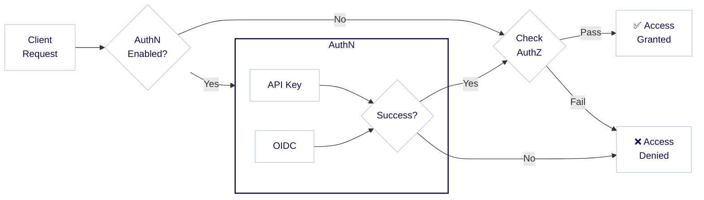
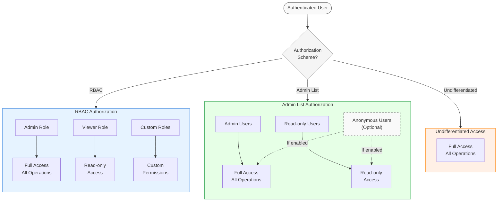

:::info 認証と認可
認証と認可は密接に関連する概念で、`AuthN` と `AuthZ` と略されることがあります。認証 (`AuthN`) はユーザーの身元を検証するプロセスであり、認可 (`AuthZ`) はユーザーがどの権限を持つかを決定するプロセスです。
:::

## 認証

Weaviate は API キーまたは OpenID Connect (OIDC) によるユーザー認証を通じてアクセスを制御します。また、匿名アクセスを許可するオプションもあります。認証後、ユーザーには下図のように異なる [認可](/deploy/configuration/authorization.md) レベルを割り当てられます。



たとえば、API キー `jane-secret` でログインしたユーザーには管理者権限が付与され、API キー `ian-secret` でログインした別のユーザーには読み取り専用権限が付与される、といった運用が可能です。

まとめると、Weaviate では次の認証方法が利用できます。

- [API キー](/deploy/configuration/authentication.md#api-key-authentication)
- [OpenID Connect (OIDC)](/deploy/configuration/authentication.md#oidc-authentication)
- [匿名アクセス](/deploy/configuration/authentication.md#anonymous-access)（認証なし。開発・評価以外では非推奨）

API キー認証と OIDC 認証は同時に有効化できます。

認証の設定方法は、Docker で実行するか Kubernetes で実行するかによって異なります。以下に両方の例を示します。

:::info Weaviate Cloud (WCD) では？
Weaviate Cloud (WCD) インスタンスでは、OIDC と API キーアクセスによる認証があらかじめ構成されています。OIDC を用いて WCD の資格情報で [Weaviate に認証](../connections/connect-cloud.mdx) するか、[API キー](/cloud/manage-clusters/connect.mdx) を使用できます。
:::

### API キー

Weaviate での API キーの利用方法については、[認証ガイド](/deploy/configuration/authentication.md#api-key-authentication)をご覧ください。

Weaviate への認証にはクライアントライブラリの使用を推奨します。詳細は [How-to: Connect](docs/weaviate/connections/index.mdx) を参照してください。 

### OIDC

Weaviate での OIDC 認証の利用方法については、[認証ガイド](/deploy/configuration/authentication.md#oidc-authentication)をご覧ください。

OIDC ではトークンを取得するためのさまざまな手法 _(フロー)_ が定義されています。適切な手法はトークン発行者の設定や要件により異なります。

OIDC 認証フロー自体の詳細は本ドキュメントの範囲外ですが、検討すべき主なオプションを以下に示します。

1. `client credentials flow` を使用してマシン間認可を行う（これはユーザーではなくアプリを認可します）。  
   - Okta と Azure をアイデンティティプロバイダーとして検証済み。GCP は 2022 年 12 月時点で client credentials grant flow をサポートしていません。  
   - Weaviate の Python クライアントはこの方式を直接サポートします。  
   - client credentials flow には通常リフレッシュトークンが付随せず、クライアントに資格情報を保存してトークン失効時に新しいアクセストークンを取得します。
2. `resource owner password flow` を使用して、[Weaviate Cloud](/cloud/manage-clusters/connect) のような信頼済みアプリケーションに適用する。
3. トークン発行者が Azure である場合やパスワードの露出を避けたい場合には `hybrid flow` を使用する。

### Weaviate クライアントのサポート

Weaviate Database が `client credentials grant` フローまたは `resource owner password flow` を使用するよう構成されている場合、Weaviate クライアントは認証フローを組み込んだ接続を生成できます。

import OIDCExamples from '/\_includes/code/connections/oidc-connect.mdx';

<OIDCExamples/>

### トークンを手動で取得・送信する

<details>
  <summary>
    トークンを手動で取得して送信する
  </summary>

ワークフローによってはトークンを手動で取得したい場合があります。以下に resource owner password flow と hybrid flow での手順を示します。

#### Resource owner password flow

1. `WEAVIATE_INSTANCE_URL/v1/.well-known/openid-configuration` に GET リクエストを送り、Weaviate の OIDC 設定 (`wv_oidc_config`) を取得します。`WEAVIATE_INSTANCE_URL` は実際のインスタンス URL に置き換えてください。
2. `wv_oidc_config` から `clientId` と `href` を取得します。
3. `href` に GET リクエストを送り、トークン発行者の OIDC 設定 (`token_oidc_config`) を取得します。
4. `token_oidc_config` にオプションの `grant_types_supported` キーが含まれる場合、値のリストに `password` があることを確認します。  
   - `password` が無い場合、トークン発行者が `resource owner password flow` に対応していない可能性があります。トークン発行者を再設定するか別の方法を利用してください。  
   - `grant_types_supported` キーが無い場合、トークン発行者に `resource owner password flow` がサポートされているか問い合わせてください。
5. `token_oidc_config` の `token_endpoint` に対し、以下の内容で POST リクエストを送信します。  
   - `{"grant_type": "password", "client_id": client_id, "username": USERNAME, "password": PASSWORD}`  
     `USERNAME` と `PASSWORD` は実際の値に置き換えてください。
6. レスポンス (`token_resp`) を解析し、`access_token` を取得します。これが Bearer トークンです。

#### Hybrid flow

1. `WEAVIATE_INSTANCE_URL/v1/.well-known/openid-configuration` に GET リクエストを送り、Weaviate の OIDC 設定 (`wv_oidc_config`) を取得します。`WEAVIATE_INSTANCE_URL` は実際のインスタンス URL に置き換えてください。
2. `wv_oidc_config` から `clientId` と `href` を取得します。
3. `href` に GET リクエストを送り、トークン発行者の OIDC 設定 (`token_oidc_config`) を取得します。
4. `authorization_endpoint` を基に以下のパラメータで URL (`auth_url`) を構築します。  
   - `{authorization_endpoint}`?client_id=`{clientId}`&response_type=code%20id_token&response_mode=fragment&redirect_url=`{redirect_url}`&scope=openid&nonce=abcd  
   - `redirect_url` はトークン発行者に[事前登録](https://openid.net/specs/openid-connect-core-1_0.html#AuthRequest)されている必要があります。
5. ブラウザで `auth_url` にアクセスし、必要に応じてログインします。成功するとトークン発行者はブラウザを `redirect_url` にリダイレクトし、`id_token` などのパラメータを付与します。
6. `id_token` の値を取得します。これが Bearer トークンです。

#### コード例

以下は OIDC トークンを取得する例です。

```python
import requests
import re

url = "http://localhost:8080"  # <-- Replace with your actual Weaviate URL

# Get Weaviate's OIDC configuration
weaviate_open_id_config = requests.get(url + "/v1/.well-known/openid-configuration")
if weaviate_open_id_config.status_code == "404":
    print("Your Weaviate instance is not configured with openid")

response_json = weaviate_open_id_config.json()
client_id = response_json["clientId"]
href = response_json["href"]

# Get the token issuer's OIDC configuration
response_auth = requests.get(href)

if "grant_types_supported" in response_auth.json():
    # For resource owner password flow
    assert "password" in response_auth.json()["grant_types_supported"]

    username = "username"  # <-- Replace with the actual username
    password = "password"  # <-- Replace with the actual password

    # Construct the POST request to send to 'token_endpoint'
    auth_body = {
        "grant_type": "password",
        "client_id": client_id,
        "username": username,
        "password": password,
    }
    response_post = requests.post(response_auth.json()["token_endpoint"], auth_body)
    print("Your access_token is:")
    print(response_post.json()["access_token"])
else:
    # For hybrid flow
    authorization_url = response_auth.json()["authorization_endpoint"]
    parameters = {
        "client_id": client_id,
        "response_type": "code%20id_token",
        "response_mode": "fragment",
        "redirect_url": url,
        "scope": "openid",
        "nonce": "abcd",
    }
    # Construct 'auth_url'
    parameter_string = "&".join([key + "=" + item for key, item in parameters.items()])
    response_auth = requests.get(authorization_url + "?" + parameter_string)

    print("To login, open the following url with your browser:")
    print(authorization_url + "?" + parameter_string)
    print(
        "After the login you will be redirected, the token is the 'id_token' parameter of the redirection url."
    )

    # You could use this regular expression to parse the token
    resp_txt = "Redirection URL"
    token = re.search("(?<=id_token=).+(?=&)", resp_txt)[0]

print("Set as bearer token in the clients to access Weaviate.")
```

#### トークンの有効期間

トークンの有効期限はトークン発行者によって設定可能です。有効期限前に新しいトークンを取得するワークフローを確立することを推奨します。

</details>

### リクエストに Bearer を追加する

import APIKeyUsage from '/\_includes/clients/api-token-usage.mdx';

<APIKeyUsage />

たとえば cURL コマンドは次のようになります。

```bash
curl https://localhost:8080/v1/objects -H "Authorization: Bearer ${WEAVIATE_API_KEY}" | jq
```

## 認可

Weaviate はユーザーの [認証](#認証) 状態に基づいて、権限レベルを分けたアクセス制御を提供します。ユーザーには管理者権限、読み取り専用権限、あるいは権限なしのいずれかを付与できます。`v1.29.0` からは、ユーザー権限をより細かく制御できる [ロールベースアクセス制御 (RBAC)](./rbac/index.mdx) もサポートされました。

次の図は、ユーザーリクエストが認証・認可のプロセスを経る流れを示しています。



Weaviate で利用できる認可方式は以下のとおりです。

- [ロールベースアクセス制御 (RBAC)](../../deploy/configuration/authorization.md#role-based-access-control-rbac)
- [管理者リスト](../../deploy/configuration/authorization.md#admin-list)
- [区別なしアクセス](../../deploy/configuration/authorization.md#undifferentiated-access)

Admin リスト方式では、[匿名ユーザー](../../deploy/configuration/authorization.md#anonymous-users) に権限を付与することも可能です。

認可の設定方法は、Docker で実行するか Kubernetes で実行するかによって異なります。以下に両方の例を示します。


## 追加リソース

- [構成: 認証](/deploy/configuration/authentication.md)
- [構成: 認可](/deploy/configuration/authorization.md)
- [構成: 環境変数 - 認証と認可](/deploy/configuration/env-vars/index.md#authentication-and-authorization)

## 質問とフィードバック

import DocsFeedback from '/\_includes/docs-feedback.mdx';

<DocsFeedback/>

