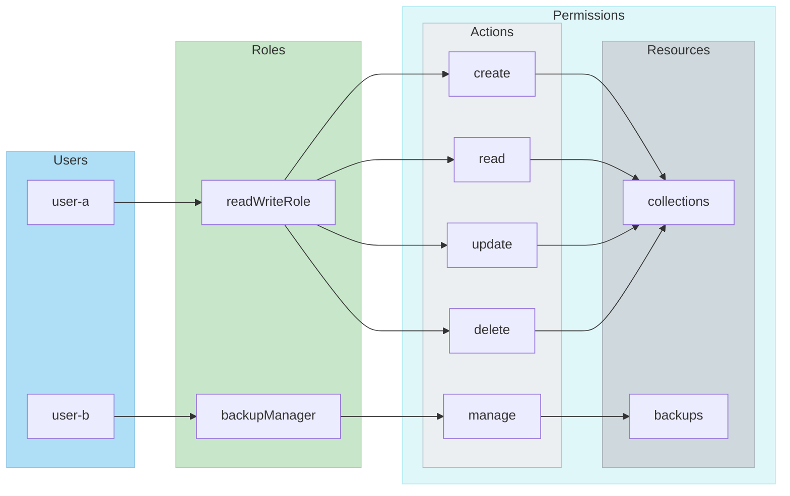

import Link from '@docusaurus/Link';
import SkipLink from '/src/components/SkipValidationLink'

:::info `v1.29` で追加
ロールベースアクセス制御（RBAC）は、バージョン `v1.29` から Weaviate で正式に利用可能になりました。
:::

Weaviate は、[認証](/deploy/configuration/authentication.md) 済みユーザーの ID に基づき、[認可](/deploy/configuration/authorization.md) レベルごとに差別化されたアクセスを提供します。

RBAC を有効にすると、ユーザーのロールに基づいてさらにアクセスを制限できます。以下の図は Weaviate における RBAC モデルを示しており、ロールを定義し、それぞれに特定の権限を割り当てることでアクセスを制御します。これらの権限は、指定されたリソースタイプに対してユーザーが実行できる操作を決定します。

主な構成要素は次のとおりです。

- **ユーザー**  
  個々のユーザー（例: `user-a`, `user-b`）は特定のロールに割り当てられます。

- **ロール**  
  各ロールは一連の権限をカプセル化します。この抽象化により、ユーザーグループが実行できる操作を管理できます。

- **権限**  
  権限は 3 つの要素で構成されます。  
  - **アクション**: create、read、update、delete、manage などの操作  
  - **リソース**: コレクションやバックアップなど、これらの操作の対象  
  - **オプションの制約**: コレクション名でのフィルタリングなど、リソース固有の制約

この RBAC システムにより、ユーザーは自身のロールに必要な最小限のアクセスのみを持つことになり、Weaviate 内のセキュリティと管理性が向上します。ロールと権限は、Weaviate の <b><SkipLink href="/weaviate/api/rest#tag/authz">REST API</SkipLink></b> もしくは **[クライアントライブラリ](/weaviate/configuration/rbac/manage-roles)** からプログラムで管理できます。

## ロール

### 事前定義ロール

Weaviate には、いくつかの事前定義ロールが用意されています。

- `root`: すべてのリソースに対する **フルアクセス** を持ちます。  
- `viewer`: すべてのリソースに対する **読み取り専用アクセス** を持ちます。

`root` ロールは、[`AUTHORIZATION_RBAC_ROOT_USERS`](/deploy/configuration/env-vars/index.md#rbac-authorization) 環境変数を使用して Weaviate の設定ファイル経由でユーザーに割り当てられます。事前定義ロールは変更できませんが、ユーザーには Weaviate API を通じて追加ロールを付与することが可能です。

事前定義ロールを含むすべてのロールは、Weaviate API でユーザーに割り当てたり取り消したりできます。事前定義ロール自体を変更することはできません。

ユーザーへ事前定義ロールを割り当てる方法の詳細は、[RBAC: 設定](/deploy/configuration/configuring-rbac.md) を参照してください。

### カスタムロール

事前定義ロールが割り当てられていない認証済みユーザーには、デフォルトでロールも権限もありません。

これらのユーザーの権限は、**ロール管理** の適切な権限を持つユーザーによって Weaviate 上で変更できます。これにより、必要に応じてカスタムロールを作成し、ユーザーに割り当てることが可能です。

ロール管理は、[事前定義 `root` ロール](/deploy/configuration/configuring-rbac.md) または [`manage_roles` 権限](/weaviate/configuration/rbac/manage-roles#role-management-permissions) を持つカスタムロールで実行できます。

:::caution Role Management Permissions
ロールを管理する権限をロールに付与する際は注意してください。これらの権限を利用して、ユーザーに追加のロールを割り当てることで特権を昇格させる可能性があります。信頼できるユーザーにのみ付与してください。
:::

## 権限

Weaviate における権限は、ユーザーが特定リソースに対してどの操作を実行できるかを定義します。各権限は以下で構成されます。

- リソースタイプ（例: collections, objects）
- アクセスレベル（read, write, update, delete, manage）
- オプションのリソース固有制約

### 利用可能な権限

権限は、以下のリソース・アクセスレベル・オプション制約で定義できます。

<!-- TODO: Potentially replace with a React component -->

<table class="rbac-table">
  <colgroup>
    <col style={{ width: '25%' }} />
    <col style={{ width: '35%' }} />
    <col style={{ width: '40%' }} />
  </colgroup>
  <thead>
    <tr>
      <th>リソースタイプ</th>
      <th>アクセスレベル</th>
      <th>リソース固有のオプション制約</th>
    </tr>
  </thead>
  <tbody>
    <tr>
      <td>
        <Link to="/weaviate/configuration/rbac/manage-roles#role-management-permissions">
          <strong>ロール管理</strong>
        </Link>
      </td>
      <td class="access-cell">
        
ロールの作成

        
ロール情報の読み取り

        
ロール権限の更新

        
ロールの削除

      </td>
      <td class="constraints-cell">
        

          
ロール名フィルタ:

          <ul>
            <li>
              <code>string または regex</code>: 管理対象のロールを指定
            </li>
          </ul>
        

        

          
ロールスコープ:

          <ul>
            <li>
              <code>all</code>: すべての権限でロール管理を許可
            </li>
            <li>
              <code>match</code>: 現在のユーザーと同レベルの権限でのみロール管理を許可
            </li>
          </ul>
        

      </td>
    </tr>
    <tr>
      <td>
        <Link to="/weaviate/configuration/rbac/manage-roles#user-management-permissions">
          <strong>ユーザー管理</strong>
        </Link>
      </td>
      <td class="access-cell">
        
ユーザーの作成

        
ユーザー情報の読み取り

        
ユーザー API キーの更新/ローテート

        
ユーザーの削除

        

          ユーザーへのロール付与および取り消し
        

      </td>
      <td class="constraints-cell">
        

          
ユーザー名フィルタ:

          <ul>
            <li>
              <code>string または regex</code>: 管理対象のユーザーを指定
            </li>
          </ul>
        

      </td>
    </tr>
    <tr>
      <td>
        <Link to="/weaviate/configuration/rbac/manage-roles#collections-permissions">
          <strong>コレクション</strong>
        </Link>
         
        <small>
          （コレクション定義のみ、データオブジェクトの権限は別）
        </small>
      </td>
      <td class="access-cell">
        
コレクションの作成

        
コレクション定義の読み取り

        
コレクション定義の更新

        
コレクションの削除

      </td>
      <td>
        
コレクション名フィルタ:

        <ul>
          <li>
            <code>string または regex</code>: 管理対象のコレクションを指定
          </li>
        </ul>
      </td>
    </tr>
    <tr>
      <td>
        <Link to="/weaviate/configuration/rbac/manage-roles#tenants-permissions">
          <strong>テナント</strong>
        </Link>
      </td>
      <td>
        
テナントの作成

        
テナント情報の読み取り

        
テナントの更新

        
テナントの削除

      </td>
      <td>
        
コレクション名フィルタ:

        <ul>
          <li>
            <code>string または regex</code>: 管理対象のコレクションを指定
          </li>
        </ul>
        
テナント名フィルタ:

        <ul>
          <li>
            <code>string または regex</code>: 管理対象のテナントを指定
          </li>
        </ul>
      </td>
    </tr>
    <tr>
      <td>
        <Link to="/weaviate/configuration/rbac/manage-roles#data-permissions">
          <strong>データオブジェクト</strong>
        </Link>
      </td>
      <td>
        
オブジェクトの作成

        
オブジェクトの読み取り

        
オブジェクトの更新

        
オブジェクトの削除

      </td>
      <td>
        
コレクション名フィルタ:

        <ul>
          <li>
            <code>string または regex</code>: 管理対象のコレクションを指定
          </li>
        </ul>
        
テナント名フィルタ:

        <ul>
          <li>
            <code>string または regex</code>: 管理対象のテナントを指定
          </li>
        </ul>
      </td>
    </tr>
    <tr>
      <td>
        <Link to="/weaviate/configuration/rbac/manage-roles#backups-permissions">
          <strong>バックアップ</strong>
        </Link>
      </td>
      <td>バックアップの管理</td>
      <td>
        
コレクション名フィルタ:

        <ul>
          <li>
            <code>string または regex</code>: 管理対象のコレクションを指定
          </li>
        </ul>
      </td>
    </tr>
    <tr>
      <td>
        <Link to="/weaviate/configuration/rbac/manage-roles#clusters-permissions">
          <strong>クラスター データアクセス</strong>
        </Link>
      </td>
      <td>クラスター メタデータの読み取り</td>
      <td></td>
    </tr>
    <tr>
      <td>
        <Link to="/weaviate/configuration/rbac/manage-roles#nodes-permissions">
          <strong>ノード データアクセス</strong>
        </Link>
      </td>
      <td>指定した詳細度でノードメタデータを読み取り</td>
      <td class="constraints-cell">
        

          
詳細度 (Verbosity level):

          <ul>
            <li>
              <code>minimal</code>: すべてのコレクションに対し最小限の読み取り
            </li>
            <li>
              <code>verbose</code>: 指定したコレクションに対し詳細な読み取り
            </li>
          </ul>
        

        

          

            コレクション名フィルタ（<code>verbose</code> のみ）:
          

          <ul>
            <li>
              <code>string または regex</code>: 管理対象のコレクションを指定
            </li>
          </ul>
        

      </td>
    </tr>
    <tr>
      <td>
        <Link to="/weaviate/configuration/rbac/manage-roles#aliases-permissions">
          <strong>コレクションエイリアス</strong>
        </Link>
      </td>
      <td>
        
エイリアスの作成

        
エイリアスの読み取り

        
エイリアスの更新

        
エイリアスの削除

      </td>
      <td>
        
エイリアス名フィルタ:

        <ul>
          <li>
            <code>string または regex</code>: 管理対象のエイリアスを指定
          </li>
        </ul>
      </td>
    </tr>
    <tr>
      <td>
        <Link to="/weaviate/configuration/rbac/manage-roles#replications-permissions">
          <strong>レプリケーション</strong>
        </Link>
      </td>
      <td>
        
レプリケーションの作成

        
レプリケーションの読み取り

        
レプリケーションの更新

        
レプリケーションの削除

      </td>
      <td>
        
コレクション名フィルタ:

        <ul>
          <li>
            <code>string または regex</code>: 管理対象のコレクションを指定
          </li>
        </ul>
        
シャード名フィルタ:

        <ul>
          <li>
            <code>string または regex</code>: 管理対象のシャードを指定
          </li>
        </ul>
      </td>
    </tr>
  </tbody>
</table>

### 権限の動作

権限を定義する際、ある権限を `False` に設定すると、それはアクセスを明示的に拒否するのではなく _設定されていない_ ことを意味します。したがって、ユーザーが複数のロールを持ち、一方のロールが権限を付与し、もう一方のロールがその権限を `False` に設定している場合でも、権限を付与しているロールによってユーザーはその権限を保持します。

たとえば、ユーザーが次の 2 つのロールを持っている場合:

- ロール A は Collection X に対して `read` を `False` に設定
- ロール B は Collection X に対して `read` を `True` に設定

ユーザーは Collection X に対する読み取りアクセスを持ちます。これは、ロール B が権限を付与しており、ロール A の `False` はアクセスをブロックするのではなく権限が設定されていないことを示すだけだからです。

### 権限における名前フィルター

一部の権限では、その権限を適用するコレクションを指定するためにコレクション名フィルターが必要です。

この場合、`"*"` は複数文字のワイルドカードとして機能します。たとえば、コレクション名フィルターに `"Test*"` を指定すると、`Test` で始まるすべてのコレクションにその権限が適用されます。また、`"*"` をフィルターに指定すると、利用可能なすべてのコレクションに適用されます。

### コレクションとテナントの権限

コレクションに対する権限は、テナントに対する権限とは独立しています。

あるコレクションに属するテナントを操作する権限を得るには、そのコレクションに対する適切なテナントレベルの権限が必要です。コレクションの作成などのコレクションレベルの権限は、そのコレクションのテナントを作成するなどの同等のテナントレベルの権限を付与しません。

たとえば、`TestCollection` というコレクションでテナントを作成するには、そのコレクション内のテナントを "create" する権限が必要です。これは `TestCollection` というコレクションを作成する権限とは別です。

## ユーザー

[user 管理](./manage-users.mdx) API を使用して、ユーザーの作成、削除、一覧取得、API キーのローテーション、およびロールの管理ができます。 

## 参考リソース

- [RBAC: 設定](/deploy/configuration/configuring-rbac.md)
- [RBAC: ロール管理](./manage-roles.mdx)
- [RBAC: ユーザー管理](./manage-users.mdx)
- [RBAC: チュートリアル](/deploy/tutorials/rbac.mdx)

## ご質問とフィードバック

import DocsFeedback from '/_includes/docs-feedback.mdx';

<DocsFeedback/>

