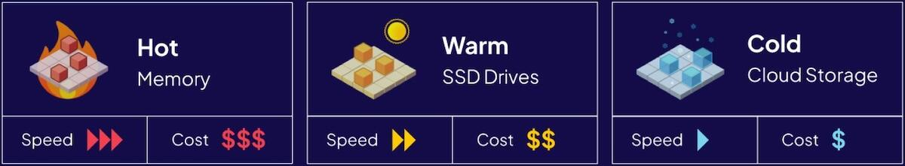

import Tabs from '@theme/Tabs';
import TabItem from '@theme/TabItem';
import FilteredTextBlock from '@site/src/components/Documentation/FilteredTextBlock';
import PyCode from '!!raw-loader!/_includes/code/howto/manage-data.multi-tenancy.py';
import TSCode from '!!raw-loader!/_includes/code/howto/manage-data.multi-tenancy.ts';

ストレージ リソースはティアにグループ化されます。各ティアは異なるパフォーマンス特性とコストを持ちます。

| Tier | Location | Speed | Cost |
| :- | :- | :- | :- |
| Hot | RAM | 最速アクセス | 最も高価 |
| Warm | Disk | 中速 | 中価格 |
| Cold | Cloud Storage | 最も遅いアクセス | 最も安価 |

Hot ティアと Cold ティアの価格差は大きく、クラウドストレージは RAM よりも桁違いに安価です。

マルチテナント コレクションでは、テナント状態（ `Active` 、 `Inactive` 、 `Offloaded` ）を変更してデータを異なるストレージ ティア間で移動できます。これにより、コスト、リソース可用性、即時利用性の間で細かなトレードオフが可能になります。

  
ベクトル インデックスのリソース温度を管理

ベクトル インデックスの種類により、デフォルトのリソース種類が決まります。

* [`HNSW` index (default)](/academy/py/vector_index/hnsw) - ベクトル インデックスを RAM 上に保持する **Hot** リソースを使用します。
* [`Flat` index](/academy/py/vector_index/flat) - ベクトル インデックスをディスク上に保持する **Warm** リソースを使用します。
* [`Dynamic` index](/academy/py/vector_index/dynamic) - 初期状態では flat インデックス（ **Warm** リソース）として開始し、設定された閾値を超えると HNSW インデックス（ **Hot** リソース）へ切り替わります。

## Tenant States 概要

テナント状態には `Active` 、 `Inactive` 、 `Offloaded` の 3 種類があります。

| Tenant state     | CRUD & Queries | Vector Index | Inverted Index | Object Data | Time to Activate | Description |
|------------------|----------------|--------------|----------------|-------------|------------------|------------|
| Active (default) | **Yes**        | Hot/Warm     | Warm           | Warm        | None             | テナントは利用可能です |
| Inactive         | **No**         | Warm         | Warm           | Warm        | Fast             | テナントはローカルに保持されていますが利用できません |
| Offloaded        | **No**         | Cold         | Cold           | Cold        | Slow             | テナントはクラウドストレージに保持され、利用できません |

:::tip Tenant state and consistency
テナント状態は最終的に整合性が取られます。 [詳細はこちら](/weaviate/concepts/replication-architecture/consistency#tenant-states-and-data-objects)
:::

### Active

`Active` テナントはクエリおよび CRUD 操作が可能です。 [ベクトル インデックスの種類](/weaviate/starter-guides/managing-resources#vector-index-types) に応じて **Hot** または **Warm** リソースを使用します。

テナントのオブジェクトデータと転置インデックスはディスク上に保存され、 `Warm` リソースを使用します。

### Inactive

`Inactive` テナントはクエリおよび CRUD 操作ができません。

テナントのオブジェクトデータ、ベクトル インデックス、転置インデックスはディスク上に保存され、 `Warm` リソースを使用します。これは **Hot** リソースを使用する Active テナントと比較して Weaviate のメモリ要件を下げる効果があります。

テナントがローカルにあるため、Inactive テナントは迅速にアクティブ化できます。

### Offloaded

import OffloadingLimitation from '/_includes/offloading-limitation.mdx';

<OffloadingLimitation/>

`Offloaded` テナントはクエリおよび CRUD 操作ができません。

テナントのオブジェクトデータ、ベクトル インデックス、転置インデックスはクラウド上に保存され、 `Cold` リソースを使用します。テナントがリモートにあるため、Offloaded テナントをアクティブ化する際には遅延が発生します。

## テナントをアクティブ化

ディスク上の `INACTIVE` テナントをアクティブ化する、またはクラウドから `OFFLOADED` テナントをオンロードしてアクティブ化するには、次を呼び出します。

<Tabs groupId="languages">
  <TabItem value="py" label="Python Client v4">
    <FilteredTextBlock
      text={PyCode}
      startMarker="# START ActivateTenants"
      endMarker="# END ActivateTenants"
      language="py"
    />
  </TabItem>

  <TabItem value="js" label="JS/TS Client v3">
    <FilteredTextBlock
      text={TSCode}
      startMarker="// START ActivateTenants"
      endMarker="// END ActivateTenants"
      language="ts"
    />
  </TabItem>
</Tabs>

## テナントを非アクティブ化

:::info v1.21.0 で追加
:::

`ACTIVE` テナントを非アクティブ化する、または `OFFLOADED` テナントをクラウドからオンロード（アクティブ化せずにローカルへ配置）するには、次を呼び出します。

<Tabs groupId="languages">
  <TabItem value="py" label="Python Client v4">
    <FilteredTextBlock
      text={PyCode}
      startMarker="# START DeactivateTenants"
      endMarker="# END DeactivateTenants"
      language="py"
    />
  </TabItem>

  <TabItem value="js" label="JS/TS Client v3">
    <FilteredTextBlock
      text={TSCode}
      startMarker="// START DeactivateTenants"
      endMarker="// END DeactivateTenants"
      language="ts"
    />
  </TabItem>
</Tabs>

## テナントのオフロード

:::info Added in v1.26.0
:::

`ACTIVE` または `INACTIVE` のテナントをクラウドにオフロードするには、次を呼び出します:

<Tabs groupId="languages">
  <TabItem value="py" label="Python Client v4">
    <FilteredTextBlock
      text={PyCode}
      startMarker="# START OffloadTenants"
      endMarker="# END OffloadTenants"
      language="py"
    />
  </TabItem>

  <TabItem value="js" label="JS/TS Client v3">
    <FilteredTextBlock
      text={TSCode}
      startMarker="// START OffloadTenants"
      endMarker="// END OffloadTenants"
      language="ts"
    />
  </TabItem>
</Tabs>

:::caution Offload モジュールが必要
テナントのオフロードには Offload モジュールが必要です。

テナントオフロードを有効にする方法は、[modules ページ](../configuration/modules.md#tenant-offload-modules) をご覧ください
:::

## テナントの自動アクティベート

:::info Added in `v1.25.2`
:::

検索、読み取り、更新、削除操作が実行された際に、`INACTIVE` または `OFFLOADED` のテナントを自動的にアクティブ化するには、次を有効にします。

<Tabs groupId="languages">
  <TabItem value="py" label="Python Client v4">
    <FilteredTextBlock
      text={PyCode}
      startMarker="# START EnableAutoActivation"
      endMarker="# END EnableAutoActivation"
      language="py"
    />
  </TabItem>

  <TabItem value="js" label="JS/TS Client v3">
    <FilteredTextBlock
      text={TSCode}
      startMarker="// START EnableAutoActivation"
      endMarker="// END EnableAutoActivation"
      language="ts"
    />
  </TabItem>

</Tabs>

## ご質問とフィードバック

import DocsFeedback from '/_includes/docs-feedback.mdx';

<DocsFeedback/>

