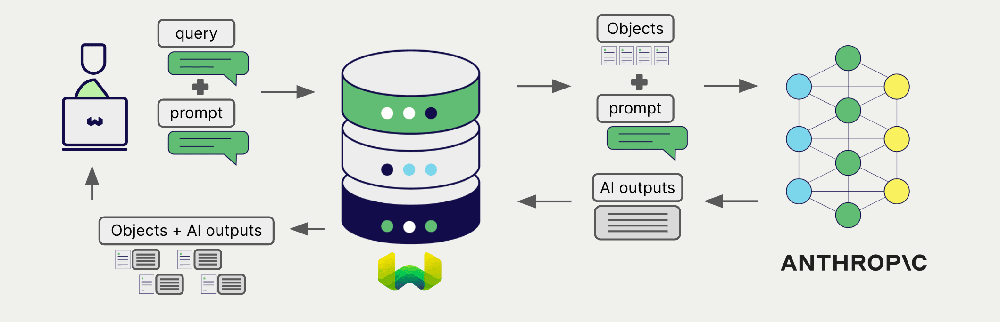
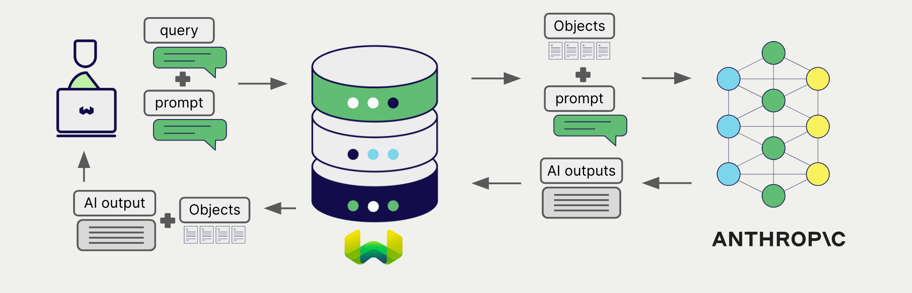

# Weaviate での Anthropic 生成 AI

import Tabs from '@theme/Tabs';
import TabItem from '@theme/TabItem';
import FilteredTextBlock from '@site/src/components/Documentation/FilteredTextBlock';
import PyConnect from '!!raw-loader!../_includes/provider.connect.py';
import TSConnect from '!!raw-loader!../_includes/provider.connect.ts';
import PyCode from '!!raw-loader!../_includes/provider.generative.py';
import TSCode from '!!raw-loader!../_includes/provider.generative.ts';

Weaviate の Anthropic API との統合により、モデルの機能を Weaviate から直接利用できます。

Anthropic の生成 AI モデルを使用するには、[Weaviate コレクションを設定](#configure-collection)してください。Weaviate は、指定したモデルとお持ちの Anthropic API キーを用いて 検索拡張生成 (RAG) を実行します。

具体的には、 Weaviate が検索を行い、最も関連性の高いオブジェクトを取得し、それらを Anthropic の生成モデルに渡して出力を生成します。

## 要件

### Weaviate の設定

ご利用の Weaviate インスタンスには、Anthropic 生成 AI 連携モジュール (`generative-anthropic`) を設定しておく必要があります。

  
Weaviate Cloud (WCD) のユーザー向け

Weaviate Cloud (WCD) のサーバーレスインスタンスでは、この連携はデフォルトで有効になっています。

  
セルフホスト版ユーザー向け

- モジュールが有効かどうかを確認するには、[クラスター メタデータ](/deploy/configuration/meta.md) をチェックしてください。
- Weaviate でモジュールを有効にするには、[モジュール設定方法](../../configuration/modules.md) ガイドに従ってください。

### API 認証情報

この連携を利用するには、有効な Anthropic API キーを Weaviate に提供する必要があります。API キーを取得するには、[Anthropic](https://www.anthropic.com/api) にサインアップしてください。

次のいずれかの方法で Weaviate に API キーを渡してください。

- Weaviate が参照できる環境変数 `ANTHROPIC_APIKEY` を設定する  
- 以下の例のように、実行時に API キーを渡す

<Tabs groupId="languages">

 <TabItem value="py" label="Python API v4">
    <FilteredTextBlock
      text={PyConnect}
      startMarker="# START AnthropicInstantiation"
      endMarker="# END AnthropicInstantiation"
      language="py"
    />
  </TabItem>

 <TabItem value="js" label="JS/TS API v3">
    <FilteredTextBlock
      text={TSConnect}
      startMarker="// START AnthropicInstantiation"
      endMarker="// END AnthropicInstantiation"
      language="ts"
    />
  </TabItem>

</Tabs>

## コレクションの設定

import MutableGenerativeConfig from '/_includes/mutable-generative-config.md';

<MutableGenerativeConfig />

Anthropic の生成モデルを使用するには、次のように [Weaviate インデックスを設定](../../manage-collections/generative-reranker-models.mdx#specify-a-generative-model-integration)します。

<Tabs groupId="languages">
  <TabItem value="py" label="Python API v4">
    <FilteredTextBlock
      text={PyCode}
      startMarker="# START BasicGenerativeAnthropic"
      endMarker="# END BasicGenerativeAnthropic"
      language="py"
    />
  </TabItem>

  <TabItem value="js" label="JS/TS API v3">
    <FilteredTextBlock
      text={TSCode}
      startMarker="// START BasicGenerativeAnthropic"
      endMarker="// END BasicGenerativeAnthropic"
      language="ts"
    />
  </TabItem>

</Tabs>

### モデルの選択

以下の設定例のように、 Weaviate で使用する [利用可能なモデル](#available-models) を指定できます。

<Tabs groupId="languages">
  <TabItem value="py" label="Python API v4">
    <FilteredTextBlock
      text={PyCode}
      startMarker="# START GenerativeAnthropicCustomModel"
      endMarker="# END GenerativeAnthropicCustomModel"
      language="py"
    />
  </TabItem>

  <TabItem value="js" label="JS/TS API v3">
    <FilteredTextBlock
      text={TSCode}
      startMarker="// START GenerativeAnthropicCustomModel"
      endMarker="// END GenerativeAnthropicCustomModel"
      language="ts"
    />
  </TabItem>

</Tabs>

Weaviate で使用する [利用可能なモデル](#available-models) を[指定](#generative-parameters)できます。モデルを指定しない場合は、[デフォルトモデル](#available-models) が使用されます。

### 生成パラメーター

以下の生成パラメーターを設定して、モデルの挙動をカスタマイズします。

<Tabs groupId="languages">
  <TabItem value="py" label="Python API v4">
    <FilteredTextBlock
      text={PyCode}
      startMarker="# START FullGenerativeAnthropic"
      endMarker="# END FullGenerativeAnthropic"
      language="py"
    />
  </TabItem>

  <TabItem value="js" label="JS/TS API v3">
    <FilteredTextBlock
      text={TSCode}
      startMarker="// START FullGenerativeAnthropic"
      endMarker="// END FullGenerativeAnthropic"
      language="ts"
    />
  </TabItem>

</Tabs>

モデルパラメーターの詳細については、[Anthropic API ドキュメント](https://www.anthropic.com/docs) を参照してください。

## 実行時のモデル選択

コレクション作成時にデフォルトのモデルプロバイダーを設定するだけでなく、クエリ実行時に上書きすることも可能です。

<Tabs groupId="languages">
  <TabItem value="py" label="Python API v4">
    <FilteredTextBlock
      text={PyCode}
      startMarker="# START RuntimeModelSelectionAnthropic"
      endMarker="# END RuntimeModelSelectionAnthropic"
      language="py"
    />
  </TabItem>
  <TabItem value="js" label="JS/TS Client v3">
    <FilteredTextBlock
      text={TSCode}
      startMarker="// START RuntimeModelSelectionAnthropic"
      endMarker="// END RuntimeModelSelectionAnthropic"
      language="ts"
    />
  </TabItem>
</Tabs>

## ヘッダー パラメーター

追加のヘッダーをリクエストに含めることで、実行時に API キーや任意のパラメーターを指定できます。利用可能なヘッダーは次のとおりです。

- `X-Anthropic-Api-Key`: Anthropic API キー  
- `X-Anthropic-Baseurl`: 既定の Anthropic URL の代わりに使用するベース URL（例: プロキシ）

実行時に指定された追加ヘッダーは、既存の Weaviate 設定を上書きします。

ヘッダーは上記の[API 資格情報の例](#api-credentials)のように指定してください。

## 検索拡張生成

生成 AI 統合を設定した後、[単一プロンプト](#single-prompt)もしくは[グループ化タスク](#grouped-task)の方法で RAG 操作を実行します。

### 単一プロンプト

検索結果の各オブジェクトに対してテキストを生成するには、単一プロンプト方式を使用します。

次の例では、`limit` パラメーターで指定した `n` 件の検索結果それぞれに対して出力を生成します。

単一プロンプトクエリを作成する際、Weaviate が言語モデルに渡すオブジェクトプロパティを埋め込むために `{}` を使用します。たとえばオブジェクトの `title` プロパティを渡したい場合は、クエリに `{title}` を含めてください。

<Tabs groupId="languages">

 <TabItem value="py" label="Python API v4">
    <FilteredTextBlock
      text={PyCode}
      startMarker="# START SinglePromptExample"
      endMarker="# END SinglePromptExample"
      language="py"
    />
  </TabItem>

 <TabItem value="js" label="JS/TS API v3">
    <FilteredTextBlock
      text={TSCode}
      startMarker="// START SinglePromptExample"
      endMarker="// END SinglePromptExample"
      language="ts"
    />
  </TabItem>

</Tabs>

### グループ化タスク

検索結果全体に対して 1 件のテキストを生成する場合は、グループ化タスク方式を使用します。

言い換えると、`n` 件の検索結果がある場合、生成モデルはそのグループ全体に対して 1 件の出力を生成します。

<Tabs groupId="languages">

 <TabItem value="py" label="Python API v4">
    <FilteredTextBlock
      text={PyCode}
      startMarker="# START GroupedTaskExample"
      endMarker="# END GroupedTaskExample"
      language="py"
    />
  </TabItem>

 <TabItem value="js" label="JS/TS API v3">
    <FilteredTextBlock
      text={TSCode}
      startMarker="// START GroupedTaskExample"
      endMarker="// END GroupedTaskExample"
      language="ts"
    />
  </TabItem>

</Tabs>

### 画像を用いた RAG

単一プロンプトでもグループ化タスクでも、検索拡張生成を実行する際の入力の一部として画像を渡すこともできます。 

<Tabs groupId="languages">

 <TabItem value="py" label="Python API v4">
    <FilteredTextBlock
      text={PyCode}
      startMarker="# START WorkingWithImagesAnthropic"
      endMarker="# END WorkingWithImagesAnthropic"
      language="py"
    />
  </TabItem>
  <TabItem value="js" label="JS/TS API v3">
    <FilteredTextBlock
      text={TSCode}
      startMarker="// START WorkingWithImagesAnthropic"
      endMarker="// END WorkingWithImagesAnthropic"
      language="ts"
    />
  </TabItem>
</Tabs>

## 参考情報

#### 出力トークンの上限

`maxTokens` パラメーターを使用して、Anthropic 生成 AI モデルの出力トークンの最大数を設定できます。このパラメーターは、最大入力トークン数（コンテキスト ウィンドウ）とは別に設定されます。

ほとんどのモデルでは、デフォルトの `maxTokens` は `4096`（かつ最大値）で、入力（コンテキスト ウィンドウ）サイズは `200,000` です。具体的な許可値はモデルによって異なる場合があります。最新情報は [Anthropic のドキュメント](https://docs.anthropic.com/en/docs/about-claude/models#model-comparison) を参照してください。

#### Base URL

Anthropic では、API エンドポイントにカスタム Base URL を指定できます。専用の API エンドポイントを持っている、またはプロキシの背後にある場合に便利です。

カスタム Base URL は、前述のようにコレクションの設定で指定するか、リクエストヘッダーで指定できます。ヘッダーで指定する場合は、`X-Anthropic-Baseurl` キーにカスタム Base URL を値として設定して Weaviate クライアントを初期化します。

デフォルトの Base URL は `https://api.anthropic.com` です。

### 利用可能なモデル

Anthropic API に用意されているすべてのモデルを Weaviate で使用できます。2024 年 7 月時点では、次のモデルが利用可能です。

- `claude-3-5-sonnet-20240620` (default)
- `claude-3-opus-20240229`
- `claude-3-sonnet-20240229`
- `claude-3-haiku-20240307`

最新のモデル一覧は [Anthropic API ドキュメント](https://docs.anthropic.com/en/docs/about-claude/models#model-names) をご覧ください。

## 追加リソース

### コード例

インテグレーションをコレクションに設定すると、Weaviate でのデータ管理と検索操作は他のコレクションとまったく同じように機能します。以下のモデル非依存の例をご覧ください。

- [How-to: コレクションの管理](../../manage-collections/index.mdx) と [How-to: オブジェクトの管理](../../manage-objects/index.mdx) では、データ操作（コレクションおよびその内部オブジェクトの作成、読み取り、更新、削除）方法を紹介しています。
- [How-to: クエリ & 検索](../../search/index.mdx) では、ベクトル検索、キーワード検索、ハイブリッド検索および検索拡張生成の実行方法を説明しています。

### 参照

- Anthropic [API ドキュメント](https://www.anthropic.com/docs)

## 質問・フィードバック

import DocsFeedback from '/_includes/docs-feedback.mdx';

<DocsFeedback/>

