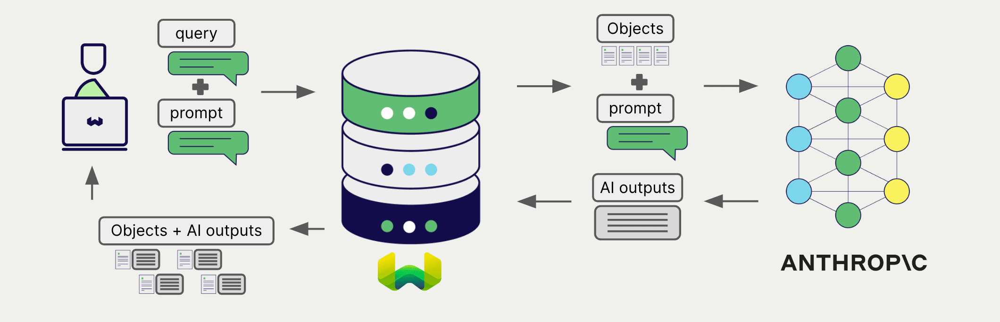

<!-- Note: for images, use https://docs.google.com/presentation/d/15opIcJuaIjEEcs_1Zm8B6pccox2p7_MHSjCnRv4dPfU/edit?usp=sharing -->

Anthropic は、自然言語処理および生成向けの幅広いモデルを提供しています。 Weaviate は Anthropic の API とシームレスに連携し、ユーザーは Weaviate データベースから直接 Anthropic のモデルを活用できます。

これらの連携により、開発者は高度な AI 主導のアプリケーションを簡単に構築できます。

## Anthropic との連携

### RAG 向け生成 AI モデル

Anthropic の生成 AI モデルは、与えられたプロンプトとコンテキストに基づいて人間らしいテキストを生成できます。

[Weaviate の生成 AI 連携](./generative.md) により、ユーザーは Weaviate データベースから直接 検索拡張生成 (RAG) を実行できます。これにより、 Weaviate の高効率なストレージと高速検索機能と Anthropic の生成 AI モデルが組み合わさり、パーソナライズされた文脈認識応答を生成できます。

[Anthropic 生成 AI 連携ページ](./generative.md)

## まとめ

これらの連携により、開発者は Weaviate 内で Anthropic の強力なモデルを直接活用できます。

その結果、 AI 主導のアプリケーションを構築するプロセスが簡素化され、開発サイクルが加速するため、イノベーティブなソリューションの創出に集中できます。

## はじめに

これらの連携を利用するには、 Weaviate に有効な Anthropic API キーを設定する必要があります。 [Anthropic](https://www.anthropic.com/) にアクセスしてサインアップし、 API キーを取得してください。

次に、関連する連携ページに移動し、 Anthropic モデルで Weaviate を設定して、アプリケーションで使用を開始してください。

- [生成 AI](./generative.md)

## 質問とフィードバック

import DocsFeedback from '/_includes/docs-feedback.mdx';

<DocsFeedback/>

