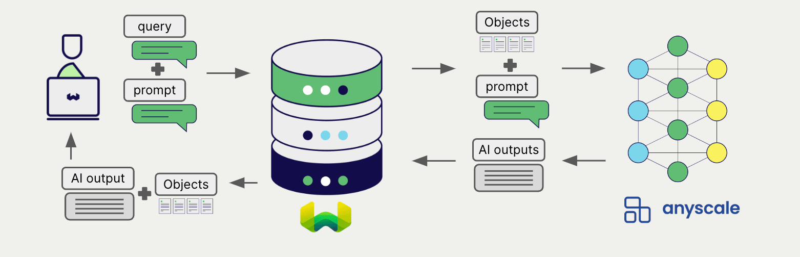

#  Weaviate と Anyscale による生成 AI

import Tabs from '@theme/Tabs';
import TabItem from '@theme/TabItem';
import FilteredTextBlock from '@site/src/components/Documentation/FilteredTextBlock';
import PyConnect from '!!raw-loader!../_includes/provider.connect.py';
import TSConnect from '!!raw-loader!../_includes/provider.connect.ts';
import PyCode from '!!raw-loader!../_includes/provider.generative.py';
import TSCode from '!!raw-loader!../_includes/provider.generative.ts';

 Weaviate の Anyscale Endpoints API との統合により、 Weaviate から直接 Anyscale のモデル機能を利用できます。

[コレクションを設定](#configure-collection)して Anyscale の生成 AI モデルを使用すると、 Weaviate は指定したモデルとお客様の Anyscale API キーを用いて検索拡張生成 (RAG) を実行します。

具体的には、 Weaviate が検索を実行し、最も関連性の高いオブジェクトを取得した後、これらを Anyscale の生成モデルに渡して出力を生成します。

## 必要条件

###  Weaviate の設定

お使いの Weaviate インスタンスには、 Anyscale 生成 AI 統合 ( `generative-anyscale` ) モジュールが有効化されている必要があります。

  
Weaviate Cloud (WCD) ユーザーの場合

この統合は、 Weaviate Cloud (WCD) のサーバーレスインスタンスではデフォルトで有効になっています。

  
セルフホストユーザーの場合

- [クラスターメタデータ](/deploy/configuration/meta.md) を確認し、モジュールが有効になっているかをご確認ください。  
- [モジュールの設定方法](../../configuration/modules.md) に従って、 Weaviate でモジュールを有効にしてください。

### API 認証情報

この統合を利用するには、有効な Anyscale API キーを Weaviate に提供する必要があります。 [Anyscale](https://www.anyscale.com/) でサインアップし、 API キーを取得してください。

以下のいずれかの方法で API キーを Weaviate に渡します。

- `ANYSCALE_APIKEY` 環境変数を設定して Weaviate から参照できるようにする。  
- 下記の例のように、実行時に API キーを渡す。

<Tabs groupId="languages">

 <TabItem value="py" label="Python API v4">
    <FilteredTextBlock
      text={PyConnect}
      startMarker="# START AnyscaleInstantiation"
      endMarker="# END AnyscaleInstantiation"
      language="py"
    />
  </TabItem>

 <TabItem value="js" label="JS/TS API v3">
    <FilteredTextBlock
      text={TSConnect}
      startMarker="// START AnyscaleInstantiation"
      endMarker="// END AnyscaleInstantiation"
      language="ts"
    />
  </TabItem>

</Tabs>

## コレクションの設定

import MutableGenerativeConfig from '/_includes/mutable-generative-config.md';

<MutableGenerativeConfig />

[Weaviate インデックスを設定](../../manage-collections/generative-reranker-models.mdx#specify-a-generative-model-integration)して Anyscale の生成モデルを使用するには、次のように設定します。

<Tabs groupId="languages">
  <TabItem value="py" label="Python API v4">
    <FilteredTextBlock
      text={PyCode}
      startMarker="# START BasicGenerativeAnyscale"
      endMarker="# END BasicGenerativeAnyscale"
      language="py"
    />
  </TabItem>

  <TabItem value="js" label="JS/TS API v3">
    <FilteredTextBlock
      text={TSCode}
      startMarker="// START BasicGenerativeAnyscale"
      endMarker="// END BasicGenerativeAnyscale"
      language="ts"
    />
  </TabItem>

</Tabs>

[利用可能なモデル](#available-models) のいずれかを [指定](#generative-parameters) できます。モデルを指定しない場合は[デフォルトモデル](#available-models) が使用されます。

### モデルの選択

 Weaviate に使用させる [利用可能なモデル](#available-models) を指定できます。以下はその設定例です。

<Tabs groupId="languages">
  <TabItem value="py" label="Python API v4">
    <FilteredTextBlock
      text={PyCode}
      startMarker="# START GenerativeAnyscaleCustomModel"
      endMarker="# END GenerativeAnyscaleCustomModel"
      language="py"
    />
  </TabItem>

  <TabItem value="js" label="JS/TS API v3">
    <FilteredTextBlock
      text={TSCode}
      startMarker="// START GenerativeAnyscaleCustomModel"
      endMarker="// END GenerativeAnyscaleCustomModel"
      language="ts"
    />
  </TabItem>

</Tabs>

### 生成パラメーター

以下の生成パラメーターを設定して、モデルの挙動をカスタマイズします。

<Tabs groupId="languages">
  <TabItem value="py" label="Python API v4">
    <FilteredTextBlock
      text={PyCode}
      startMarker="# START FullGenerativeAnyscale"
      endMarker="# END FullGenerativeAnyscale"
      language="py"
    />
  </TabItem>

  <TabItem value="js" label="JS/TS API v3">
    <FilteredTextBlock
      text={TSCode}
      startMarker="// START FullGenerativeAnyscale"
      endMarker="// END FullGenerativeAnyscale"
      language="ts"
    />
  </TabItem>

</Tabs>

モデルパラメーターの詳細については、[Anyscale Endpoints API documentation](https://docs.anyscale.com/endpoints/intro/) を参照してください。

## 実行時のモデル選択

コレクション作成時にデフォルトのモデルプロバイダーを設定する以外に、クエリ実行時に上書きすることも可能です。

<Tabs groupId="languages">
  <TabItem value="py" label="Python API v4">
    <FilteredTextBlock
      text={PyCode}
      startMarker="# START RuntimeModelSelectionAnyscale"
      endMarker="# END RuntimeModelSelectionAnyscale"
      language="py"
    />
  </TabItem>
  <TabItem value="js" label="JS/TS Client v3">
    <FilteredTextBlock
      text={TSCode}
      startMarker="// START RuntimeModelSelectionAnyscale"
      endMarker="// END RuntimeModelSelectionAnyscale"
      language="ts"
    />
  </TabItem>
</Tabs>

## ヘッダーパラメーター

API キーおよびオプションのパラメーターは、リクエストに追加ヘッダーとして実行時に渡せます。利用可能なヘッダーは次のとおりです。

- `X-Anyscale-Api-Key`: Anyscale の API キー  
- `X-Anyscale-Baseurl`: 既定の Anyscale URL の代わりに使用するベース URL（例: プロキシ）

実行時に渡された追加ヘッダーは、既存の Weaviate 設定を上書きします。

上記の [API credentials の例](#api-credentials) のようにヘッダーを指定してください。

## 検索拡張生成

生成 AI の統合を設定した後、[シングル プロンプト](#single-prompt) または [グループ化タスク](#grouped-task) の方法で RAG 操作を実行できます。

### シングル プロンプト

検索結果の各オブジェクトに対してテキストを生成する場合は、シングル プロンプト方式を使用します。

次の例では、`limit` パラメーターで指定した `n` 件の検索結果それぞれに対して出力を生成します。

シングル プロンプト クエリを作成する際、Weaviate から言語モデルへ渡したいオブジェクトプロパティを中括弧 `{}` でインターポレートします。たとえば、オブジェクトの `title` プロパティを渡すには、クエリ内に `{title}` を含めます。

<Tabs groupId="languages">

 <TabItem value="py" label="Python API v4">
    <FilteredTextBlock
      text={PyCode}
      startMarker="# START SinglePromptExample"
      endMarker="# END SinglePromptExample"
      language="py"
    />
  </TabItem>

 <TabItem value="js" label="JS/TS API v3">
    <FilteredTextBlock
      text={TSCode}
      startMarker="// START SinglePromptExample"
      endMarker="// END SinglePromptExample"
      language="ts"
    />
  </TabItem>

</Tabs>

### グループ化タスク

検索結果のセット全体に対して 1 つのテキストを生成する場合は、グループ化タスク方式を使用します。

つまり、`n` 件の検索結果がある場合でも、生成モデルはグループ全体に対して 1 つの出力のみを生成します。

<Tabs groupId="languages">

 <TabItem value="py" label="Python API v4">
    <FilteredTextBlock
      text={PyCode}
      startMarker="# START GroupedTaskExample"
      endMarker="# END GroupedTaskExample"
      language="py"
    />
  </TabItem>

 <TabItem value="js" label="JS/TS API v3">
    <FilteredTextBlock
      text={TSCode}
      startMarker="// START GroupedTaskExample"
      endMarker="// END GroupedTaskExample"
      language="ts"
    />
  </TabItem>

</Tabs>

## 参考資料

### 利用可能なモデル

* `meta-llama/Llama-2-70b-chat-hf` (default)
* `meta-llama/Llama-2-13b-chat-hf`
* `meta-llama/Llama-2-7b-chat-hf`
* `codellama/CodeLlama-34b-Instruct-hf`
* `mistralai/Mistral-7B-Instruct-v0.1`
* `mistralai/Mixtral-8x7B-Instruct-v0.1`

## 追加リソース

### コード例

コレクションで統合を設定すると、 Weaviate のデータ管理および検索操作は他のコレクションとまったく同じように機能します。以下のモデル非依存の例をご覧ください。

- [How-to: コレクションの管理](../../manage-collections/index.mdx) と [How-to: オブジェクトの管理](../../manage-objects/index.mdx) のガイドでは、データ操作（つまり create、read、update、delete によるコレクションおよびそれら内のオブジェクトの作成・読み取り・更新・削除）の方法を解説しています。
- [How-to: クエリ & 検索](../../search/index.mdx) ガイドでは、ベクトル検索、キーワード検索、ハイブリッド検索、さらに 検索拡張生成 の実行方法を紹介しています。

### 参考

- Anyscale [Endpoints API ドキュメント](https://docs.anyscale.com/endpoints/intro/)

## 質問とフィードバック

import DocsFeedback from '/_includes/docs-feedback.mdx';

<DocsFeedback/>

