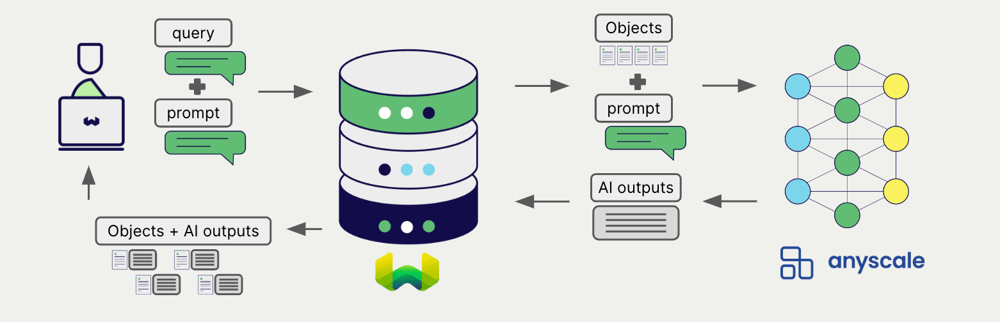

<!-- Note: for images, use https://docs.google.com/presentation/d/15opIcJuaIjEEcs_1Zm8B6pccox2p7_MHSjCnRv4dPfU/edit?usp=sharing -->

Anyscale は自然言語処理と生成のための幅広いモデルを提供しています。Weaviate は Anyscale の Endpoints API とシームレスに統合されており、ユーザーは Weaviate Database から直接 Anyscale のモデルを利用できます。

これらの統合により、開発者は高度な AI 駆動アプリケーションを簡単に構築できます。

## Anyscale との統合

### RAG 向け生成 AI モデル

Anyscale の生成 AI モデルは、指定されたプロンプトとコンテキストに基づいて人間らしいテキストを生成できます。

[Weaviate の生成 AI 統合](./generative.md) を使用すると、ユーザーは Weaviate Database から直接 検索拡張生成 (RAG) を実行できます。これにより、Weaviate の効率的なストレージと高速な検索機能に Anyscale の生成 AI モデルを組み合わせて、パーソナライズされコンテキストを考慮した応答を生成します。

[Anyscale 生成 AI 統合ページ](./generative.md)

## Summary

これらの統合により、開発者は Weaviate 内で直接 Anyscale の強力なモデルを活用できます。

その結果、AI 駆動アプリケーションの構築プロセスが簡素化され、開発を迅速化でき、革新的なソリューションの創出に集中できます。

## Get started

これらの統合を利用するには、有効な Anyscale API キーを Weaviate に提供する必要があります。 [Anyscale](https://www.anyscale.com/) にアクセスしてサインアップし、API キーを取得してください。

次に、該当する統合ページに移動し、Weaviate で Anyscale モデルを設定してアプリケーションで使用する方法を確認してください。

- [生成 AI](./generative.md)

## 質問とフィードバック

import DocsFeedback from '/_includes/docs-feedback.mdx';

<DocsFeedback/>

