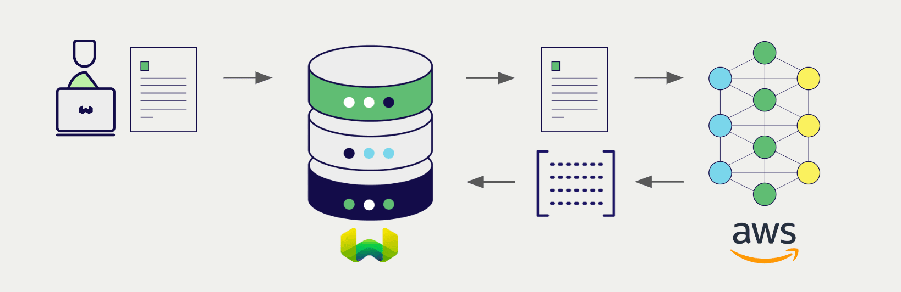

# Weaviate での AWS 埋め込み

import Tabs from '@theme/Tabs';
import TabItem from '@theme/TabItem';
import FilteredTextBlock from '@site/src/components/Documentation/FilteredTextBlock';
import PyConnect from '!!raw-loader!../_includes/provider.connect.py';
import TSConnect from '!!raw-loader!../_includes/provider.connect.ts';
import GoConnect from '!!raw-loader!/_includes/code/howto/go/docs/model-providers/1-connect/main.go';
import PyCode from '!!raw-loader!../_includes/provider.vectorizer.py';
import TSCode from '!!raw-loader!../_includes/provider.vectorizer.ts';
import GoCode from '!!raw-loader!/_includes/code/howto/go/docs/model-providers/2-usage-text/main.go';

 Weaviate が  AWS の [SageMaker](https://aws.amazon.com/sagemaker/) と [Bedrock](https://aws.amazon.com/bedrock/)  API に統合されているため、これらのモデルの機能を  Weaviate から直接利用できます。

[ Weaviate ベクトルインデックス](#configure-the-vectorizer) を  AWS の埋め込みモデルで使用するように設定すると、 Weaviate は指定したモデルとお客様の  AWS  API 資格情報を用いてさまざまな操作の埋め込みを生成します。この機能は *ベクトライザー* と呼ばれます。

[インポート時](#data-import) に、 Weaviate はテキストオブジェクトの埋め込みを生成し、インデックスに保存します。さらに [ベクトル](#vector-near-text-search) および [ハイブリッド](#hybrid-search) 検索操作では、 Weaviate がテキストクエリを埋め込みへと変換します。

## 要件

### Weaviate の設定

お使いの  Weaviate インスタンスは、 AWS ベクトライザー統合（`text2vec-aws`）モジュールを有効にしておく必要があります。

  
 Weaviate Cloud (WCD) ユーザーの場合

この統合は  Weaviate Cloud (WCD) サーバーレスインスタンスではデフォルトで有効になっています。

  
セルフホストユーザーの場合

- [クラスターメタデータ](/deploy/configuration/meta.md) を確認し、モジュールが有効かどうかを確認します。  
- [モジュールの設定方法](../../configuration/modules.md) ガイドに従い、 Weaviate でモジュールを有効化します。

### API 資格情報

これらの統合を利用するには、[アクセスキー方式の  AWS 資格情報](https://docs.aws.amazon.com/IAM/latest/UserGuide/id_credentials_access-keys.html) を  Weaviate に提供する必要があります。 [AWS](https://aws.amazon.com/) にサインアップして、 AWS アクセスキー ID と対応する AWS シークレットアクセスキーを取得してください。

次のいずれかの方法で  Weaviate に API 資格情報を提供します。

- `AWS_ACCESS_KEY` と `AWS_SECRET_KEY` の環境変数を設定し、 Weaviate から利用できるようにする  
- 以下の例のように、実行時に API 資格情報を渡す

<Tabs groupId="languages">

 <TabItem value="py" label="Python API v4">
    <FilteredTextBlock
      text={PyConnect}
      startMarker="# START AWSInstantiation"
      endMarker="# END AWSInstantiation"
      language="py"
    />
  </TabItem>

 <TabItem value="js" label="JS/TS API v3">
    <FilteredTextBlock
      text={TSConnect}
      startMarker="// START AWSInstantiation"
      endMarker="// END AWSInstantiation"
      language="ts"
    />
  </TabItem>

  <TabItem value="go" label="Go">
    <FilteredTextBlock
      text={GoConnect}
      startMarker="// START AWSInstantiation"
      endMarker="// END AWSInstantiation"
      language="goraw"
    />
  </TabItem>

</Tabs>

### AWS モデルへのアクセス

#### Bedrock

[Bedrock](https://aws.amazon.com/bedrock/) を介してモデルを利用するには、そのモデルが利用可能であり、 AWS からのアクセス許可が付与されている必要があります。

利用可能なモデルの一覧は [AWS ドキュメント](https://docs.aws.amazon.com/bedrock/latest/userguide/models-regions.html) を、モデルへのアクセス申請方法は [こちらのドキュメント](https://docs.aws.amazon.com/bedrock/latest/userguide/model-usage.html) を参照してください。

#### SageMaker

[SageMaker](https://aws.amazon.com/sagemaker/) を通じてモデルを使用する場合は、そのモデルのエンドポイントにアクセスできる必要があります。

## ベクトライザーの設定

 AWS 埋め込みモデルを使用するように [ Weaviate インデックス](../../manage-collections/vector-config.mdx#specify-a-vectorizer) を次のように設定します。

 Bedrock と SageMaker のモデルでは必要なパラメーターが異なります。

### Bedrock

Bedrock を使用する場合は、ベクトライザー設定にモデル名を指定する必要があります。

<Tabs groupId="languages">
  <TabItem value="py" label="Python API v4">
    <FilteredTextBlock
      text={PyCode}
      startMarker="# START BasicVectorizerAWSBedrock"
      endMarker="# END BasicVectorizerAWSBedrock"
      language="py"
    />
  </TabItem>

  <TabItem value="js" label="JS/TS API v3">
    <FilteredTextBlock
      text={TSCode}
      startMarker="// START BasicVectorizerAWSBedrock"
      endMarker="// END BasicVectorizerAWSBedrock"
      language="ts"
    />
  </TabItem>

  <TabItem value="go" label="Go">
    <FilteredTextBlock
      text={GoCode}
      startMarker="// START BasicVectorizerAWSBedrock"
      endMarker="// END BasicVectorizerAWSBedrock"
      language="goraw"
    />
  </TabItem>

</Tabs>

### SageMaker

SageMaker を使用する場合、ベクトライザーの設定で endpoint アドレスを指定する必要があります。

<Tabs groupId="languages">
  <TabItem value="py" label="Python API v4">
    <FilteredTextBlock
      text={PyCode}
      startMarker="# START BasicVectorizerAWSSagemaker"
      endMarker="# END BasicVectorizerAWSSagemaker"
      language="py"
    />
  </TabItem>

  <TabItem value="js" label="JS/TS API v3">
    <FilteredTextBlock
      text={TSCode}
      startMarker="// START BasicVectorizerAWSSagemaker"
      endMarker="// END BasicVectorizerAWSSagemaker"
      language="ts"
    />
  </TabItem>

  <TabItem value="go" label="Go">
    <FilteredTextBlock
      text={GoCode}
      startMarker="// START BasicVectorizerAWSSagemaker"
      endMarker="// END BasicVectorizerAWSSagemaker"
      language="goraw"
    />
  </TabItem>

</Tabs>

import VectorizationBehavior from '/_includes/vectorization.behavior.mdx';

  
ベクトル化の挙動

<VectorizationBehavior/>

### ベクトライザーのパラメーター

次の例では、AWS 固有のオプションの設定方法を示します。

AWS 統合では region の設定が必須です。

- Bedrock のユーザーは、`service` を `bedrock` に設定し、`model` 名を指定する必要があります。
- SageMaker のユーザーは、`service` を `sagemaker` に設定し、`endpoint` アドレスを指定する必要があります。

<Tabs groupId="languages">
  <TabItem value="py" label="Python API v4">
    <FilteredTextBlock
      text={PyCode}
      startMarker="# START FullVectorizerAWS"
      endMarker="# END FullVectorizerAWS"
      language="py"
    />
  </TabItem>

  <TabItem value="js" label="JS/TS API v3">
    <FilteredTextBlock
      text={TSCode}
      startMarker="// START FullVectorizerAWS"
      endMarker="// END FullVectorizerAWS"
      language="ts"
    />
  </TabItem>

  <TabItem value="go" label="Go">
    <FilteredTextBlock
      text={GoCode}
      startMarker="// START FullVectorizerAWS"
      endMarker="// END FullVectorizerAWS"
      language="goraw"
    />
  </TabItem>

</Tabs>

## データインポート

ベクトライザーを設定したら、[データをインポート](../../manage-objects/import.mdx) して Weaviate に取り込みます。Weaviate は指定されたモデルを使用してテキストオブジェクトの埋め込みを生成します。

<Tabs groupId="languages">

 <TabItem value="py" label="Python API v4">
    <FilteredTextBlock
      text={PyCode}
      startMarker="# START BatchImportExample"
      endMarker="# END BatchImportExample"
      language="py"
    />
  </TabItem>

 <TabItem value="js" label="JS/TS API v3">
    <FilteredTextBlock
      text={TSCode}
      startMarker="// START BatchImportExample"
      endMarker="// END BatchImportExample"
      language="ts"
    />
  </TabItem>

 <TabItem value="go" label="Go">
    <FilteredTextBlock
      text={GoCode}
      startMarker="// START BatchImportExample"
      endMarker="// END BatchImportExample"
      language="goraw"
    />
  </TabItem>

</Tabs>

:::tip 既存ベクトルの再利用
互換性のあるモデル ベクトル が既にある場合は、それを直接 Weaviate に渡すことができます。同じモデルで埋め込みを既に生成しており、他のシステムからの移行などでそれらを Weaviate で利用したい場合に便利です。
:::

## 検索

ベクトライザーの設定が完了すると、 Weaviate は指定した AWS モデルを使用してベクトル検索とハイブリッド検索を実行します。

### ベクトル（Near Text）検索

[ベクトル検索](../../search/similarity.md#search-with-text) を実行すると、 Weaviate はクエリ テキストを指定されたモデルでベクトル化し、データベースから最も類似したオブジェクトを返します。

以下のクエリは `limit` で指定した値に応じて、データベースから `n` 件の最も類似したオブジェクトを返します。

<Tabs groupId="languages">

 <TabItem value="py" label="Python API v4">
    <FilteredTextBlock
      text={PyCode}
      startMarker="# START NearTextExample"
      endMarker="# END NearTextExample"
      language="py"
    />
  </TabItem>

 <TabItem value="js" label="JS/TS API v3">
    <FilteredTextBlock
      text={TSCode}
      startMarker="// START NearTextExample"
      endMarker="// END NearTextExample"
      language="ts"
    />
  </TabItem>

  <TabItem value="go" label="Go">
    <FilteredTextBlock
      text={GoCode}
      startMarker="// START NearTextExample"
      endMarker="// END NearTextExample"
      language="goraw"
    />
  </TabItem>

</Tabs>

### ハイブリッド検索

:::info ハイブリッド検索とは？
ハイブリッド検索は、ベクトル検索とキーワード（BM25）検索を実行し、その後で[結果を統合](../../search/hybrid.md)してデータベースから最適な一致オブジェクトを返します。
:::

[ハイブリッド検索](../../search/hybrid.md) を実行すると、 Weaviate はクエリ テキストを指定されたモデルでベクトル化し、データベースからスコアの高い順にオブジェクトを返します。

以下のクエリは `limit` で指定した値に応じて、データベースから `n` 件のスコアが最も高いオブジェクトを返します。

<Tabs groupId="languages">

 <TabItem value="py" label="Python API v4">
    <FilteredTextBlock
      text={PyCode}
      startMarker="# START HybridExample"
      endMarker="# END HybridExample"
      language="py"
    />
  </TabItem>

 <TabItem value="js" label="JS/TS API v3">
    <FilteredTextBlock
      text={TSCode}
      startMarker="// START HybridExample"
      endMarker="// END HybridExample"
      language="ts"
    />
  </TabItem>

 <TabItem value="go" label="Go">
    <FilteredTextBlock
      text={GoCode}
      startMarker="// START HybridExample"
      endMarker="// END HybridExample"
      language="goraw"
    />
  </TabItem>

</Tabs>

## 参照

### 利用可能なモデル

#### Bedrock

- `amazon.titan-embed-text-v1`
- `amazon.titan-embed-text-v2:0`
- `cohere.embed-english-v3`
- `cohere.embed-multilingual-v3`

モデルがご利用のリージョンで使用可能か、またモデルへのアクセスをリクエストする方法については[こちらのドキュメント](https://docs.aws.amazon.com/bedrock/latest/userguide/model-usage.html)をご確認ください。

### SageMaker

カスタム SageMaker 名（例: "TEI-xxx"）はエンドポイントとして使用できます。

## 追加リソース

### その他の統合

- [AWS 生成モデル + Weaviate](./generative.md)

### コード例

コレクションに統合を設定すると、 Weaviate のデータ管理および検索操作は他のコレクションと同じ方法で動作します。以下のモデル非依存の例をご覧ください。

- [How-to: Manage collections](../../manage-collections/index.mdx) と [How-to: Manage objects](../../manage-objects/index.mdx) のガイドでは、データ操作（コレクションおよびその内部のオブジェクトの作成、読み取り、更新、削除）の方法を説明しています。
- [How-to: Query & Search](../../search/index.mdx) のガイドでは、ベクトル検索、キーワード検索、ハイブリッド検索、さらに検索拡張生成の実行方法を説明しています。

### 外部リソース

- AWS [Bedrock documentation](https://docs.aws.amazon.com/bedrock/)
- AWS [SageMaker documentation](https://docs.aws.amazon.com/sagemaker/)

## 質問とフィードバック

import DocsFeedback from '/_includes/docs-feedback.mdx';

<DocsFeedback/>

