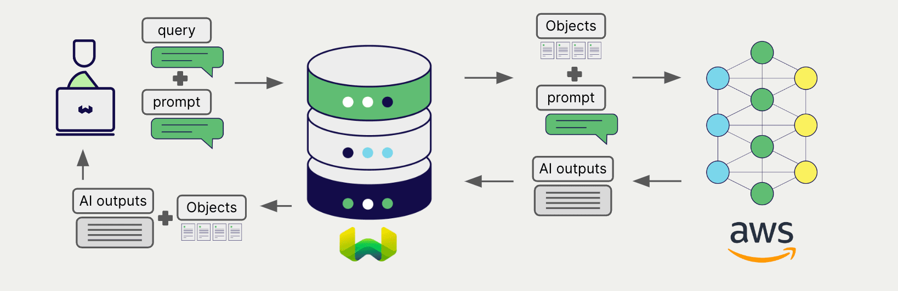

# Weaviate と AWS 生成 AI

import Tabs from '@theme/Tabs';
import TabItem from '@theme/TabItem';
import FilteredTextBlock from '@site/src/components/Documentation/FilteredTextBlock';
import PyConnect from '!!raw-loader!../_includes/provider.connect.py';
import TSConnect from '!!raw-loader!../_includes/provider.connect.ts';
import PyCode from '!!raw-loader!../_includes/provider.generative.py';
import TSCode from '!!raw-loader!../_includes/provider.generative.ts';

Weaviate の AWS の [SageMaker](https://aws.amazon.com/sagemaker/) と [Bedrock](https://aws.amazon.com/bedrock/) API との統合により、モデルの機能に Weaviate から直接アクセスできます。

[AWS とともに生成 AI モデルを使用するように Weaviate コレクションを設定](#configure-collection)します。Weaviate は、指定したモデルと AWS の API 資格情報を用いて 検索拡張生成 (RAG) を実行します。

具体的には、Weaviate が検索を実行して最も関連性の高いオブジェクトを取得し、それらを AWS の生成モデルに渡して出力を生成します。

## 要件

### Weaviate の設定

お使いの Weaviate インスタンスには、AWS 生成 AI 統合 (`generative-aws`) モジュールが設定されている必要があります。

  
Weaviate Cloud (WCD) 利用者向け

この統合は Weaviate Cloud (WCD) のサーバーレスインスタンスではデフォルトで有効になっています。

  
セルフホスト環境向け

- モジュールが有効になっているかどうかを確認するには、[クラスター メタデータ](/deploy/configuration/meta.md) をチェックしてください。  
- Weaviate でモジュールを有効にするには、[モジュール設定方法](../../configuration/modules.md) ガイドに従ってください。

### API 資格情報

これらの統合を行うには、アクセスキー方式の AWS 資格情報を Weaviate に提供する必要があります。AWS に登録し、AWS access key ID と対応する AWS secret access key を取得してください。

以下のいずれかの方法で Weaviate に API 資格情報を渡します。

- `AWS_ACCESS_KEY` と `AWS_SECRET_KEY` 環境変数を設定し、Weaviate から参照できるようにします。  
- 下記の例のように、実行時に API 資格情報を渡します。

<Tabs groupId="languages">

 <TabItem value="py" label="Python API v4">
    <FilteredTextBlock
      text={PyConnect}
      startMarker="# START AWSInstantiation"
      endMarker="# END AWSInstantiation"
      language="py"
    />
  </TabItem>

 <TabItem value="js" label="JS/TS API v3">
    <FilteredTextBlock
      text={TSConnect}
      startMarker="// START AWSInstantiation"
      endMarker="// END AWSInstantiation"
      language="ts"
    />
  </TabItem>

</Tabs>

### AWS モデルへのアクセス

#### Bedrock

[Bedrock](https://aws.amazon.com/bedrock/) 経由でモデルを利用するには、そのモデルが利用可能であり、かつ AWS からアクセスが許可されている必要があります。

利用可能なモデルの一覧は [AWS のドキュメント](https://docs.aws.amazon.com/bedrock/latest/userguide/models-regions.html) を、モデルへのアクセス申請方法は [こちら](https://docs.aws.amazon.com/bedrock/latest/userguide/model-usage.html) を参照してください。

#### SageMaker

[SageMaker](https://aws.amazon.com/sagemaker/) 経由でモデルを利用するには、モデルのエンドポイントへのアクセス権が必要です。

## コレクションの設定

import MutableGenerativeConfig from '/_includes/mutable-generative-config.md';

<MutableGenerativeConfig />

AWS の生成モデルを使用するように、次のように [Weaviate インデックス](../../manage-collections/generative-reranker-models.mdx#specify-a-generative-model-integration) を設定します。

### Bedrock

Bedrock を使用する場合、生成 AI 設定でモデル名を指定する必要があります。

<Tabs groupId="languages">
  <TabItem value="py" label="Python API v4">
    <FilteredTextBlock
      text={PyCode}
      startMarker="# START BasicGenerativeAWSBedrock"
      endMarker="# END BasicGenerativeAWSBedrock"
      language="py"
    />
  </TabItem>

  <TabItem value="js" label="JS/TS API v3">
    <FilteredTextBlock
      text={TSCode}
      startMarker="// START BasicGenerativeAWSBedrock"
      endMarker="// END BasicGenerativeAWSBedrock"
      language="ts"
    />
  </TabItem>

</Tabs>

### SageMaker

SageMaker を使用する場合は、生成 AI 設定でエンドポイントアドレスを指定する必要があります。

<Tabs groupId="languages">
  <TabItem value="py" label="Python API v4">
    <FilteredTextBlock
      text={PyCode}
      startMarker="# START BasicGenerativeAWSSagemaker"
      endMarker="# END BasicGenerativeAWSSagemaker"
      language="py"
    />
  </TabItem>

  <TabItem value="js" label="JS/TS API v3">
    <FilteredTextBlock
      text={TSCode}
      startMarker="// START BasicGenerativeAWSSagemaker"
      endMarker="// END BasicGenerativeAWSSagemaker"
      language="ts"
    />
  </TabItem>

</Tabs>

[利用可能なモデル](#available-models) のいずれかを Weaviate に使用させるように [指定](#generative-parameters) できます。モデルを指定しない場合は [デフォルトモデル](#available-models) が使用されます。

### 生成パラメーター

モデルパラメーターの詳細については、[関連する AWS ドキュメント](#further-resources) を参照してください。

## 実行時のモデル選択

コレクション作成時にデフォルトのモデルプロバイダーを設定するだけでなく、クエリ実行時に上書きすることも可能です。

<Tabs groupId="languages">
  <TabItem value="py" label="Python API v4">
    <FilteredTextBlock
      text={PyCode}
      startMarker="# START RuntimeModelSelectionAWS"
      endMarker="# END RuntimeModelSelectionAWS"
      language="py"
    />
  </TabItem>
  <TabItem value="js" label="JS/TS Client v3">
    <FilteredTextBlock
      text={TSCode}
      startMarker="// START RuntimeModelSelectionAWS"
      endMarker="// END RuntimeModelSelectionAWS"
      language="ts"
    />
  </TabItem>
</Tabs>

## 検索拡張生成

生成 AI 連携を設定した後、[シングルプロンプト](#single-prompt) または [グループ化タスク](#grouped-task) の方法で RAG 操作を実行します。

### シングルプロンプト

検索結果の各オブジェクトに対してテキストを生成するには、シングルプロンプト方式を使用します。

以下の例では、`limit` パラメーターで指定した `n` 件の検索結果それぞれに対して出力を生成します。

シングルプロンプトクエリを作成する際、渡したいオブジェクトプロパティを波かっこ `{}` で囲んで記述すると、Weaviate がその値を言語モデルに渡します。たとえば、オブジェクトの `title` プロパティを渡すには、クエリ内に `{title}` を含めます。

<Tabs groupId="languages">

 <TabItem value="py" label="Python API v4">
    <FilteredTextBlock
      text={PyCode}
      startMarker="# START SinglePromptExample"
      endMarker="# END SinglePromptExample"
      language="py"
    />
  </TabItem>

 <TabItem value="js" label="JS/TS API v3">
    <FilteredTextBlock
      text={TSCode}
      startMarker="// START SinglePromptExample"
      endMarker="// END SinglePromptExample"
      language="ts"
    />
  </TabItem>

</Tabs>

### グループ化タスク

検索結果全体に対して一つのテキストを生成するには、グループ化タスク方式を使用します。

つまり、`n` 件の検索結果があっても、生成モデルはそのグループ全体に対して 1 つの出力を生成します。

<Tabs groupId="languages">

 <TabItem value="py" label="Python API v4">
    <FilteredTextBlock
      text={PyCode}
      startMarker="# START GroupedTaskExample"
      endMarker="# END GroupedTaskExample"
      language="py"
    />
  </TabItem>

 <TabItem value="js" label="JS/TS API v3">
    <FilteredTextBlock
      text={TSCode}
      startMarker="// START GroupedTaskExample"
      endMarker="// END GroupedTaskExample"
      language="ts"
    />
  </TabItem>

</Tabs>

### 画像付き RAG

単一プロンプトでもグループ化されたタスクでも、検索拡張生成を行う際の入力の一部として画像を渡すこともできます。 

<Tabs groupId="languages">

 <TabItem value="py" label="Python API v4">
    <FilteredTextBlock
      text={PyCode}
      startMarker="# START WorkingWithImagesAWS"
      endMarker="# END WorkingWithImagesAWS"
      language="py"
    />
  </TabItem>
  <TabItem value="js" label="JS/TS API v3">
    <FilteredTextBlock
      text={TSCode}
      startMarker="// START WorkingWithImagesAWS"
      endMarker="// END WorkingWithImagesAWS"
      language="ts"
    />
  </TabItem>
</Tabs>

## 参考資料

### 利用可能なモデル

#### Bedrock

- `ai21.j2-ultra-v1`
- `ai21.j2-mid-v1`
- `amazon.titan-text-lite-v1`
- `amazon.titan-text-express-v1`
- `amazon.titan-text-premier-v1:0`
- `anthropic.claude-v2`
- `anthropic.claude-v2:1`
- `anthropic.claude-instant-v1`
- `anthropic.claude-3-sonnet-20240229-v1:0`
- `anthropic.claude-3-haiku-20240307-v1:0`
- `cohere.command-text-v14`
- `cohere.command-light-text-v14`
- `cohere.command-r-v1:0`
- `cohere.command-r-plus-v1:0`
- `meta.llama3-8b-instruct-v1:0`
- `meta.llama3-70b-instruct-v1:0`
- `meta.llama2-13b-chat-v1`
- `meta.llama2-70b-chat-v1`
- `mistral.mistral-7b-instruct-v0:2`
- `mistral.mixtral-8x7b-instruct-v0:1`
- `mistral.mistral-large-2402-v1:0`

モデルへのアクセスをリクエストする方法については [こちらのドキュメント](https://docs.aws.amazon.com/bedrock/latest/userguide/model-usage.html) を参照してください。

### SageMaker

任意のカスタム SageMaker URL をエンドポイントとして使用できます。

## 追加リソース

### その他の統合

- [AWS embedding models + Weaviate](./embeddings.md)。

### コード例

インテグレーションをコレクションで設定すると、Weaviate におけるデータ管理および検索操作は他のコレクションと同一の方法で機能します。以下のモデル非依存の例をご覧ください。

- [ハウツー: コレクション管理](../../manage-collections/index.mdx) および [ハウツー: オブジェクト管理](../../manage-objects/index.mdx) ガイドでは、データ操作（コレクションおよびその内部のオブジェクトの作成、読み取り、更新、削除）を行う方法を示しています。
- [ハウツー: クエリ & 検索](../../search/index.mdx) ガイドでは、検索操作（ベクトル、キーワード、ハイブリッド）および 検索拡張生成 を実行する方法を示します。

### 参考文献

- AWS [Bedrock ドキュメント](https://docs.aws.amazon.com/bedrock/)
- AWS [SageMaker ドキュメント](https://docs.aws.amazon.com/sagemaker/)

## 質問とフィードバック

import DocsFeedback from '/_includes/docs-feedback.mdx';

<DocsFeedback/>

