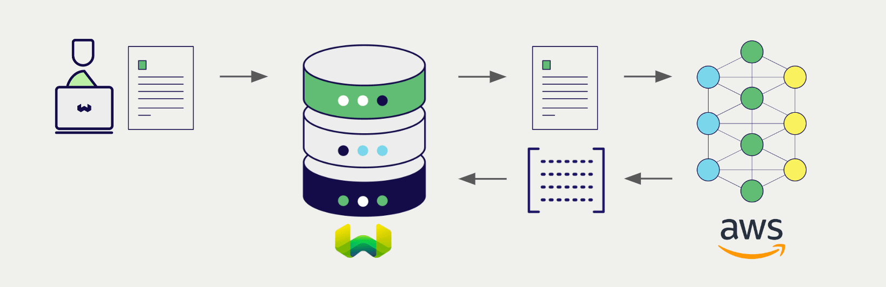
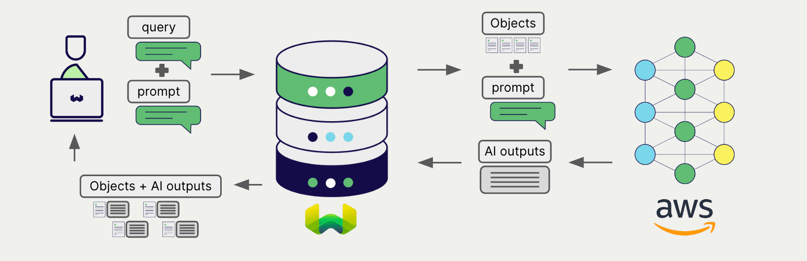

<!-- Note: for images, use https://docs.google.com/presentation/d/15opIcJuaIjEEcs_1Zm8B6pccox2p7_MHSjCnRv4dPfU/edit?usp=sharing -->

 AWS は、自然言語処理および生成のための幅広いモデルを提供しています。 Weaviate は AWS の API とシームレスに統合され、ユーザーは Weaviate Database から直接 AWS のモデルを活用できます。

 Weaviate は、 AWS の [Sagemaker](https://aws.amazon.com/sagemaker/) と [Bedrock](https://aws.amazon.com/bedrock/) の両方と統合しています。

 これらの統合により、開発者は高度な AI 駆動アプリケーションを容易に構築できます。

:::tip Sagemaker vs Bedrock
Amazon SageMaker は、機械学習モデルの構築、トレーニング、デプロイを行えるフルマネージドサービスです。Amazon Bedrock は、主要な AI 企業が提供する高性能な基盤モデル (FM) を選択できるフルマネージドサービスです。
:::

## AWS との統合

### ベクトル検索用埋め込みモデル

 AWS の埋め込みモデルは、テキストデータをベクトル埋め込みに変換し、意味とコンテキストを捉えます。

 [Weaviate は AWS の埋め込みモデルと統合](./embeddings.md) し、データのシームレスなベクトル化を実現します。この統合により、追加の前処理やデータ変換を行わずに、セマンティック検索およびハイブリッド検索を実行できます。

[AWS 埋め込み統合ページ](./embeddings.md)

### RAG 向け生成 AI モデル

 AWS の生成 AI モデルは、与えられたプロンプトとコンテキストに基づき、人間のようなテキストを生成できます。

 [Weaviate の生成 AI 統合](./generative.md) により、 Weaviate Database から直接 検索拡張生成 (RAG) を実行できます。これにより、 Weaviate の効率的なストレージと高速な検索機能を AWS の生成 AI モデルと組み合わせ、パーソナライズされたコンテキスト認識の応答を生成します。

[AWS 生成 AI 統合ページ](./generative.md)

## まとめ

これらの統合により、開発者は Weaviate 内で直接 AWS の強力なモデルを活用できます。

その結果、AI 駆動アプリケーションの構築プロセスが簡素化され、開発を加速し、革新的なソリューションの創出に集中できます。

## はじめに

これらの統合を利用するには、 Weaviate に [アクセスキー形式の AWS 認証情報](https://docs.aws.amazon.com/IAM/latest/UserGuide/id_credentials_access-keys.html) を提供する必要があります。 AWS にアクセスし、サインアップして AWS アクセスキーと対応する AWS シークレットアクセスキーを取得してください。

その後、該当する統合ページに移動し、 AWS モデルで Weaviate を設定してアプリケーションで使用する方法をご確認ください。

- [テキスト埋め込み](./embeddings.md)
- [生成 AI](./generative.md)

## 質問とフィードバック

import DocsFeedback from '/_includes/docs-feedback.mdx';

<DocsFeedback/>

