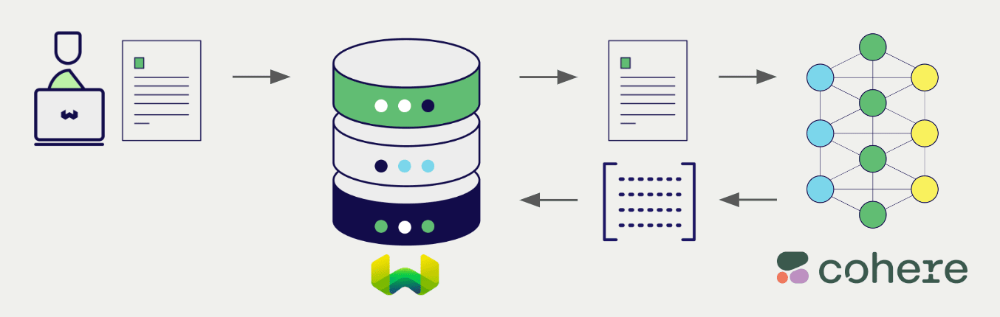
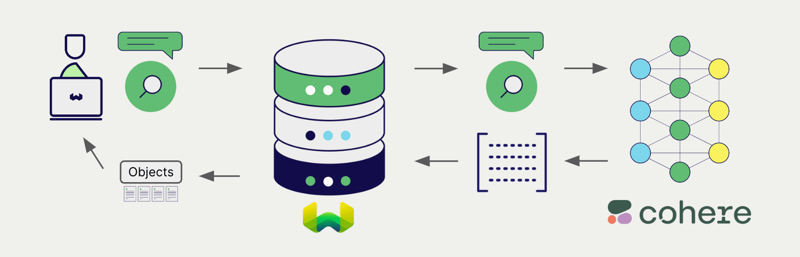

# Weaviate における Cohere マルチモーダル埋め込み

:::info Added in `1.25.25`, `1.26.9` and `v1.27.2`
:::

import Tabs from '@theme/Tabs';
import TabItem from '@theme/TabItem';
import FilteredTextBlock from '@site/src/components/Documentation/FilteredTextBlock';
import PyConnect from '!!raw-loader!../_includes/provider.connect.py';
import TSConnect from '!!raw-loader!../_includes/provider.connect.ts';
import PyCode from '!!raw-loader!../_includes/provider.vectorizer.py';
import TSCode from '!!raw-loader!../_includes/provider.vectorizer.ts';

Weaviate と Cohere の API 連携により、Weaviate から Cohere モデルの機能に直接アクセスできます。

[vector インデックスを設定](#configure-the-vectorizer) して Cohere の埋め込みモデルを使用すると、Weaviate は指定したモデルとお持ちの Cohere API キーを用いて、各種操作に必要な埋め込みを生成します。この機能は *vectorizer* と呼ばれます。

[インポート時](#data-import) に、Weaviate はマルチモーダルオブジェクト埋め込みを生成し、インデックスへ保存します。[vector](#vector-near-text-search) および [ハイブリッド](#hybrid-search) 検索操作では、Weaviate がテキストクエリを埋め込みに変換します。[マルチモーダル検索](#vector-near-media-search) もサポートされています。

## 必要条件

### Weaviate の設定

お使いの Weaviate インスタンスには Cohere ベクトライザー統合 (`multi2vec-cohere`) モジュールが有効である必要があります。

  
Weaviate Cloud (WCD) ユーザーの場合

この統合は WCD サーバーレスインスタンスでデフォルトで有効になっています。

  
セルフホストユーザーの場合

- [クラスターメタデータ](/deploy/configuration/meta.md) を確認し、モジュールが有効かどうかを確認します。
- Weaviate でモジュールを有効化するには、[モジュール設定方法](../../configuration/modules.md) ガイドに従ってください。

### API 資格情報

この連携を使用するには、有効な Cohere API キーを Weaviate に提供する必要があります。API キーの取得には [Cohere](https://cohere.com/) にサインアップしてください。

次のいずれかの方法で API キーを Weaviate に渡します。

- Weaviate が参照できる `COHERE_APIKEY` 環境変数を設定する。
- 以下の例のように、実行時に API キーを提供する。

<Tabs groupId="languages">

 <TabItem value="py" label="Python API v4">
    <FilteredTextBlock
      text={PyConnect}
      startMarker="# START CohereInstantiation"
      endMarker="# END CohereInstantiation"
      language="py"
    />
  </TabItem>

 <TabItem value="js" label="JS/TS API v3">
    <FilteredTextBlock
      text={TSConnect}
      startMarker="// START CohereInstantiation"
      endMarker="// END CohereInstantiation"
      language="ts"
    />
  </TabItem>

</Tabs>

## ベクトライザーの設定

Cohere 埋め込みモデルを使用するように [Weaviate インデックスを設定](../../manage-collections/vector-config.mdx#specify-a-vectorizer) します。

<Tabs groupId="languages">
  <TabItem value="py" label="Python API v4">
    <FilteredTextBlock
      text={PyCode}
      startMarker="# START BasicMMVectorizerCohere"
      endMarker="# END BasicMMVectorizerCohere"
      language="py"
    />
  </TabItem>

  <TabItem value="js" label="JS/TS API v3">
    <FilteredTextBlock
      text={TSCode}
      startMarker="// START BasicMMVectorizerCohere"
      endMarker="// END BasicMMVectorizerCohere"
      language="ts"
    />
  </TabItem>

</Tabs>

### モデルの選択

以下の設定例のように、ベクトライザーが使用する [利用可能なモデル](#available-models) のいずれかを指定できます。

<Tabs groupId="languages">
  <TabItem value="py" label="Python API v4">
    <FilteredTextBlock
      text={PyCode}
      startMarker="# START MMVectorizerCohereCustomModel"
      endMarker="# END MMVectorizerCohereCustomModel"
      language="py"
    />
  </TabItem>

  <TabItem value="js" label="JS/TS API v3">
    <FilteredTextBlock
      text={TSCode}
      startMarker="// START MMVectorizerCohereCustomModel"
      endMarker="// END MMVectorizerCohereCustomModel"
      language="ts"
    />
  </TabItem>

</Tabs>

Weaviate に使用させるモデルは [指定](#vectorizer-parameters) できます。モデルを指定しない場合は [デフォルトモデル](#available-models) が使用されます。

import VectorizationBehavior from '/_includes/vectorization.behavior.mdx';

  
ベクトル化の挙動

<VectorizationBehavior/>

### ベクトライザーのパラメーター

以下の例では、Cohere 固有のオプションを設定する方法を示します。

<Tabs groupId="languages">
  <TabItem value="py" label="Python API v4">
    <FilteredTextBlock
      text={PyCode}
      startMarker="# START FullMMVectorizerCohere"
      endMarker="# END FullMMVectorizerCohere"
      language="py"
    />
  </TabItem>

  <TabItem value="js" label="JS/TS API v3">
    <FilteredTextBlock
      text={TSCode}
      startMarker="// START FullMMVectorizerCohere"
      endMarker="// END FullMMVectorizerCohere"
      language="ts"
    />
  </TabItem>

</Tabs>

モデルのパラメーターの詳細については、[Cohere API ドキュメント](https://docs.cohere.com/reference/embed)をご覧ください。

## データインポート

ベクトライザーを設定したら、Weaviate に[データをインポート](../../manage-objects/import.mdx)します。Weaviate は指定したモデルを使用してテキストオブジェクトの埋め込みを生成します。

<Tabs groupId="languages">

 <TabItem value="py" label="Python API v4">
    <FilteredTextBlock
      text={PyCode}
      startMarker="# START MMBatchImportExample"
      endMarker="# END MMBatchImportExample"
      language="py"
    />
  </TabItem>

 <TabItem value="js" label="JS/TS API v3">
    <FilteredTextBlock
      text={TSCode}
      startMarker="// START MMBatchImportExample"
      endMarker="// END MMBatchImportExample"
      language="ts"
    />
  </TabItem>

</Tabs>

:::tip 既存ベクトルの再利用
すでに互換性のあるモデルベクトルをお持ちの場合は、それを直接 Weaviate に渡すことができます。たとえば、同じモデルで既に埋め込みを生成しており、他のシステムからデータを移行する際などに便利です。
:::

## 検索

ベクトライザーを設定すると、Weaviate は指定した Cohere モデルを用いてベクトル検索およびハイブリッド検索を実行します。

### ベクトル（near text）検索

[ベクトル検索](../../search/similarity.md#search-with-text)を実行すると、Weaviate はテキストクエリを指定したモデルで埋め込みに変換し、データベースから最も類似したオブジェクトを返します。

以下のクエリは、`limit` で指定した数 `n` の最も類似したオブジェクトをデータベースから返します。

<Tabs groupId="languages">

 <TabItem value="py" label="Python API v4">
    <FilteredTextBlock
      text={PyCode}
      startMarker="# START NearTextExample"
      endMarker="# END NearTextExample"
      language="py"
    />
  </TabItem>

 <TabItem value="js" label="JS/TS API v3">
    <FilteredTextBlock
      text={TSCode}
      startMarker="// START NearTextExample"
      endMarker="// END NearTextExample"
      language="ts"
    />
  </TabItem>

</Tabs>

### ハイブリッド検索

:::info ハイブリッド検索とは？
ハイブリッド検索は、ベクトル検索とキーワード（BM25）検索を行い、その結果を[組み合わせ](../../search/hybrid.md)てデータベースから最も一致するオブジェクトを返します。
:::

[ハイブリッド検索](../../search/hybrid.md)を実行すると、Weaviate はテキストクエリを指定したモデルで埋め込みに変換し、データベースからスコアが最も高いオブジェクトを返します。

以下のクエリは、`limit` で指定した数 `n` のスコアが最も高いオブジェクトをデータベースから返します。

<Tabs groupId="languages">

 <TabItem value="py" label="Python API v4">
    <FilteredTextBlock
      text={PyCode}
      startMarker="# START HybridExample"
      endMarker="# END HybridExample"
      language="py"
    />
  </TabItem>

 <TabItem value="js" label="JS/TS API v3">
    <FilteredTextBlock
      text={TSCode}
      startMarker="// START HybridExample"
      endMarker="// END HybridExample"
      language="ts"
    />
  </TabItem>

</Tabs>

### ベクトル（near media）検索

[near image search](../../search/similarity.md#search-with-image) のようなメディア検索を実行すると、Weaviate はクエリを指定されたモデルで埋め込みに変換し、データベースからもっとも類似したオブジェクトを返します。

near image search のような near media 検索を行うには、メディアクエリを base64 文字列に変換し、それを検索クエリに渡します。

以下のクエリは、`limit` で設定した数 `n` 件の、入力画像にもっとも類似したオブジェクトをデータベースから返します。

<Tabs groupId="languages">

 <TabItem value="py" label="Python API v4">
    <FilteredTextBlock
      text={PyCode}
      startMarker="# START NearImageExample"
      endMarker="# END NearImageExample"
      language="py"
    />
  </TabItem>

 <TabItem value="js" label="JS/TS API v3">
    <FilteredTextBlock
      text={TSCode}
      startMarker="// START NearImageExample"
      endMarker="// END NearImageExample"
      language="ts"
    />
  </TabItem>

</Tabs>

## 参考資料

### 利用可能なモデル

- `embed-multilingual-v3.0` (デフォルト)
- `embed-multilingual-light-v3.0`
- `embed-english-v3.0`
- `embed-english-light-v3.0`

## 追加リソース

### その他の統合

- [Cohere テキスト埋め込みモデル + Weaviate](./embeddings.md).
- [Cohere 生成モデル + Weaviate](./generative.md).
- [Cohere reranker モデル + Weaviate](./reranker.md).

### コード例

統合をコレクションで設定すると、Weaviate におけるデータ管理および検索操作は他のコレクションとまったく同じように機能します。モデルに依存しない以下の例をご覧ください。

- [How-to: コレクションの管理](../../manage-collections/index.mdx) と [How-to: オブジェクトの管理](../../manage-objects/index.mdx) のガイドでは、データ操作（コレクションとその内部のオブジェクトの作成・読み取り・更新・削除）方法を示しています。
- [How-to: クエリ & 検索](../../search/index.mdx) のガイドでは、ベクトル検索、キーワード検索、ハイブリッド検索、および 検索拡張生成 の実行方法を説明しています。

### 外部リソース

- Cohere [Embed API ドキュメント](https://docs.cohere.com/reference/embed)

## 質問とフィードバック

import DocsFeedback from '/_includes/docs-feedback.mdx';

<DocsFeedback/>

