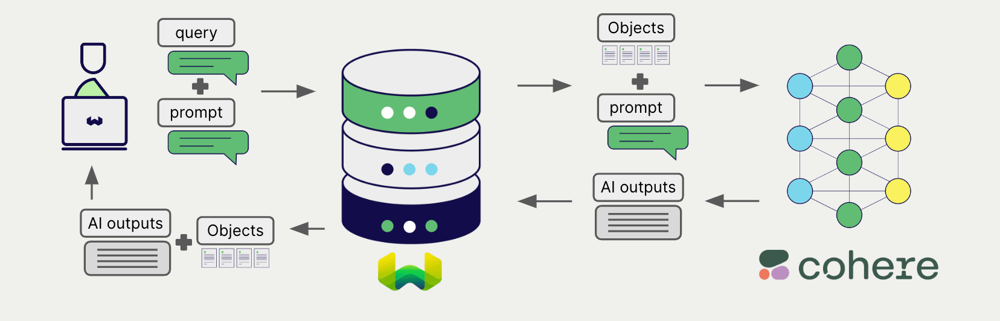

# Weaviate での Cohere 生成 AI

import Tabs from '@theme/Tabs';
import TabItem from '@theme/TabItem';
import FilteredTextBlock from '@site/src/components/Documentation/FilteredTextBlock';
import PyConnect from '!!raw-loader!../_includes/provider.connect.py';
import TSConnect from '!!raw-loader!../_includes/provider.connect.ts';
import PyCode from '!!raw-loader!../_includes/provider.generative.py';
import TSCode from '!!raw-loader!../_includes/provider.generative.ts';

Weaviate は Cohere の API と統合することで、Cohere のモデル機能に直接アクセスできます。

[Weaviate コレクションを設定](#configure-collection)して Cohere の生成 AI モデルを使用すると、Weaviate は 検索拡張生成 (RAG) を指定したモデルとお持ちの Cohere API キーで実行します。

具体的には、Weaviate が検索を行い、最も関連性の高いオブジェクトを取得してから、それらを Cohere の生成モデルに渡して出力を生成します。

## 必要条件

### Weaviate の設定

ご利用の Weaviate インスタンスには、Cohere 生成 AI 統合モジュール (`generative-cohere`) が有効になっている必要があります。

  
Weaviate Cloud (WCD) ユーザーの場合

この統合は Weaviate Cloud (WCD) のサーバーレスインスタンスではデフォルトで有効になっています。

  
セルフホスティングの場合

- モジュールが有効かどうかを確認するには [クラスターメタデータ](/deploy/configuration/meta.md) をご確認ください。
- モジュールを有効化する方法については、[モジュールの設定方法](../../configuration/modules.md) ガイドをご覧ください。

### API 認証情報

この統合を利用するには、有効な Cohere API キーを Weaviate に提供する必要があります。API キーは [Cohere](https://cohere.com/) でサインアップして取得してください。

以下のいずれかの方法で Weaviate に API キーを渡します。

- Weaviate が参照できる `COHERE_APIKEY` 環境変数を設定する。
- 下記の例のように実行時に API キーを渡す。

<Tabs groupId="languages">

 <TabItem value="py" label="Python API v4">
    <FilteredTextBlock
      text={PyConnect}
      startMarker="# START CohereInstantiation"
      endMarker="# END CohereInstantiation"
      language="py"
    />
  </TabItem>

 <TabItem value="js" label="JS/TS API v3">
    <FilteredTextBlock
      text={TSConnect}
      startMarker="// START CohereInstantiation"
      endMarker="// END CohereInstantiation"
      language="ts"
    />
  </TabItem>

</Tabs>

## コレクションの設定

import MutableGenerativeConfig from '/_includes/mutable-generative-config.md';

<MutableGenerativeConfig />

[Cohere 生成 AI モデルを使用するように Weaviate インデックスを設定](../../manage-collections/generative-reranker-models.mdx#specify-a-generative-model-integration)するには、以下のように指定します。

<Tabs groupId="languages">
  <TabItem value="py" label="Python API v4">
    <FilteredTextBlock
      text={PyCode}
      startMarker="# START BasicGenerativeCohere"
      endMarker="# END BasicGenerativeCohere"
      language="py"
    />
  </TabItem>

  <TabItem value="js" label="JS/TS API v3">
    <FilteredTextBlock
      text={TSCode}
      startMarker="// START BasicGenerativeCohere"
      endMarker="// END BasicGenerativeCohere"
      language="ts"
    />
  </TabItem>

</Tabs>

### モデルの選択

Weaviate に使用させる [利用可能なモデル](#available-models) のいずれかを、次の設定例のように指定できます。

<Tabs groupId="languages">
  <TabItem value="py" label="Python API v4">
    <FilteredTextBlock
      text={PyCode}
      startMarker="# START GenerativeCohereCustomModel"
      endMarker="# END GenerativeCohereCustomModel"
      language="py"
    />
  </TabItem>

  <TabItem value="js" label="JS/TS API v3">
    <FilteredTextBlock
      text={TSCode}
      startMarker="// START GenerativeCohereCustomModel"
      endMarker="// END GenerativeCohereCustomModel"
      language="ts"
    />
  </TabItem>

</Tabs>

[利用可能なモデル](#available-models) のいずれかを[指定](#generative-parameters)できます。モデルを指定しない場合は [デフォルトモデル](#available-models) が使用されます。

### 生成パラメーター

以下の生成パラメーターを設定して、モデルの動作をカスタマイズします。

<Tabs groupId="languages">
  <TabItem value="py" label="Python API v4">
    <FilteredTextBlock
      text={PyCode}
      startMarker="# START FullGenerativeCohere"
      endMarker="# END FullGenerativeCohere"
      language="py"
    />
  </TabItem>

  <TabItem value="js" label="JS/TS API v3">
    <FilteredTextBlock
      text={TSCode}
      startMarker="// START FullGenerativeCohere"
      endMarker="// END FullGenerativeCohere"
      language="ts"
    />
  </TabItem>

</Tabs>

モデルパラメーターの詳細については、[Cohere API ドキュメント](https://docs.cohere.com/reference/chat) を参照してください。

## 実行時のモデル選択

コレクション作成時にデフォルトのモデルプロバイダーを設定するだけでなく、クエリ実行時に上書きすることもできます。

<Tabs groupId="languages">
  <TabItem value="py" label="Python API v4">
    <FilteredTextBlock
      text={PyCode}
      startMarker="# START RuntimeModelSelectionCohere"
      endMarker="# END RuntimeModelSelectionCohere"
      language="py"
    />
  </TabItem>
  <TabItem value="js" label="JS/TS Client v3">
    <FilteredTextBlock
      text={TSCode}
      startMarker="// START RuntimeModelSelectionCohere"
      endMarker="// END RuntimeModelSelectionCohere"
      language="ts"
    />
  </TabItem>
</Tabs>

## ヘッダーパラメーター

リクエストに追加ヘッダーを付与することで、実行時に API キーおよびいくつかのオプションパラメーターを指定できます。利用可能なヘッダーは次のとおりです:

- `X-Cohere-Api-Key`: Cohere の API キー。  
- `X-Cohere-Baseurl`: デフォルトの Cohere URL の代わりに使用するベース URL（例: プロキシ）。

実行時に指定した追加ヘッダーは、既存の Weaviate 設定を上書きします。

ヘッダーは上記の [API credentials の例](#api-credentials) のとおりに指定してください。

## 検索拡張生成

生成 AI 連携を設定したら、[シングルプロンプト](#single-prompt) または [グループタスク](#grouped-task) のいずれかの方法で RAG 操作を実行します。

### シングルプロンプト

検索結果に含まれる各オブジェクトに対してテキストを生成するには、シングルプロンプト方式を使用します。

次の例では、`limit` パラメーターで指定した `n` 件の検索結果それぞれに対して出力を生成します。

シングルプロンプトクエリを作成するときは、波括弧 `{}` を使用して、Weaviate から言語モデルへ渡したいオブジェクトのプロパティを埋め込みます。たとえばオブジェクトの `title` プロパティを渡すには、クエリ内に `{title}` を含めます。

<Tabs groupId="languages">

 <TabItem value="py" label="Python API v4">
    <FilteredTextBlock
      text={PyCode}
      startMarker="# START SinglePromptExample"
      endMarker="# END SinglePromptExample"
      language="py"
    />
  </TabItem>

 <TabItem value="js" label="JS/TS API v3">
    <FilteredTextBlock
      text={TSCode}
      startMarker="// START SinglePromptExample"
      endMarker="// END SinglePromptExample"
      language="ts"
    />
  </TabItem>

</Tabs>

### グループタスク

検索結果全体に対して 1 つのテキストを生成するには、グループタスク方式を使用します。

言い換えると、`n` 件の検索結果があっても、生成モデルはグループ全体に対して 1 つの出力を返します。

<Tabs groupId="languages">

 <TabItem value="py" label="Python API v4">
    <FilteredTextBlock
      text={PyCode}
      startMarker="# START GroupedTaskExample"
      endMarker="# END GroupedTaskExample"
      language="py"
    />
  </TabItem>

 <TabItem value="js" label="JS/TS API v3">
    <FilteredTextBlock
      text={TSCode}
      startMarker="// START GroupedTaskExample"
      endMarker="// END GroupedTaskExample"
      language="ts"
    />
  </TabItem>

</Tabs>

## 参考資料

### 利用可能なモデル

- `command-r-plus` （ `v1.25.0` で追加）
- `command-r`（デフォルト）（ `v1.25.0` で追加）
- `command-xlarge`
- `command-xlarge-beta`
- `command-xlarge-nightly`
- `command-medium`
- `command-medium-nightly`
- `command`
- `command-nightly`
- `command-light`
- `command-light-nightly`

## 追加リソース

### その他の統合

- [Cohere text embedding models + Weaviate](./embeddings.md)
- [Cohere multimodal embedding embeddings models + Weaviate](./embeddings-multimodal.md)
- [Cohere reranker models + Weaviate](./reranker.md)

### コード例

コレクションで統合を構成すると、Weaviate におけるデータ管理および検索操作は他のコレクションとまったく同じように機能します。以下のモデル非依存の例をご覧ください。

- [How-to: コレクションを管理する](../../manage-collections/index.mdx) と [How-to: オブジェクトを管理する](../../manage-objects/index.mdx) のガイドでは、データ操作（コレクションおよびその中のオブジェクトの作成・読み取り・更新・削除）の方法を示しています。
- [How-to: クエリと検索](../../search/index.mdx) のガイドでは、ベクトル検索、キーワード検索、ハイブリッド検索に加えて 検索拡張生成 を実行する方法を示しています。

### 参照

- Cohere [Chat API documentation](https://docs.cohere.com/reference/chat)

## 質問とフィードバック

import DocsFeedback from '/_includes/docs-feedback.mdx';

<DocsFeedback/>

