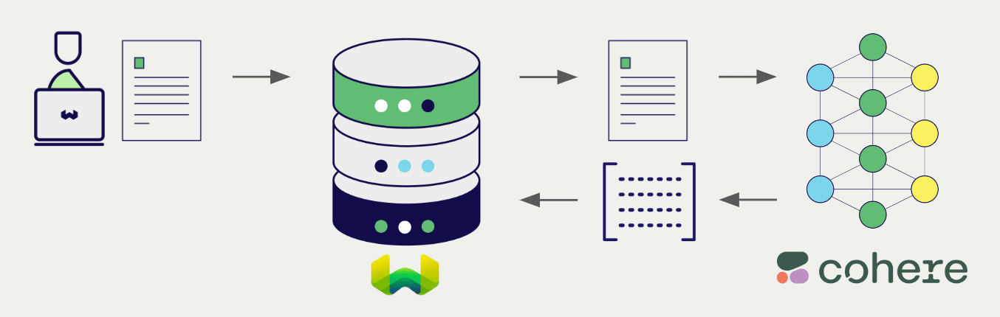
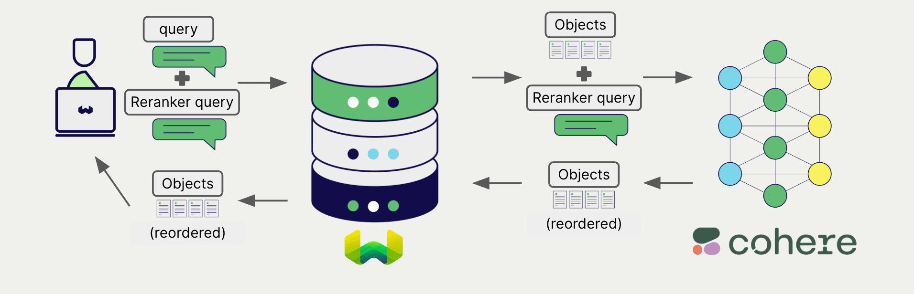

<!-- Note: for images, use https://docs.google.com/presentation/d/15opIcJuaIjEEcs_1Zm8B6pccox2p7_MHSjCnRv4dPfU/edit?usp=sharing -->

Cohere は、自然言語処理と生成のための幅広いモデルを提供しています。Weaviate は Cohere の API とシームレスに統合され、ユーザーは Weaviate Database から直接 Cohere のモデルを利用できます。

これらの統合により、開発者は高度な AI ドリブンアプリケーションを簡単に構築できるようになります。

## Cohere との統合

### ベクトル検索向け埋め込みモデル

Cohere の埋め込みモデルは、テキストデータを意味と文脈を捉えたベクトル埋め込みに変換します。

[Weaviate は Cohere の埋め込みモデルと統合](./embeddings.md)しており、データをシームレスにベクトル化できます。この統合により、追加の前処理やデータ変換なしにセマンティック検索やハイブリッド検索を実行できます。

[Cohere 埋め込み統合ページ](./embeddings.md)  
[Cohere マルチモーダル埋め込み統合ページ](./embeddings-multimodal.md)

### RAG 向け生成 AI モデル

Cohere の生成 AI モデルは、与えられたプロンプトとコンテキストに基づいて人間らしいテキストを生成できます。

[Weaviate の生成 AI 統合](./generative.md)により、Weaviate Database から直接 検索拡張生成 (RAG) を実行できます。これにより、Weaviate の効率的なストレージと高速検索機能が Cohere の生成 AI モデルと組み合わさり、パーソナライズされた文脈対応の応答を生成します。

[Cohere 生成 AI 統合ページ](./generative.md)

### Reranker モデル

Cohere の reranker モデルは、検索結果の関連性とランキングを向上させるよう設計されています。

[Weaviate の reranker 統合](./reranker.md)を利用することで、Cohere の reranker モデルを活用し、検索結果を簡単にリファインできます。

[Cohere reranker 統合ページ](./reranker.md)

## 概要

これらの統合により、開発者は Cohere の強力なモデルを Weaviate 内で直接活用できます。

その結果、AI ドリブンアプリケーション開発のプロセスが簡素化され、開発スピードが向上し、革新的なソリューションの創出に集中できます。

## はじめに

これらの統合を利用するには、Weaviate に有効な Cohere API キーを提供する必要があります。[Cohere](https://cohere.com/) にアクセスしてサインアップし、API キーを取得してください。

その後、該当する統合ページで Cohere モデルを Weaviate に設定し、アプリケーションでの利用を開始しましょう。

- [テキスト埋め込み](./embeddings.md)
- [生成 AI](./generative.md)
- [Reranker](./reranker.md)

## ご質問とフィードバック

import DocsFeedback from '/_includes/docs-feedback.mdx';

<DocsFeedback/>

