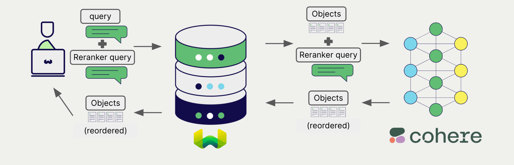

# Weaviate との Cohere リランカー モデル

import Tabs from '@theme/Tabs';
import TabItem from '@theme/TabItem';
import FilteredTextBlock from '@site/src/components/Documentation/FilteredTextBlock';
import PyConnect from '!!raw-loader!../_includes/provider.connect.py';
import TSConnect from '!!raw-loader!../_includes/provider.connect.ts';
import PyCode from '!!raw-loader!../_includes/provider.reranker.py';
import TSCode from '!!raw-loader!../_includes/provider.reranker.ts';

Weaviate は Cohere の API と統合することで、同社のモデル機能に直接アクセスできます。

Cohere のリランカーモデルを使用するように [ Weaviate コレクションを設定](#configure-the-reranker) すると、 Weaviate は指定したモデルとお客様の Cohere API キーを使用して検索結果をリランクします。

この 2 ステップのプロセスでは、まず Weaviate が検索を実行し、その後指定したモデルを使用して結果をリランクします。

## 要件

### Weaviate 構成

お使いの Weaviate インスタンスは、 Cohere リランカー統合（`reranker-cohere`）モジュールを有効にしておく必要があります。

  
Weaviate Cloud ( WCD ) ユーザー向け

この統合は、 Weaviate Cloud ( WCD ) の serverless インスタンスではデフォルトで有効になっています。

  
セルフホストユーザー向け

- モジュールが有効になっているか確認するには、 [ クラスター メタデータ ](/deploy/configuration/meta.md) を確認してください。  
- モジュールを Weaviate で有効にするには、 [ モジュールの構成方法 ](../../configuration/modules.md) ガイドに従ってください。

### API 資格情報

この統合には、 Weaviate に有効な Cohere API キーを提供する必要があります。 [ Cohere ](https://cohere.com/) にアクセスしてサインアップし、 API キーを取得してください。

次のいずれかの方法で Weaviate に API キーを渡してください：

- `COHERE_APIKEY` 環境変数を設定し、 Weaviate から参照できるようにします。  
- 以下の例のように、実行時に API キーを渡します。

<Tabs groupId="languages">

 <TabItem value="py" label="Python API v4">
    <FilteredTextBlock
      text={PyConnect}
      startMarker="# START CohereInstantiation"
      endMarker="# END CohereInstantiation"
      language="py"
    />
  </TabItem>

 <TabItem value="js" label="JS/TS API v3">
    <FilteredTextBlock
      text={TSConnect}
      startMarker="// START CohereInstantiation"
      endMarker="// END CohereInstantiation"
      language="ts"
    />
  </TabItem>

</Tabs>

## リランカーの設定

import MutableRerankerConfig from '/_includes/mutable-reranker-config.md';

<MutableRerankerConfig />

以下のように設定して、 Weaviate コレクションで Cohere リランカー モデルを使用します。

<Tabs groupId="languages">
  <TabItem value="py" label="Python API v4">
    <FilteredTextBlock
      text={PyCode}
      startMarker="# START RerankerCohereBasic"
      endMarker="# END RerankerCohereBasic"
      language="py"
    />
  </TabItem>

  <TabItem value="js" label="JS/TS API v3">
    <FilteredTextBlock
      text={TSCode}
      startMarker="// START RerankerCohereBasic"
      endMarker="// END RerankerCohereBasic"
      language="ts"
    />
  </TabItem>

</Tabs>

### モデルを選択する

以下の設定例のように、 Weaviate が使用する [ 利用可能なモデル ](#available-models) のいずれかを指定できます。

<Tabs groupId="languages">
  <TabItem value="py" label="Python API v4">
    <FilteredTextBlock
      text={PyCode}
      startMarker="# START RerankerCohereCustomModel"
      endMarker="# END RerankerCohereCustomModel"
      language="py"
    />
  </TabItem>

  <TabItem value="js" label="JS/TS API v3">
    <FilteredTextBlock
      text={TSCode}
      startMarker="// START RerankerCohereCustomModel"
      endMarker="// END RerankerCohereCustomModel"
      language="ts"
    />
  </TabItem>

</Tabs>

モデルを指定しない場合は、 [ デフォルトモデル ](#available-models) が使用されます。

## ヘッダー パラメーター

リクエストの追加ヘッダーを通じて、実行時に API キーおよびオプション パラメーターを設定できます。利用可能なヘッダーは次のとおりです:

- `X-Cohere-Api-Key`: Cohere API キー  
- `X-Cohere-Baseurl`: デフォルトの Cohere URL の代わりに使用するベース URL (例: プロキシ)

実行時に指定した追加ヘッダーは、既存の Weaviate 設定を上書きします。

ヘッダーの指定方法は、上記の [API 認証情報の例](#api-credentials) を参照してください。

## リランキング クエリ

リランカーの設定が完了すると、Weaviate は指定した Cohere モデルを使用して [リランキング処理](../../search/rerank.md) を実行します。

具体的には、まず Weaviate が初期検索を行い、その結果を指定したモデルでリランキングします。

Weaviate のあらゆる検索はリランカーと組み合わせてリランキングを実行できます。

<Tabs groupId="languages">

 <TabItem value="py" label="Python API v4">
    <FilteredTextBlock
      text={PyCode}
      startMarker="# START RerankerQueryExample"
      endMarker="# END RerankerQueryExample"
      language="py"
    />
  </TabItem>

 <TabItem value="js" label="JS/TS API v3">
    <FilteredTextBlock
      text={TSCode}
      startMarker="// START RerankerQueryExample"
      endMarker="// END RerankerQueryExample"
      language="ts"
    />
  </TabItem>

</Tabs>

## 参照

### 利用可能なモデル

- `rerank-v3.5` (default)
- `rerank-english-v3.0`
- `rerank-multilingual-v3.0`
- `rerank-english-v2.0`
- `rerank-multilingual-v2.0`

以下のようなファインチューニング済みリランカーの model_id も選択できます:

- `500df123-afr3-...`

詳細は [こちらのブログ記事](https://weaviate.io/blog/fine-tuning-coheres-reranker) をご覧ください。

モデル パラメーターの詳細については [Cohere API ドキュメント](https://docs.cohere.com/reference/rerank) を参照してください。

## 追加リソース

### その他のインテグレーション

- [Cohere テキスト埋め込みモデル + Weaviate](./embeddings.md)
- [Cohere マルチモーダル埋め込みモデル + Weaviate](./embeddings-multimodal.md)
- [Cohere 生成モデル + Weaviate](./generative.md)

### コード例

コレクションでインテグレーションを設定すると、Weaviate のデータ管理および検索操作は他のコレクションと同様に動作します。モデル非依存の次の例をご覧ください:

- [How-to: Manage collections](../../manage-collections/index.mdx) と [How-to: Manage objects](../../manage-objects/index.mdx) のガイドでは、データ操作 (コレクションおよびその中のオブジェクトの作成、読み取り、更新、削除) を行う方法を示しています。  
- [How-to: Query & Search](../../search/index.mdx) のガイドでは、検索操作 ( ベクトル、キーワード、ハイブリッド) と 検索拡張生成 を実行する方法を説明しています。

### 参照

- Cohere [Rerank API ドキュメント](https://docs.cohere.com/reference/rerank)

## 質問とフィードバック

import DocsFeedback from '/_includes/docs-feedback.mdx';

<DocsFeedback/>

