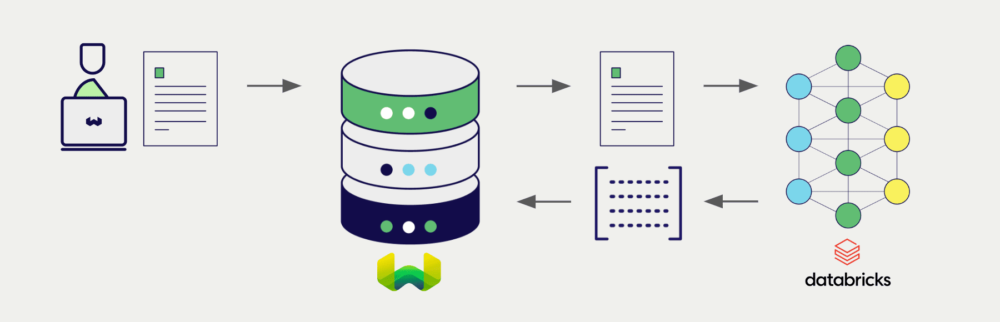
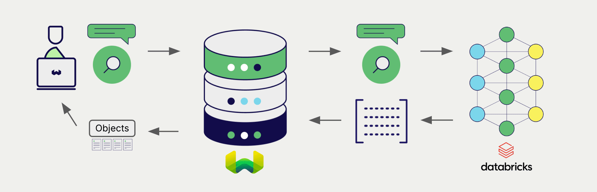

:::info Added in `v1.26.3`
:::

# Weaviate と Databricks の埋め込み

import Tabs from '@theme/Tabs';
import TabItem from '@theme/TabItem';
import FilteredTextBlock from '@site/src/components/Documentation/FilteredTextBlock';
import PyConnect from '!!raw-loader!../_includes/provider.connect.py';
import TSConnect from '!!raw-loader!../_includes/provider.connect.ts';
import GoConnect from '!!raw-loader!/_includes/code/howto/go/docs/model-providers/1-connect/main.go';
import PyCode from '!!raw-loader!../_includes/provider.vectorizer.py';
import TSCode from '!!raw-loader!../_includes/provider.vectorizer.ts';
import GoCode from '!!raw-loader!/_includes/code/howto/go/docs/model-providers/2-usage-text/main.go';

Weaviate の Databricks API 連携により、Databricks プラットフォームでホストされているモデルへ Weaviate から直接アクセスできます。

[Weaviate ベクトル インデックスを設定](#configure-the-vectorizer)して Databricks の埋め込みモデルを使用すると、指定したエンドポイントと Databricks トークンを用いて、さまざまな操作のために Weaviate が埋め込みを生成します。この機能は *ベクトライザー* と呼ばれます。

[インポート時](#data-import)には、Weaviate がテキストオブジェクトの埋め込みを生成し、インデックスに保存します。[ベクトル](#vector-near-text-search) や [ハイブリッド](#hybrid-search) 検索操作では、Weaviate がテキストクエリを埋め込みに変換します。

## 必要条件

### Weaviate の設定

お使いの Weaviate インスタンスには、Databricks ベクトライザー連携 (`text2vec-databricks`) モジュールが組み込まれている必要があります。

  
Weaviate Cloud (WCD) ユーザーの場合

この連携は、Weaviate Cloud (WCD) のサーバーレス インスタンスではデフォルトで有効になっています。

  
セルフホスト ユーザーの場合

- [クラスターメタデータ](/deploy/configuration/meta.md) を確認し、モジュールが有効になっているかを確認してください。  
- Weaviate でモジュールを有効にする方法は、[モジュール設定方法](../../configuration/modules.md) ガイドをご覧ください。

### Databricks Personal Access Token {#api-credentials}

この連携には、有効な Databricks Personal Access Token (PAT) を Weaviate に提供する必要があります。ワークスペースでの PAT 生成方法については、[Databricks のドキュメント](https://docs.databricks.com/en/dev-tools/auth/pat.html) を参照してください。

以下のいずれかの方法で Databricks トークンを Weaviate に渡します。

- Weaviate が参照できる `DATABRICKS_TOKEN` 環境変数を設定する  
- 下記の例のように実行時にトークンを渡す

<Tabs groupId="languages">

 <TabItem value="py" label="Python API v4">
    <FilteredTextBlock
      text={PyConnect}
      startMarker="# START DatabricksInstantiation"
      endMarker="# END DatabricksInstantiation"
      language="py"
    />
  </TabItem>

  <TabItem value="js" label="JS/TS API v3">
    <FilteredTextBlock
      text={TSConnect}
      startMarker="// START DatabricksInstantiation"
      endMarker="// END DatabricksInstantiation"
      language="ts"
    />
  </TabItem>

  <TabItem value="go" label="Go">
    <FilteredTextBlock
      text={GoConnect}
      startMarker="// START DatabricksInstantiation"
      endMarker="// END DatabricksInstantiation"
      language="goraw"
    />
  </TabItem>

</Tabs>

## ベクトライザーの設定

Databricks のサービングモデル エンドポイントを使用するように [Weaviate インデックスを設定](../../manage-collections/vector-config.mdx#specify-a-vectorizer) するには、次のようにベクトライザーを指定します。

<Tabs groupId="languages">
  <TabItem value="py" label="Python API v4">
    <FilteredTextBlock
      text={PyCode}
      startMarker="# START BasicVectorizerDatabricks"
      endMarker="# END BasicVectorizerDatabricks"
      language="py"
    />
  </TabItem>

  <TabItem value="js" label="JS/TS API v3">
    <FilteredTextBlock
      text={TSCode}
      startMarker="// START BasicVectorizerDatabricks"
      endMarker="// END BasicVectorizerDatabricks"
      language="ts"
    />
  </TabItem>

  <TabItem value="go" label="Go">
    <FilteredTextBlock
      text={GoCode}
      startMarker="// START BasicVectorizerDatabricks"
      endMarker="// END BasicVectorizerDatabricks"
      language="goraw"
    />
  </TabItem>

</Tabs>

これにより、指定したエンドポイントで提供されるベクトライザーを Weaviate が使用するように構成されます。

### ベクトライザーのパラメーター

- `endpoint`:  Databricks にホストされている埋め込みモデルの URL です。  
- `instruction`:  埋め込みモデルに渡す任意の instruction です。  

モデルパラメーターの詳細については、[Databricks のドキュメント](https://docs.databricks.com/en/machine-learning/foundation-models/api-reference.html#embedding-request) を参照してください。

## ヘッダーパラメーター

リクエストに追加ヘッダーを付与することで、実行時に API キーおよび任意のパラメーターを指定できます。利用可能なヘッダーは次のとおりです:

- `X-Databricks-Token`:  Databricks API トークンです。  
- `X-Databricks-Endpoint`:  Databricks モデルで使用する endpoint です。  
- `X-Databricks-User-Agent`:  Databricks モデルで使用する user agent です。  

実行時に指定したその他のヘッダーは、既存の Weaviate の設定を上書きします。

ヘッダーは上記の [API 資格情報の例](#api-credentials) のとおりに指定してください。

## データインポート

ベクトライザーの設定が完了したら、Weaviate に[データをインポート](../../manage-objects/import.mdx)します。Weaviate は [指定したモデル](#vectorizer-parameters) を使用してテキストオブジェクトの埋め込みを生成します。

<Tabs groupId="languages">

 <TabItem value="py" label="Python API v4">
    <FilteredTextBlock
      text={PyCode}
      startMarker="# START BatchImportExample"
      endMarker="# END BatchImportExample"
      language="py"
    />
  </TabItem>

  <TabItem value="js" label="JS/TS API v3">
    <FilteredTextBlock
      text={TSCode}
      startMarker="// START BatchImportExample"
      endMarker="// END BatchImportExample"
      language="ts"
    />
  </TabItem>

  <TabItem value="go" label="Go">
    <FilteredTextBlock
      text={GoCode}
      startMarker="// START BatchImportExample"
      endMarker="// END BatchImportExample"
      language="goraw"
    />
  </TabItem>
</Tabs>

:::tip 既存ベクトルを再利用する
互換性のあるモデル ベクトルが既にある場合は、それを直接 Weaviate に渡すことができます。同じモデルで既に埋め込みを生成しており、それらを Weaviate で使用したい場合、例えば他のシステムからデータを移行する際などに便利です。
:::

## 検索

ベクトライザーが設定されると、Weaviate は指定したモデルを使用してベクトル検索とハイブリッド検索を実行します。

### ベクトル (near text) 検索

[ベクトル検索](../../search/similarity.md#search-with-text)を実行すると、Weaviate はクエリー文字列を指定したモデルで埋め込みに変換し、データベースから最も類似したオブジェクトを返します。

以下のクエリーは、`limit` で指定した数 `n` の最も類似したオブジェクトをデータベースから返します。

<Tabs groupId="languages">

 <TabItem value="py" label="Python API v4">
    <FilteredTextBlock
      text={PyCode}
      startMarker="# START NearTextExample"
      endMarker="# END NearTextExample"
      language="py"
    />
  </TabItem>

  <TabItem value="js" label="JS/TS API v3">
    <FilteredTextBlock
      text={TSCode}
      startMarker="// START NearTextExample"
      endMarker="// END NearTextExample"
      language="ts"
    />
  </TabItem>

  <TabItem value="go" label="Go">
    <FilteredTextBlock
      text={GoCode}
      startMarker="// START NearTextExample"
      endMarker="// END NearTextExample"
      language="goraw"
    />
  </TabItem>
</Tabs>

### ハイブリッド検索

:::info ハイブリッド検索とは？
ハイブリッド検索はベクトル検索とキーワード (BM25) 検索を行い、[結果を結合](../../search/hybrid.md)してデータベースから最適なオブジェクトを返します。
:::

[ハイブリッド検索](../../search/hybrid.md)を実行すると、Weaviate はクエリー文字列を指定したモデルで埋め込みに変換し、データベースから最もスコアの高いオブジェクトを返します。

以下のクエリーは、`limit` で指定した数 `n` の最もスコアの高いオブジェクトをデータベースから返します。

<Tabs groupId="languages">

 <TabItem value="py" label="Python API v4">
    <FilteredTextBlock
      text={PyCode}
      startMarker="# START HybridExample"
      endMarker="# END HybridExample"
      language="py"
    />
  </TabItem>

  <TabItem value="js" label="JS/TS API v3">
    <FilteredTextBlock
      text={TSCode}
      startMarker="// START HybridExample"
      endMarker="// END HybridExample"
      language="ts"
    />
  </TabItem>

  <TabItem value="go" label="Go">
    <FilteredTextBlock
      text={GoCode}
      startMarker="// START HybridExample"
      endMarker="// END HybridExample"
      language="goraw"
    />
  </TabItem>
</Tabs>

## 参考資料

## 追加リソース

### 他のインテグレーション

- [Databricks 生成モデル + Weaviate](./generative.md)

### コード例

コレクションで統合を設定すると、Weaviate でのデータ管理および検索操作は他のコレクションとまったく同じ方法で動作します。以下のモデル非依存の例をご覧ください:

- [How-to: コレクションを管理する](../../manage-collections/index.mdx) と [How-to: オブジェクトを管理する](../../manage-objects/index.mdx) ガイドでは、データ操作 (例: コレクションとその中のオブジェクトの作成、読み取り、更新、削除) の方法を示しています。
- [How-to: クエリ & 検索](../../search/index.mdx) ガイドでは、検索操作 (例: ベクトル、キーワード、ハイブリッド) と検索拡張生成の方法を解説しています。

### 外部リソース

- Databricks [Foundation model REST API リファレンス](https://docs.databricks.com/en/machine-learning/foundation-models/api-reference.html)

## 質問とフィードバック

import DocsFeedback from '/_includes/docs-feedback.mdx';

<DocsFeedback/>

