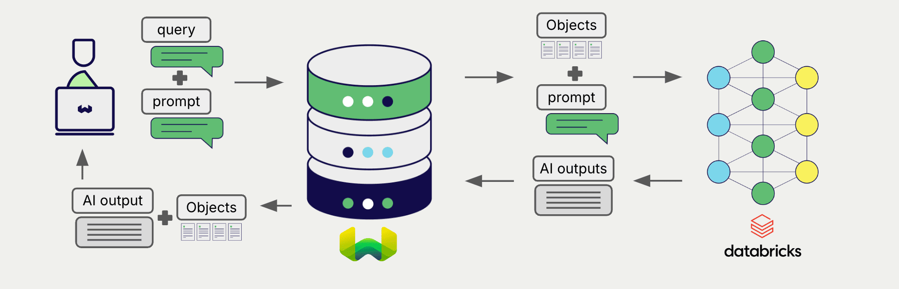

:::info `v1.26.3` で追加
:::

# Weaviate と Databricks の 生成 AI

import Tabs from '@theme/Tabs';  
import TabItem from '@theme/TabItem';  
import FilteredTextBlock from '@site/src/components/Documentation/FilteredTextBlock';  
import PyConnect from '!!raw-loader!../_includes/provider.connect.py';  
import TSConnect from '!!raw-loader!../_includes/provider.connect.ts';  
import PyCode from '!!raw-loader!../_includes/provider.generative.py';  
import TSCode from '!!raw-loader!../_includes/provider.generative.ts';  

Weaviate と Databricks の API の統合により、Databricks のモデル機能に Weaviate から直接アクセスできます。

[Weaviate のコレクションを設定](#configure-collection) して、Databricks の生成 AI モデルを利用します。Weaviate は、指定したエンドポイントと Databricks トークンを使って 検索拡張生成 (RAG) を実行します。

具体的には、Weaviate が検索を実行し、最も関連性の高いオブジェクトを取得したうえで、それらを Databricks の生成モデルに渡して出力を生成します。

## 要件

### Weaviate 構成

ご利用の Weaviate インスタンスには、Databricks 生成 AI 連携 (`generative-databricks`) モジュールが設定されている必要があります。

  
Weaviate Cloud (WCD) 利用者向け

この連携は Weaviate Cloud (WCD) のサーバーレス インスタンスではデフォルトで有効になっています。

  
セルフホスト利用者向け

- モジュールが有効になっているか確認するため、[クラスターメタデータ](/deploy/configuration/meta.md) をチェックしてください。  
- Weaviate でモジュールを有効化するには、[モジュール構成方法](../../configuration/modules.md) ガイドに従ってください。

### API 資格情報

この連携を利用するには、有効な Databricks Personal Access Token (PAT) を Weaviate に渡す必要があります。PAT の生成方法については、[Databricks のドキュメント](https://docs.databricks.com/en/dev-tools/auth/pat.html) を参照してください。

次のいずれかの方法で Databricks トークンを Weaviate に提供します。

- Weaviate から参照可能な `DATABRICKS_TOKEN` 環境変数を設定する。  
- 以下の例のように、実行時に API キーを渡す。

<Tabs groupId="languages">

  <TabItem value="py" label="Python API v4">
    <FilteredTextBlock
      text={PyConnect}
      startMarker="# START DatabricksInstantiation"
      endMarker="# END DatabricksInstantiation"
      language="py"
    />
  </TabItem>
  <TabItem value="js" label="JS/TS API v3">
    <FilteredTextBlock
      text={TSConnect}
      startMarker="// START DatabricksInstantiation"
      endMarker="// END DatabricksInstantiation"
      language="ts"
    />
  </TabItem>

</Tabs>

## コレクションの設定

import MutableGenerativeConfig from '/_includes/mutable-generative-config.md';

<MutableGenerativeConfig />

[Weaviate のコレクションを設定](../../manage-collections/generative-reranker-models.mdx#specify-a-generative-model-integration) し、次のように Databricks の生成 AI エンドポイントを指定してください。

<Tabs groupId="languages">
  <TabItem value="py" label="Python API v4">
    <FilteredTextBlock
      text={PyCode}
      startMarker="# START BasicGenerativeDatabricks"
      endMarker="# END BasicGenerativeDatabricks"
      language="py"
    />
  </TabItem>

  <TabItem value="js" label="JS/TS API v3">
    <FilteredTextBlock
      text={TSCode}
      startMarker="// START BasicGenerativeDatabricks"
      endMarker="// END BasicGenerativeDatabricks"
      language="ts"
    />
  </TabItem>
</Tabs>

これにより、指定したエンドポイントで提供される生成 AI モデルを Weaviate が使用するように設定されます。

### 生成パラメーター

モデルの動作をカスタマイズするため、以下の生成パラメーターを設定できます。

<Tabs groupId="languages">
  <TabItem value="py" label="Python API v4">
    <FilteredTextBlock
      text={PyCode}
      startMarker="# START FullGenerativeDatabricks"
      endMarker="# END FullGenerativeDatabricks"
      language="py"
    />
  </TabItem>

  <TabItem value="js" label="JS/TS API v3">
    <FilteredTextBlock
      text={TSCode}
      startMarker="// START FullGenerativeDatabricks"
      endMarker="// END FullGenerativeDatabricks"
      language="ts"
    />
  </TabItem>

</Tabs>

モデルパラメーターの詳細については、[Databricks のドキュメント](https://docs.databricks.com/en/machine-learning/foundation-models/api-reference.html#chat-task) を参照してください。

## 実行時のモデル選択

コレクション作成時にデフォルトのモデルプロバイダーを設定するだけでなく、クエリ実行時に上書きすることもできます。

<Tabs groupId="languages">
  <TabItem value="py" label="Python API v4">
    <FilteredTextBlock
      text={PyCode}
      startMarker="# START RuntimeModelSelectionDatabricks"
      endMarker="# END RuntimeModelSelectionDatabricks"
      language="py"
    />
  </TabItem>
  <TabItem value="js" label="JS/TS Client v3">
    <FilteredTextBlock
          text={TSCode}
          startMarker="// START RuntimeModelSelectionDatabricks"
          endMarker="// END RuntimeModelSelectionDatabricks"
          language="ts"
        />
  </TabItem>
</Tabs>

## ヘッダー パラメーター

API キーのほか、いくつかのオプションパラメーターを追加ヘッダーとして実行時に渡すことができます。利用可能なヘッダーは次のとおりです。

- `X-Databricks-Token`: Databricks API トークン。
- `X-Databricks-Endpoint`: Databricks モデルに使用するエンドポイント。
- `X-Databricks-User-Agent`: Databricks モデルに使用するユーザーエージェント。

実行時に渡された追加ヘッダーは、既存の Weaviate 設定を上書きします。

ヘッダーは上記の [API 資格情報の例](#api-credentials) のとおりに指定してください。

## 検索拡張生成

生成 AI 連携を設定した後、[シングル プロンプト](#single-prompt) または [グループ化タスク](#grouped-task) の方法で RAG 操作を実行します。

### シングル プロンプト

検索結果内の各オブジェクトに対してテキストを生成するには、シングル プロンプト方式を使用します。

以下の例では、`limit` パラメーターで指定した `n` 件の検索結果それぞれに対して出力を生成します。

シングル プロンプト クエリを作成する際は、Weaviate が言語モデルへ渡すオブジェクトプロパティを中かっこ `{}` で記述してください。たとえばオブジェクトの `title` プロパティを渡すには、クエリ内に `{title}` を含めます。

<Tabs groupId="languages">

  <TabItem value="py" label="Python API v4">
    <FilteredTextBlock
      text={PyCode}
      startMarker="# START SinglePromptExample"
      endMarker="# END SinglePromptExample"
      language="py"
    />
  </TabItem>
  <TabItem value="js" label="JS/TS API v3">
    <FilteredTextBlock
      text={TSCode}
      startMarker="// START SinglePromptExample"
      endMarker="// END SinglePromptExample"
      language="ts"
    />
  </TabItem>

</Tabs>

### グループ化タスク

検索結果のセット全体に対して 1 つのテキストを生成するには、グループ化タスク方式を使用します。

言い換えれば、`n` 件の検索結果があっても、生成モデルはグループ全体に対して 1 つの出力を生成します。

<Tabs groupId="languages">

  <TabItem value="py" label="Python API v4">
    <FilteredTextBlock
      text={PyCode}
      startMarker="# START GroupedTaskExample"
      endMarker="# END GroupedTaskExample"
      language="py"
    />
  </TabItem>

  <TabItem value="js" label="JS/TS API v3">
    <FilteredTextBlock
      text={TSCode}
      startMarker="// START GroupedTaskExample"
      endMarker="// END GroupedTaskExample"
      language="ts"
    />
  </TabItem>

</Tabs>

<!-- ## References -->

## 追加リソース

### その他の連携

- [Databricks 埋め込みモデル + Weaviate](./embeddings.md)

### コード例

コレクションで連携を設定すると、Weaviate でのデータ管理および検索操作は他のコレクションと同一になります。以下にモデル非依存の例を示します。

- [How-to: コレクションを管理する](../../manage-collections/index.mdx) および [How-to: オブジェクトを管理する](../../manage-objects/index.mdx) ガイドでは、データ操作（コレクションおよびその内部オブジェクトの作成、読み取り、更新、削除）方法を説明しています。
- [How-to: クエリ & 検索](../../search/index.mdx) ガイドでは、ベクトル検索、キーワード検索、ハイブリッド検索、そして 検索拡張生成 の方法を説明しています。

### 参考資料

- [Databricks foundation model ドキュメント](https://docs.databricks.com/en/machine-learning/foundation-models/api-reference.html)

## 質問とフィードバック

import DocsFeedback from '/_includes/docs-feedback.mdx';

<DocsFeedback/>

