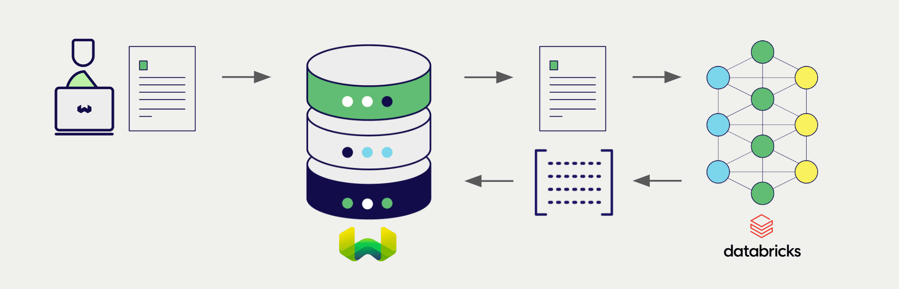

<!-- Note: for images, use https://docs.google.com/presentation/d/15opIcJuaIjEEcs_1Zm8B6pccox2p7_MHSjCnRv4dPfU/edit?usp=sharing -->

:::info `v1.26.3` で追加
:::

Databricks は、自然言語処理と生成のために幅広いモデルを提供しています。  
 Weaviate は Databricks の Foundation Model API とシームレスに統合されており、ユーザーは Weaviate Database から直接 Databricks のモデルを活用できます。

これらの統合により、開発者は高度な AI 駆動アプリケーションを簡単に構築できます。

## Databricks との統合

### ベクトル検索用の埋め込みモデル

Databricks の埋め込みモデルは、テキストデータを意味と文脈を捉えた ベクトル 埋め込みへと変換します。

[Weaviate は Databricks の埋め込みモデルと統合](./embeddings.md) し、データのシームレスなベクトル化を実現します。これにより、追加の前処理やデータ変換を行うことなく、セマンティック検索やハイブリッド検索を実行できます。

[Databricks 埋め込み統合ページ](./embeddings.md)

### RAG 用の生成 AI モデル

Databricks の生成 AI モデルは、与えられたプロンプトとコンテキストに基づいて人間のようなテキストを生成できます。

[Weaviate の生成 AI 統合](./generative.md) は、Weaviate Database から直接 検索拡張生成 (RAG) を実行できるようにします。これにより、Weaviate の効率的なストレージと高速な検索機能を Databricks の生成 AI モデルと組み合わせて、パーソナライズされた文脈に応じた回答を生成します。

[Databricks 生成 AI 統合ページ](./generative.md)

## まとめ

これらの統合により、開発者は Databricks の強力なモデルを Weaviate 内で直接活用できます。

その結果、AI 駆動アプリケーションの開発プロセスが簡素化され、開発スピードが向上し、より革新的なソリューションの創出に集中できます。

## はじめる

これらの統合を利用するには、Databricks のパーソナルアクセス トークンを Weaviate に提供する必要があります。トークンの生成方法については、[Databricks のドキュメント](https://docs.databricks.com/en/dev-tools/auth/pat.html) を参照してください。

その後、該当する統合ページで Weaviate を OpenAI モデルと連携する方法を確認し、アプリケーションでご利用ください。

- [テキスト埋め込み](./embeddings.md)
- [生成 AI](./generative.md)

## 質問とフィードバック

import DocsFeedback from '/_includes/docs-feedback.mdx';

<DocsFeedback/>

