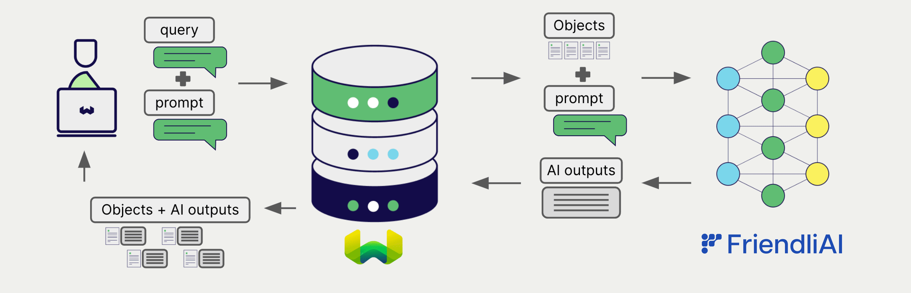

# Weaviate と FriendliAI の生成 AI

:::info `v1.26.3` で追加
:::

import Tabs from '@theme/Tabs';
import TabItem from '@theme/TabItem';
import FilteredTextBlock from '@site/src/components/Documentation/FilteredTextBlock';
import PyConnect from '!!raw-loader!../_includes/provider.connect.py';
import TSConnect from '!!raw-loader!../_includes/provider.connect.ts';
import PyCode from '!!raw-loader!../_includes/provider.generative.py';
import TSCode from '!!raw-loader!../_includes/provider.generative.ts';

Weaviate の FriendliAI API 連携を利用すると、FriendliAI のモデル機能に Weaviate から直接アクセスできます。

FriendliAI の生成 AI モデルを使用するように [Weaviate のコレクションを設定](#configure-collection) してください。指定したモデルと Friendli トークンを用いて、Weaviate が 検索拡張生成 (RAG) を実行します。

具体的には、Weaviate が検索を実行して最も関連性の高いオブジェクトを取得し、それらを FriendliAI の生成モデルに渡して出力を生成します。

## 要件

### Weaviate の設定

お使いの Weaviate インスタンスには、FriendliAI 生成 AI 連携 (`generative-friendliai`) モジュールが有効になっている必要があります。

  
Weaviate Cloud (WCD) ユーザー向け

この連携は、Weaviate Cloud (WCD) のサーバーレスインスタンスではデフォルトで有効になっています。

  
セルフホストユーザー向け

- モジュールが有効かどうかは、[クラスターメタデータ](/deploy/configuration/meta.md) で確認してください。
- Weaviate でモジュールを有効にする手順は、[モジュール設定方法](../../configuration/modules.md) ガイドを参照してください。

### API 資格情報

この連携を利用するには、有効な Friendli Suite Token を Weaviate に提供する必要があります。登録とトークン取得は [Friendli Suite](https://docs.friendli.ai/openapi/create-chat-completions) で行えます。

Friendli トークンは、次のいずれかの方法で Weaviate に渡してください。

- Weaviate で参照可能な `FRIENDLI_TOKEN` 環境変数を設定する
- 下記の例のように実行時にトークンを渡す

<Tabs groupId="languages">

 <TabItem value="py" label="Python API v4">
    <FilteredTextBlock
      text={PyConnect}
      startMarker="# START FriendliInstantiation"
      endMarker="# END FriendliInstantiation"
      language="py"
    />
  </TabItem>

 <TabItem value="js" label="JS/TS API v3">
    <FilteredTextBlock
      text={TSConnect}
      startMarker="// START FriendliInstantiation"
      endMarker="// END FriendliInstantiation"
      language="ts"
    />
  </TabItem>

</Tabs>

## コレクションの設定

import MutableGenerativeConfig from '/_includes/mutable-generative-config.md';

<MutableGenerativeConfig />

FriendliAI の生成 AI モデルを使用するには、以下のように [Weaviate インデックスを設定](../../manage-collections/generative-reranker-models.mdx#specify-a-generative-model-integration) します。

<Tabs groupId="languages">
  <TabItem value="py" label="Python API v4">
    <FilteredTextBlock
      text={PyCode}
      startMarker="# START BasicGenerativeFriendliAI"
      endMarker="# END BasicGenerativeFriendliAI"
      language="py"
    />
  </TabItem>

  <TabItem value="js" label="JS/TS API v3">
    <FilteredTextBlock
      text={TSCode}
      startMarker="// START BasicGenerativeFriendliAI"
      endMarker="// END BasicGenerativeFriendliAI"
      language="ts"
    />
  </TabItem>

</Tabs>

### モデルの選択

次の設定例のように、Weaviate に使用させる [利用可能なモデル](#available-models) のいずれかを指定できます。

<Tabs groupId="languages">
  <TabItem value="py" label="Python API v4">
    <FilteredTextBlock
      text={PyCode}
      startMarker="# START GenerativeFriendliAICustomModel"
      endMarker="# END GenerativeFriendliAICustomModel"
      language="py"
    />
  </TabItem>

  <TabItem value="js" label="JS/TS API v3">
    <FilteredTextBlock
      text={TSCode}
      startMarker="// START GenerativeFriendliAICustomModel"
      endMarker="// END GenerativeFriendliAICustomModel"
      language="ts"
    />
  </TabItem>

</Tabs>

[利用可能なモデル](#available-models) のいずれかを [指定](#generative-parameters) できます。モデルを指定しない場合は、[デフォルトモデル](#available-models) が使用されます。

### 生成パラメーター

次の生成パラメーターを設定して、モデルの挙動をカスタマイズします。

<Tabs groupId="languages">
  <TabItem value="py" label="Python API v4">
    <FilteredTextBlock
      text={PyCode}
      startMarker="# START FullGenerativeFriendliAI"
      endMarker="# END FullGenerativeFriendliAI"
      language="py"
    />
  </TabItem>

  <TabItem value="js" label="JS/TS API v3">
    <FilteredTextBlock
      text={TSCode}
      startMarker="// START FullGenerativeFriendliAI"
      endMarker="// END FullGenerativeFriendliAI"
      language="ts"
    />
  </TabItem>

</Tabs>

モデルパラメーターの詳細については、[FriendliAI の API ドキュメント](https://docs.friendli.ai/openapi/create-chat-completions) を参照してください。

## 実行時のモデル選択

コレクションを作成するときにデフォルトのモデルプロバイダーを設定するだけでなく、クエリ実行時に上書きすることもできます。

<Tabs groupId="languages">
  <TabItem value="py" label="Python API v4">
    <FilteredTextBlock
      text={PyCode}
      startMarker="# START RuntimeModelSelectionFriendliAI"
      endMarker="# END RuntimeModelSelectionFriendliAI"
      language="py"
    />
  </TabItem>
  <TabItem value="js" label="JS/TS Client v3">
    <FilteredTextBlock
      text={TSCode}
      startMarker="// START RuntimeModelSelectionFriendliAI"
      endMarker="// END RuntimeModelSelectionFriendliAI"
      language="ts"
    />
  </TabItem>
</Tabs>

## ヘッダーパラメーター

リクエストに追加のヘッダーを付与することで、実行時に API キーと任意のパラメーターを指定できます。利用可能なヘッダーは次のとおりです。

- `X-Friendli-Api-Key`: Friendli の API キー。
- `X-Friendli-Baseurl`: 既定の Friendli URL の代わりに使用するベース URL（例: プロキシ）。

実行時に指定した追加ヘッダーは、既存の Weaviate の設定を上書きします。

ヘッダーの指定方法については、上記の [API credentials の例](#api-credentials) を参照してください。

## 検索拡張生成

生成 AI との統合を設定したら、[single prompt](#single-prompt) もしくは [grouped task](#grouped-task) のいずれかの方法で RAG 操作を実行します。

### シングルプロンプト

検索結果の各オブジェクトに対してテキストを生成する場合は、シングルプロンプト方式を使用します。

次の例では、`limit` パラメーターで指定した `n` 件の検索結果それぞれに対して出力を生成します。

シングルプロンプト クエリを作成する際は、波かっこ `{}` を使用して、言語モデルに渡したいオブジェクトのプロパティを埋め込みます。たとえば、オブジェクトの `title` プロパティを渡す場合は、クエリ内に `{title}` を含めます。

<Tabs groupId="languages">

 <TabItem value="py" label="Python API v4">
    <FilteredTextBlock
      text={PyCode}
      startMarker="# START SinglePromptExample"
      endMarker="# END SinglePromptExample"
      language="py"
    />
  </TabItem>

 <TabItem value="js" label="JS/TS API v3">
    <FilteredTextBlock
      text={TSCode}
      startMarker="// START SinglePromptExample"
      endMarker="// END SinglePromptExample"
      language="ts"
    />
  </TabItem>

</Tabs>

### グループタスク

検索結果全体に対して 1 つのテキストを生成する場合は、グループタスク方式を使用します。

言い換えると、`n` 件の検索結果がある場合でも、生成モデルはグループ全体に対して 1 つの出力だけを生成します。

<Tabs groupId="languages">

 <TabItem value="py" label="Python API v4">
    <FilteredTextBlock
      text={PyCode}
      startMarker="# START GroupedTaskExample"
      endMarker="# END GroupedTaskExample"
      language="py"
    />
  </TabItem>

 <TabItem value="js" label="JS/TS API v3">
    <FilteredTextBlock
      text={TSCode}
      startMarker="// START GroupedTaskExample"
      endMarker="// END GroupedTaskExample"
      language="ts"
    />
  </TabItem>

</Tabs>

## 参照

### 利用可能なモデル

* `meta-llama-3.1-70b-instruct` (default)
* `meta-llama-3.1-8b-instruct`
* `mixtral-8x7b-instruct-v0-1`

Weaviate とともに Friendli Suite にデプロイされた任意のモデルを使用できます。

FriendliAI が提供する [利用可能なモデル](https://friendli.ai/models) は幅広く、オプションで [ファインチューニング](https://docs.friendli.ai/guides/dedicated_endpoints/fine-tuning) も可能です。手順については [FriendliAI クイックスタートガイド](https://docs.friendli.ai/guides/dedicated_endpoints/quickstart) を参照してください。

Weaviate との統合で専用の FriendliAI エンドポイントを使用する場合は、以下のように指定します。

<Tabs groupId="languages">

 <TabItem value="py" label="Python API v4">
    <FilteredTextBlock
      text={PyConnect}
      startMarker="# START FriendliDedicatedInstantiation"
      endMarker="# END FriendliDedicatedInstantiation"
      language="py"
    />
  </TabItem>

 <TabItem value="js" label="JS/TS API v3">
    <FilteredTextBlock
      text={TSConnect}
      startMarker="// START FriendliDedicatedInstantiation"
      endMarker="// END FriendliDedicatedInstantiation"
      language="ts"
    />
  </TabItem>

</Tabs>

<Tabs groupId="languages">
  <TabItem value="py" label="Python API v4">
    <FilteredTextBlock
      text={PyCode}
      startMarker="# START DedicatedGenerativeFriendliAI"
      endMarker="# END DedicatedGenerativeFriendliAI"
      language="py"
    />
  </TabItem>

  <TabItem value="js" label="JS/TS API v3">
    <FilteredTextBlock
      text={TSCode}
      startMarker="// START DedicatedGenerativeFriendliAI"
      endMarker="// END DedicatedGenerativeFriendliAI"
      language="ts"
    />
  </TabItem>

</Tabs>

## 追加リソース

### コード例

コレクションで統合が構成されると、Weaviate におけるデータ管理および検索操作は他のコレクションと同様に動作します。以下のモデル非依存の例を参照してください。

- [How-to: Manage collections](../../manage-collections/index.mdx) および [How-to: Manage objects](../../manage-objects/index.mdx) ガイドでは、データ操作（コレクションおよびその内部のオブジェクトの作成、読み取り、更新、削除）を行う方法を示しています。
- [How-to: Query & Search](../../search/index.mdx) ガイドでは、検索操作（ベクトル、キーワード、ハイブリッド）と検 索拡張生成の実行方法を説明しています。

### 参照

- [FriendliAI API ドキュメント](https://docs.friendli.ai/openapi/create-chat-completions)

import DocsFeedback from '/_includes/docs-feedback.mdx';

<DocsFeedback/>

