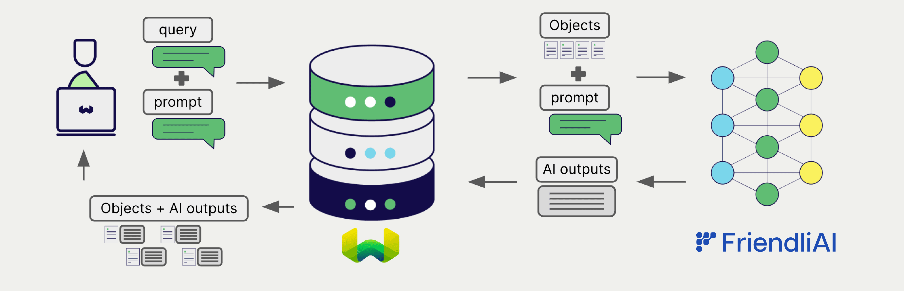

<!-- Note: for images, use https://docs.google.com/presentation/d/15opIcJuaIjEEcs_1Zm8B6pccox2p7_MHSjCnRv4dPfU/edit?usp=sharing -->

:::info `v1.26.3` で追加されました
:::

 FriendliAI は、自然言語処理および生成のための幅広いモデルを提供しています。 Weaviate は FriendliAI の API とシームレスに統合され、ユーザーは Weaviate Database 内で FriendliAI の推論エンジンを利用できます。

 FriendliAI との統合により、開発者は高度な AI 駆動アプリケーションを簡単に構築できます。

## FriendliAI との統合

### RAG 向け生成 AI モデル

 FriendliAI の生成 AI モデルは、指定されたプロンプトとコンテキストに基づいて人間のようなテキストを生成できます。

[Weaviate の生成 AI 統合](./generative.md) を使用すると、Weaviate Database から直接 Retrieval Augmented Generation (RAG) を実行できます。これにより、 Weaviate の効率的なストレージと高速検索機能に FriendliAI の生成 AI モデルを組み合わせ、パーソナライズされたコンテキスト認識の応答を生成します。

詳しくは、[FriendliAI 生成 AI 統合ページ](./generative.md) をご覧ください。

## まとめ

この統合により、開発者は Weaviate 内で FriendliAI の推論エンジンのパワーを活用できます。

その結果、 AI 駆動アプリケーションの構築プロセスが簡素化され、開発を加速し、革新的なソリューションの創出に集中できます。

## はじめに

これらの統合を利用するには、有効な Friendli トークン (Personal Access Token) を Weaviate に提供する必要があります。 [Friendli Suite](https://suite.friendli.ai/) にアクセスしてサインアップし、パーソナルアクセストークンを取得してください。

次に、該当する統合ページで、 FriendliAI モデルを Weaviate に設定する方法を確認し、アプリケーションで使用を開始しましょう。

- [生成 AI](./generative.md)

import DocsFeedback from '/_includes/docs-feedback.mdx';

<DocsFeedback/>

