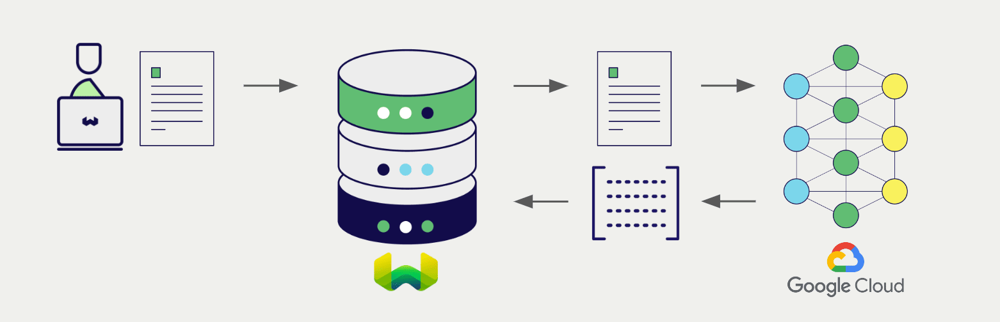
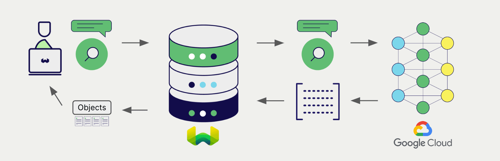

# Weaviate における Google マルチモーダル埋め込み


import Tabs from '@theme/Tabs';
import TabItem from '@theme/TabItem';
import FilteredTextBlock from '@site/src/components/Documentation/FilteredTextBlock';
import PyConnect from '!!raw-loader!../_includes/provider.connect.py';
import TSConnect from '!!raw-loader!../_includes/provider.connect.ts';
import PyCode from '!!raw-loader!../_includes/provider.vectorizer.py';
import TSCode from '!!raw-loader!../_includes/provider.vectorizer.ts';

[Google Vertex AI](https://cloud.google.com/vertex-ai) API と Weaviate の統合により、モデルの機能を Weaviate から直接利用できます。

:::note Gemini API は利用できません
現在、Google Gemini API ではマルチモーダル埋め込みを利用できません。
:::

[ベクトルインデックスを設定](#configure-the-vectorizer) して Google の埋め込みモデルを使用すると、Weaviate は指定したモデルと Google API キーを使って各種操作の埋め込みを生成します。この機能は *ベクトライザー* と呼ばれます。

[インポート時](#data-import) には、Weaviate がマルチモーダルオブジェクト埋め込みを生成してインデックスに保存します。[ ベクトル ](#vector-near-text-search) および [ ハイブリッド ](#hybrid-search) 検索では、Weaviate が 1 種類以上のモダリティのクエリを埋め込みに変換します。[ マルチモーダル検索操作 ](#vector-near-media-search) にも対応しています。



## 要件

### Weaviate の設定

お使いの Weaviate インスタンスでは、Google マルチモーダルベクトライザー統合モジュール (`multi2vec-google`) を有効にしておく必要があります。

:::info モジュール名の変更
`multi2vec-google` は Weaviate `v1.27` 以前では `multi2vec-palm` という名称でした。
:::

<details>
  <summary>Weaviate Cloud (WCD) をご利用の場合</summary>

この統合は、Weaviate Cloud (WCD) のサーバーレスインスタンスではデフォルトで有効になっています。

</details>

<details>
  <summary>セルフホスト環境の場合</summary>

- [ クラスターメタデータ ](/deploy/configuration/meta.md) でモジュールが有効かどうかを確認してください。  
- Weaviate でモジュールを有効にする手順は、[モジュール設定方法](../../configuration/modules.md) をご覧ください。

</details>

### API 認証情報

適切な統合を行うため、Weaviate には有効な API 認証情報を提供する必要があります。

#### Vertex AI

Google Cloud では `access token` と呼ばれます。

##### トークンの自動生成

import UseGoogleAuthInstructions from './_includes/use_google_auth_instructions.mdx';

<UseGoogleAuthInstructions/>

##### トークンを手動で取得する

[Google Cloud CLI ツール](https://cloud.google.com/cli) がインストール済みで設定が完了している場合、次のコマンドでトークンを確認できます。

```shell
gcloud auth print-access-token
```

#### Vertex AI ユーザー向けトークンの有効期限

import GCPTokenExpiryNotes from '/_includes/gcp.token.expiry.notes.mdx';

<GCPTokenExpiryNotes/>

#### API キーの提供

以下の例のように、実行時に Weaviate へ API キーを渡してください。

<!-- Note the separate headers that are available for [Gemini API](#gemini-api) and [Vertex AI](#vertex-ai) users. -->

import ApiKeyNote from '../_includes/google-api-key-note.md';

<ApiKeyNote />

<Tabs groupId="languages">

 <TabItem value="py" label="Python API v4">
    <FilteredTextBlock
      text={PyConnect}
      startMarker="# START GoogleVertexInstantiation"
      endMarker="# END GoogleVertexInstantiation"
      language="py"
    />
  </TabItem>

 <TabItem value="js" label="JS/TS API v3">
    <FilteredTextBlock
      text={TSConnect}
      startMarker="// START GoogleVertexInstantiation"
      endMarker="// END GoogleVertexInstantiation"
      language="ts"
    />
  </TabItem>

</Tabs>

## ベクトライザーの設定

Google 埋め込みモデルを使用できるよう、[ Weaviate インデックスを設定](../../manage-collections/vector-config.mdx#specify-a-vectorizer) します。

<Tabs groupId="languages">
  <TabItem value="py" label="Python API v4">
    <FilteredTextBlock
      text={PyCode}
      startMarker="# START BasicMMVectorizerGoogleVertex"
      endMarker="# END BasicMMVectorizerGoogleVertex"
      language="py"
    />
  </TabItem>

  <TabItem value="js" label="JS/TS API v3">
    <FilteredTextBlock
      text={TSCode}
      startMarker="// START BasicMMVectorizerGoogleVertex"
      endMarker="// END BasicMMVectorizerGoogleVertex"
      language="ts"
    />API v
  </TabItem>

</Tabs>

[ 使用可能なモデル ](#available-models) のいずれかを [指定](#vectorizer-parameters) できます。現在利用可能なモデルは `multimodalembedding@001` のみです。

<!-- The default model (`textembedding-gecko@001` for Vertex AI, `embedding-001` for Gemini API) is used if no model is specified. -->

import VectorizationBehavior from '/_includes/vectorization.behavior.mdx';

<details>
  <summary>ベクトル化の挙動</summary>

<VectorizationBehavior/>

</details>


### ベクトライザーのパラメーター

以下の例では、Google 固有のオプションの設定方法を示します。

- `location` （必須）: 例: `"us-central1"`
- `projectId` （Vertex AI を使用する場合のみ必須）: 例: `cloud-large-language-models`
- `apiEndpoint` （オプション）: 例: `us-central1-aiplatform.googleapis.com`
- `modelId` （オプション）: 例: `multimodalembedding@001`
- `dimensions` （オプション）: 次のいずれかである必要があります: `128`, `256`, `512`, `1408`。デフォルトは `1408` です。

<Tabs groupId="languages">
  <TabItem value="py" label="Python API v4">
    <FilteredTextBlock
      text={PyCode}
      startMarker="# START FullMMVectorizerGoogle"
      endMarker="# END FullMMVectorizerGoogle"
      language="py"
    />
  </TabItem>

  <TabItem value="js" label="JS/TS API v3">
    <FilteredTextBlock
      text={TSCode}
      startMarker="// START FullMMVectorizerGoogle"
      endMarker="// END FullMMVectorizerGoogle"
      language="ts"
    />
  </TabItem>

</Tabs>

## データのインポート

ベクトライザーを設定したら、Weaviate へ [データをインポートする](../../manage-objects/import.mdx) と、指定したモデルを使用してオブジェクトの埋め込みが生成されます。

<Tabs groupId="languages">

 <TabItem value="py" label="Python API v4">
    <FilteredTextBlock
      text={PyCode}
      startMarker="# START MMBatchImportExample"
      endMarker="# END MMBatchImportExample"
      language="py"
    />
  </TabItem>

 <TabItem value="js" label="JS/TS API v3">
    <FilteredTextBlock
      text={TSCode}
      startMarker="// START MMBatchImportExample"
      endMarker="// END MMBatchImportExample"
      language="ts"
    />
  </TabItem>

</Tabs>

:::tip 既存のベクトルを再利用する
すでに互換性のあるモデルのベクトルをお持ちであれば、それを直接 Weaviate に渡すことができます。同じモデルで事前に埋め込みを生成しており、別のシステムからデータを移行する場合などに役立ちます。
:::

## 検索

ベクトライザーを設定すると、Weaviate は指定した Google モデルを用いてベクトル検索およびハイブリッド検索を実行します。



### ベクトル（near text）検索

[ベクトル検索](../../search/similarity.md#search-with-text) を行うと、Weaviate はテキストクエリを指定したモデルで埋め込みに変換し、データベースから最も類似したオブジェクトを返します。

次のクエリは、`limit` で指定した `n` 件の最も類似したオブジェクトを返します。

<Tabs groupId="languages">

 <TabItem value="py" label="Python API v4">
    <FilteredTextBlock
      text={PyCode}
      startMarker="# START NearTextExample"
      endMarker="# END NearTextExample"
      language="py"
    />
  </TabItem>

 <TabItem value="js" label="JS/TS API v3">
    <FilteredTextBlock
      text={TSCode}
      startMarker="// START NearTextExample"
      endMarker="// END NearTextExample"
      language="ts"
    />
  </TabItem>

</Tabs>

### ハイブリッド検索

:::info ハイブリッド検索とは？
ハイブリッド検索は、ベクトル検索とキーワード（BM25）検索を実行し、その結果を [組み合わせて](../../search/hybrid.md) データベースから最適なオブジェクトを返します。
:::

[ハイブリッド検索](../../search/hybrid.md) を実行すると、Weaviate はテキストクエリを指定したモデルで埋め込みに変換し、データベースから最もスコアの高いオブジェクトを返します。

次のクエリは、`limit` で指定した `n` 件の最もスコアの高いオブジェクトを返します。

<Tabs groupId="languages">

 <TabItem value="py" label="Python API v4">
    <FilteredTextBlock
      text={PyCode}
      startMarker="# START HybridExample"
      endMarker="# END HybridExample"
      language="py"
    />
  </TabItem>

 <TabItem value="js" label="JS/TS API v3">
    <FilteredTextBlock
      text={TSCode}
      startMarker="// START HybridExample"
      endMarker="// END HybridExample"
      language="ts"
    />
  </TabItem>

</Tabs>


### ベクトル（near media）検索

例えば near image search のようなメディア検索を実行すると、 Weaviate は指定したモデルを使用してクエリを埋め込み（embedding）に変換し、データベースから最も類似したオブジェクトを返します。

 near image search のような near media search を実行するには、メディアクエリを base64 文字列に変換し、それを検索クエリに渡します。

以下のクエリは、`limit` で指定した数  n  件の入力画像に最も類似したオブジェクトをデータベースから返します。

<Tabs groupId="languages">

 <TabItem value="py" label="Python API v4">
    <FilteredTextBlock
      text={PyCode}
      startMarker="# START NearImageExample"
      endMarker="# END NearImageExample"
      language="py"
    />
  </TabItem>

 <TabItem value="js" label="JS/TS API v3">
    <FilteredTextBlock
      text={TSCode}
      startMarker="// START NearImageExample"
      endMarker="// END NearImageExample"
      language="ts"
    />
  </TabItem>

</Tabs>

## 参考

### 利用可能なモデル

- `multimodalembedding@001` （デフォルト）

## 追加リソース

### 他のインテグレーション

- [Google テキスト埋め込みモデル + Weaviate](./embeddings.md)
- [Google AI 生成モデル + Weaviate](./generative.md)

### コード例

コレクションでインテグレーションを設定すると、 Weaviate におけるデータ管理および検索操作は他のコレクションとまったく同じように機能します。モデル非依存の例は以下を参照してください。

- [How-to: コレクションを管理する](../../manage-collections/index.mdx) および [How-to: オブジェクトを管理する](../../manage-objects/index.mdx) ガイドでは、データ操作（コレクションおよびその内部のオブジェクトの作成、読み取り、更新、削除）を実行する方法を説明しています。
- [How-to: クエリ & 検索](../../search/index.mdx) ガイドでは、検索操作（ vector、 keyword、 hybrid）や 検索拡張生成 を実行する方法を説明しています。

### 外部リソース

- [Google Vertex AI](https://cloud.google.com/vertex-ai)
- [Google Gemini API](https://ai.google.dev/?utm_source=weaviate&utm_medium=referral&utm_campaign=partnerships&utm_content=)

## 質問とフィードバック

import DocsFeedback from '/_includes/docs-feedback.mdx';

<DocsFeedback/>

