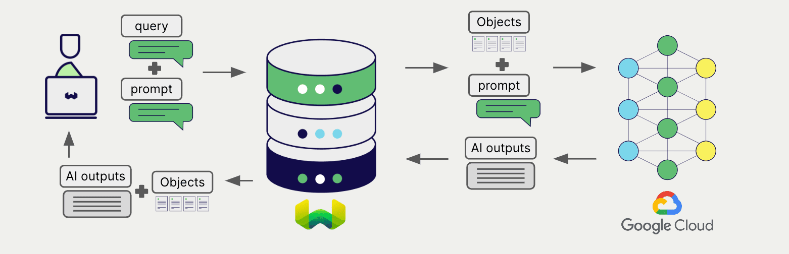
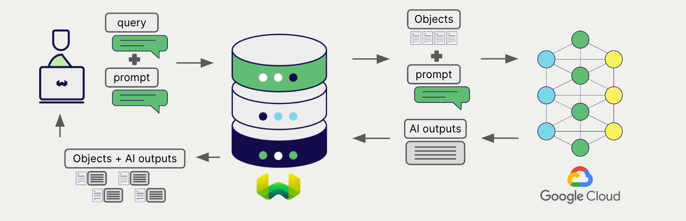

# Weaviate と Google 生成 AI


import Tabs from '@theme/Tabs';
import TabItem from '@theme/TabItem';
import FilteredTextBlock from '@site/src/components/Documentation/FilteredTextBlock';
import PyConnect from '!!raw-loader!../_includes/provider.connect.py';
import TSConnect from '!!raw-loader!../_includes/provider.connect.ts';
import PyCode from '!!raw-loader!../_includes/provider.generative.py';
import TSCode from '!!raw-loader!../_includes/provider.generative.ts';

Weaviate の統合により、[Google Gemini API](https://ai.google.dev/?utm_source=weaviate&utm_medium=referral&utm_campaign=partnerships&utm_content=) と [Google Vertex AI](https://cloud.google.com/vertex-ai) の各 API が提供するモデル機能を Weaviate から直接利用できます。

[コレクションを設定](#configure-collection) して Google の生成 AI モデルを使用すると、Weaviate が 検索拡張生成 (RAG) を指定したモデルとお客様の Google API キーで実行します。

具体的には、Weaviate が検索を実行し、最も関連性の高いオブジェクトを取得した後、それらを Google の生成モデルに渡して出力を生成します。



:::info Gemini API の提供状況
執筆時点 (2023 年 11 月) では、Gemini API はすべてのリージョンで利用可能ではありません。最新情報は [こちら](https://ai.google.dev/gemini-api/docs/available-regions) をご覧ください。
:::

## 要件

### Weaviate の設定

ご利用の Weaviate インスタンスには、Google 生成 AI 連携 (`generative-google`) モジュールが有効になっている必要があります。

:::info モジュール名の変更
`generative-google` は Weaviate `v1.27` 以前では `generative-palm` と呼ばれていました。
:::

<details>
  <summary>Weaviate Cloud (WCD) ユーザーの場合</summary>

この連携は、Weaviate Cloud (WCD) のサーバーレスインスタンスではデフォルトで有効になっています。

</details>

<details>
  <summary>セルフホストユーザーの場合</summary>

- [クラスターメタデータ](/deploy/configuration/meta.md) を確認し、モジュールが有効になっているかを確認してください。  
- Weaviate でモジュールを有効にする方法は、[モジュール設定方法](../../configuration/modules.md) ガイドをご覧ください。

</details>

### API 資格情報

適切な連携を利用するために、有効な API 資格情報を Weaviate に提供する必要があります。

#### Gemini API

[Google Gemini API](https://aistudio.google.com/app/apikey/?utm_source=weaviate&utm_medium=referral&utm_campaign=partnerships&utm_content=) にアクセスしてサインアップし、API キーを取得してください。

#### Vertex AI

Google Cloud では `access token` と呼ばれます。

##### トークンの自動生成

import UseGoogleAuthInstructions from './_includes/use_google_auth_instructions.mdx';

<UseGoogleAuthInstructions/>

##### トークンの手動取得

Google Cloud では `access token` と呼ばれます。

[Google Cloud CLI ツール](https://cloud.google.com/cli) をインストールして設定済みの場合、以下のコマンドでトークンを確認できます。

```shell
gcloud auth print-access-token
```

import GCPTokenExpiryNotes from '/_includes/gcp.token.expiry.notes.mdx';

<GCPTokenExpiryNotes/>

#### API キーの提供

以下の例に示すように、実行時に API キーを Weaviate に渡してください。

[Gemin​​i API](#gemini-api) と [Vertex AI](#vertex-ai) ユーザー向けに、個別のヘッダーが用意されていますのでご注意ください。

import ApiKeyNote from '../_includes/google-api-key-note.md';

<ApiKeyNote />

<Tabs groupId="languages">

 <TabItem value="py" label="Python API v4">
    <FilteredTextBlock
      text={PyConnect}
      startMarker="# START GoogleInstantiation"
      endMarker="# END GoogleInstantiation"
      language="py"
    />
  </TabItem>

 <TabItem value="js" label="JS/TS API v3">
    <FilteredTextBlock
      text={TSConnect}
      startMarker="// START GoogleInstantiation"
      endMarker="// END GoogleInstantiation"
      language="ts"
    />
  </TabItem>

</Tabs>

## コレクションの設定

import MutableGenerativeConfig from '/_includes/mutable-generative-config.md';

<MutableGenerativeConfig />

[Weaviate インデックスを設定](../../manage-collections/generative-reranker-models.mdx#specify-a-generative-model-integration) し、Google の生成 AI モデルを使用するには次のようにします。

Vertex AI と Gemini API では、必要なパラメーターが異なる点に注意してください。

Weaviate に [利用可能なモデル](#available-models) の中から [指定](#generative-parameters) することも、モデルを指定しない場合は [デフォルトモデル](#available-models) が使用されます。

### Vertex AI

Vertex AI ユーザーは、コレクション設定で Google Cloud プロジェクト ID を指定する必要があります。

<Tabs groupId="languages">
  <TabItem value="py" label="Python API v4">
    <FilteredTextBlock
      text={PyCode}
      startMarker="# START BasicGenerativeGoogleVertex"
      endMarker="# END BasicGenerativeGoogleVertex"
      language="py"
    />
  </TabItem>

  <TabItem value="js" label="JS/TS API v3">
    <FilteredTextBlock
      text={TSCode}
      startMarker="// START BasicGenerativeGoogleVertex"
      endMarker="// END BasicGenerativeGoogleVertex"
      language="ts"
    />
  </TabItem>

</Tabs>

### Gemini API

<Tabs groupId="languages">
  <TabItem value="py" label="Python API v4">
    <FilteredTextBlock
      text={PyCode}
      startMarker="# START BasicGenerativeGoogleStudio"
      endMarker="# END BasicGenerativeGoogleStudio"
      language="py"
    />
  </TabItem>

  <TabItem value="js" label="JS/TS API v3">
    <FilteredTextBlock
      text={TSCode}
      startMarker="// START BasicGenerativeGoogleStudio"
      endMarker="// END BasicGenerativeGoogleStudio"
      language="ts"
    />
  </TabItem>

</Tabs>

### 生成パラメーター

以下の生成パラメーターを設定して、モデルの動作をカスタマイズします。

<Tabs groupId="languages">
  <TabItem value="py" label="Python API v4">
    <FilteredTextBlock
      text={PyCode}
      startMarker="# START FullGenerativeGoogle"
      endMarker="# END FullGenerativeGoogle"
      language="py"
    />
  </TabItem>

  <TabItem value="js" label="JS/TS API v3">
    <FilteredTextBlock
      text={TSCode}
      startMarker="// START FullGenerativeGoogle"
      endMarker="// END FullGenerativeGoogle"
      language="ts"
    />
  </TabItem>

</Tabs>

## 実行時モデル選択

コレクション作成時にデフォルトのモデルプロバイダーを設定するほか、クエリ実行時に上書きすることもできます。

<Tabs groupId="languages">
  <TabItem value="py" label="Python API v4">
    <FilteredTextBlock
      text={PyCode}
      startMarker="# START RuntimeModelSelectionGoogle"
      endMarker="# END RuntimeModelSelectionGoogle"
      language="py"
    />
  </TabItem>
  <TabItem value="js" label="JS/TS Client v3">
    <FilteredTextBlock
      text={TSCode}
      startMarker="// START RuntimeModelSelectionGoogle"
      endMarker="// END RuntimeModelSelectionGoogle"
      language="ts"
    />
  </TabItem>
</Tabs>

## 検索拡張生成

生成 AI の統合を設定した後、[single prompt](#single-prompt) または [grouped task](#grouped-task) の方法で RAG 操作を実行します。

### シングル プロンプト



検索結果内の各オブジェクトに対してテキストを生成する場合は、シングル プロンプト方式を利用します。

以下の例では、`limit` パラメーターで指定された `n` 件の検索結果それぞれに対して出力を生成します。

シングル プロンプト クエリを作成する際は、Weaviate から言語モデルへ渡したいオブジェクトプロパティを波かっこ `{}` で囲んで挿入します。たとえば、オブジェクトの `title` プロパティを渡すには、クエリ内に `{title}` を含めます。

<Tabs groupId="languages">

 <TabItem value="py" label="Python API v4">
    <FilteredTextBlock
      text={PyCode}
      startMarker="# START SinglePromptExample"
      endMarker="# END SinglePromptExample"
      language="py"
    />
  </TabItem>

 <TabItem value="js" label="JS/TS API v3">
    <FilteredTextBlock
      text={TSCode}
      startMarker="// START SinglePromptExample"
      endMarker="// END SinglePromptExample"
      language="ts"
    />
  </TabItem>

</Tabs>


### グループ化タスク


検索結果全体に対して 1 つのテキストを生成するには、グループ化タスク方式を使用します。

つまり、`n` 件の検索結果がある場合でも、生成モデルはそのグループ全体に対して 1 つの出力を生成します。

<Tabs groupId="languages">

 <TabItem value="py" label="Python API v4">
    <FilteredTextBlock
      text={PyCode}
      startMarker="# START GroupedTaskExample"
      endMarker="# END GroupedTaskExample"
      language="py"
    />
  </TabItem>

 <TabItem value="js" label="JS/TS API v3">
    <FilteredTextBlock
      text={TSCode}
      startMarker="// START GroupedTaskExample"
      endMarker="// END GroupedTaskExample"
      language="ts"
    />
  </TabItem>

</Tabs>

### 画像を用いた RAG

検索拡張生成を行う際、単一プロンプトでもグループ化タスクでも、入力の一部として画像を渡すことができます。

<Tabs groupId="languages">

 <TabItem value="py" label="Python API v4">
    <FilteredTextBlock
      text={PyCode}
      startMarker="# START WorkingWithImagesGoogle"
      endMarker="# END WorkingWithImagesGoogle"
      language="py"
    />
  </TabItem>
  <TabItem value="js" label="JS/TS API v3">
    <FilteredTextBlock
        text={TSCode}
        startMarker="// START WorkingWithImagesGoogle"
        endMarker="// END WorkingWithImagesGoogle"
        language="ts"
      />
  </TabItem>
</Tabs>

## 参考情報

### 利用可能なモデル

Vertex AI:
- `chat-bison` (default)
- `chat-bison-32k` (from Weaviate `v1.24.9`)
- `chat-bison@002` (from Weaviate `v1.24.9`)
- `chat-bison-32k@002` (from Weaviate `v1.24.9`)
- `chat-bison@001` (from Weaviate `v1.24.9`)
- `gemini-1.5-pro-preview-0514` (from Weaviate `v1.25.1`)
- `gemini-1.5-pro-preview-0409` (from Weaviate `v1.25.1`)
- `gemini-1.5-flash-preview-0514` (from Weaviate `v1.25.1`)
- `gemini-1.0-pro-002` (from Weaviate `v1.25.1`)
- `gemini-1.0-pro-001` (from Weaviate `v1.25.1`)
- `gemini-1.0-pro` (from Weaviate `v1.25.1`)

Gemini API:
- `chat-bison-001` (default)
- `gemini-pro`
<!-- - `gemini-pro-vision` (from Weaviate `v1.24.2`) -->

## 追加リソース

### その他の統合

- [Google テキスト埋め込みモデル + Weaviate](./embeddings.md).
- [Google マルチモーダル埋め込みモデル + Weaviate](./embeddings-multimodal.md).

### コード例

コレクションで統合を設定すると、Weaviate におけるデータ管理と検索操作は他のコレクションと同様に動作します。以下のモデル非依存の例をご覧ください。

- [ハウツー: コレクションを管理](../../manage-collections/index.mdx) および [ハウツー: オブジェクトを管理](../../manage-objects/index.mdx) では、データ操作 (コレクションとその中のオブジェクトの作成、読み込み、更新、削除) の方法を示しています。
- [ハウツー: クエリ & 検索](../../search/index.mdx) では、ベクトル検索、キーワード検索、ハイブリッド検索、そして検索拡張生成の実行方法を解説しています。

### 参考文献

- [Google Vertex AI](https://cloud.google.com/vertex-ai)
- [Google Gemini API](https://ai.google.dev/?utm_source=weaviate&utm_medium=referral&utm_campaign=partnerships&utm_content=)

## 質問とフィードバック

import DocsFeedback from '/_includes/docs-feedback.mdx';

<DocsFeedback/>

