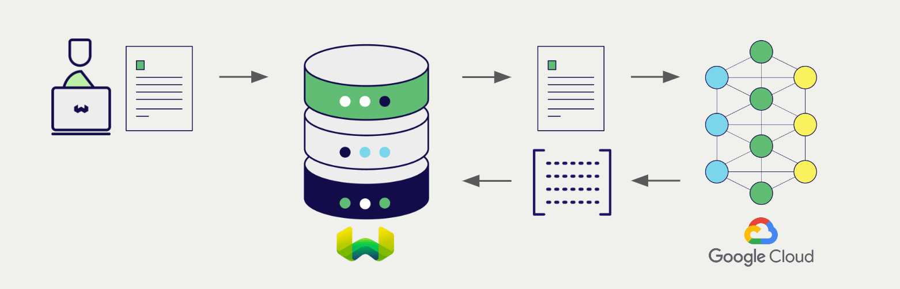

<!-- Note: for images, use https://docs.google.com/presentation/d/15opIcJuaIjEEcs_1Zm8B6pccox2p7_MHSjCnRv4dPfU/edit?usp=sharing -->

Google は、自然言語処理および生成のための幅広いモデルを提供しています。Weaviate は [Google Gemini API](https://ai.google.dev/?utm_source=weaviate&utm_medium=referral&utm_campaign=partnerships&utm_content=) と [Google Vertex AI](https://cloud.google.com/vertex-ai) の API とシームレスに統合されており、ユーザーは Google のモデルを Weaviate Database から直接利用できます。

これらの統合により、開発者は高度な AI 駆動アプリケーションを簡単に構築できます。

## Google との統合

### ベクトル検索向け埋め込みモデル

Google の埋め込みモデルは、テキストデータを意味と文脈を捉えたベクトル埋め込みに変換します。

[Weaviate は Google の埋め込みモデルと統合](./embeddings.md) しており、データのシームレスなベクトライゼーションを実現します。この統合により、追加の前処理やデータ変換を行わずに、セマンティック検索およびハイブリッド検索を実行できます。

[Google 埋め込み統合ページ](./embeddings.md)  
[Google マルチモーダル埋め込み統合ページ](./embeddings-multimodal.md)

### RAG 向け生成 AI モデル

Google の生成 AI モデルは、与えられたプロンプトとコンテキストに基づいて人間のようなテキストを生成できます。

[Weaviate の生成 AI 統合](./generative.md) を利用すると、Weaviate Database から直接検索拡張生成 (RAG) を実行できます。これにより、Weaviate の効率的なストレージと高速な検索機能を Google の生成 AI モデルと組み合わせ、パーソナライズされたコンテキスト対応の応答を生成します。

[Google 生成 AI 統合ページ](./generative.md)

## 概要

これらの統合により、開発者は Weaviate 内で Google の強力なモデルを直接活用できます。

その結果、AI 駆動アプリケーションの構築が簡素化され、開発プロセスが加速されるため、革新的なソリューションの創出に集中できます。

## 認証情報

これらの統合を利用するには、有効な Google API 認証情報を Weaviate に提供する必要があります。

### Vertex AI

##### 自動トークン生成

import UseGoogleAuthInstructions from './_includes/use_google_auth_instructions.mdx';

<UseGoogleAuthInstructions/>

## 開始方法

Weaviate は [Google Gemini API](https://aistudio.google.com/app/apikey/?utm_source=weaviate&utm_medium=referral&utm_campaign=partnerships&utm_content=) と [Google Vertex AI](https://cloud.google.com/vertex-ai) の両方と統合しています。

各統合ページで、Google モデルを Weaviate に設定し、アプリケーションでの利用を始める方法をご確認ください。

- [テキスト埋め込み](./embeddings.md)
- [マルチモーダル埋め込み](./embeddings-multimodal.md)
- [生成 AI](./generative.md)

## 質問とフィードバック

import DocsFeedback from '/_includes/docs-feedback.mdx';

<DocsFeedback/>

