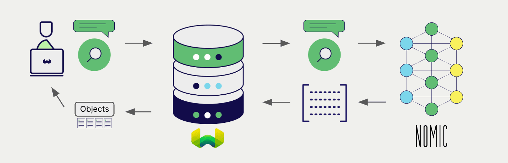

# Weaviate での GPT4All 埋め込み


import Tabs from '@theme/Tabs';
import TabItem from '@theme/TabItem';
import FilteredTextBlock from '@site/src/components/Documentation/FilteredTextBlock';
import PyConnect from '!!raw-loader!../_includes/provider.connect.local.py';
import TSConnect from '!!raw-loader!../_includes/provider.connect.local.ts';
import PyCode from '!!raw-loader!../_includes/provider.vectorizer.py';
import TSCode from '!!raw-loader!../_includes/provider.vectorizer.ts';

Weaviate と GPT4All のモデル統合により、Weaviate から直接それらのモデルの機能にアクセスできます。

GPT4All の埋め込みモデルを使用するように [Weaviate ベクトル インデックス](#configure-the-vectorizer) を設定すると、Weaviate は GPT4All 推論コンテナを介して指定したモデルを用い、さまざまな操作のために埋め込みを生成します。この機能は *ベクトライザー* と呼ばれます。

[インポート時](#data-import) に、Weaviate はテキストオブジェクトの埋め込みを生成し、インデックスに保存します。[ベクトル](#vector-near-text-search) 検索および [ハイブリッド](#hybrid-search) 検索では、テキストクエリを埋め込みに変換します。


このモジュールは `ggml` ライブラリを使用して CPU に最適化されており、GPU がなくても高速な推論が可能です。

## 要件

現在、GPT4All 統合は `amd64/x86_64` アーキテクチャのデバイスでのみ利用可能です。`gpt4all` ライブラリは Apple M シリーズなどの ARM デバイスをまだサポートしていないためです。

### Weaviate の設定

ご利用の Weaviate インスタンスには、GPT4All ベクトライザー統合（`text2vec-gpt4all` モジュール）を有効にしておく必要があります。

<details>
  <summary>Weaviate Cloud (WCD) をご利用の場合</summary>

この統合はローカルで動作する GPT4All インスタンスを必要とするため、Weaviate Cloud (WCD) のサーバーレス インスタンスでは利用できません。

</details>

<details>
  <summary>セルフホスト環境の場合</summary>

- モジュールが有効になっているかどうかを確認するには、[クラスター メタデータ](/deploy/configuration/meta.md) をご覧ください。  
- Weaviate でモジュールを有効にする方法は、[モジュール設定方法](../../configuration/modules.md) ガイドを参照してください。

</details>

#### 統合の設定

この統合を使用するには、GPT4All モデルのコンテナーイメージと、そのコンテナー化されたモデルの推論エンドポイントを設定する必要があります。

以下の例は、Weaviate で GPT4All 統合を設定する方法を示しています。

<Tabs groupId="languages">
<TabItem value="docker" label="Docker">

#### Docker オプション 1: 事前設定済みの `docker-compose.yml` を使用する

[Weaviate Docker インストール コンフィギュレーター](/deploy/installation-guides/docker-installation.md#configurator) の手順に従い、選択したモデルが設定された `docker-compose.yml` をダウンロードしてください。  
<br/>

#### Docker オプション 2: 手動で設定を追加する

あるいは、以下の例のように `docker-compose.yml` に設定を手動で追加します。

```yaml
services:
  weaviate:
    # Other Weaviate configuration
    environment:
      GPT4ALL_INFERENCE_API: http://text2vec-gpt4all:8080  # Set the inference API endpoint
  text2vec-gpt4all:  # Set the name of the inference container
    image: cr.weaviate.io/semitechnologies/gpt4all-inference:all-MiniLM-L6-v2
```

- `GPT4ALL_INFERENCE_API` 環境変数で推論 API エンドポイントを指定します  
- `text2vec-gpt4all` は推論コンテナーの名前です  
- `image` はコンテナー イメージです  

</TabItem>
<TabItem value="k8s" label="Kubernetes">

Weaviate の Helm チャートの `values.yaml` ファイルで、`modules` セクションに `text2vec-gpt4all` モジュールを追加または更新して GPT4All 統合を設定します。例として、`values.yaml` を以下のように変更します。

```yaml
modules:

  text2vec-gpt4all:

    enabled: true
    tag: all-MiniLM-L6-v2
    repo: semitechnologies/gpt4all-inference
    registry: cr.weaviate.io
```

より多くの設定オプションを含む `values.yaml` の例は、[Weaviate Helm チャート](https://github.com/weaviate/weaviate-helm/blob/master/weaviate/values.yaml) を参照してください。

</TabItem>
</Tabs>

### 認証情報

この統合はローカルの GPT4All コンテナーに接続するため、追加の認証情報（API キーなど）は不要です。以下の例のように通常どおり Weaviate に接続してください。

<Tabs groupId="languages">

 <TabItem value="py" label="Python API v4">
    <FilteredTextBlock
      text={PyConnect}
      startMarker="# START BasicInstantiation"
      endMarker="# END BasicInstantiation"
      language="py"
    />
  </TabItem>

 <TabItem value="js" label="JS/TS API v3">
    <FilteredTextBlock
      text={TSConnect}
      startMarker="// START BasicInstantiation"
      endMarker="// END BasicInstantiation"
      language="ts"
    />
  </TabItem>

</Tabs>

## ベクトライザーの設定

GPT4All 埋め込みモデルを使用するように [Weaviate インデックス](../../manage-collections/vector-config.mdx#specify-a-vectorizer) を設定します。

<Tabs groupId="languages">
  <TabItem value="py" label="Python API v4">
    <FilteredTextBlock
      text={PyCode}
      startMarker="# START BasicVectorizerGPT4All"
      endMarker="# END BasicVectorizerGPT4All"
      language="py"
    />
  </TabItem>

  <TabItem value="js" label="JS/TS API v3">
    <FilteredTextBlock
      text={TSCode}
      startMarker="// START BasicVectorizerGPT4All"
      endMarker="// END BasicVectorizerGPT4All"
      language="ts"
    />
  </TabItem>

</Tabs>

現在利用できるモデルは [`all-MiniLM-L6-v2`](https://huggingface.co/sentence-transformers/all-MiniLM-L6-v2) のみです。

import VectorizationBehavior from '/_includes/vectorization.behavior.mdx';

<details>
  <summary>ベクトル化の挙動</summary>

<VectorizationBehavior/>

</details>


## データインポート

ベクトライザーを設定した後、[データをインポート](../../manage-objects/import.mdx)して Weaviate に取り込みます。Weaviate は指定したモデルを使用してテキストオブジェクトの埋め込みを生成します。

<Tabs groupId="languages">

 <TabItem value="py" label="Python API v4">
    <FilteredTextBlock
      text={PyCode}
      startMarker="# START BatchImportExample"
      endMarker="# END BatchImportExample"
      language="py"
    />
  </TabItem>

 <TabItem value="js" label="JS/TS API v3">
    <FilteredTextBlock
      text={TSCode}
      startMarker="// START BatchImportExample"
      endMarker="// END BatchImportExample"
      language="ts"
    />
  </TabItem>

</Tabs>

:::tip 既存ベクトルの再利用
既に互換性のあるモデルベクトルをお持ちの場合は、それを直接 Weaviate に提供できます。これは同じモデルで埋め込みを生成済みで、他システムからデータ移行する際などに便利です。
:::

## 検索

ベクトライザーが設定されると、Weaviate は指定した GPT4All モデルを用いてベクトル検索およびハイブリッド検索を実行します。



### ベクトル（near text）検索

[ベクトル検索](../../search/similarity.md#search-with-text)を実行すると、Weaviate はテキストクエリを指定モデルで埋め込みに変換し、データベースから最も類似したオブジェクトを返します。

以下のクエリは、`limit` で指定された `n` 件の最も類似したオブジェクトを返します。

<Tabs groupId="languages">

 <TabItem value="py" label="Python API v4">
    <FilteredTextBlock
      text={PyCode}
      startMarker="# START NearTextExample"
      endMarker="# END NearTextExample"
      language="py"
    />
  </TabItem>

 <TabItem value="js" label="JS/TS API v3">
    <FilteredTextBlock
      text={TSCode}
      startMarker="// START NearTextExample"
      endMarker="// END NearTextExample"
      language="ts"
    />
  </TabItem>

</Tabs>

### ハイブリッド検索

:::info ハイブリッド検索とは？
ハイブリッド検索は、ベクトル検索とキーワード（BM25）検索を実行した後、それらを[組み合わせて結果を統合](../../search/hybrid.md)し、データベースから最適なオブジェクトを返します。
:::

[ハイブリッド検索](../../search/hybrid.md)を実行すると、Weaviate はテキストクエリを指定モデルで埋め込みに変換し、データベースから最適なスコアのオブジェクトを返します。

以下のクエリは、`limit` で指定された `n` 件の最も高スコアのオブジェクトを返します。

<Tabs groupId="languages">

 <TabItem value="py" label="Python API v4">
    <FilteredTextBlock
      text={PyCode}
      startMarker="# START HybridExample"
      endMarker="# END HybridExample"
      language="py"
    />
  </TabItem>

 <TabItem value="js" label="JS/TS API v3">
    <FilteredTextBlock
      text={TSCode}
      startMarker="// START HybridExample"
      endMarker="// END HybridExample"
      language="ts"
    />
  </TabItem>

</Tabs>

## 参考

<!-- #### Example configuration -->

<!-- Hiding "full" examples as no other parameters exist than shown above -->

<!-- <Tabs groupId="languages">
  <TabItem value="py" label="Python API v4">
    <FilteredTextBlock
      text={PyCode}
      startMarker="# START FullVectorizerGPT4All"
      endMarker="# END FullVectorizerGPT4All"
      language="py"
    />
  </TabItem>

  <TabItem value="js" label="JS/TS API v3">
    <FilteredTextBlock
      text={TSCode}
      startMarker="// START FullVectorizerGPT4All"
      endMarker="// END FullVectorizerGPT4All"
      language="ts"
    />
  </TabItem>

</Tabs> -->


### 利用可能なモデル

現在、利用可能なモデルは [`all-MiniLM-L6-v2`](https://huggingface.co/sentence-transformers/all-MiniLM-L6-v2) だけです。

## 追加リソース

### コード例

コレクションでインテグレーションを設定すると、 Weaviate のデータ管理と検索操作は他のコレクションとまったく同じになります。以下のモデル非依存の例をご覧ください。

- [How-to: コレクションの管理](../../manage-collections/index.mdx) と [How-to: オブジェクトの管理](../../manage-objects/index.mdx) のガイドでは、データ操作（コレクションおよびその内部のオブジェクトの作成、読み取り、更新、削除）の方法を説明しています。
- [How-to: クエリ & 検索](../../search/index.mdx) のガイドでは、ベクトル、キーワード、ハイブリッド検索、および検索拡張生成の実行方法を説明しています。

### 外部リソース

- [GPT4All ドキュメント](https://docs.gpt4all.io/)

## 質問とフィードバック

import DocsFeedback from '/_includes/docs-feedback.mdx';

<DocsFeedback/>

