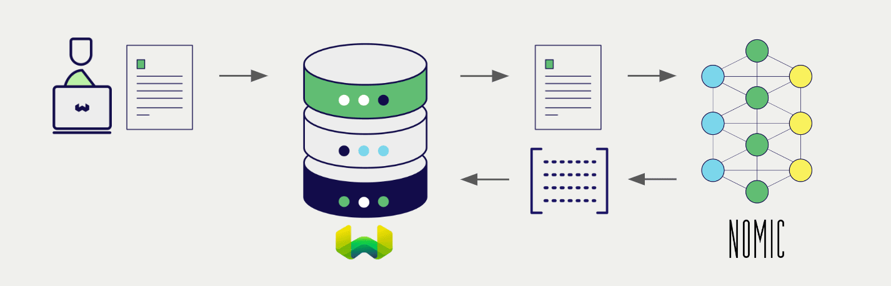

<!-- Note: for images, use https://docs.google.com/presentation/d/15opIcJuaIjEEcs_1Zm8B6pccox2p7_MHSjCnRv4dPfU/edit?usp=sharing -->

:::caution 非推奨の統合
この統合は非推奨で、今後のリリースで削除される予定です。新しいプロジェクトでは、他のモデルプロバイダーの利用をおすすめします。

ローカル AI モデルの統合には、[Ollama](../ollama/index.md) または [ローカル HuggingFace](../huggingface/index.md) のモデル統合をご検討ください。
:::

GPT4All ライブラリを使用すると、幅広いモデルを簡単にローカルデバイス上で実行できます。Weaviate は GPT4All ライブラリとシームレスに統合されており、ユーザーは互換性のあるモデルを Weaviate Database から直接利用できます。

これらの統合により、開発者は高度な AI ドリブンアプリケーションを容易に構築できます。

## GPT4All との統合

Weaviate は、ローカルでホストされた GPT4All API にアクセスすることで、互換性のある GPT4All モデルと統合します。

### ベクトル検索用埋め込みモデル

GPT4All の埋め込みモデルは、テキストデータをベクトル埋め込みに変換し、意味とコンテキストを捉えます。

[Weaviate は GPT4All の埋め込みモデルと統合](./embeddings.md) しており、データのシームレスなベクトル化を実現します。この統合により、追加の前処理やデータ変換を行わずに、セマンティック検索やハイブリッド検索を実行できます。

[GPT4All 埋め込み統合ページ](./embeddings.md)

## 概要

これらの統合により、開発者は Weaviate から直接強力な GPT4All モデルを活用できます。

その結果、AI ドリブンアプリケーションの構築プロセスが簡素化され、開発を加速し、革新的なソリューションの創出に集中できます。

## はじめに

これらの統合を利用するには、ローカルでホストされた Weaviate インスタンスが必要です。自身の GPT4All モデルをホストしてください。

該当する統合ページで、Weaviate を GPT4All モデルと連携させる方法を学び、アプリケーションで使用を開始しましょう。

- [テキスト埋め込み](./embeddings.md)

## 質問とフィードバック

import DocsFeedback from '/_includes/docs-feedback.mdx';

<DocsFeedback/>

