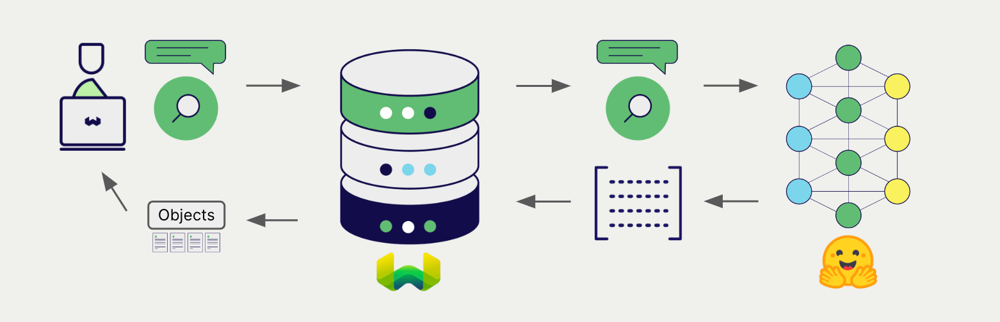

# Weaviate と Hugging Face の埋め込み

import Tabs from '@theme/Tabs';
import TabItem from '@theme/TabItem';
import FilteredTextBlock from '@site/src/components/Documentation/FilteredTextBlock';
import PyConnect from '!!raw-loader!../_includes/provider.connect.py';
import TSConnect from '!!raw-loader!../_includes/provider.connect.ts';
import GoConnect from '!!raw-loader!/_includes/code/howto/go/docs/model-providers/1-connect/main.go';
import PyCode from '!!raw-loader!../_includes/provider.vectorizer.py';
import TSCode from '!!raw-loader!../_includes/provider.vectorizer.ts';
import GoCode from '!!raw-loader!/_includes/code/howto/go/docs/model-providers/2-usage-text/main.go';

Weaviate の Hugging Face API との統合により、Weaviate から直接モデルの機能にアクセスできます。

[Weaviate の ベクトル インデックスを設定](#configure-the-vectorizer) して Hugging Face Hub の埋め込みモデルを使用すると、Weaviate は指定したモデルと Hugging Face API キーを使用して各種操作のための埋め込みを生成します。この機能は *vectorizer* と呼ばれます。

[インポート時](#data-import) に、Weaviate はテキストオブジェクトの埋め込みを生成し、インデックスに保存します。[ベクトル](#vector-near-text-search) 検索および [ハイブリッド](#hybrid-search) 検索操作では、Weaviate はテキストクエリを埋め込みに変換します。

## 要件

### Weaviate の設定

お使いの Weaviate インスタンスは、Hugging Face ベクトライザー統合（`text2vec-huggingface`）モジュールが有効になっている必要があります。

  
For Weaviate Cloud (WCD) users

この統合は Weaviate Cloud (WCD) のサーバーレス インスタンスではデフォルトで有効になっています。

  
For self-hosted users

- [クラスターメタデータ](/deploy/configuration/meta.md) を確認し、モジュールが有効かどうかを確認します。  
- [モジュールの設定方法](../../configuration/modules.md) ガイドに従い、Weaviate でモジュールを有効にします。

### API 認証情報

この統合を使用するには、Weaviate に有効な Hugging Face API キーを渡す必要があります。API キーの取得方法は [Hugging Face](https://huggingface.co/docs/api-inference/en/quicktour) を参照してください。

以下のいずれかの方法で Weaviate に API キーを提供します。

- Weaviate から参照できる `HUGGINGFACE_APIKEY` 環境変数を設定します。  
- 下記の例のように、実行時に API キーを渡します。

<Tabs groupId="languages">

 <TabItem value="py" label="Python API v4">
    <FilteredTextBlock
      text={PyConnect}
      startMarker="# START HuggingFaceInstantiation"
      endMarker="# END HuggingFaceInstantiation"
      language="py"
    />
  </TabItem>

 <TabItem value="js" label="JS/TS API v3">
    <FilteredTextBlock
      text={TSConnect}
      startMarker="// START HuggingFaceInstantiation"
      endMarker="// END HuggingFaceInstantiation"
      language="ts"
    />
  </TabItem>

  <TabItem value="go" label="Go">
    <FilteredTextBlock
      text={GoConnect}
      startMarker="// START HuggingFaceInstantiation"
      endMarker="// END HuggingFaceInstantiation"
      language="goraw"
    />
  </TabItem>
</Tabs>

## ベクトライザーの設定

以下のように [Weaviate インデックスを設定](../../manage-collections/vector-config.mdx#specify-a-vectorizer) し、Hugging Face の埋め込みモデルを使用します。

<Tabs groupId="languages">
  <TabItem value="py" label="Python API v4">
    <FilteredTextBlock
      text={PyCode}
      startMarker="# START BasicVectorizerHuggingFace"
      endMarker="# END BasicVectorizerHuggingFace"
      language="py"
    />
  </TabItem>

  <TabItem value="js" label="JS/TS API v3">
    <FilteredTextBlock
      text={TSCode}
      startMarker="// START BasicVectorizerHuggingFace"
      endMarker="// END BasicVectorizerHuggingFace"
      language="ts"
    />
  </TabItem>

  <TabItem value="go" label="Go">
    <FilteredTextBlock
      text={GoCode}
      startMarker="// START BasicVectorizerHuggingFace"
      endMarker="// END BasicVectorizerHuggingFace"
      language="goraw"
    />
  </TabItem>
</Tabs>

ベクトライザーで使用する [利用可能なモデル](#available-models) のいずれかを指定する必要があります。

import VectorizationBehavior from '/_includes/vectorization.behavior.mdx';

  
ベクトル化の挙動

<VectorizationBehavior/>

### ベクトライザー パラメーター

以下の例では、Hugging Face 固有のオプションの設定方法を示します。

<Tabs groupId="languages">
  <TabItem value="py" label="Python API v4">
    <FilteredTextBlock
      text={PyCode}
      startMarker="# START FullVectorizerHuggingFace"
      endMarker="# END FullVectorizerHuggingFace"
      language="py"
    />
  </TabItem>

  <TabItem value="js" label="JS/TS API v3">
    <FilteredTextBlock
      text={TSCode}
      startMarker="// START FullVectorizerHuggingFace"
      endMarker="// END FullVectorizerHuggingFace"
      language="ts"
    />
  </TabItem>

 <TabItem value="go" label="Go">
    <FilteredTextBlock
      text={GoCode}
      startMarker="// START FullVectorizerHuggingFace"
      endMarker="// END FullVectorizerHuggingFace"
      language="goraw"
    />
  </TabItem>

</Tabs>

#### モデル選択パラメーター

モデルを指定するには、次のパラメーターのうち 1 つだけを選択してください:

- `model`
- `passageModel` と `queryModel`
- `endpointURL`

:::note `model`、`passageModel`/`queryModel` と `endpointURL` の違い
`passageModel` と `queryModel` パラメーターは組み合わせて使用し、[DPR](https://huggingface.co/docs/transformers/en/model_doc/dpr) の passage モデルと query モデルを指定します。

`endpointURL` パラメーターは、[カスタム Hugging Face Inference Endpoint](https://huggingface.co/inference-endpoints) を指定するために使用します。このパラメーターを設定すると、`model`、`passageModel`、`queryModel` の各パラメーターより優先されます。
:::

#### 追加パラメーター

- `options.waitForModel`：モデルが準備完了でない場合、`503` エラーを返す代わりに準備が整うまで待機します。  
- `options.useGPU`：ご利用の [アカウント プラン](https://huggingface.co/inference-api#pricing) が対応している場合、推論に GPU を使用します。  
- `options.useCache`：キャッシュがある場合はそれを利用します。（非決定的なモデルではキャッシュ メカニズムを無効にする際に使用します。）

## データ インポート

ベクトライザーを設定したら、Weaviate に [データをインポート](../../manage-objects/import.mdx) します。Weaviate は指定されたモデルを使用してテキスト オブジェクトの埋め込みを生成します。

<Tabs groupId="languages">

 <TabItem value="py" label="Python API v4">
    <FilteredTextBlock
      text={PyCode}
      startMarker="# START BatchImportExample"
      endMarker="# END BatchImportExample"
      language="py"
    />
  </TabItem>

 <TabItem value="js" label="JS/TS API v3">
    <FilteredTextBlock
      text={TSCode}
      startMarker="// START BatchImportExample"
      endMarker="// END BatchImportExample"
      language="ts"
    />
  </TabItem>

  <TabItem value="go" label="Go">
    <FilteredTextBlock
      text={GoCode}
      startMarker="// START BatchImportExample"
      endMarker="// END BatchImportExample"
      language="goraw"
    />
  </TabItem>
</Tabs>

:::tip 既存ベクトルの再利用
既に互換性のあるモデル ベクトルをお持ちの場合、それを Weaviate に直接提供できます。これは、同じモデルを使用して埋め込みを生成済みで、それらを Weaviate で再利用したい場合、たとえば別システムからデータを移行する際に便利です。
:::

## 検索

ベクトライザーが設定されると、Weaviate は指定された Hugging Face モデルを使用してベクトル検索およびハイブリッド検索を実行します。

### ベクトル (near text) 検索

[ベクトル検索](../../search/similarity.md#search-with-text) を行うと、Weaviate はテキスト クエリを指定モデルで埋め込みに変換し、データベースから最も類似したオブジェクトを返します。

次のクエリは、`limit` で指定した件数 `n` の最も類似したオブジェクトを返します。

<Tabs groupId="languages">

 <TabItem value="py" label="Python API v4">
    <FilteredTextBlock
      text={PyCode}
      startMarker="# START NearTextExample"
      endMarker="# END NearTextExample"
      language="py"
    />
  </TabItem>

 <TabItem value="js" label="JS/TS API v3">
    <FilteredTextBlock
      text={TSCode}
      startMarker="// START NearTextExample"
      endMarker="// END NearTextExample"
      language="ts"
    />
  </TabItem>

 <TabItem value="go" label="Go">
    <FilteredTextBlock
      text={GoCode}
      startMarker="// START NearTextExample"
      endMarker="// END NearTextExample"
      language="goraw"
    />
  </TabItem>
</Tabs>

### ハイブリッド検索

:::info ハイブリッド検索とは？
ハイブリッド検索は、ベクトル検索とキーワード (BM25) 検索を実行し、その結果を [結合](../../search/hybrid.md) してデータベースから最も一致するオブジェクトを返します。
:::

[ハイブリッド検索](../../search/hybrid.md) を実行すると、Weaviate はテキストクエリを指定したモデルで埋め込みに変換し、データベースから最も高いスコアのオブジェクトを返します。

以下のクエリは、`limit` で設定されたデータベース内の `n` 件の最もスコアが高いオブジェクトを返します。

<Tabs groupId="languages">

 <TabItem value="py" label="Python API v4">
    <FilteredTextBlock
      text={PyCode}
      startMarker="# START HybridExample"
      endMarker="# END HybridExample"
      language="py"
    />
  </TabItem>

 <TabItem value="js" label="JS/TS API v3">
    <FilteredTextBlock
      text={TSCode}
      startMarker="// START HybridExample"
      endMarker="// END HybridExample"
      language="ts"
    />
  </TabItem>

 <TabItem value="go" label="Go">
    <FilteredTextBlock
      text={GoCode}
      startMarker="// START HybridExample"
      endMarker="// END HybridExample"
      language="goraw"
    />
  </TabItem>
</Tabs>

## 参照

### 利用可能なモデル

`text2vec-huggingface` では、パブリックおよびプライベートの Hugging Face モデルを含む任意の Hugging Face 埋め込みモデルを使用できます。一般的に、[Sentence similarity モデル](https://huggingface.co/models?pipeline_tag=sentence-similarity&sort=downloads) が最も良い結果をもたらします。

## 追加リソース

- [Hugging Face 連携 (ローカルホスト)](../transformers/index.md)

### コード例

連携をコレクションで設定すると、Weaviate のデータ管理および検索操作は他のコレクションと同じように機能します。以下のモデル非依存の例をご覧ください。

- [How-to: コレクションを管理する](../../manage-collections/index.mdx) と [How-to: オブジェクトを管理する](../../manage-objects/index.mdx) では、コレクションおよびその中のオブジェクトを作成・読み取り・更新・削除する方法を示しています。
- [How-to: 検索 & クエリ](../../search/index.mdx) では、ベクトル、キーワード、ハイブリッド検索に加え、検索拡張生成の方法を解説しています。

### 外部リソース

- Hugging Face [Inference API ドキュメント](https://huggingface.co/docs/api-inference/en/quicktour)
- Hugging Face [Model Hub](https://huggingface.co/models)

## 質問とフィードバック

import DocsFeedback from '/_includes/docs-feedback.mdx';

<DocsFeedback/>

