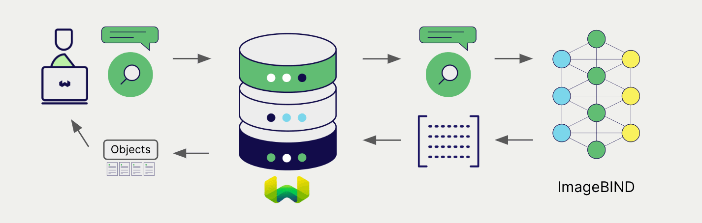

# ローカルホスト ImageBind 埋め込み + Weaviate


import Tabs from '@theme/Tabs';
import TabItem from '@theme/TabItem';
import FilteredTextBlock from '@site/src/components/Documentation/FilteredTextBlock';
import PyConnect from '!!raw-loader!../_includes/provider.connect.local.py';
import TSConnect from '!!raw-loader!../_includes/provider.connect.local.ts';
import PyCode from '!!raw-loader!../_includes/provider.vectorizer.py';
import TSCode from '!!raw-loader!../_includes/provider.vectorizer.ts';

Weaviate の Meta ImageBind ライブラリとの統合により、 ImageBind の機能を Weaviate から直接利用できます。 ImageBind モデルは複数のモダリティ（テキスト、画像、音声、動画、サーマル、 IMU、深度）をサポートします。

[ベクトル化を設定](#configure-the-vectorizer)して ImageBind 統合を使用し、[Weaviate インスタンスを設定](#weaviate-configuration)してモデルイメージを指定すると、 Weaviate は ImageBind 推論コンテナ内の指定モデルを用いて各種操作の埋め込みを生成します。この機能は *ベクトライザー* と呼ばれます。

[インポート時](#data-import)には、 Weaviate がマルチモーダルオブジェクト埋め込みを生成し、インデックスに保存します。 [ベクトル](#vector-near-text-search) および [ハイブリッド](#hybrid-search) 検索操作では、 Weaviate が 1 つ以上のモダリティのクエリを埋め込みに変換します。 [マルチモーダル検索操作](#vector-near-media-search) もサポートされています。



## 必要条件

### Weaviate 設定

お使いの Weaviate インスタンスは、 ImageBind マルチモーダル ベクトライザー統合（`multi2vec-bind`）モジュールを有効にしている必要があります。

<details>
  <summary>Weaviate Cloud (WCD) ユーザー向け</summary>

この統合は ImageBind モデルを含むコンテナを起動する必要があるため、 Weaviate Cloud (WCD) のサーバーレスインスタンスでは利用できません。

</details>

#### 統合モジュールの有効化

- モジュールが有効になっているかを確認するには、[クラスターメタデータ](/deploy/configuration/meta.md) を確認してください。
- Weaviate でモジュールを有効化するには、[モジュール設定方法](../../configuration/modules.md) ガイドに従ってください。

#### 統合の設定

この統合を使用するには、 ImageBind モデルのコンテナイメージと、その推論エンドポイントを設定する必要があります。

以下は Weaviate で ImageBind 統合を設定する例です。

<Tabs groupId="languages">
<TabItem value="docker" label="Docker">

#### Docker オプション 1: 事前設定済み `docker-compose.yml` を使用

[Weaviate Docker インストールコンフィギュレーター](/deploy/installation-guides/docker-installation.md#configurator) の手順に従い、選択したモデルを含む事前設定済み `docker-compose.yml` ファイルをダウンロードしてください。
<br/>

#### Docker オプション 2: 手動で設定を追加

または、下記の例のように `docker-compose.yml` ファイルへ手動で設定を追加します。

```yaml
services:
  weaviate:
    # Other Weaviate configuration
    environment:
      BIND_INFERENCE_API: http://multi2vec-bind:8080  # Set the inference API endpoint
  multi2vec-bind:  # Set the name of the inference container
    mem_limit: 12g
    image: cr.weaviate.io/semitechnologies/multi2vec-bind:imagebind
    environment:
      ENABLE_CUDA: 0  # Set to 1 to enable
```

- `BIND_INFERENCE_API` 環境変数で推論 API エンドポイントを指定します
- `multi2vec-bind` は推論コンテナの名前です
- `image` はコンテナイメージです
- `ENABLE_CUDA` 環境変数で GPU 使用を有効化します

</TabItem>
<TabItem value="k8s" label="Kubernetes">

Weaviate Helm チャートの `values.yaml` ファイルで `modules` セクションに `multi2vec-bind` モジュールを追加または更新し、 ImageBind 統合を設定します。例として、 `values.yaml` を以下のように修正します。

```yaml
modules:

  multi2vec-bind:

    enabled: true
    tag: imagebind
    repo: semitechnologies/multi2vec-bind
    registry: cr.weaviate.io
    envconfig:
      enable_cuda: true
```

より多くの設定オプションを含む `values.yaml` の例については、[Weaviate Helm チャート](https://github.com/weaviate/weaviate-helm/blob/master/weaviate/values.yaml) を参照してください。

</TabItem>
</Tabs>

### 認証情報

この統合は ImageBind モデルを含むローカルコンテナを起動するため、追加の認証情報（例: API キー）は不要です。以下の例のように通常どおり Weaviate に接続してください。

<Tabs groupId="languages">

 <TabItem value="py" label="Python API v4">
    <FilteredTextBlock
      text={PyConnect}
      startMarker="# START BasicInstantiation"
      endMarker="# END BasicInstantiation"
      language="py"
    />
  </TabItem>

 <TabItem value="js" label="JS/TS API v3">
    <FilteredTextBlock
      text={TSConnect}
      startMarker="// START BasicInstantiation"
      endMarker="// END BasicInstantiation"
      language="ts"
    />
  </TabItem>

</Tabs>

## ベクトライザーの設定

ImageBind 埋め込みモデルを使用するように、[Weaviate インデックスを設定](../../manage-collections/vector-config.mdx#specify-a-vectorizer)します。

<Tabs groupId="languages">
  <TabItem value="py" label="Python API v4">
    <FilteredTextBlock
      text={PyCode}
      startMarker="# START BasicMMVectorizerBind"
      endMarker="# END BasicMMVectorizerBind"
      language="py"
    />
  </TabItem>

  <TabItem value="js" label="JS/TS API v3">
    <FilteredTextBlock
      text={TSCode}
      startMarker="// START BasicMMVectorizerBind"
      endMarker="// END BasicMMVectorizerBind"
      language="ts"
    />
  </TabItem>

</Tabs>

利用可能な ImageBind モデルは 1 つのみです。

import VectorizationBehavior from '/_includes/vectorization.behavior.mdx';

<details>
  <summary>ベクトル化の挙動</summary>

<VectorizationBehavior/>

</details>


### ベクトライザーのパラメーター

ImageBind ベクトライザーは複数のモダリティ（テキスト、画像、音声、動画、サーマル、IMU、深度）をサポートします。以下のように、これらのうち 1 つ以上をベクトライザー設定で指定できます。

<Tabs groupId="languages">
  <TabItem value="py" label="Python API v4">
    <FilteredTextBlock
      text={PyCode}
      startMarker="# START FullMMVectorizerBind"
      endMarker="# END FullMMVectorizerBind"
      language="py"
    />
  </TabItem>

  <TabItem value="js" label="JS/TS API v3">
    <FilteredTextBlock
      text={TSCode}
      startMarker="// START FullMMVectorizerBind"
      endMarker="// END FullMMVectorizerBind"
      language="ts"
    />
  </TabItem>

</Tabs>

## データインポート

ベクトライザーを設定したら、Weaviate に [データをインポート](../../manage-objects/import.mdx) します。Weaviate は指定したモデルを使用してオブジェクトの埋め込みを生成します。

<Tabs groupId="languages">

 <TabItem value="py" label="Python API v4">
    <FilteredTextBlock
      text={PyCode}
      startMarker="# START MMBatchImportExample"
      endMarker="# END MMBatchImportExample"
      language="py"
    />
  </TabItem>

 <TabItem value="js" label="JS/TS API v3">
    <FilteredTextBlock
      text={TSCode}
      startMarker="// START MMBatchImportExample"
      endMarker="// END MMBatchImportExample"
      language="ts"
    />
  </TabItem>

</Tabs>

:::tip 既存ベクトルの再利用
すでに互換性のあるモデルベクトルをお持ちの場合は、それを Weaviate に直接渡すことができます。すでに同じモデルで埋め込みを生成しており、別のシステムからデータを移行する際などに便利です。
:::

## 検索

ベクトライザーの設定が完了すると、Weaviate は指定した ImageBind モデルを使用して ベクトル検索 とハイブリッド検索を実行します。


### ベクトル（near text）検索

[ベクトル検索](../../search/similarity.md#search-with-text) を実行すると、Weaviate はテキストクエリを指定したモデルで埋め込みに変換し、データベースから最も類似したオブジェクトを返します。

次のクエリは、`limit` で設定した数 `n` 件の最も類似したオブジェクトをデータベースから返します。

<Tabs groupId="languages">

 <TabItem value="py" label="Python API v4">
    <FilteredTextBlock
      text={PyCode}
      startMarker="# START NearTextExample"
      endMarker="# END NearTextExample"
      language="py"
    />
  </TabItem>

 <TabItem value="js" label="JS/TS API v3">
    <FilteredTextBlock
      text={TSCode}
      startMarker="// START NearTextExample"
      endMarker="// END NearTextExample"
      language="ts"
    />
  </TabItem>

</Tabs>

### ハイブリッド検索

:::info ハイブリッド検索とは？
ハイブリッド検索は ベクトル検索 とキーワード（BM25）検索を行い、その結果を [組み合わせて](../../search/hybrid.md) データベースから最適なオブジェクトを返します。
:::

[ハイブリッド検索](../../search/hybrid.md) を実行すると、Weaviate はテキストクエリを指定したモデルで埋め込みに変換し、データベースから最もスコアの高いオブジェクトを返します。

次のクエリは、`limit` で設定した数 `n` 件の最もスコアが高いオブジェクトをデータベースから返します。

<Tabs groupId="languages">

 <TabItem value="py" label="Python API v4">
    <FilteredTextBlock
      text={PyCode}
      startMarker="# START HybridExample"
      endMarker="# END HybridExample"
      language="py"
    />
  </TabItem>

 <TabItem value="js" label="JS/TS API v3">
    <FilteredTextBlock
      text={TSCode}
      startMarker="// START HybridExample"
      endMarker="// END HybridExample"
      language="ts"
    />
  </TabItem>

</Tabs>

### ベクトル ( near メディア ) 検索

メディア検索（例えば [near image 検索](../../search/similarity.md#search-with-image)）を実行すると、Weaviate はクエリを指定モデルで埋め込みに変換し、データベースから最も類似したオブジェクトを返します。

near メディア検索（near image 検索など）を実行するには、メディアクエリを base64 文字列に変換し、それを検索クエリに渡します。

以下のクエリは、`limit` で設定された件数、つまり入力画像に最も類似した `n` 件のオブジェクトをデータベースから返します。

<Tabs groupId="languages">

 <TabItem value="py" label="Python API v4">
    <FilteredTextBlock
      text={PyCode}
      startMarker="# START NearImageExample"
      endMarker="# END NearImageExample"
      language="py"
    />
  </TabItem>

 <TabItem value="js" label="JS/TS API v3">
    <FilteredTextBlock
      text={TSCode}
      startMarker="// START NearImageExample"
      endMarker="// END NearImageExample"
      language="ts"
    />
  </TabItem>

</Tabs>

同様の検索は、オーディオ、ビデオ、サーマル、IMU、デプスなど他のメディアタイプについても、対応する検索クエリを使用して実行できます。

## 参照

### 利用可能なモデル

利用可能な ImageBind モデルは 1 つだけです。

## 追加リソース

### コード例

インテグレーションをコレクションで設定すると、Weaviate でのデータ管理および検索操作は他のコレクションとまったく同じように機能します。以下のモデル非依存の例をご覧ください。

- [How-to: コレクションの管理](../../manage-collections/index.mdx) と [How-to: オブジェクトの管理](../../manage-objects/index.mdx) ガイドでは、データ操作（コレクションおよびその内部のオブジェクトの作成、読み取り、更新、削除）を実行する方法を示しています。
- [How-to: クエリ & 検索](../../search/index.mdx) ガイドでは、検索操作（ベクトル、キーワード、ハイブリッド）および検索拡張生成を実行する方法を説明しています。

### モデルライセンス

[ImageBind ページ](https://github.com/facebookresearch/ImageBind)でモデルのライセンスを確認してください。

そのライセンス条件がご自身の用途に適切かどうかを評価する責任は、利用者にあります。

### 外部リソース

- [ImageBind GitHub ページ](https://github.com/facebookresearch/ImageBind)

## 質問とフィードバック

import DocsFeedback from '/_includes/docs-feedback.mdx';

<DocsFeedback/>

