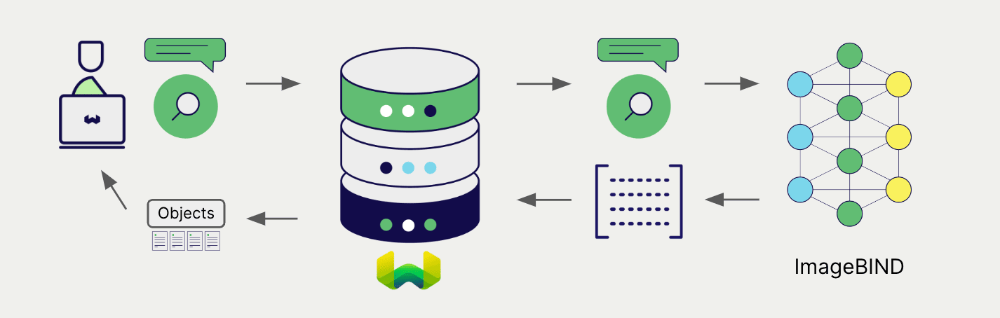

<!-- Note: for images, use https://docs.google.com/presentation/d/15opIcJuaIjEEcs_1Zm8B6pccox2p7_MHSjCnRv4dPfU/edit?usp=sharing -->

Meta の ImageBind ライブラリは、自然言語処理向けの幅広いモデルで利用できます。Weaviate は ImageBind ライブラリとシームレスに統合されており、ユーザーは Weaviate Database から互換性のあるモデルを直接利用できます。

これらの統合により、開発者は高度な AI 駆動型アプリケーションを簡単に構築できます。

## ImageBind との統合

Weaviate はコンテナ内で ImageBind モデルを起動することで統合を実現しています。これにより、ユーザーは独自のモデルをホストし、Weaviate と一緒に利用できます。

### ベクトル検索用の埋め込みモデル

ImageBind の埋め込みモデルは、マルチモーダルデータをベクトル埋め込みに変換し、その意味とコンテキストを捉えます。

[Weaviate は ImageBind の埋め込みモデルと統合](./embeddings-multimodal.md)し、データのシームレスなベクトル化を可能にします。この統合により、追加の前処理やデータ変換を行うことなく、セマンティック検索やハイブリッド検索を実行できます。

[ImageBind 埋め込み統合ページ](./embeddings-multimodal.md)

## 概要

これらの統合により、開発者は Weaviate 内から直接強力な ImageBind モデルを活用できます。

その結果、AI 駆動型アプリケーションの開発プロセスが簡素化され、イノベーティブなソリューションの創造に集中できます。

## 開始方法

これらの統合を利用するには、ローカルホストの Weaviate インスタンスが必要です。これにより、ご自身の ImageBind モデルをホストできます。

該当の統合ページにアクセスし、ImageBind モデルで Weaviate を構成する方法を学び、アプリケーションで利用を開始してください。

- [マルチモーダル埋め込み](./embeddings-multimodal.md)

## 質問とフィードバック

import DocsFeedback from '/_includes/docs-feedback.mdx';

<DocsFeedback/>

