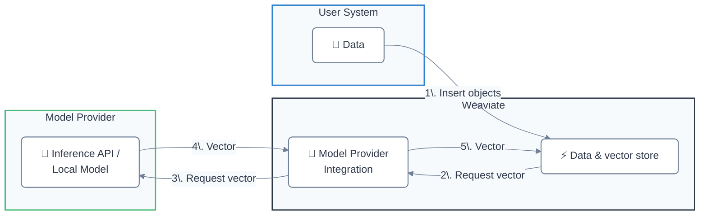

Weaviate は、さまざまなプロバイダーが提供する [セルフホスト型](#locally-hosted) と [API ベース](#api-based) のモデルと統合できます。

これにより、次のような開発体験が向上します。  
- 埋め込みを手動で指定せずに、オブジェクトを Weaviate へ直接インポートできる  
- 生成 AI モデルと連携した 検索拡張生成 ( RAG ) パイプラインを構築できる  

## モデル プロバイダー統合

### API ベース

| Model provider | 埋め込み | 生成 AI | その他 |
| --- | --- | --- | --- |
| [Anthropic](./anthropic/index.md) | - | [Text](./anthropic/generative.md) | - |
| [Anyscale](./anyscale/index.md) | - | [Text](./anyscale/generative.md) | - |
| [AWS](./aws/index.md) | [Text](./aws/embeddings.md) | [Text](./aws/generative.md) |
| [Cohere](./cohere/index.md) | [Text](./cohere/embeddings.md), [Multimodal](./cohere/embeddings-multimodal.md) | [Text](./cohere/generative.md) | [Reranker](./cohere/reranker.md) |
| [Databricks](./databricks/index.md) | [Text](./databricks/embeddings.md) | [Text](./databricks/generative.md) | - |
| [FriendliAI](./friendliai/index.md) | - | [Text](./friendliai/generative.md) | - |
| [Google](./google/index.md) | [Text](./google/embeddings.md), [Multimodal](./google/embeddings-multimodal.md) | [Text](./google/generative.md) | - |
| [Hugging Face](./huggingface/index.md) | [Text](./huggingface/embeddings.md) | - | - |
| [Jina AI](./jinaai/index.md) | [Text](./jinaai/embeddings.md), [Multimodal](./jinaai/embeddings-multimodal.md) | - | [Reranker](./jinaai/reranker.md) |
| [Mistral](./mistral/index.md) | [Text](./mistral/embeddings.md) | [Text](./mistral/generative.md) | - |
| [NVIDIA](./nvidia/index.md) | [Text](./nvidia/embeddings.md), [Multimodal](./nvidia/embeddings-multimodal.md) | [Text](./nvidia/generative.md) | [Reranker](./nvidia/reranker.md) |
| [OctoAI (Deprecated)](./octoai/index.md) | [Text](./octoai/embeddings.md) | [Text](./octoai/generative.md) | - |
| [OpenAI](./openai/index.md) | [Text](./openai/embeddings.md) | [Text](./openai/generative.md) | - |
| [Azure OpenAI](./openai-azure/index.md) | [Text](./openai-azure/embeddings.md) | [Text](./openai-azure/generative.md) | - |
| [Voyage AI](./voyageai/index.md) | [Text](./voyageai/embeddings.md), [Multimodal](./voyageai/embeddings-multimodal.md) | - | [Reranker](./voyageai/reranker.md) |
| [Weaviate](./weaviate/index.md) | [Text](./weaviate/embeddings.md) | - | - |
| [xAI](./xai/index.md) | - | [Text](./xai/generative.md) | - |

#### すべての API ベース モジュールを有効化

:::caution Experimental feature
Available starting in `v1.26.0`. This is an experimental feature. Use with caution.
:::

[環境変数 `ENABLE_API_BASED_MODULES` を `true` に設定](../configuration/modules.md#enable-all-api-based-modules) することで、すべての API ベース統合を一度に有効化できます。

これにより、Anthropic、Cohere、OpenAI などの API ベースモデル統合がすべて使用可能になります。これらのモジュールは軽量なため、すべてを有効にしてもリソース使用量は大きく増加しません。

[すべての API ベース モジュールを有効化する方法](../configuration/modules.md#enable-all-api-based-modules) を参照してください。

### セルフホスト型

| Model provider | 埋め込み | 生成 AI | その他 |
| --- | --- | --- | --- |
| [GPT4All (Deprecated)](./gpt4all/index.md) | [Text (Deprecated)](./gpt4all/embeddings.md) | - | - |
| [Hugging Face](./transformers/index.md) | [Text](./transformers/embeddings.md), [Multimodal (CLIP)](./transformers/embeddings-multimodal.md) | - | [Reranker](./transformers/reranker.md) |
| [KubeAI](./kubeai/index.md) | [Text](./kubeai/embeddings.md) | - | - |
| [Model2vec](./model2vec/index.md) | [Text](./model2vec/embeddings.md) | - | - |
| [Meta ImageBind](./imagebind/index.md) | [Multimodal](./imagebind/embeddings-multimodal.md) | - | - |
| [Ollama](./ollama/index.md) | [Text](./ollama/embeddings.md) | [Text](./ollama/generative.md) | - |

## Weaviate はどのように埋め込みを生成しますか？

埋め込み用のモデル プロバイダー統合が有効になっている場合、データベースに追加されたオブジェクトに対して Weaviate が自動的に埋め込みを生成します。

これは、ソース データを統合プロバイダーに送信し、プロバイダーが生成した埋め込みを Weaviate に返し、最終的に埋め込みが Weaviate データベースに保存されるという流れです。

Weaviate がオブジェクトの埋め込みを生成する手順は次のとおりです。

- スキップ設定されていない限り、データ型が `text` または `text[]` のプロパティを選択する
- 値を連結する前に、プロパティをアルファベット順 (a-z) に並べ替える
- 設定されている場合はコレクション名を先頭に付加する

:::note 大文字小文字の扱い
Weaviate バージョン `v1.27` より前では、上記で作成された文字列はモデル プロバイダーに送信される前にすべて小文字化されます。`v1.27` 以降では、変換せずそのまま送信されます。

テキストを小文字化したい場合は、環境変数 `LOWERCASE_VECTORIZATION_INPUT` を設定してください。  
`text2vec-contextionary` 統合では、常に小文字化されます。
:::

## 質問とフィードバック

import DocsFeedback from '/_includes/docs-feedback.mdx';

<DocsFeedback/>

