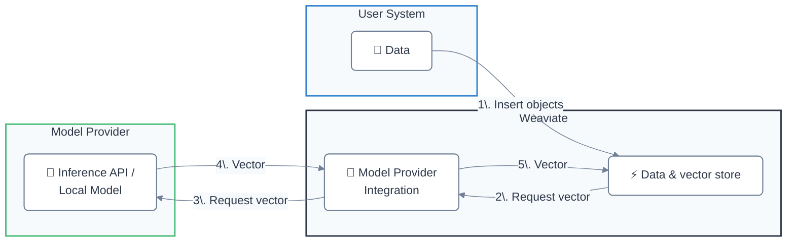

Weaviate は、さまざまなプロバイダーが提供する [自己ホスト型](#locally-hosted) と [API ベース](#api-based) のモデルに対応しています。

これにより、例えば次のような開発体験が向上します:
- ベクトルを手動で指定することなく、オブジェクトを Weaviate に直接インポートできる  
- 生成 AI モデルを用いた統合型の 検索拡張生成 (RAG) パイプラインを構築できる

## モデルプロバイダー連携

### API ベース

| モデルプロバイダー | Embeddings | 生成 AI | その他 |
| --- | --- | --- | --- |
| [Anthropic](./anthropic/index.md) | - | [テキスト](./anthropic/generative.md) | - |
| [Anyscale](./anyscale/index.md) | - | [テキスト](./anyscale/generative.md) | - |
| [AWS](./aws/index.md) | [テキスト](./aws/embeddings.md) | [テキスト](./aws/generative.md) |
| [Cohere](./cohere/index.md) | [テキスト](./cohere/embeddings.md), [マルチモーダル](./cohere/embeddings-multimodal.md) | [テキスト](./cohere/generative.md) | [リランカー](./cohere/reranker.md) |
| [Databricks](./databricks/index.md) | [テキスト](./databricks/embeddings.md) | [テキスト](./databricks/generative.md) | - |
| [FriendliAI](./friendliai/index.md) | - | [テキスト](./friendliai/generative.md) | - |
| [Google](./google/index.md) | [テキスト](./google/embeddings.md), [マルチモーダル](./google/embeddings-multimodal.md) | [テキスト](./google/generative.md) | - |
| [Hugging Face](./huggingface/index.md) | [テキスト](./huggingface/embeddings.md) | - | - |
| [Jina AI](./jinaai/index.md) | [テキスト](./jinaai/embeddings.md), [マルチモーダル](./jinaai/embeddings-multimodal.md) | - | [リランカー](./jinaai/reranker.md) |
| [Mistral](./mistral/index.md) | [テキスト](./mistral/embeddings.md) | [テキスト](./mistral/generative.md) | - |
| [NVIDIA](./nvidia/index.md) | [テキスト](./nvidia/embeddings.md), [マルチモーダル](./nvidia/embeddings-multimodal.md) | [テキスト](./nvidia/generative.md) | [リランカー](./nvidia/reranker.md) |
| [OctoAI（非推奨）](./octoai/index.md) | [テキスト](./octoai/embeddings.md) | [テキスト](./octoai/generative.md) | - |
| [OpenAI](./openai/index.md) | [テキスト](./openai/embeddings.md) | [テキスト](./openai/generative.md) | - |
| [Azure OpenAI](./openai-azure/index.md) | [テキスト](./openai-azure/embeddings.md) | [テキスト](./openai-azure/generative.md) | - |
| [Voyage AI](./voyageai/index.md) | [テキスト](./voyageai/embeddings.md), [マルチモーダル](./voyageai/embeddings-multimodal.md) | - | [リランカー](./voyageai/reranker.md) |
| [Weaviate](./weaviate/index.md) | [テキスト](./weaviate/embeddings.md) | - | - |
| [xAI](./xai/index.md) | - | [テキスト](./xai/generative.md) | - |

#### すべての API ベースモジュールを有効化する

:::caution 実験的な機能
`v1.26.0` 以降で利用可能です。これは実験的な機能ですので、ご注意ください。
:::

[ `ENABLE_API_BASED_MODULES` 環境変数を `true` に設定](../configuration/modules.md#enable-all-api-based-modules) すると、すべての API ベース統合を一度に有効化できます。

これにより Anthropic、Cohere、OpenAI など、すべての API ベースモデル連携が利用可能になります。これらのモジュールは軽量なため、すべてを有効にしてもリソース使用量が大幅に増加することはありません。

詳しくは、[API ベースモジュールをすべて有効化する](../configuration/modules.md#enable-all-api-based-modules) を参照してください。

### ローカルホスト型

| モデルプロバイダー | Embeddings | 生成 AI | その他 |
| --- | --- | --- | --- |
| [GPT4All](./gpt4all/index.md) | [テキスト](./gpt4all/embeddings.md) | - | - |
| [Hugging Face](./transformers/index.md) | [テキスト](./transformers/embeddings.md), [マルチモーダル (CLIP)](./transformers/embeddings-multimodal.md) | - | [リランカー](./transformers/reranker.md) |
| [KubeAI](./kubeai/index.md) | [テキスト](./kubeai/embeddings.md) | - | - |
| [Model2vec](./model2vec/index.md) | [テキスト](./model2vec/embeddings.md) | - | - |
| [Meta ImageBind](./imagebind/index.md) | [マルチモーダル](./imagebind/embeddings-multimodal.md) | - | - |
| [Ollama](./ollama/index.md) | [テキスト](./ollama/embeddings.md) | [テキスト](./ollama/generative.md) | - |

## Weaviate はどのようにしてベクトルを生成しますか？

Embeddings 用のモデルプロバイダー連携を有効にすると、データベースに追加されたオブジェクトに対して Weaviate が自動的にベクトルを生成します。

これは、ソースデータを連携プロバイダーに渡し、生成されたベクトルを Weaviate が受け取って保存することで行われます。

Weaviate がオブジェクトのベクトルを生成する手順は次のとおりです:

- `text` または `text[]` データ型を持つプロパティを、スキップ設定がない限り選択する  
- プロパティの値を連結する前に、プロパティ名をアルファベット順 (a-z) にソートする  
- 設定されている場合は、コレクション名を前置する  

:::note 大文字と小文字の区別
`v1.27` より前の Weaviate では、上記で生成した文字列はモデルプロバイダーに送信される前に小文字化されます。`v1.27` 以降では、文字列はそのまま送信されます。

テキストを小文字化したい場合は、`LOWERCASE_VECTORIZATION_INPUT` 環境変数を設定してください。  
`text2vec-contextionary` 連携では、常に小文字化されます。
:::

## 質問とフィードバック

import DocsFeedback from '/_includes/docs-feedback.mdx';

<DocsFeedback/>

