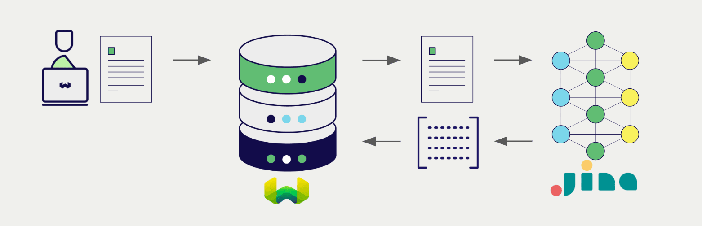

:::info `v1.29` で追加
:::

# Weaviate と Jina AI ColBERT エンベディング

import Tabs from '@theme/Tabs';
import TabItem from '@theme/TabItem';
import FilteredTextBlock from '@site/src/components/Documentation/FilteredTextBlock';
import PyConnect from '!!raw-loader!../_includes/provider.connect.py';
import TSConnect from '!!raw-loader!../_includes/provider.connect.ts';
import GoConnect from '!!raw-loader!/_includes/code/howto/go/docs/model-providers/1-connect/main.go';
import PyCode from '!!raw-loader!../_includes/provider.vectorizer.py';
import TSCode from '!!raw-loader!../_includes/provider.vectorizer.ts';
import GoCode from '!!raw-loader!/_includes/code/howto/go/docs/model-providers/2-usage-text/main.go';

Weaviate の Jina AI API との統合により、Jina AI のモデル機能を Weaviate から直接利用できます。

[Jina AI ColBERT エンベディングモデルを使用するように Weaviate ベクトルインデックスを設定](#configure-the-vectorizer)すると、指定したモデルと Jina AI API キーを使って Weaviate が各種操作のためにエンベディングを生成します。この機能は *ベクトライザー* と呼ばれます。

[インポート時](#data-import)には、Weaviate がテキストオブジェクトのエンベディングを生成し、インデックスに保存します。[ベクトル](#vector-near-text-search)検索や[ハイブリッド](#hybrid-search)検索操作では、Weaviate がテキストクエリをエンベディングに変換します。

## 要件

### Weaviate の設定

お使いの Weaviate インスタンスは、Jina AI ColBERT ベクトライザー統合（`text2colbert-jinaai`）モジュールが有効になっている必要があります。

  
Weaviate Cloud (WCD) ユーザー向け

この統合は、Weaviate Cloud (WCD) のサーバーレスインスタンスではデフォルトで有効になっています。

  
セルフホストユーザー向け

- モジュールが有効かどうかを確認するには、[クラスターのメタデータ](/deploy/configuration/meta.md)をチェックしてください。  
- Weaviate でモジュールを有効にする方法は、[モジュール設定方法](../../configuration/modules.md)ガイドをご覧ください。

### API 認証情報

この統合を利用するには、有効な Jina AI API キーを Weaviate に提供する必要があります。登録と API キーの取得は [Jina AI](https://jina.ai/embeddings/) で行えます。

API キーは次のいずれかの方法で Weaviate に渡してください。

- Weaviate が参照可能な環境変数 `JINAAI_APIKEY` を設定する  
- 以下の例のように、実行時に API キーを渡す  

<Tabs groupId="languages">

 <TabItem value="py" label="Python API v4">
    <FilteredTextBlock
      text={PyConnect}
      startMarker="# START JinaAIInstantiation"
      endMarker="# END JinaAIInstantiation"
      language="py"
    />
  </TabItem>

 <TabItem value="js" label="JS/TS API v3">
    <FilteredTextBlock
      text={TSConnect}
      startMarker="// START JinaAIInstantiation"
      endMarker="// END JinaAIInstantiation"
      language="ts"
    />
  </TabItem>

  <TabItem value="go" label="Go">
    <FilteredTextBlock
      text={GoConnect}
      startMarker="// START JinaAIInstantiation"
      endMarker="// END JinaAIInstantiation"
      language="goraw"
    />
  </TabItem>

</Tabs>

## ベクトライザーの設定

Jina AI ColBERT エンベディングモデルを使用するために、以下のように [Weaviate インデックスを設定](../../manage-collections/vector-config.mdx#specify-a-vectorizer)します。

<Tabs groupId="languages">
  <TabItem value="py" label="Python API v4">
    <FilteredTextBlock
      text={PyCode}
      startMarker="# START BasicColBERTVectorizerJinaAI"
      endMarker="# END BasicColBERTVectorizerJinaAI"
      language="py"
    />
  </TabItem>

  <TabItem value="js" label="JS/TS API v3">
    <FilteredTextBlock
      text={TSCode}
      startMarker="// START BasicColBERTVectorizerJinaAI"
      endMarker="// END BasicColBERTVectorizerJinaAI"
      language="ts"
    />
  </TabItem>

  <TabItem value="go" label="Go">
    <FilteredTextBlock
      text={GoCode}
      startMarker="// START BasicColBERTVectorizerJinaAI"
      endMarker="// END BasicColBERTVectorizerJinaAI"
      language="goraw"
    />
  </TabItem>

</Tabs>

### モデルの選択

次の設定例のように、ベクトライザーで使用する [利用可能なモデル](#available-models) のいずれかを指定できます。

<Tabs groupId="languages">
  <TabItem value="py" label="Python API v4">
    <FilteredTextBlock
      text={PyCode}
      startMarker="# START ColBERTVectorizerJinaCustomModel"
      endMarker="# END ColBERTVectorizerJinaCustomModel"
      language="py"
    />
  </TabItem>

  <TabItem value="js" label="JS/TS API v3">
    <FilteredTextBlock
      text={TSCode}
      startMarker="// START ColBERTVectorizerJinaCustomModel"
      endMarker="// END ColBERTVectorizerJinaCustomModel"
      language="ts"
    />
  </TabItem>

  <TabItem value="go" label="Go">
    <FilteredTextBlock
      text={GoCode}
      startMarker="// START ColBERTVectorizerJinaCustomModel"
      endMarker="// END ColBERTVectorizerJinaCustomModel"
      language="goraw"
    />
  </TabItem>

</Tabs>

[指定](#vectorizer-parameters) により、 Weaviate で使用する [利用可能なモデル](#available-models) のいずれかを選択できます。モデルを指定しない場合、[デフォルトモデル](#available-models) が使用されます。

import VectorizationBehavior from '/_includes/vectorization.behavior.mdx';

  
ベクトル化の挙動

<VectorizationBehavior/>

### ベクトライザーのパラメーター

以下の例は、 Jina AI 固有のオプションを設定する方法を示しています。

`dimensions` は `jina-colbert-v1` モデルには適用できない点にご注意ください。

<Tabs groupId="languages">
  <TabItem value="py" label="Python API v4">
    <FilteredTextBlock
      text={PyCode}
      startMarker="# START FullColBERTVectorizerJinaAI"
      endMarker="# END FullColBERTVectorizerJinaAI"
      language="py"
    />
  </TabItem>

  <TabItem value="js" label="JS/TS API v3">
    <FilteredTextBlock
      text={TSCode}
      startMarker="// START FullColBERTVectorizerJinaAI"
      endMarker="// END FullColBERTVectorizerJinaAI"
      language="ts"
    />
  </TabItem>

  <TabItem value="go" label="Go">
    <FilteredTextBlock
      text={GoCode}
      startMarker="// START FullColBERTVectorizerJinaAI"
      endMarker="// END FullColBERTVectorizerJinaAI"
      language="goraw"
    />
  </TabItem>

</Tabs>

## データのインポート

ベクトライザーを設定したら、[データをインポート](../../manage-objects/import.mdx) して Weaviate に取り込みます。指定したモデルを使用して、テキストオブジェクトの埋め込みが生成されます。

<Tabs groupId="languages">

 <TabItem value="py" label="Python API v4">
    <FilteredTextBlock
      text={PyCode}
      startMarker="# START BatchImportExample"
      endMarker="# END BatchImportExample"
      language="py"
    />
  </TabItem>

 <TabItem value="js" label="JS/TS API v3">
    <FilteredTextBlock
      text={TSCode}
      startMarker="// START BatchImportExample"
      endMarker="// END BatchImportExample"
      language="ts"
    />
  </TabItem>

  <TabItem value="go" label="Go">
    <FilteredTextBlock
      text={GoCode}
      startMarker="// START BatchImportExample"
      endMarker="// END BatchImportExample"
      language="goraw"
    />
  </TabItem>

</Tabs>

:::tip 既存ベクトルの再利用
互換性のあるモデルのベクトルを既にお持ちの場合は、それを直接 Weaviate に渡すことができます。同じモデルで生成済みの埋め込みを Weaviate で再利用したい場合、例えば他のシステムからデータを移行するときなどに便利です。
:::

## 検索

ベクトライザーを設定すると、 Weaviate は指定した Jina AI モデルを使用してベクトル検索およびハイブリッド検索を実行します。

### ベクトル (near text) 検索

[ベクトル検索](../../search/similarity.md#search-with-text) を行うと、 Weaviate はクエリのテキストを指定したモデルで埋め込みに変換し、データベースからもっとも類似したオブジェクトを返します。

以下のクエリは、 `limit` で指定した数 `n` のもっとも類似したオブジェクトをデータベースから返します。

<Tabs groupId="languages">

 <TabItem value="py" label="Python API v4">
    <FilteredTextBlock
      text={PyCode}
      startMarker="# START NearTextExample"
      endMarker="# END NearTextExample"
      language="py"
    />
  </TabItem>

 <TabItem value="js" label="JS/TS API v3">
    <FilteredTextBlock
      text={TSCode}
      startMarker="// START NearTextExample"
      endMarker="// END NearTextExample"
      language="ts"
    />
  </TabItem>

  <TabItem value="go" label="Go">
    <FilteredTextBlock
      text={GoCode}
      startMarker="// START NearTextExample"
      endMarker="// END NearTextExample"
      language="goraw"
    />
  </TabItem>

</Tabs>

### ハイブリッド検索

:::info ハイブリッド検索とは？
ハイブリッド検索はベクトル検索とキーワード (BM25) 検索を実行し、 [結果を融合](../../search/hybrid.md#change-the-fusion-method) してデータベースからもっとも適合するオブジェクトを返します。
:::

[ハイブリッド検索](../../search/hybrid.md) を行うと、 Weaviate はクエリのテキストを指定したモデルで埋め込みに変換し、データベースからもっともスコアの高いオブジェクトを返します。

以下のクエリは、 `limit` で指定した数 `n` のもっともスコアの高いオブジェクトをデータベースから返します。

<Tabs groupId="languages">

 <TabItem value="py" label="Python API v4">
    <FilteredTextBlock
      text={PyCode}
      startMarker="# START HybridExample"
      endMarker="# END HybridExample"
      language="py"
    />
  </TabItem>

 <TabItem value="js" label="JS/TS API v3">
    <FilteredTextBlock
      text={TSCode}
      startMarker="// START HybridExample"
      endMarker="// END HybridExample"
      language="ts"
    />
  </TabItem>

  <TabItem value="go" label="Go">
    <FilteredTextBlock
      text={GoCode}
      startMarker="// START HybridExample"
      endMarker="// END HybridExample"
      language="goraw"
    />
  </TabItem>

</Tabs>

## 参照

### 利用可能なモデル

- `jina-colbert-v2`
    - デフォルトでは、 Weaviate は `128` dimensions を使用します
- `jina-colbert-v1`

`dimensions` は `jina-colbert-v1` モデルには適用されません。

## さらに学ぶ

### 他の統合

- [Jina AI 埋め込みモデル + Weaviate](./embeddings.md)
- [Jina AI マルチモーダル埋め込みモデル + Weaviate](./embeddings-multimodal.md)
- [Jina AI リランカーモデル + Weaviate](./reranker.md)

### コード例

コレクションで統合を設定すると、 Weaviate のデータ管理および検索操作は他のコレクションとまったく同じように機能します。以下のモデル非依存の例をご覧ください。

- [How-to: Manage collections](../../manage-collections/index.mdx) および [How-to: Manage objects](../../manage-objects/index.mdx) ガイドでは、データ操作 (コレクションとその中のオブジェクトの作成、読み取り、更新、削除) の方法を示しています。
- [How-to: Query & Search](../../search/index.mdx) ガイドでは、ベクトル、キーワード、ハイブリッド検索に加えて検索拡張生成の実行方法を説明しています。

### 外部リソース

- Jina AI [Embeddings API documentation](https://jina.ai/embeddings/)

## 質問とフィードバック

import DocsFeedback from '/_includes/docs-feedback.mdx';

<DocsFeedback/>

