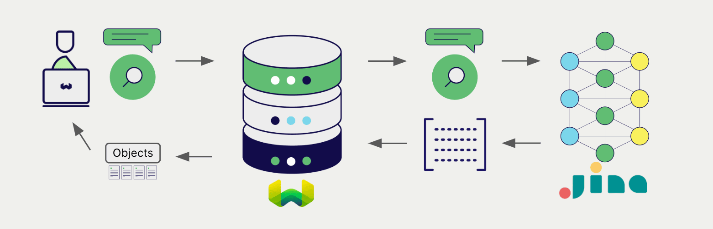

# Weaviate での Jina AI マルチモーダル埋め込み

:::info `1.25.26`、`1.26.11`、`v1.27.5` で追加されました
:::

import Tabs from '@theme/Tabs';  
import TabItem from '@theme/TabItem';  
import FilteredTextBlock from '@site/src/components/Documentation/FilteredTextBlock';  
import PyConnect from '!!raw-loader!../_includes/provider.connect.py';  
import TSConnect from '!!raw-loader!../_includes/provider.connect.ts';  
import PyCode from '!!raw-loader!../_includes/provider.vectorizer.py';  
import TSCode from '!!raw-loader!../_includes/provider.vectorizer.ts';  

Weaviate と Jina AI の API の統合により、Weaviate から直接 Jina AI のモデル機能を利用できます。

[Weaviate ベクトルインデックスを設定](#configure-the-vectorizer)して Jina AI の埋め込みモデルを使用すると、指定したモデルとお持ちの Jina AI API キーを用いて、Weaviate がさまざまな操作向けに埋め込みを生成します。この機能を *ベクトライザー* と呼びます。

[インポート時](#data-import)には、Weaviate がマルチモーダルオブジェクトの埋め込みを生成し、インデックスに保存します。[ベクトル](#vector-near-text-search) と [ハイブリッド](#hybrid-search) の検索操作では、1 つ以上のモダリティからなるクエリを埋め込みに変換します。[マルチモーダル検索操作](#vector-near-media-search) にも対応しています。

## 要件

### Weaviate の設定

お使いの Weaviate インスタンスは、Jina AI マルチモーダルベクトライザー統合 (`multi2vec-jinaai`) モジュールが有効になっている必要があります。

  
Weaviate Cloud (WCD) ユーザー向け

この統合は、Weaviate Cloud (WCD) のサーバーレスインスタンスではデフォルトで有効になっています。

  
セルフホストユーザー向け

- [クラスターメタデータ](/deploy/configuration/meta.md) を確認し、モジュールが有効になっているか確認してください。  
- Weaviate でモジュールを有効にする方法は、[モジュール設定の方法](../../configuration/modules.md) をご覧ください。

### API 認証情報

この統合を使用するには、有効な Jina AI API キーを Weaviate に提供する必要があります。サインアップして API キーを取得するには、[Jina AI](https://jina.ai/embeddings/) へアクセスしてください。

次のいずれかの方法で Weaviate に API キーを渡します。

- Weaviate が参照できる `JINAAI_APIKEY` 環境変数を設定する  
- 以下の例のように実行時に API キーを渡す

<Tabs groupId="languages">

 <TabItem value="py" label="Python API v4">
    <FilteredTextBlock
      text={PyConnect}
      startMarker="# START JinaAIInstantiation"
      endMarker="# END JinaAIInstantiation"
      language="py"
    />
  </TabItem>

 <TabItem value="js" label="JS/TS API v3">
    <FilteredTextBlock
      text={TSConnect}
      startMarker="// START JinaAIInstantiation"
      endMarker="// END JinaAIInstantiation"
      language="ts"
    />
  </TabItem>

</Tabs>

## ベクトライザーの設定

Jina AI の埋め込みモデルを使用するように、[Weaviate インデックスを設定](../../manage-collections/vector-config.mdx#specify-a-vectorizer)します。

<Tabs groupId="languages">
  <TabItem value="py" label="Python API v4">
    <FilteredTextBlock
      text={PyCode}
      startMarker="# START BasicMMVectorizerJinaAI"
      endMarker="# END BasicMMVectorizerJinaAI"
      language="py"
    />
  </TabItem>

  <TabItem value="js" label="JS/TS API v3">
    <FilteredTextBlock
      text={TSCode}
      startMarker="// START BasicMMVectorizerJinaAI"
      endMarker="// END BasicMMVectorizerJinaAI"
      language="ts"
    />
  </TabItem>

</Tabs>

### モデルの選択

[利用可能なモデル](#available-models) のいずれかを指定して、ベクトライザーに使用させることができます。以下の設定例をご覧ください。

<Tabs groupId="languages">
  <TabItem value="py" label="Python API v4">
    <FilteredTextBlock
      text={PyCode}
      startMarker="# START MMVectorizerJinaCustomModel"
      endMarker="# END MMVectorizerJinaCustomModel"
      language="py"
    />
  </TabItem>

  <TabItem value="js" label="JS/TS API v3">
    <FilteredTextBlock
      text={TSCode}
      startMarker="// START MMVectorizerJinaCustomModel"
      endMarker="// END MMVectorizerJinaCustomModel"
      language="ts"
    />
  </TabItem>

</Tabs>

[利用可能なモデル](#available-models) のいずれかを [指定](#vectorizer-parameters) できます。モデルを指定しない場合は[デフォルトモデル](#available-models) が使用されます。

import VectorizationBehavior from '/_includes/vectorization.behavior.mdx';

  
ベクトル化の挙動

<VectorizationBehavior/>

### ベクトライザーのパラメーター

以下の例では、Jina AI 固有のオプションの設定方法を示します。

<Tabs groupId="languages">
  <TabItem value="py" label="Python API v4">
    <FilteredTextBlock
      text={PyCode}
      startMarker="# START FullMMVectorizerJinaAI"
      endMarker="# END FullMMVectorizerJinaAI"
      language="py"
    />
  </TabItem>

  <TabItem value="js" label="JS/TS API v3">
    <FilteredTextBlock
      text={TSCode}
      startMarker="// START FullMMVectorizerJinaAI"
      endMarker="// END FullMMVectorizerJinaAI"
      language="ts"
    />
  </TabItem>
</Tabs>

### ベクトライザーのパラメーター

- `model`: モデル名。
- `dimensions`: モデルの次元数。  
  - [すべてのモデル](#available-models) がこのパラメーターをサポートしているわけではありません。

## データインポート

ベクトライザーを設定したら、Weaviate に[データをインポート](../../manage-objects/import.mdx)します。Weaviate は指定したモデルを使用してテキストオブジェクトの埋め込み (embedding) を生成します。

<Tabs groupId="languages">

 <TabItem value="py" label="Python API v4">
    <FilteredTextBlock
      text={PyCode}
      startMarker="# START MMBatchImportExample"
      endMarker="# END MMBatchImportExample"
      language="py"
    />
  </TabItem>

 <TabItem value="js" label="JS/TS API v3">
    <FilteredTextBlock
      text={TSCode}
      startMarker="// START MMBatchImportExample"
      endMarker="// END MMBatchImportExample"
      language="ts"
    />
  </TabItem>

</Tabs>

:::tip 既存ベクトルの再利用
すでに互換性のあるモデルベクトルをお持ちの場合は、それを Weaviate に直接渡すことができます。同じモデルで埋め込みを生成済みの場合や、他システムからデータを移行する際に便利です。
:::

## 検索

ベクトライザーを設定すると、Weaviate は指定した Jina AI モデルを用いてベクトル検索およびハイブリッド検索を実行します。

### ベクトル (near text) 検索

[ベクトル検索](../../search/similarity.md#search-with-text) を実行すると、Weaviate はテキストクエリを指定モデルで埋め込みに変換し、データベースから最も類似したオブジェクトを返します。

以下のクエリは、`limit` で指定した数 `n` の最も類似したオブジェクトを返します。

<Tabs groupId="languages">

 <TabItem value="py" label="Python API v4">
    <FilteredTextBlock
      text={PyCode}
      startMarker="# START NearTextExample"
      endMarker="# END NearTextExample"
      language="py"
    />
  </TabItem>

 <TabItem value="js" label="JS/TS API v3">
    <FilteredTextBlock
      text={TSCode}
      startMarker="// START NearTextExample"
      endMarker="// END NearTextExample"
      language="ts"
    />
  </TabItem>

</Tabs>

### ハイブリッド検索

:::info ハイブリッド検索とは？
ハイブリッド検索では、ベクトル検索とキーワード (BM25) 検索を行い、その結果を[組み合わせ](../../search/hybrid.md)てデータベースから最適なオブジェクトを返します。
:::

[ハイブリッド検索](../../search/hybrid.md) を実行すると、Weaviate はテキストクエリを指定モデルで埋め込みに変換し、データベースからスコアの高いオブジェクトを返します。

以下のクエリは、`limit` で指定した数 `n` の最もスコアの高いオブジェクトを返します。

<Tabs groupId="languages">

 <TabItem value="py" label="Python API v4">
    <FilteredTextBlock
      text={PyCode}
      startMarker="# START HybridExample"
      endMarker="# END HybridExample"
      language="py"
    />
  </TabItem>

 <TabItem value="js" label="JS/TS API v3">
    <FilteredTextBlock
      text={TSCode}
      startMarker="// START HybridExample"
      endMarker="// END HybridExample"
      language="ts"
    />
  </TabItem>

</Tabs>

### ベクトル（ near media ）検索

[ near image 検索](../../search/similarity.md#search-with-image) のようなメディア検索を実行すると、 Weaviate は指定されたモデルを使用してクエリを埋め込みに変換し、データベースから最も類似したオブジェクトを返します。

near image search のような near media 検索を実行するには、メディアクエリを base64 文字列に変換し、それを検索クエリに渡します。

以下のクエリは、`limit` で設定された数 `n` 件の、入力画像に最も類似したオブジェクトをデータベースから返します。

<Tabs groupId="languages">

 <TabItem value="py" label="Python API v4">
    <FilteredTextBlock
      text={PyCode}
      startMarker="# START NearImageExample"
      endMarker="# END NearImageExample"
      language="py"
    />
  </TabItem>

 <TabItem value="js" label="JS/TS API v3">
    <FilteredTextBlock
      text={TSCode}
      startMarker="// START NearImageExample"
      endMarker="// END NearImageExample"
      language="ts"
    />
  </TabItem>

</Tabs>

## 参考

### 利用可能なモデル

- `jina-clip-v2`
    - このモデルは [Matryoshka Representation Learning](https://arxiv.org/abs/2205.13147) を使用した多言語・マルチモーダルモデルです。  
    - このモデルは `dimensions` パラメーターを受け取り、 64 から 1024 まで（両端を含む）の整数を指定できます。デフォルト値は 1024 です。
- `jina-clip-v1`
    - このモデルは常に 768 次元の埋め込みを返します。

## 追加リソース

### その他のインテグレーション

- [ Jina AI テキスト埋め込みモデル + Weaviate](./embeddings.md).
- [ Jina AI ColBERT 埋め込みモデル + Weaviate](./embeddings-colbert.md).
- [ Jina AI reranker モデル + Weaviate](./reranker.md).

### コード例

コレクションでインテグレーションを設定すると、 Weaviate におけるデータ管理および検索操作は他のコレクションとまったく同じように機能します。以下のモデル非依存の例をご覧ください:

- [How-to: コレクションの管理](../../manage-collections/index.mdx) と [How-to: オブジェクトの管理](../../manage-objects/index.mdx) のガイドでは、データ操作 (例: コレクションおよびその中のオブジェクトの作成・読み取り・更新・削除) の方法を示しています。
- [How-to: Query & Search](../../search/index.mdx) のガイドでは、検索操作 (例: ベクトル、キーワード、ハイブリッド) と 検索拡張生成 の方法を示しています。

### 外部リソース

- Jina AI [Embeddings API ドキュメント](https://jina.ai/embeddings/)

## 質問とフィードバック

import DocsFeedback from '/_includes/docs-feedback.mdx';

<DocsFeedback/>

