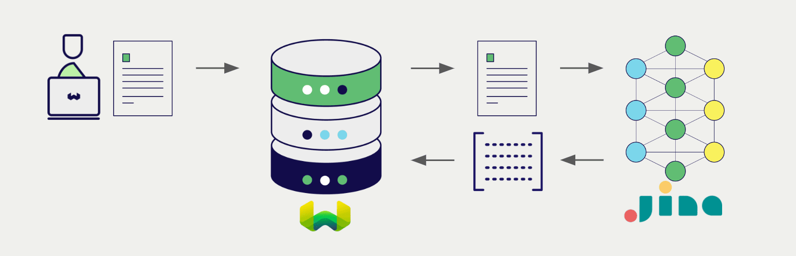

<!-- Note: for images, use https://docs.google.com/presentation/d/15opIcJuaIjEEcs_1Zm8B6pccox2p7_MHSjCnRv4dPfU/edit?usp=sharing -->

Jina AI は自然言語処理のための幅広いモデルを提供しています。 Weaviate は Jina AI の API とシームレスに統合され、ユーザーは Weaviate Database から直接 Jina AI のモデルを活用できます。

これらの統合により、開発者は高度な AI 主導のアプリケーションを簡単に構築できます。

## Jina AI との統合

### ベクトル検索向け埋め込みモデル

Jina AI の埋め込みモデルはテキスト データをベクトル埋め込みに変換し、意味とコンテキストを捉えます。

[Weaviate は Jina AI の埋め込みモデルと統合](./embeddings.md) し、データのシームレスなベクトル化を可能にします。これにより、追加の前処理やデータ変換ステップなしで意味検索やハイブリッド検索を実行できます。

[Jina AI 埋め込み統合ページ](./embeddings.md)  
[Jina AI ColBERT 埋め込み統合ページ](./embeddings-colbert.md)  
[Jina AI マルチモーダル埋め込み統合ページ](./embeddings-multimodal.md)

## 概要

これらの統合により、開発者は Weaviate 内で直接 Jina AI の強力なモデルを活用できます。

その結果、AI 主導のアプリケーション開発が簡素化され、開発プロセスが加速するため、革新的なソリューションの創出に集中できます。

## はじめに

これらの統合を利用するには、Weaviate に有効な Jina AI API キーを設定する必要があります。 [Jina AI](https://jina.ai/embeddings/) にアクセスしてサインアップし、API キーを取得してください。

次に、該当する統合ページで Jina AI モデルを用いた Weaviate の設定方法を確認し、アプリケーションで利用を開始してください。

- [テキスト埋め込み](./embeddings.md)
- [ColBERT 埋め込み](./embeddings-colbert.md)
- [マルチモーダル埋め込み](./embeddings-multimodal.md)
- [リランカー](./reranker.md)

## 質問とフィードバック

import DocsFeedback from '/_includes/docs-feedback.mdx';

<DocsFeedback/>

