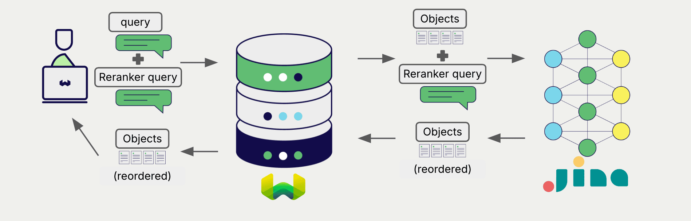

# Weaviate との Jina AI リランカー モデル

:::info `v1.26.1` で追加
:::

import Tabs from '@theme/Tabs';
import TabItem from '@theme/TabItem';
import FilteredTextBlock from '@site/src/components/Documentation/FilteredTextBlock';
import PyConnect from '!!raw-loader!../_includes/provider.connect.py';
import TSConnect from '!!raw-loader!../_includes/provider.connect.ts';
import PyCode from '!!raw-loader!../_includes/provider.reranker.py';
import TSCode from '!!raw-loader!../_includes/provider.reranker.ts';

 Weaviate と Jina AI の API を統合することで、Jina AI モデルの機能を Weaviate から直接利用できます。

[リランカーを設定](#configure-the-reranker) して Jina AI リランカー モデルを使用すると、 Weaviate は指定したモデルとお持ちの Jina AI API キーを用いて検索結果をリランクします。

この 2 ステップのプロセスでは、まず Weaviate が検索を実行し、その後に指定したモデルで結果をリランクします。

## 要件

### Weaviate の構成

ご利用の Weaviate インスタンスには、JinaAI リランカー統合（`reranker-jinaai`）モジュールが有効になっている必要があります。

  
Weaviate Cloud (WCD) ユーザーの場合

この統合は Weaviate Cloud (WCD) のサーバーレス インスタンスでデフォルトで有効になっています。

  
セルフホスト ユーザーの場合

- [クラスターメタデータ](/deploy/configuration/meta.md) を確認し、モジュールが有効かどうかを確認してください。
- Weaviate でモジュールを有効にするには、[モジュール設定方法](../../configuration/modules.md) ガイドに従ってください。

### API 資格情報

この統合を利用するには、有効な JinaAI API キーを Weaviate に提供する必要があります。Jina AI の [公式サイト](https://jina.ai/embeddings/) でサインアップし、API キーを取得してください。

以下のいずれかの方法で Weaviate に API キーを渡します。

- `JINAAI_APIKEY` 環境変数を設定し、 Weaviate から参照できるようにする。
- 下記の例のように、実行時に API キーを渡す。

<Tabs groupId="languages">

 <TabItem value="py" label="Python API v4">
    <FilteredTextBlock
      text={PyConnect}
      startMarker="# START JinaAIInstantiation"
      endMarker="# END JinaAIInstantiation"
      language="py"
    />
  </TabItem>

 <TabItem value="js" label="JS/TS API v3">
    <FilteredTextBlock
      text={TSConnect}
      startMarker="// START JinaAIInstantiation"
      endMarker="// END JinaAIInstantiation"
      language="ts"
    />
  </TabItem>

</Tabs>

## リランカーを設定する

import MutableRerankerConfig from '/_includes/mutable-reranker-config.md';

<MutableRerankerConfig />

Jina AI リランカー モデルを使用するように Weaviate コレクションを設定する方法は次のとおりです。

<Tabs groupId="languages">
  <TabItem value="py" label="Python API v4">
    <FilteredTextBlock
      text={PyCode}
      startMarker="# START RerankerJinaAIBasic"
      endMarker="# END RerankerJinaAIBasic"
      language="py"
    />
  </TabItem>

  <TabItem value="js" label="JS/TS API v3">
    <FilteredTextBlock
      text={TSCode}
      startMarker="// START RerankerJinaAIBasic"
      endMarker="// END RerankerJinaAIBasic"
      language="ts"
    />
  </TabItem>

</Tabs>

### モデルを選択する

以下の設定例のように、 Weaviate で使用する [利用可能なモデル](#available-models) のいずれかを指定できます。

<Tabs groupId="languages">
  <TabItem value="py" label="Python API v4">
    <FilteredTextBlock
      text={PyCode}
      startMarker="# START RerankerJinaAICustomModel"
      endMarker="# END RerankerJinaAICustomModel"
      language="py"
    />
  </TabItem>

  <TabItem value="js" label="JS/TS API v3">
    <FilteredTextBlock
      text={TSCode}
      startMarker="// START RerankerJinaAICustomModel"
      endMarker="// END RerankerJinaAICustomModel"
      language="ts"
    />
  </TabItem>

</Tabs>

モデルを指定しない場合は [デフォルトモデル](#available-models) が使用されます。

## リランキングクエリ

リランカーが設定されると、 Weaviate は指定した Jina AI モデルを使用して[リランキング操作](../../search/rerank.md)を実行します。

具体的には、 Weaviate は最初に検索を行い、その結果を指定したモデルでリランキングします。

Weaviate のどの検索でもリランカーと組み合わせてリランキングを実行できます。

<Tabs groupId="languages">

 <TabItem value="py" label="Python API v4">
    <FilteredTextBlock
      text={PyCode}
      startMarker="# START RerankerQueryExample"
      endMarker="# END RerankerQueryExample"
      language="py"
    />
  </TabItem>

 <TabItem value="js" label="JS/TS API v3">
    <FilteredTextBlock
      text={TSCode}
      startMarker="// START RerankerQueryExample"
      endMarker="// END RerankerQueryExample"
      language="ts"
    />
  </TabItem>

</Tabs>

## 参考

### 利用可能なモデル

- `jina-reranker-v2-base-multilingual` (default)
- `jina-reranker-v1-base-en`
- `jina-reranker-v1-turbo-en`
- `jina-reranker-v1-tiny-en`
- `jina-colbert-v1-en`

## 追加リソース

### その他の統合

- [Jina AI テキスト埋め込みモデル + Weaviate](./embeddings.md)
- [Jina AI ColBERT 埋め込みモデル + Weaviate](./embeddings-colbert.md)
- [Jina AI マルチモーダル埋め込みモデル + Weaviate](./embeddings-multimodal.md)

### コード例

統合がコレクションに設定されると、 Weaviate におけるデータ管理と検索操作は他のコレクションと同様に動作します。以下のモデル非依存の例をご覧ください:

- [How-to: Manage collections](../../manage-collections/index.mdx) と [How-to: Manage objects](../../manage-objects/index.mdx) ガイドでは、データ操作（コレクションやその中のオブジェクトの作成、読み取り、更新、削除）方法を説明しています。
- [How-to: Query & Search](../../search/index.mdx) ガイドでは、ベクトル検索、キーワード検索、ハイブリッド検索、検索拡張生成などの検索方法を紹介しています。

### 参考

- Jina AI [Reranker ドキュメント](https://jina.ai/reranker/)

## 質問とフィードバック

import DocsFeedback from '/_includes/docs-feedback.mdx';

<DocsFeedback/>

