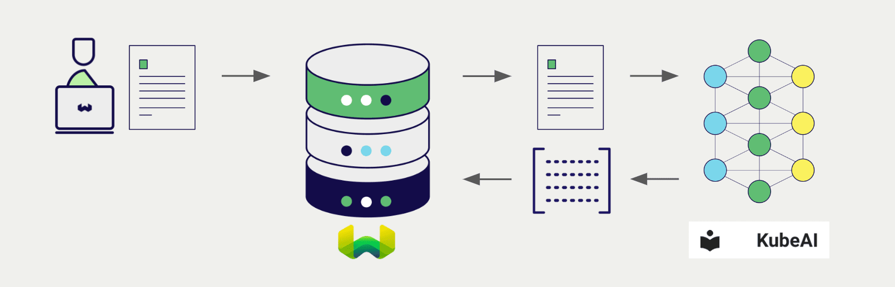
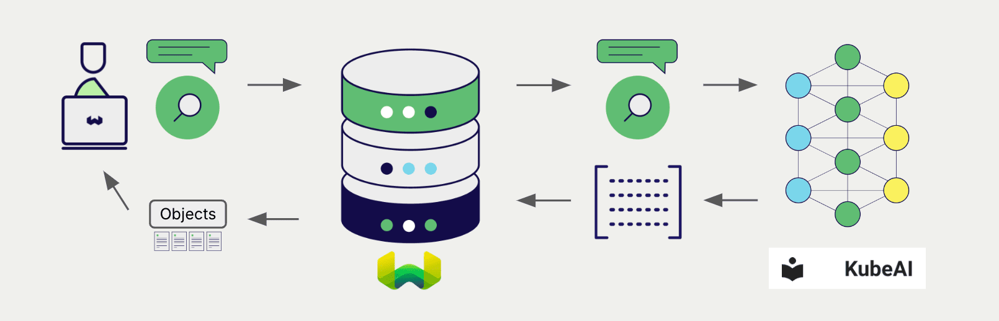

# Weaviate における KubeAI Embeddings

import Tabs from '@theme/Tabs';
import TabItem from '@theme/TabItem';
import FilteredTextBlock from '@site/src/components/Documentation/FilteredTextBlock';
import PyConnect from '!!raw-loader!../_includes/provider.connect.py';
import TSConnect from '!!raw-loader!../_includes/provider.connect.ts';
import PyCode from '!!raw-loader!../_includes/provider.vectorizer.py';
import TSCode from '!!raw-loader!../_includes/provider.vectorizer.ts';

Weaviate と OpenAI スタイルの API の統合により、Weaviate から直接 KubeAI モデル にアクセスできます。

[ベクトルインデックスを構成](#configure-the-vectorizer) して KubeAI の Embedding モデルを使用すると、指定したモデルで各種操作の Embedding が生成されます。この機能は *ベクトライザー* と呼ばれます。

[インポート時](#data-import) に、Weaviate はテキストオブジェクトの Embedding を生成し、インデックスに保存します。[ベクトル](#vector-near-text-search) および [ハイブリッド](#hybrid-search) 検索では、Weaviate がテキストクエリを Embedding に変換します。

## 前提条件

### KubeAI 設定

KubeAI は、Embedding モデルを備えた Kubernetes クラスター内にデプロイされている必要があります。詳しくは、この [KubeAI デプロイ ガイド](https://www.kubeai.org/tutorials/weaviate/#kubeai-configuration) を参照してください。

### Weaviate 設定

ご利用の Weaviate インスタンスに `text2vec-openai` モジュールが有効になっている必要があります。

  
Weaviate Cloud (WCD) ユーザー向け

この統合は、Weaviate Cloud (WCD) のサーバーレス インスタンスではデフォルトで有効になっています。

  
セルフホスト ユーザー向け

- [クラスターメタデータ](/deploy/configuration/meta.md) を確認し、モジュールが有効かどうかを確認します。  
- Weaviate でモジュールを有効にするには、[モジュール設定方法](../../configuration/modules.md) ガイドに従ってください。

### API 認証情報

OpenAI 統合には API キーが必要です。KubeAI を使用する場合、この値は KubeAI では使用されないため、任意の値を設定してください。

以下のいずれかの方法で Weaviate に API キーを提供します。

- Weaviate から参照できる `OPENAI_APIKEY` 環境変数を設定する  
- 以下の例のように、実行時に API キーを渡す

<Tabs groupId="languages">

 <TabItem value="py" label="Python API v4">
    <FilteredTextBlock
      text={PyConnect}
      startMarker="# START OpenAIInstantiation"
      endMarker="# END OpenAIInstantiation"
      language="py"
    />
  </TabItem>

 <TabItem value="js" label="JS/TS API v3">
    <FilteredTextBlock
      text={TSConnect}
      startMarker="// START OpenAIInstantiation"
      endMarker="// END OpenAIInstantiation"
      language="ts"
    />
  </TabItem>

</Tabs>

## ベクトライザーの設定

KubeAI Embedding モデルを使用するように [Weaviate インデックスを設定](../../manage-collections/vector-config.mdx#specify-a-vectorizer) します。

<Tabs groupId="languages">
  <TabItem value="py" label="Python API v4">
    <FilteredTextBlock
      text={PyCode}
      startMarker="# START FullVectorizerKubeAI"
      endMarker="# END FullVectorizerKubeAI"
      language="py"
    />
  </TabItem>

  <TabItem value="js" label="JS/TS API v3">
    <FilteredTextBlock
      text={TSCode}
      startMarker="// START FullVectorizerKubeAI"
      endMarker="// END FullVectorizerKubeAI"
      language="ts"
    />
  </TabItem>

</Tabs>

import VectorizationBehavior from '/_includes/vectorization.behavior.mdx';

  
ベクトル化の動作

<VectorizationBehavior/>

### ベクトライザーのパラメーター

- `model`: KubeAI モデル名  
- `dimensions`: モデルの次元数  
- `baseURL`: KubeAI が提供する OpenAI スタイルのエンドポイント  
    - 通常、`baseURL` は `http://kubeai/openai` です。異なるクラスターや名前空間で Weaviate をデプロイしている場合を除きます。

## データインポート

ベクトライザーを設定したら、[データをインポート](../../manage-objects/import.mdx) して Weaviate に取り込みます。Weaviate は、指定したモデルを使用してテキストオブジェクトの埋め込みを生成します。

<Tabs groupId="languages">

 <TabItem value="py" label="Python API v4">
    <FilteredTextBlock
      text={PyCode}
      startMarker="# START BatchImportExample"
      endMarker="# END BatchImportExample"
      language="py"
    />
  </TabItem>

 <TabItem value="js" label="JS/TS API v3">
    <FilteredTextBlock
      text={TSCode}
      startMarker="// START BatchImportExample"
      endMarker="// END BatchImportExample"
      language="ts"
    />
  </TabItem>

</Tabs>

:::tip 既存ベクトルを再利用する
すでに互換性のあるモデルベクトルをお持ちの場合は、それを直接 Weaviate に渡すことができます。これは、同じモデルで既に埋め込みを生成しており、別のシステムからデータを移行する際などに Weaviate で再利用したい場合に便利です。
:::

## 検索

ベクトライザーが設定されると、Weaviate は指定された KubeAI モデルを使用してベクトル検索およびハイブリッド検索を実行します。

### ベクトル（near text）検索

[ベクトル検索](../../search/similarity.md#search-with-text) を実行すると、Weaviate はテキストクエリを指定されたモデルで埋め込みに変換し、データベースから最も類似したオブジェクトを返します。

以下のクエリは、`limit` で指定した数 `n` 件の最も類似したオブジェクトをデータベースから返します。

<Tabs groupId="languages">

 <TabItem value="py" label="Python API v4">
    <FilteredTextBlock
      text={PyCode}
      startMarker="# START NearTextExample"
      endMarker="# END NearTextExample"
      language="py"
    />
  </TabItem>

 <TabItem value="js" label="JS/TS API v3">
    <FilteredTextBlock
      text={TSCode}
      startMarker="// START NearTextExample"
      endMarker="// END NearTextExample"
      language="ts"
    />
  </TabItem>

</Tabs>

### ハイブリッド検索

:::info ハイブリッド検索とは？
ハイブリッド検索は、ベクトル検索とキーワード（ BM25 ）検索を実行し、その結果を[組み合わせて](../../search/hybrid.md) データベースから最適なオブジェクトを返します。
:::

[ハイブリッド検索](../../search/hybrid.md) を実行すると、Weaviate はテキストクエリを指定されたモデルで埋め込みに変換し、データベースから最高スコアのオブジェクトを返します。

以下のクエリは、`limit` で指定した数 `n` 件の最高スコアのオブジェクトをデータベースから返します。

<Tabs groupId="languages">

 <TabItem value="py" label="Python API v4">
    <FilteredTextBlock
      text={PyCode}
      startMarker="# START HybridExample"
      endMarker="# END HybridExample"
      language="py"
    />
  </TabItem>

 <TabItem value="js" label="JS/TS API v3">
    <FilteredTextBlock
      text={TSCode}
      startMarker="// START HybridExample"
      endMarker="// END HybridExample"
      language="ts"
    />
  </TabItem>

</Tabs>

## 参照

## 追加リソース

### その他のインテグレーション

- [KubeAI 生成モデル + Weaviate](./generative.md)

### コード例

インテグレーションがコレクションで設定されると、Weaviate のデータ管理および検索操作は他のコレクションと同様に動作します。モデル非依存の例は次のとおりです。

- [How-to: コレクションを管理する](../../manage-collections/index.mdx) および [How-to: オブジェクトを管理する](../../manage-objects/index.mdx) では、データ操作（コレクションおよびその中のオブジェクトの作成・読み取り・更新・削除）の方法を示しています。
- [How-to: クエリ & 検索](../../search/index.mdx) では、検索操作（ベクトル、キーワード、ハイブリッド）や検索拡張生成の方法を示しています。

### 外部リソース

- [KubeAI documentation](https://www.kubeai.org/)

## 質問とフィードバック

import DocsFeedback from '/_includes/docs-feedback.mdx';

<DocsFeedback/>

