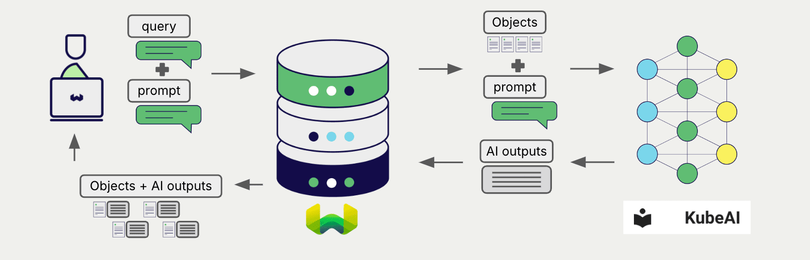
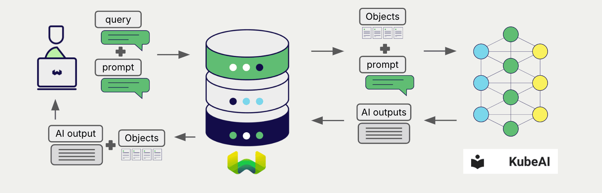

# Weaviate での KubeAI 生成 AI

import Tabs from '@theme/Tabs';
import TabItem from '@theme/TabItem';
import FilteredTextBlock from '@site/src/components/Documentation/FilteredTextBlock';
import PyConnect from '!!raw-loader!../_includes/provider.connect.py';
import TSConnect from '!!raw-loader!../_includes/provider.connect.ts';
import PyCode from '!!raw-loader!../_includes/provider.generative.py';
import TSCode from '!!raw-loader!../_includes/provider.generative.ts';

Weaviate の OpenAI-style API との統合により、KubeAI モデルを Weaviate から直接利用できます。

[コレクションを設定](#configure-collection) して、KubeAI で生成 AI モデルを使用します。Weaviate は 検索拡張生成 (RAG) を、指定したモデルで実行します。

具体的には、Weaviate が検索を実行して最も関連性の高いオブジェクトを取得し、それらを KubeAI の生成モデルに渡して出力を生成します。

## 要件

### KubeAI の設定

KubeAI は埋め込みモデルを備えた Kubernetes クラスターにデプロイされている必要があります。詳細な手順については、この [KubeAI デプロイ ガイド](https://www.kubeai.org/tutorials/weaviate/#kubeai-configuration) を参照してください。

### Weaviate の設定

お使いの Weaviate インスタンスは、OpenAI 生成 AI 統合 (`generative-openai`) モジュールが有効になっている必要があります。

  
Weaviate Cloud (WCD) ユーザー向け

この統合は Weaviate Cloud (WCD) のサーバーレス インスタンスではデフォルトで有効になっています。

  
セルフホストユーザー向け

- モジュールが有効かどうかを確認するには、[クラスターメタデータ](/deploy/configuration/meta.md) をチェックしてください。
- Weaviate でモジュールを有効にする方法については、[モジュールの設定方法](../../configuration/modules.md) ガイドに従ってください。

### API 認証情報

OpenAI 統合には API キー値が必要です。KubeAI を使用する場合、この値は KubeAI では使用されないため、任意の値を設定してください。

以下のいずれかの方法で Weaviate に API キーを渡します。

- Weaviate から参照できる `OPENAI_APIKEY` 環境変数を設定する
- 下記の例のように実行時に API キーを渡す

<Tabs groupId="languages">

 <TabItem value="py" label="Python API v4">
    <FilteredTextBlock
      text={PyConnect}
      startMarker="# START OpenAIInstantiation"
      endMarker="# END OpenAIInstantiation"
      language="py"
    />
  </TabItem>

 <TabItem value="js" label="JS/TS API v3">
    <FilteredTextBlock
      text={TSConnect}
      startMarker="// START OpenAIInstantiation"
      endMarker="// END OpenAIInstantiation"
      language="ts"
    />
  </TabItem>

</Tabs>

## コレクションの設定 {#configure-collection}

Weaviate で KubeAI 生成 AI モデルを使用するように設定します。

<Tabs groupId="languages">
  <TabItem value="py" label="Python API v4">
    <FilteredTextBlock
      text={PyCode}
      startMarker="# START FullGenerativeKubeAI"
      endMarker="# END FullGenerativeKubeAI"
      language="py"
    />
  </TabItem>

  <TabItem value="js" label="JS/TS API v3">
    <FilteredTextBlock
      text={TSCode}
      startMarker="// START FullGenerativeKubeAI"
      endMarker="// END FullGenerativeKubeAI"
      language="ts"
    />
  </TabItem>

</Tabs>

vLLM または Ollama がサポートするモデルはすべて KubeAI で使用できます。

利用可能なモデルおよびその設定方法の詳細は、[KubeAI のモデル管理に関するドキュメント](https://www.kubeai.org/how-to/install-models/) を参照してください。

## 実行時のモデル選択

コレクション作成時にデフォルトのモデルプロバイダーを設定するだけでなく、クエリ時に上書きすることもできます。

<Tabs groupId="languages">
  <TabItem value="py" label="Python API v4">
    <FilteredTextBlock
      text={PyCode}
      startMarker="# START RuntimeModelSelectionKubeAI"
      endMarker="# END RuntimeModelSelectionKubeAI"
      language="py"
    />
  </TabItem>
  <TabItem value="js" label="JS/TS Client v3">
    <FilteredTextBlock
      text={TSCode}
      startMarker="// START RuntimeModelSelectionKubeAI"
      endMarker="// END RuntimeModelSelectionKubeAI"
      language="ts"
    />
  </TabItem>
</Tabs>

## 検索拡張生成

生成 AI インテグレーションを設定したら、[単一プロンプト](#single-prompt)方式または[グループタスク](#grouped-task)方式で RAG 操作を実行します。

### 単一プロンプト

検索結果内の各オブジェクトに対してテキストを生成するには、単一プロンプト方式を使用します。

以下の例では、`limit` パラメーターで指定した `n` 件の検索結果それぞれに対して出力を生成します。

単一プロンプトクエリを作成する際は、`{}` を使用して、言語モデルに渡したいオブジェクトプロパティを挿入します。たとえば、オブジェクトの `title` プロパティを渡したい場合は、クエリに `{title}` を含めます。

<Tabs groupId="languages">

 <TabItem value="py" label="Python API v4">
    <FilteredTextBlock
      text={PyCode}
      startMarker="# START SinglePromptExample"
      endMarker="# END SinglePromptExample"
      language="py"
    />
  </TabItem>

 <TabItem value="js" label="JS/TS API v3">
    <FilteredTextBlock
      text={TSCode}
      startMarker="// START SinglePromptExample"
      endMarker="// END SinglePromptExample"
      language="ts"
    />
  </TabItem>

</Tabs>

### グループタスク

検索結果全体に対して 1 つのテキストを生成するには、グループタスク方式を使用します。

つまり、`n` 件の検索結果がある場合でも、生成モデルはグループ全体に対して 1 つの出力を生成します。

<Tabs groupId="languages">

 <TabItem value="py" label="Python API v4">
    <FilteredTextBlock
      text={PyCode}
      startMarker="# START GroupedTaskExample"
      endMarker="# END GroupedTaskExample"
      language="py"
    />
  </TabItem>

 <TabItem value="js" label="JS/TS API v3">
    <FilteredTextBlock
      text={TSCode}
      startMarker="// START GroupedTaskExample"
      endMarker="// END GroupedTaskExample"
      language="ts"
    />
  </TabItem>

</Tabs>

## 追加リソース

### 他のインテグレーション

- [KubeAI 埋め込みモデル + Weaviate](./embeddings.md).

### コード例

インテグレーションがコレクションに設定されると、Weaviate のデータ管理および検索操作は他のコレクションと同じように機能します。以下のモデル非依存の例をご覧ください。

- [How-to: コレクションを管理する](../../manage-collections/index.mdx)および[How-to: オブジェクトを管理する](../../manage-objects/index.mdx)ガイドでは、データ操作（コレクションとその内部のオブジェクトの作成・読み取り・更新・削除）の方法を説明しています。
- [How-to: クエリ & 検索](../../search/index.mdx)ガイドでは、ベクトル検索・キーワード検索・ハイブリッド検索に加えて検索拡張生成の実行方法を説明しています。

### 外部リソース

- [KubeAI documentation](https://www.kubeai.org/)
- [KubeAI documentation on model management](https://www.kubeai.org/how-to/install-models/)

## 質問とフィードバック

import DocsFeedback from '/_includes/docs-feedback.mdx';

<DocsFeedback/>

