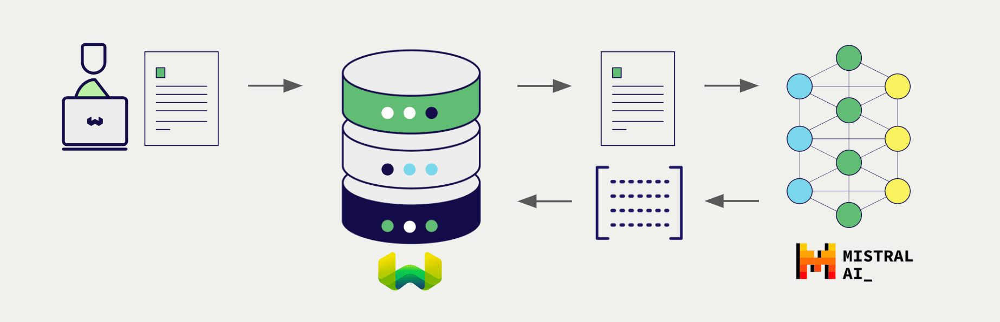
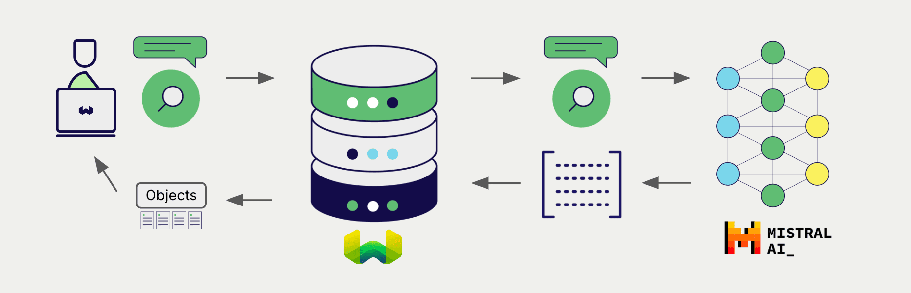

# Weaviate と Mistral の埋め込み

import Tabs from '@theme/Tabs';
import TabItem from '@theme/TabItem';
import FilteredTextBlock from '@site/src/components/Documentation/FilteredTextBlock';
import PyConnect from '!!raw-loader!../_includes/provider.connect.py';
import TSConnect from '!!raw-loader!../_includes/provider.connect.ts';
import GoConnect from '!!raw-loader!/_includes/code/howto/go/docs/model-providers/1-connect/main.go';
import PyCode from '!!raw-loader!../_includes/provider.vectorizer.py';
import TSCode from '!!raw-loader!../_includes/provider.vectorizer.ts';
import GoCode from '!!raw-loader!/_includes/code/howto/go/docs/model-providers/2-usage-text/main.go';

Weaviate が Mistral の API と統合されているため、Weaviate から直接、そのモデルの機能にアクセスできます。

[Weaviate の ベクトル インデックスを設定](#configure-the-vectorizer)して Mistral の埋め込みモデルを使用すると、Weaviate は指定したモデルとお持ちの Mistral API キーを利用して、さまざまな操作に必要な埋め込みを生成します。この機能は *ベクトライザー* と呼ばれます。

[インポート時](#data-import)に、Weaviate はテキストオブジェクトの埋め込みを生成し、インデックスに保存します。 [ベクトル](#vector-near-text-search) および [ハイブリッド](#hybrid-search) 検索操作では、Weaviate がテキストクエリを埋め込みに変換します。

## 要件

### Weaviate の構成

お使いの Weaviate インスタンスは、Mistral ベクトライザー統合（`text2vec-mistral`）モジュールが設定されている必要があります。

  
Weaviate Cloud (WCD) ユーザー向け

この統合は、Weaviate Cloud (WCD) のサーバーレスインスタンスではデフォルトで有効になっています。

  
セルフホストユーザー向け

- モジュールが有効かどうかを確認するには、[クラスター メタデータ](/deploy/configuration/meta.md) を確認します。
- Weaviate でモジュールを有効にするには、[モジュールの設定方法](../../configuration/modules.md) ガイドに従ってください。

### API 資格情報

この統合を使用するには、有効な Mistral API キーを Weaviate に提供する必要があります。 [Mistral](https://mistral.ai/) にアクセスしてサインアップし、API キーを取得してください。

次のいずれかの方法で、API キーを Weaviate に渡してください。

- Weaviate から参照できる `MISTRAL_APIKEY` 環境変数を設定します。  
- 以下の例のように、実行時に API キーを指定します。

<Tabs groupId="languages">

 <TabItem value="py" label="Python API v4">
    <FilteredTextBlock
      text={PyConnect}
      startMarker="# START MistralInstantiation"
      endMarker="# END MistralInstantiation"
      language="py"
    />
  </TabItem>

 <TabItem value="js" label="JS/TS API v3">
    <FilteredTextBlock
      text={TSConnect}
      startMarker="// START MistralInstantiation"
      endMarker="// END MistralInstantiation"
      language="ts"
    />
  </TabItem>

  <TabItem value="go" label="Go">
    <FilteredTextBlock
      text={GoConnect}
      startMarker="// START MistralInstantiation"
      endMarker="// END MistralInstantiation"
      language="goraw"
    />
  </TabItem>

</Tabs>

## ベクトライザーを設定する

[Weaviate のインデックスを以下のように設定](../../manage-collections/vector-config.mdx#specify-a-vectorizer)して、Mistral の埋め込みモデルを使用します。

<Tabs groupId="languages">
  <TabItem value="py" label="Python API v4">
    <FilteredTextBlock
      text={PyCode}
      startMarker="# START BasicVectorizerMistral"
      endMarker="# END BasicVectorizerMistral"
      language="py"
    />
  </TabItem>

  <TabItem value="js" label="JS/TS API v3">
    <FilteredTextBlock
      text={TSCode}
      startMarker="// START BasicVectorizerMistral"
      endMarker="// END BasicVectorizerMistral"
      language="ts"
    />
  </TabItem>

  <TabItem value="go" label="Go">
    <FilteredTextBlock
      text={GoCode}
      startMarker="// START BasicVectorizerMistral"
      endMarker="// END BasicVectorizerMistral"
      language="goraw"
    />
  </TabItem>

</Tabs>

### モデルの選択

以下の設定例のように、ベクトライザーで使用する [利用可能なモデル](#available-models) のいずれかを指定できます。

<Tabs groupId="languages">
  <TabItem value="py" label="Python API v4">
    <FilteredTextBlock
      text={PyCode}
      startMarker="# START FullVectorizerMistral"
      endMarker="# END FullVectorizerMistral"
      language="py"
    />
  </TabItem>

  <TabItem value="js" label="JS/TS API v3">
    <FilteredTextBlock
      text={TSCode}
      startMarker="// START FullVectorizerMistral"
      endMarker="// END FullVectorizerMistral"
      language="ts"
    />
  </TabItem>

  <TabItem value="go" label="Go">
    <FilteredTextBlock
      text={GoCode}
      startMarker="// START FullVectorizerMistral"
      endMarker="// END FullVectorizerMistral"
      language="goraw"
    />
  </TabItem>

</Tabs>

モデルを指定しない場合は、[デフォルトモデル](#available-models) が使用されます。

import VectorizationBehavior from '/_includes/vectorization.behavior.mdx';

  
ベクトル化の挙動

<VectorizationBehavior/>

## ヘッダー パラメーター

追加のヘッダーをリクエストに含めることで、実行時に API キーおよびいくつかのオプションパラメーターを指定できます。利用可能なヘッダーは次のとおりです:

- `X-Mistral-Api-Key`: Mistral の API キー。
- `X-Mistral-Baseurl`: 既定の Mistral URL の代わりに使用するベース URL (例: プロキシ)。

実行時に指定した追加ヘッダーは、 Weaviate の既存の設定を上書きします。

ヘッダーは上記の [API 資格情報の例](#api-credentials) のとおりに設定してください。

## データのインポート

ベクトライザーを設定したら、[データをインポート](../../manage-objects/import.mdx) して Weaviate に取り込みます。 Weaviate は指定したモデルを使用してテキストオブジェクトの埋め込みを生成します。

<Tabs groupId="languages">

 <TabItem value="py" label="Python API v4">
    <FilteredTextBlock
      text={PyCode}
      startMarker="# START BatchImportExample"
      endMarker="# END BatchImportExample"
      language="py"
    />
  </TabItem>

 <TabItem value="js" label="JS/TS API v3">
    <FilteredTextBlock
      text={TSCode}
      startMarker="// START BatchImportExample"
      endMarker="// END BatchImportExample"
      language="ts"
    />
  </TabItem>

 <TabItem value="go" label="Go">
    <FilteredTextBlock
      text={GoCode}
      startMarker="// START BatchImportExample"
      endMarker="// END BatchImportExample"
      language="goraw"
    />
  </TabItem>

</Tabs>

:::tip 既存ベクトルの再利用
互換性のあるモデルのベクトルがすでに存在する場合は、それを直接 Weaviate に渡すことができます。これは、同じモデルで既に埋め込みを生成しており、他のシステムからの移行などで Weaviate で再利用したい場合に便利です。
:::

## 検索

ベクトライザーの設定が完了すると、 Weaviate は指定した Mistral モデルを使用して ベクトル検索およびハイブリッド検索を行います。

### ベクトル (near text) 検索

[ベクトル検索](../../search/similarity.md#search-with-text) を実行すると、 Weaviate はクエリテキストを指定したモデルで埋め込みに変換し、データベースから最も類似したオブジェクトを返します。

以下のクエリは、`limit` で設定した数 (`n`) だけデータベースから最も類似したオブジェクトを返します。

<Tabs groupId="languages">

 <TabItem value="py" label="Python API v4">
    <FilteredTextBlock
      text={PyCode}
      startMarker="# START NearTextExample"
      endMarker="# END NearTextExample"
      language="py"
    />
  </TabItem>

 <TabItem value="js" label="JS/TS API v3">
    <FilteredTextBlock
      text={TSCode}
      startMarker="// START NearTextExample"
      endMarker="// END NearTextExample"
      language="ts"
    />
  </TabItem>

  <TabItem value="go" label="Go">
    <FilteredTextBlock
      text={GoCode}
      startMarker="// START NearTextExample"
      endMarker="// END NearTextExample"
      language="goraw"
    />
  </TabItem>

</Tabs>

### ハイブリッド検索

:::info ハイブリッド検索とは？
ハイブリッド検索は、 ベクトル 検索とキーワード (BM25) 検索を実行し、その後で[結果を組み合わせ](../../search/hybrid.md)てデータベースから最も適合するオブジェクトを返します。
:::

[ハイブリッド検索](../../search/hybrid.md) を実行すると、 Weaviate はテキストクエリを指定されたモデルでエンベディングに変換し、データベースからスコアが最も高いオブジェクトを返します。

以下のクエリは、 `limit` で設定された `n` 件のスコアが最も高いオブジェクトをデータベースから返します。

<Tabs groupId="languages">

 <TabItem value="py" label="Python API v4">
    <FilteredTextBlock
      text={PyCode}
      startMarker="# START HybridExample"
      endMarker="# END HybridExample"
      language="py"
    />
  </TabItem>

 <TabItem value="js" label="JS/TS API v3">
    <FilteredTextBlock
      text={TSCode}
      startMarker="// START HybridExample"
      endMarker="// END HybridExample"
      language="ts"
    />
  </TabItem>

 <TabItem value="go" label="Go">
    <FilteredTextBlock
      text={GoCode}
      startMarker="// START HybridExample"
      endMarker="// END HybridExample"
      language="goraw"
    />
  </TabItem>

</Tabs>

## 参考情報

### 利用可能なモデル

2024 年 9 月現在、利用可能なモデルは `mistral-embed` のみです。

## 追加リソース

### その他のインテグレーション

- [Mistral 生成モデル + Weaviate](./generative.md)

### コード例

コレクションでインテグレーションを設定すると、 Weaviate におけるデータ管理と検索操作は他のコレクションとまったく同じように機能します。以下のモデル非依存の例をご覧ください。

- [How-to: コレクションを管理する](../../manage-collections/index.mdx) および [How-to: オブジェクトを管理する](../../manage-objects/index.mdx) ガイドでは、データ操作 (作成、読み取り、更新、削除) を行う方法を示しています。
- [How-to: クエリ & 検索](../../search/index.mdx) ガイドでは、 ベクトル 、キーワード、ハイブリッド検索に加えて検索拡張生成を実行する方法を示しています。

### 外部リソース

- Mistral [Embeddings documentation](https://docs.mistral.ai/capabilities/embeddings/)

## 質問とフィードバック

import DocsFeedback from '/_includes/docs-feedback.mdx';

<DocsFeedback/>

