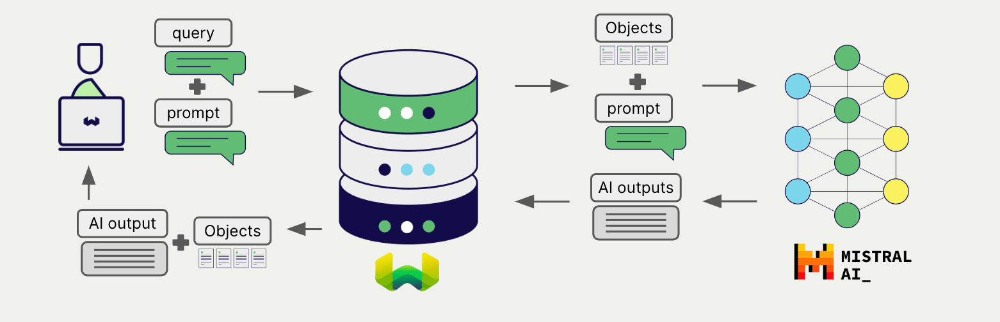

# Weaviate と Mistral の 生成 AI

import Tabs from '@theme/Tabs';
import TabItem from '@theme/TabItem';
import FilteredTextBlock from '@site/src/components/Documentation/FilteredTextBlock';
import PyConnect from '!!raw-loader!../_includes/provider.connect.py';
import TSConnect from '!!raw-loader!../_includes/provider.connect.ts';
import PyCode from '!!raw-loader!../_includes/provider.generative.py';
import TSCode from '!!raw-loader!../_includes/provider.generative.ts';

Weaviate と Mistral の API の統合により、Weaviate から直接モデルの機能を利用できます。

[Mistral を使用する生成 AI モデルを設定](#configure-collection)すると、Weaviate は 指定したモデルとお客様の Mistral API キーを使って 検索拡張生成 (RAG) を実行します。

より具体的には、Weaviate が検索を行い、最も関連性の高いオブジェクトを取得してから、それらを Mistral の生成モデルに渡して出力を生成します。

## 必要条件

### Weaviate の設定

お使いの Weaviate インスタンスは、Mistral 生成 AI 統合 (`generative-mistral`) モジュールを有効にしている必要があります。

  
Weaviate Cloud (WCD) 利用者向け

この統合は Weaviate Cloud (WCD) のサーバーレスインスタンスでデフォルトで有効になっています。

  
セルフホスト利用者向け

- モジュールが有効かどうかを確認するには、[クラスターメタデータ](/deploy/configuration/meta.md) をチェックしてください。  
- Weaviate でモジュールを有効にする手順は、[モジュール設定方法](../../configuration/modules.md) をご覧ください。

### API 認証情報

この統合には、有効な Mistral API キーを Weaviate に提供する必要があります。API キーは [Mistral](https://mistral.ai/) でサインアップし、取得してください。

Weaviate には次のいずれかの方法で API キーを渡せます。

- Weaviate から参照可能な `MISTRAL_APIKEY` 環境変数を設定する  
- 以下の例のように、実行時に API キーを渡す

<Tabs groupId="languages">

 <TabItem value="py" label="Python API v4">
    <FilteredTextBlock
      text={PyConnect}
      startMarker="# START MistralInstantiation"
      endMarker="# END MistralInstantiation"
      language="py"
    />
  </TabItem>

 <TabItem value="js" label="JS/TS API v3">
    <FilteredTextBlock
      text={TSConnect}
      startMarker="// START MistralInstantiation"
      endMarker="// END MistralInstantiation"
      language="ts"
    />
  </TabItem>

</Tabs>

## コレクションを設定

import MutableGenerativeConfig from '/_includes/mutable-generative-config.md';

<MutableGenerativeConfig />

Mistral の生成モデルを使用するには、次のように [Weaviate インデックスを設定](../../manage-collections/generative-reranker-models.mdx#specify-a-generative-model-integration)してください。

<Tabs groupId="languages">
  <TabItem value="py" label="Python API v4">
    <FilteredTextBlock
      text={PyCode}
      startMarker="# START BasicGenerativeMistral"
      endMarker="# END BasicGenerativeMistral"
      language="py"
    />
  </TabItem>

  <TabItem value="js" label="JS/TS API v3">
    <FilteredTextBlock
      text={TSCode}
      startMarker="// START BasicGenerativeMistral"
      endMarker="// END BasicGenerativeMistral"
      language="ts"
    />
  </TabItem>

</Tabs>

### モデルを選択

以下の設定例のように、Weaviate が使用する [利用可能なモデル](#available-models) のいずれかを指定できます。

<Tabs groupId="languages">
  <TabItem value="py" label="Python API v4">
    <FilteredTextBlock
      text={PyCode}
      startMarker="# START GenerativeMistralCustomModel"
      endMarker="# END GenerativeMistralCustomModel"
      language="py"
    />
  </TabItem>

  <TabItem value="js" label="JS/TS API v3">
    <FilteredTextBlock
      text={TSCode}
      startMarker="// START GenerativeMistralCustomModel"
      endMarker="// END GenerativeMistralCustomModel"
      language="ts"
    />
  </TabItem>

</Tabs>

Weaviate に使用させるモデルは、[生成パラメータ](#generative-parameters)で [利用可能なモデル](#available-models) のいずれかを指定できます。何も指定しない場合は [デフォルトモデル](#available-models) が使用されます。

### 生成パラメーター

モデルの挙動をカスタマイズするため、次の生成パラメーターを設定します。

<Tabs groupId="languages">
  <TabItem value="py" label="Python API v4">
    <FilteredTextBlock
      text={PyCode}
      startMarker="# START FullGenerativeMistral"
      endMarker="# END FullGenerativeMistral"
      language="py"
    />
  </TabItem>

  <TabItem value="js" label="JS/TS API v3">
    <FilteredTextBlock
      text={TSCode}
      startMarker="// START FullGenerativeMistral"
      endMarker="// END FullGenerativeMistral"
      language="ts"
    />
  </TabItem>

</Tabs>

モデルパラメーターの詳細については、[Mistral API ドキュメント](https://docs.mistral.ai/api/) を参照してください。

## 実行時にモデルを選択

コレクション作成時にデフォルトのモデルプロバイダーを設定するだけでなく、クエリ実行時に上書きすることもできます。

<Tabs groupId="languages">
  <TabItem value="py" label="Python API v4">
    <FilteredTextBlock
      text={PyCode}
      startMarker="# START RuntimeModelSelectionMistral"
      endMarker="# END RuntimeModelSelectionMistral"
      language="py"
    />
  </TabItem>
  <TabItem value="js" label="JS/TS Client v3">
    <FilteredTextBlock
      text={TSCode}
      startMarker="// START RuntimeModelSelectionMistral"
      endMarker="// END RuntimeModelSelectionMistral"
      language="ts"
    />
  </TabItem>
</Tabs>

## ヘッダーパラメーター

追加のリクエストヘッダーを使って、実行時に API キーおよびオプションのパラメーターを渡すことができます。利用可能なヘッダーは次のとおりです:

- `X-Mistral-Api-Key`: Mistral の API キー。
- `X-Mistral-Baseurl`: 既定の Mistral URL の代わりに使用するベース URL（例: プロキシ）。

実行時に指定した追加ヘッダーは、既存の Weaviate 設定を上書きします。

上記の [API 認証情報の例](#api-credentials) に示すとおりにヘッダーを指定してください。

## 検索拡張生成

生成 AI 連携を設定したら、単一プロンプト方式またはグループ化タスク方式のいずれかで RAG 操作を実行します。

### 単一プロンプト

検索結果に含まれる各オブジェクトごとにテキストを生成するには、単一プロンプト方式を使用します。

以下の例では、`limit` パラメーターで指定した `n` 件の検索結果それぞれに対して出力を生成します。

単一プロンプトクエリを作成する際は、波括弧 `{}` を使用して、言語モデルに渡したいオブジェクトのプロパティを埋め込みます。たとえばオブジェクトの `title` プロパティを渡すには、クエリ内に `{title}` を含めます。

<Tabs groupId="languages">

 <TabItem value="py" label="Python API v4">
    <FilteredTextBlock
      text={PyCode}
      startMarker="# START SinglePromptExample"
      endMarker="# END SinglePromptExample"
      language="py"
    />
  </TabItem>

 <TabItem value="js" label="JS/TS API v3">
    <FilteredTextBlock
      text={TSCode}
      startMarker="// START SinglePromptExample"
      endMarker="// END SinglePromptExample"
      language="ts"
    />
  </TabItem>

</Tabs>

### グループ化タスク

検索結果全体に対して 1 つのテキストを生成するには、グループ化タスク方式を使用します。

つまり、検索結果が `n` 件あっても、生成モデルは全体で 1 件の出力のみを生成します。

<Tabs groupId="languages">

 <TabItem value="py" label="Python API v4">
    <FilteredTextBlock
      text={PyCode}
      startMarker="# START GroupedTaskExample"
      endMarker="# END GroupedTaskExample"
      language="py"
    />
  </TabItem>

 <TabItem value="js" label="JS/TS API v3">
    <FilteredTextBlock
      text={TSCode}
      startMarker="// START GroupedTaskExample"
      endMarker="// END GroupedTaskExample"
      language="ts"
    />
  </TabItem>

</Tabs>

## 参考情報

### 利用可能なモデル

* `open-mistral-7b` (aka `mistral-tiny-2312`) (default)
* `open-mixtral-8x7b` (aka `mistral-small-2312`)
* `mistral-tiny`
* `mistral-small`
* `mistral-small-latest` (aka `mistral-small-2402`)
* `mistral-medium`
* `mistral-medium-latest` (aka `mistral-medium-2312`)
* `mistral-large-latest` (aka `mistral-large-2402`)

## 追加リソース

### その他の統合

- [Mistral 埋め込みモデル + Weaviate](./embeddings.md).

### コード例

統合がコレクションで設定されると、 Weaviate におけるデータ管理および検索操作は他のコレクションとまったく同じように動作します。以下のモデル非依存の例をご覧ください:

- [ How-to: コレクションを管理する ](../../manage-collections/index.mdx) および [ How-to: オブジェクトを管理する ](../../manage-objects/index.mdx) ガイドでは、データ操作（すなわち コレクション および その中のオブジェクトの作成・読み取り・更新・削除）の方法を説明しています。
- [ How-to: クエリ & 検索 ](../../search/index.mdx) ガイドでは、検索操作（つまり ベクトル、キーワード、ハイブリッド）および 検索拡張生成 の実行方法を説明しています。

### 参考情報

- Mistral [ AI API ドキュメント ](https://docs.mistral.ai/api/)

## 質問とフィードバック

import DocsFeedback from '/_includes/docs-feedback.mdx';

<DocsFeedback/>

