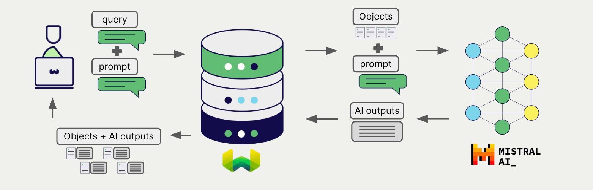

<!-- Note: for images, use https://docs.google.com/presentation/d/15opIcJuaIjEEcs_1Zm8B6pccox2p7_MHSjCnRv4dPfU/edit?usp=sharing -->

Mistral は、自然言語処理と生成のための幅広いモデルを提供しています。 Weaviate は Mistral の API とシームレスに統合されており、ユーザーは Weaviate Database から直接 Mistral のモデルを活用できます。

これらの統合により、開発者は高度な AI 駆動アプリケーションを簡単に構築できます。

## Mistral との統合

### ベクトル検索向け埋め込みモデル

Mistral の埋め込みモデルは、テキストデータを意味と文脈を捉えた ベクトル 埋め込みに変換します。

[Weaviate は Mistral の埋め込みモデルと統合](./embeddings.md)しており、データのシームレスなベクトル化を実現します。これにより、追加の前処理やデータ変換を行わずに、セマンティック検索やハイブリッド検索を実行できます。

[Mistral 埋め込み統合ページ](./embeddings.md)

### RAG 向け生成 AI モデル

Mistral の生成 AI モデルは、与えられたプロンプトとコンテキストに基づいて人間らしいテキストを生成できます。

[Weaviate の生成 AI 統合](./generative.md)により、 Weaviate Database から直接 検索拡張生成 (RAG) を実行できます。これにより、 Weaviate の効率的なストレージと高速検索機能に、 Mistral の生成 AI モデルを組み合わせて、パーソナライズされた文脈に応じた応答を生成します。

[Mistral 生成 AI 統合ページ](./generative.md)

## まとめ

これらの統合により、開発者は Weaviate 内で直接 Mistral の強力なモデルを活用できます。

その結果、 AI 駆動アプリケーションの構築が簡素化され、開発プロセスを加速し、革新的なソリューションの創出に注力できます。

## はじめに

これらの統合を利用するには、 Weaviate に有効な Mistral API キーを提供する必要があります。 [Mistral](https://mistral.ai/) にアクセスして登録し、 API キーを取得してください。

次に、該当する統合ページで、 Mistral モデルを使用するための Weaviate の設定方法をご確認ください。

- [テキスト埋め込み](./embeddings.md)
- [生成 AI](./generative.md)

## ご質問とフィードバック

import DocsFeedback from '/_includes/docs-feedback.mdx';

<DocsFeedback/>

