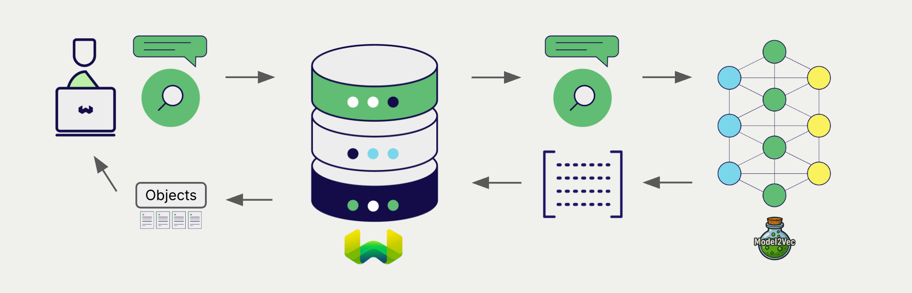

:::info `v1.31.0` で追加
:::

# Weaviate との Model2Vec 埋め込み


import Tabs from '@theme/Tabs';
import TabItem from '@theme/TabItem';
import FilteredTextBlock from '@site/src/components/Documentation/FilteredTextBlock';
import PyConnect from '!!raw-loader!../_includes/provider.connect.local.py';
import TSConnect from '!!raw-loader!../_includes/provider.connect.local.ts';
import PyCode from '!!raw-loader!../_includes/provider.vectorizer.py';
import TSCode from '!!raw-loader!../_includes/provider.vectorizer.ts';

Weaviate と Model2Vec のモデル統合により、Weaviate から直接それらのモデル機能を利用できます。

[Weaviate のベクトルインデックスを設定](#configure-the-vectorizer)して Model2Vec の埋め込みモデルを使用すると、Weaviate は Model2Vec 推論コンテナを介して指定したモデルで各種操作のための埋め込みを生成します。この機能は *vectorizer* と呼ばれます。

[インポート時](#data-import)には、Weaviate がテキストオブジェクトの埋め込みを生成してインデックスに保存します。[ベクトル](#vector-near-text-search) や [ハイブリッド](#hybrid-search) 検索操作では、Weaviate がテキストクエリを埋め込みに変換します。


## 要件

### Weaviate の設定

Weaviate インスタンスには、Model2Vec ベクトライザー統合（`text2vec-model2vec`）モジュールが有効になっている必要があります。

<details>
  <summary>Weaviate Cloud (WCD) ユーザー向け</summary>

この統合はローカルで動作する Model2Vec インスタンスを必要とするため、Weaviate Cloud (WCD) のサーバーレスインスタンスでは利用できません。

</details>

<details>
  <summary>セルフホストユーザー向け</summary>

- モジュールが有効かどうかを確認するには [クラスターメタデータ](/deploy/configuration/meta.md) をご覧ください。  
- Weaviate でモジュールを有効化するには、[モジュール設定方法](../../configuration/modules.md) を参照してください。

</details>

#### 統合の設定

この統合を使用するには、Model2Vec モデルのコンテナーイメージと、そのコンテナー化されたモデルの推論エンドポイントを設定する必要があります。

次の例は、Weaviate で Model2Vec 統合を設定する方法を示しています。

<Tabs groupId="languages">
<TabItem value="docker" label="Docker">

#### Docker オプション 1: 事前設定済み `docker-compose.yml` ファイルを使用

[Weaviate Docker インストールコンフィギュレーター](/deploy/installation-guides/docker-installation.md#configurator) の手順に従い、選択したモデルが設定済みの `docker-compose.yml` ファイルをダウンロードします  
<br/>

#### Docker オプション 2: 手動で設定を追加

または、以下の例のように `docker-compose.yml` ファイルへ手動で設定を追加します。

```yaml
services:
  weaviate:
    # Other Weaviate configuration
    environment:
      MODEL2VEC_INFERENCE_API: http://text2vec-model2vec:8080  # Set the inference API endpoint
  text2vec-model2vec:  # Set the name of the inference container
    image: cr.weaviate.io/semitechnologies/model2vec-inference:minishlab-potion-base-32M
```

- `MODEL2VEC_INFERENCE_API` 環境変数は推論 API エンドポイントを設定します  
- `text2vec-model2vec` は推論コンテナーの名前です  
- `image` はコンテナーイメージです  

</TabItem>
<TabItem value="k8s" label="Kubernetes">

Weaviate の Helm チャート values ファイルの `modules` セクションに `text2vec-model2vec` モジュールを追加または更新して、Model2Vec 統合を設定します。たとえば、`values.yaml` ファイルを次のように変更します。

```yaml
modules:

  text2vec-model2vec:

    enabled: true
    tag: minishlab-potion-base-8M
    repo: semitechnologies/model2vec-inference
    registry: cr.weaviate.io
```

より多くの設定オプションを含む `values.yaml` ファイルの例については、[Weaviate Helm チャート](https://github.com/weaviate/weaviate-helm/blob/master/weaviate/values.yaml) を参照してください。

</TabItem>
</Tabs>

### 認証情報

この統合はローカルの Model2Vec コンテナーに接続するため、追加の認証情報（例: API キー）は不要です。以下の例のように通常どおり Weaviate へ接続してください。

<Tabs groupId="languages">

 <TabItem value="py" label="Python API v4">
    <FilteredTextBlock
      text={PyConnect}
      startMarker="# START BasicInstantiation"
      endMarker="# END BasicInstantiation"
      language="py"
    />
  </TabItem>

 <TabItem value="js" label="JS/TS API v3">
    <FilteredTextBlock
      text={TSConnect}
      startMarker="// START BasicInstantiation"
      endMarker="// END BasicInstantiation"
      language="ts"
    />
  </TabItem>

</Tabs>

## ベクトライザーの設定

[Weaviate インデックスを設定](../../manage-collections/vector-config.mdx#specify-a-vectorizer)して、Model2Vec の埋め込みモデルを使用するには次のようにします。

<Tabs groupId="languages">
  <TabItem value="py" label="Python API v4">
    <FilteredTextBlock
      text={PyCode}
      startMarker="# START BasicVectorizerModel2Vec"
      endMarker="# END BasicVectorizerModel2Vec"
      language="py"
    />
  </TabItem>

  <TabItem value="js" label="JS/TS API v3">
    <FilteredTextBlock
      text={TSCode}
      startMarker="// START BasicVectorizerModel2Vec"
      endMarker="// END BasicVectorizerModel2Vec"
      language="ts"
    />
  </TabItem>

</Tabs>

この統合では、使用するモデルを Weaviate の設定ファイル内で指定します。

import VectorizationBehavior from '/_includes/vectorization.behavior.mdx';

<details>
  <summary>ベクトル化の動作</summary>

<VectorizationBehavior/>

</details>


## データのインポート

ベクトライザーを設定したら、[データをインポート](../../manage-objects/import.mdx) して Weaviate に取り込みます。 Weaviate は指定したモデルを使用してテキストオブジェクトの埋め込みを生成します。

<Tabs groupId="languages">

 <TabItem value="py" label="Python API v4">
    <FilteredTextBlock
      text={PyCode}
      startMarker="# START BatchImportExample"
      endMarker="# END BatchImportExample"
      language="py"
    />
  </TabItem>

 <TabItem value="js" label="JS/TS API v3">
    <FilteredTextBlock
      text={TSCode}
      startMarker="// START BatchImportExample"
      endMarker="// END BatchImportExample"
      language="ts"
    />
  </TabItem>

</Tabs>

:::tip 既存ベクトルの再利用
互換性のあるモデル ベクトル がすでにある場合は、それを直接 Weaviate に渡せます。すでに同じモデルで埋め込みを生成しており、別のシステムからデータを移行する際などに Weaviate で再利用したい場合に便利です。
:::

## 検索

ベクトライザーを設定すると、 Weaviate は指定した Model2Vec モデルを使用して ベクトル 検索とハイブリッド検索を実行します。



### ベクトル（ニアテキスト）検索

ベクトル検索を実行すると、 Weaviate は指定されたモデルを使用してテキストクエリを埋め込みに変換し、データベースから最も類似したオブジェクトを返します。

以下のクエリは、`limit` で設定した `n` 件の最も類似したオブジェクトをデータベースから返します。

<Tabs groupId="languages">

 <TabItem value="py" label="Python API v4">
    <FilteredTextBlock
      text={PyCode}
      startMarker="# START NearTextExample"
      endMarker="# END NearTextExample"
      language="py"
    />
  </TabItem>

 <TabItem value="js" label="JS/TS API v3">
    <FilteredTextBlock
      text={TSCode}
      startMarker="// START NearTextExample"
      endMarker="// END NearTextExample"
      language="ts"
    />
  </TabItem>

</Tabs>

### ハイブリッド検索

:::info ハイブリッド検索とは？
ハイブリッド検索では、ベクトル検索とキーワード（BM25）検索を行い、[結果を結合](../../search/hybrid.md) してデータベースから最適な一致オブジェクトを返します。
:::

ハイブリッド検索を実行すると、 Weaviate は指定されたモデルを使用してテキストクエリを埋め込みに変換し、データベースから最高スコアのオブジェクトを返します。

以下のクエリは、`limit` で設定した `n` 件の最高スコアのオブジェクトをデータベースから返します。

<Tabs groupId="languages">

 <TabItem value="py" label="Python API v4">
    <FilteredTextBlock
      text={PyCode}
      startMarker="# START HybridExample"
      endMarker="# END HybridExample"
      language="py"
    />
  </TabItem>

 <TabItem value="js" label="JS/TS API v3">
    <FilteredTextBlock
      text={TSCode}
      startMarker="// START HybridExample"
      endMarker="// END HybridExample"
      language="ts"
    />
  </TabItem>

</Tabs>

## 参考資料

<!-- #### Example configuration -->

<!-- Hiding "full" examples as no other parameters exist than shown above -->

<!-- <Tabs groupId="languages">
  <TabItem value="py" label="Python API v4">
    <FilteredTextBlock
      text={PyCode}
      startMarker="# START FullVectorizerModel2Vec"
      endMarker="# END FullVectorizerModel2Vec"
      language="py"
    />
  </TabItem>

  <TabItem value="js" label="JS/TS API v3">
    <FilteredTextBlock
      text={TSCode}
      startMarker="// START FullVectorizerModel2Vec"
      endMarker="// END FullVectorizerModel2Vec"
      language="ts"
    />
  </TabItem>

</Tabs> -->


### 利用可能なモデル

最新のモデル一覧については、 Docker Hub の [model2vec-inference](https://hub.docker.com/r/semitechnologies/model2vec-inference/tags) コンテナのタグをご覧ください。

## 追加リソース

### コード例

コレクションでインテグレーションが設定されると、 Weaviate のデータ管理および検索操作は他のコレクションと同様に機能します。以下のモデル非依存の例をご確認ください。

- [How-to: コレクションの管理](../../manage-collections/index.mdx) と [How-to: オブジェクトの管理](../../manage-objects/index.mdx) の各ガイドでは、データ操作（コレクションおよびその中のオブジェクトの作成・読み取り・更新・削除）の方法を示しています。
- [How-to: クエリ & 検索](../../search/index.mdx) ガイドでは、検索操作（ベクトル、キーワード、ハイブリッド）に加えて検索拡張生成の実行方法を説明しています。

### 外部リソース

- [Model2Vec ドキュメント](https://minish.ai/packages/model2vec/introduction)

## 質問とフィードバック

import DocsFeedback from '/_includes/docs-feedback.mdx';

<DocsFeedback/>

