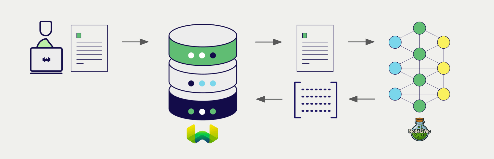

<!-- Note: for images, use https://docs.google.com/presentation/d/15opIcJuaIjEEcs_1Zm8B6pccox2p7_MHSjCnRv4dPfU/edit?usp=sharing -->

Model2Vec ライブラリを利用すると、軽量でスタティックなモデルとして、さまざまな埋め込みモデルをローカルデバイス上で簡単に実行できます。Weaviate は Model2Vec ライブラリとシームレスに統合されており、互換性のあるモデルを Weaviate Database から直接活用できます。

これらの統合により、開発者は高度な AI ドリブンアプリケーションを簡単に構築できます。

## Model2Vec との統合

Weaviate は、ローカルでホストされている Model2Vec API にアクセスすることで、互換性のある Model2Vec モデルと統合します。

### ベクトル検索用埋め込みモデル

Model2Vec の埋め込みモデルは、テキストデータをベクトル 埋め込みに変換し、高速なスタティック版の sentence transformer モデルを使用します。

[Weaviate は Model2Vec の埋め込みモデルと統合](./embeddings.md) し、データのベクトル化を容易にします。この統合により、追加の前処理やデータ変換を行わずに、セマンティック検索やハイブリッド検索を実行できます。

[Model2Vec 埋め込み統合ページ](./embeddings.md)

## まとめ

これらの統合により、開発者は Weaviate から直接強力な Model2Vec モデルを活用できます。

その結果、AI ドリブンアプリケーションの構築プロセスが簡素化され、開発を加速し、革新的なソリューションの創出に集中できます。

## はじめに

これらの統合を利用するには、Model2Vec モデルをホストできるローカルホストの Weaviate インスタンスが必要です。

該当する統合ページで、Weaviate を Model2Vec モデルと連携させる方法を学び、アプリケーションで活用してください。

- [テキスト埋め込み](./embeddings.md)

## 質問とフィードバック

import DocsFeedback from '/_includes/docs-feedback.mdx';

<DocsFeedback/>

