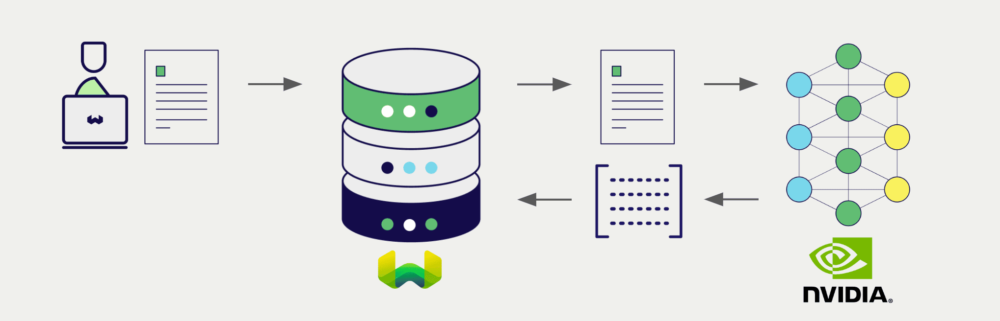
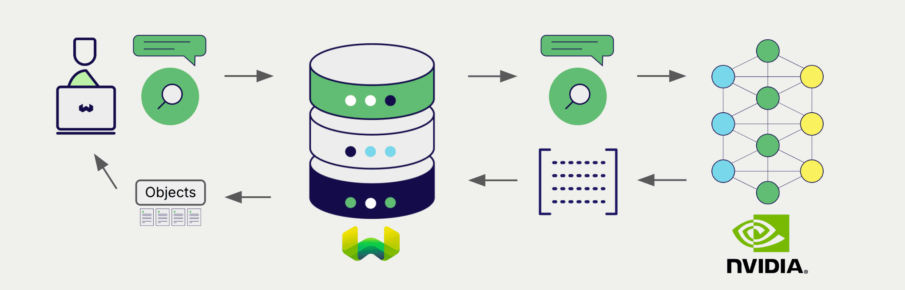

# Weaviate による NVIDIA マルチモーダル埋め込み

:::info  `v1.28.5`、`v1.29.0` で追加
:::

import Tabs from '@theme/Tabs';
import TabItem from '@theme/TabItem';
import FilteredTextBlock from '@site/src/components/Documentation/FilteredTextBlock';
import PyConnect from '!!raw-loader!../_includes/provider.connect.py';
import TSConnect from '!!raw-loader!../_includes/provider.connect.ts';
import PyCode from '!!raw-loader!../_includes/provider.vectorizer.py';
import TSCode from '!!raw-loader!../_includes/provider.vectorizer.ts';

Weaviate と NVIDIA の API の統合により、Weaviate から直接 NVIDIA モデルの機能にアクセスできます。

[Weaviate ベクトルインデックスを設定](#configure-the-vectorizer) して NVIDIA の埋め込みモデルを使用すると、Weaviate は指定したモデルとお客様の NVIDIA NIM API キーを用いて、さまざまな操作のための埋め込みを生成します。この機能は *vectorizer* と呼ばれます。

[インポート時](#data-import) に、Weaviate はマルチモーダルオブジェクトの埋め込みを生成し、インデックスに保存します。[vector](#vector-near-text-search) 検索および [hybrid](#hybrid-search) 検索では、Weaviate がテキストクエリを埋め込みに変換します。[マルチモーダル検索](#vector-near-media-search) にも対応しています。

## 要件

### Weaviate の構成

お使いの Weaviate インスタンスには、NVIDIA ベクトライザー統合（`multi2vec-nvidia`）モジュールが有効になっている必要があります。

  
Weaviate Cloud (WCD) ユーザー向け

この統合は、Weaviate Cloud (WCD) のサーバーレスインスタンスではデフォルトで有効になっています。

  
セルフホストユーザー向け

- モジュールが有効かどうかを確認するには、[クラスターのメタデータ](/deploy/configuration/meta.md) をチェックしてください。
- Weaviate でモジュールを有効にする方法は、[モジュール設定方法](../../configuration/modules.md) ガイドをご覧ください。

### API 認証情報

この統合を利用するには、有効な NVIDIA NIM API キーを Weaviate に提供する必要があります。API キーは [NVIDIA](https://build.nvidia.com/) にサインアップして取得してください。

以下のいずれかの方法で Weaviate に API キーを渡します。

- Weaviate にアクセス可能な環境変数 `NVIDIA_APIKEY` を設定する  
- 後述の例のように、実行時に API キーを渡す

<Tabs groupId="languages">

 <TabItem value="py" label="Python API v4">
    <FilteredTextBlock
      text={PyConnect}
      startMarker="# START NVIDIAInstantiation"
      endMarker="# END NVIDIAInstantiation"
      language="py"
    />
  </TabItem>

 <TabItem value="js" label="JS/TS API v3">
    <FilteredTextBlock
      text={TSConnect}
      startMarker="// START NVIDIAInstantiation"
      endMarker="// END NVIDIAInstantiation"
      language="ts"
    />
  </TabItem>

</Tabs>

## Vectorizer の設定

NVIDIA の埋め込みモデルを使用するように、以下のように [Weaviate インデックスを設定](../../manage-collections/vector-config.mdx#specify-a-vectorizer) します。

<Tabs groupId="languages">
  <TabItem value="py" label="Python API v4">
    <FilteredTextBlock
      text={PyCode}
      startMarker="# START BasicMMVectorizerNVIDIA"
      endMarker="# END BasicMMVectorizerNVIDIA"
      language="py"
    />
  </TabItem>

  <TabItem value="js" label="JS/TS API v3">
    <FilteredTextBlock
      text={TSCode}
      startMarker="// START BasicMMVectorizerNVIDIA"
      endMarker="// END BasicMMVectorizerNVIDIA"
      language="ts"
    />
  </TabItem>

</Tabs>

### モデルの選択

次の設定例のように、[利用可能なモデル](#available-models) のいずれかを Vectorizer に指定できます。

<Tabs groupId="languages">
  <TabItem value="py" label="Python API v4">
    <FilteredTextBlock
      text={PyCode}
      startMarker="# START MMVectorizerNVIDIACustomModel"
      endMarker="# END MMVectorizerNVIDIACustomModel"
      language="py"
    />
  </TabItem>

  <TabItem value="js" label="JS/TS API v3">
    <FilteredTextBlock
      text={TSCode}
      startMarker="// START MMVectorizerNVIDIACustomModel"
      endMarker="// END MMVectorizerNVIDIACustomModel"
      language="ts"
    />
  </TabItem>

</Tabs>

[Vectorizer のパラメーター](#vectorizer-parameters) で [利用可能なモデル](#available-models) のいずれかを指定できます。モデルを指定しない場合は、[デフォルトモデル](#available-models) が使用されます。

import VectorizationBehavior from '/_includes/vectorization.behavior.mdx';

  
ベクトル化動作

<VectorizationBehavior/>

### ベクトライザーのパラメーター

次の例では、 NVIDIA 固有のオプションを設定する方法を示します。

<Tabs groupId="languages">
  <TabItem value="py" label="Python API v4">
    <FilteredTextBlock
      text={PyCode}
      startMarker="# START FullMMVectorizerNVIDIA"
      endMarker="# END FullMMVectorizerNVIDIA"
      language="py"
    />
  </TabItem>

  <TabItem value="js" label="JS/TS API v3">
    <FilteredTextBlock
      text={TSCode}
      startMarker="// START FullMMVectorizerNVIDIA"
      endMarker="// END FullMMVectorizerNVIDIA"
      language="ts"
    />
  </TabItem>
</Tabs>

モデルのパラメーターの詳細については、[ NVIDIA NIM API ドキュメント](https://docs.api.nvidia.com/nim/reference/retrieval-apis) を参照してください。

## データのインポート

ベクトライザーを設定したら、[データをインポート](../../manage-objects/import.mdx) して Weaviate に取り込みます。 Weaviate は指定したモデルを使用してテキストオブジェクトの埋め込みを生成します。

<Tabs groupId="languages">

 <TabItem value="py" label="Python API v4">
    <FilteredTextBlock
      text={PyCode}
      startMarker="# START MMBatchImportExample"
      endMarker="# END MMBatchImportExample"
      language="py"
    />
  </TabItem>

 <TabItem value="js" label="JS/TS API v3">
    <FilteredTextBlock
      text={TSCode}
      startMarker="// START MMBatchImportExample"
      endMarker="// END MMBatchImportExample"
      language="ts"
    />
  </TabItem>
</Tabs>

:::tip 既存ベクトルの再利用
すでに互換性のあるモデル ベクトルがある場合は、それを直接 Weaviate に渡すことができます。同じモデルで埋め込みをすでに生成しており、別のシステムからデータを移行する際などに Weaviate で再利用したい場合に便利です。
:::

## 検索

ベクトライザーが設定されると、 Weaviate は指定した NVIDIA モデルを使用して ベクトル 検索とハイブリッド検索を実行します。

### ベクトル（near text）検索

[ベクトル検索](../../search/similarity.md#search-with-text) を実行すると、 Weaviate はテキストクエリを指定したモデルで埋め込みに変換し、データベースから最も類似したオブジェクトを返します。

以下のクエリは、`limit` で設定した件数に基づき、データベースから `n` 件の最も類似したオブジェクトを返します。

<Tabs groupId="languages">

 <TabItem value="py" label="Python API v4">
    <FilteredTextBlock
      text={PyCode}
      startMarker="# START NearTextExample"
      endMarker="# END NearTextExample"
      language="py"
    />
  </TabItem>

 <TabItem value="js" label="JS/TS API v3">
    <FilteredTextBlock
      text={TSCode}
      startMarker="// START NearTextExample"
      endMarker="// END NearTextExample"
      language="ts"
    />
  </TabItem>
</Tabs>

### ハイブリッド検索

:::info ハイブリッド検索とは？
ハイブリッド検索は、ベクトル検索とキーワード（ BM25 ）検索を実行し、その結果を[融合](../../search/hybrid.md#change-the-fusion-method)して、データベースから最も一致するオブジェクトを返します。
:::

[ハイブリッド検索](../../search/hybrid.md) を実行すると、 Weaviate はテキストクエリを指定したモデルで埋め込みに変換し、データベースからスコアが最も高いオブジェクトを返します。

以下のクエリは、`limit` で設定した件数に基づき、データベースから `n` 件の最高スコアのオブジェクトを返します。

<Tabs groupId="languages">

 <TabItem value="py" label="Python API v4">
    <FilteredTextBlock
      text={PyCode}
      startMarker="# START HybridExample"
      endMarker="# END HybridExample"
      language="py"
    />
  </TabItem>

 <TabItem value="js" label="JS/TS API v3">
    <FilteredTextBlock
      text={TSCode}
      startMarker="// START HybridExample"
      endMarker="// END HybridExample"
      language="ts"
    />
  </TabItem>
</Tabs>

### ベクトル（near media）検索

[near image 検索](../../search/similarity.md#search-with-image) などのメディア検索を実行すると、 Weaviate は指定したモデルを使用してクエリを埋め込みに変換し、データベースから最も類似したオブジェクトを返します。

near image 検索などの near media 検索を行うには、メディアクエリを base64 文字列に変換し、それを検索クエリに渡します。

以下のクエリは、 `limit` で設定した数だけ、入力画像に最も類似した `n` 件のオブジェクトをデータベースから返します。

<Tabs groupId="languages">

 <TabItem value="py" label="Python API v4">
    <FilteredTextBlock
      text={PyCode}
      startMarker="# START NearImageExample"
      endMarker="# END NearImageExample"
      language="py"
    />
  </TabItem>

 <TabItem value="js" label="JS/TS API v3">
    <FilteredTextBlock
      text={TSCode}
      startMarker="// START NearImageExample"
      endMarker="// END NearImageExample"
      language="ts"
    />
  </TabItem>

</Tabs>

## 参考情報

### 利用可能なモデル

Weaviate では、 [NVIDIA NIM APIs](https://build.nvidia.com/models) 上の任意のマルチモーダル埋め込みモデルを使用できます。

デフォルトモデルは `nvidia/nvclip` です。

## さらなるリソース

### その他の統合

- [NVIDIA テキスト埋め込みモデル + Weaviate](./embeddings.md).
- [NVIDIA 生成モデル + Weaviate](./generative.md).
- [NVIDIA リランキングモデル + Weaviate](./reranker.md).

### コード例

コレクションで統合を設定すると、 Weaviate のデータ管理および検索操作は他のコレクションと同じ方法で機能します。モデルに依存しない例については、以下を参照してください。

- [How-to: コレクションを管理する](../../manage-collections/index.mdx) と [How-to: オブジェクトを管理する](../../manage-objects/index.mdx) では、データ操作（作成・読み取り・更新・削除）の方法を説明しています。
- [How-to: クエリ & 検索](../../search/index.mdx) では、ベクトル、キーワード、ハイブリッド検索、および検索拡張生成の実行方法を説明しています。

### 外部リソース

- [NVIDIA NIM API documentation](https://docs.api.nvidia.com/nim/)

## ご質問とフィードバック

import DocsFeedback from '/_includes/docs-feedback.mdx';

<DocsFeedback/>

