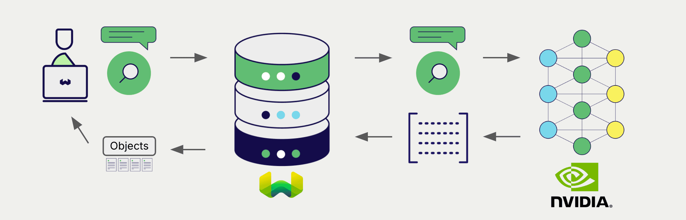

# Weaviate における NVIDIA 埋め込み

:::info `v1.28.5` と `v1.29.0` で追加
:::

import Tabs from '@theme/Tabs';
import TabItem from '@theme/TabItem';
import FilteredTextBlock from '@site/src/components/Documentation/FilteredTextBlock';
import PyConnect from '!!raw-loader!../_includes/provider.connect.py';
import TSConnect from '!!raw-loader!../_includes/provider.connect.ts';
import GoConnect from '!!raw-loader!/_includes/code/howto/go/docs/model-providers/1-connect/main.go';
import PyCode from '!!raw-loader!../_includes/provider.vectorizer.py';
import TSCode from '!!raw-loader!../_includes/provider.vectorizer.ts';
import GoCode from '!!raw-loader!/_includes/code/howto/go/docs/model-providers/2-usage-text/main.go';

Weaviate と NVIDIA API の統合により、NVIDIA モデルの機能を Weaviate から直接利用できます。

[NVIDIA で埋め込みモデルを使用するように Weaviate のベクトルインデックスを設定](#configure-the-vectorizer)すると、指定したモデルとお客様の NVIDIA NIM API キーを用いて、さまざまな操作のための埋め込みを Weaviate が生成します。この機能は *ベクトライザー* と呼ばれます。

[インポート時](#data-import)には、Weaviate がテキストオブジェクトの埋め込みを生成してインデックスに保存します。[vector](#vector-near-text-search) や [hybrid](#hybrid-search) 検索操作では、Weaviate がテキストクエリを埋め込みに変換します。

## 前提条件

### Weaviate の構成

お使いの Weaviate インスタンスには、NVIDIA ベクトライザー統合モジュール (`text2vec-nvidia`) が有効になっている必要があります。

  
Weaviate Cloud (WCD) ユーザー向け

この統合は、Weaviate Cloud (WCD) のサーバーレスインスタンスではデフォルトで有効になっています。

  
セルフホストユーザー向け

- モジュールが有効かどうかを確認するには、[クラスターメタデータ](/deploy/configuration/meta.md) を確認してください。
- Weaviate でモジュールを有効にする方法は、[モジュール設定方法](../../configuration/modules.md) ガイドをご覧ください。

### API 資格情報

この統合を利用するには、有効な NVIDIA NIM API キーを Weaviate に提供する必要があります。[NVIDIA](https://build.nvidia.com/) にアクセスしてサインアップし、API キーを取得してください。

API キーは次のいずれかの方法で Weaviate に提供します。

- Weaviate が参照できる `NVIDIA_APIKEY` 環境変数を設定する
- 以下の例のように、実行時に API キーを渡す

<Tabs groupId="languages">

  <TabItem value="py" label="Python API v4">
    <FilteredTextBlock
      text={PyConnect}
      startMarker="# START NVIDIAInstantiation"
      endMarker="# END NVIDIAInstantiation"
      language="py"
      docRefs={[
        "weaviate.html#weaviate.connect_to_weaviate_cloud",
        "weaviate.html#weaviate.auth.Auth",
      ]}
    />
  </TabItem>

  <TabItem value="js" label="JS/TS API v3">
    <FilteredTextBlock
      text={TSConnect}
      startMarker="// START NVIDIAInstantiation"
      endMarker="// END NVIDIAInstantiation"
      language="ts"
      docRefs={[
        "functions/connectToWeaviateCloud",
        "classes/ApiKey",
      ]}
    />
  </TabItem>

  <TabItem value="go" label="Go">
    <FilteredTextBlock
      text={GoConnect}
      startMarker="// START NVIDIAInstantiation"
      endMarker="// END NVIDIAInstantiation"
      language="goraw"
    />
  </TabItem>
</Tabs>

## ベクトライザーの設定

NVIDIA の埋め込みモデルを使用するために、次のように Weaviate インデックスを設定します：

<Tabs groupId="languages">
  <TabItem value="py" label="Python API v4">
    <FilteredTextBlock
      text={PyCode}
      startMarker="# START BasicVectorizerNVIDIA"
      endMarker="# END BasicVectorizerNVIDIA"
      language="py"
    />
  </TabItem>

  <TabItem value="js" label="JS/TS API v3">
    <FilteredTextBlock
      text={TSCode}
      startMarker="// START BasicVectorizerNVIDIA"
      endMarker="// END BasicVectorizerNVIDIA"
      language="ts"
    />
  </TabItem>

  <TabItem value="go" label="Go">
    <FilteredTextBlock
      text={GoCode}
      startMarker="// START BasicVectorizerNVIDIA"
      endMarker="// END BasicVectorizerNVIDIA"
      language="goraw"
    />
  </TabItem>

</Tabs>

### モデルの選択

次の設定例に示すように、ベクトライザーで使用する [利用可能なモデル](#available-models) のいずれかを指定できます。

<Tabs groupId="languages">
  <TabItem value="py" label="Python API v4">
    <FilteredTextBlock
      text={PyCode}
      startMarker="# START VectorizerNVIDIACustomModel"
      endMarker="# END VectorizerNVIDIACustomModel"
      language="py"
    />
  </TabItem>

  <TabItem value="js" label="JS/TS API v3">
    <FilteredTextBlock
      text={TSCode}
      startMarker="// START VectorizerNVIDIACustomModel"
      endMarker="// END VectorizerNVIDIACustomModel"
      language="ts"
    />
  </TabItem>

  <TabItem value="go" label="Go">
    <FilteredTextBlock
      text={GoCode}
      startMarker="// START VectorizerNVIDIACustomModel"
      endMarker="// END VectorizerNVIDIACustomModel"
      language="goraw"
    />
  </TabItem>

</Tabs>

[利用可能なモデル](#available-models) のいずれかを [指定](#vectorizer-parameters) して、 Weaviate が使用するモデルを設定できます。モデルを指定しない場合は、 [デフォルトモデル](#available-models) が使用されます。

import VectorizationBehavior from '/_includes/vectorization.behavior.mdx';

  
ベクトル化の挙動

<VectorizationBehavior/>

### ベクトライザーのパラメーター

以下の例では、 NVIDIA 固有のオプションを設定する方法を示します。

<Tabs groupId="languages">
  <TabItem value="py" label="Python API v4">
    <FilteredTextBlock
      text={PyCode}
      startMarker="# START FullVectorizerNVIDIA"
      endMarker="# END FullVectorizerNVIDIA"
      language="py"
    />
  </TabItem>

  <TabItem value="js" label="JS/TS API v3">
    <FilteredTextBlock
      text={TSCode}
      startMarker="// START FullVectorizerNVIDIA"
      endMarker="// END FullVectorizerNVIDIA"
      language="ts"
    />
  </TabItem>

  <TabItem value="go" label="Go">
    <FilteredTextBlock
      text={GoCode}
      startMarker="// START FullVectorizerNVIDIA"
      endMarker="// END FullVectorizerNVIDIA"
      language="goraw"
    />
  </TabItem>
</Tabs>

モデルパラメーターの詳細については、 [NVIDIA NIM API ドキュメント](https://docs.api.nvidia.com/nim/reference/retrieval-apis) をご覧ください。

## データのインポート

ベクトライザーを設定したら、 [データをインポート](../../manage-objects/import.mdx) して Weaviate に取り込みます。 Weaviate は指定したモデルを使用してテキストオブジェクトの埋め込みを生成します。

<Tabs groupId="languages">

 <TabItem value="py" label="Python API v4">
    <FilteredTextBlock
      text={PyCode}
      startMarker="# START BatchImportExample"
      endMarker="# END BatchImportExample"
      language="py"
    />
  </TabItem>

 <TabItem value="js" label="JS/TS API v3">
    <FilteredTextBlock
      text={TSCode}
      startMarker="// START BatchImportExample"
      endMarker="// END BatchImportExample"
      language="ts"
    />
  </TabItem>

 <TabItem value="go" label="Go">
    <FilteredTextBlock
      text={GoCode}
      startMarker="// START BatchImportExample"
      endMarker="// END BatchImportExample"
      language="goraw"
    />
  </TabItem>

</Tabs>

:::tip 既存のベクトルを再利用
互換性のあるモデルのベクトルが既にある場合は、それを直接 Weaviate に渡すことができます。同じモデルで既に埋め込みを生成しており、別のシステムからデータを移行する際などに便利です。
:::

## 検索

ベクトライザーの設定が完了すると、 Weaviate は指定した NVIDIA モデルを使用してベクトル検索およびハイブリッド検索を実行します。

### ベクトル (near text) 検索

ベクトル検索を実行すると、 Weaviate は指定したモデルを使ってテキストクエリを埋め込みへ変換し、データベースから最も類似したオブジェクトを返します。

以下のクエリは、 `limit` で指定した `n` 件の最も類似したオブジェクトをデータベースから返します。

<Tabs groupId="languages">

 <TabItem value="py" label="Python API v4">
    <FilteredTextBlock
      text={PyCode}
      startMarker="# START NearTextExample"
      endMarker="# END NearTextExample"
      language="py"
    />
  </TabItem>

 <TabItem value="js" label="JS/TS API v3">
    <FilteredTextBlock
      text={TSCode}
      startMarker="// START NearTextExample"
      endMarker="// END NearTextExample"
      language="ts"
    />
  </TabItem>

 <TabItem value="go" label="Go">
    <FilteredTextBlock
      text={GoCode}
      startMarker="// START NearTextExample"
      endMarker="// END NearTextExample"
      language="goraw"
    />
  </TabItem>

</Tabs>

### ハイブリッド検索

:::info ハイブリッド検索とは？
ハイブリッド検索はベクトル検索とキーワード (BM25) 検索を実行し、 [結果を結合](../../search/hybrid.md#change-the-fusion-method) してデータベースから最も適合するオブジェクトを返します。
:::

ハイブリッド検索を実行すると、 Weaviate は指定したモデルを使ってテキストクエリを埋め込みへ変換し、データベースから最高スコアのオブジェクトを返します。

以下のクエリは、 `limit` で指定した `n` 件の最高スコアのオブジェクトをデータベースから返します。

<Tabs groupId="languages">

 <TabItem value="py" label="Python API v4">
    <FilteredTextBlock
      text={PyCode}
      startMarker="# START HybridExample"
      endMarker="# END HybridExample"
      language="py"
    />
  </TabItem>

 <TabItem value="js" label="JS/TS API v3">
    <FilteredTextBlock
      text={TSCode}
      startMarker="// START HybridExample"
      endMarker="// END HybridExample"
      language="ts"
    />
  </TabItem>

 <TabItem value="go" label="Go">
    <FilteredTextBlock
      text={GoCode}
      startMarker="// START HybridExample"
      endMarker="// END HybridExample"
      language="goraw"
    />
  </TabItem>
</Tabs>

## 参考資料

### 利用可能なモデル

Weaviate では、 NVIDIA NIM APIs 上の任意のテキスト埋め込みモデルを利用できます。

デフォルトモデルは `nvidia/nv-embed-v1` です。

## さらなるリソース

### その他の統合

- [NVIDIA マルチモーダル埋め込みモデル + Weaviate](./embeddings-multimodal.md)
- [NVIDIA 生成モデル + Weaviate](./generative.md)
- [NVIDIA リランカーモデル + Weaviate](./reranker.md)

### コード例

コレクションで統合設定を済ませれば、 Weaviate におけるデータ管理および検索操作は他のコレクションと同様に動作します。モデルに依存しない次の例をご覧ください。

- [How-to: コレクションを管理する](../../manage-collections/index.mdx) と [How-to: オブジェクトを管理する](../../manage-objects/index.mdx) のガイドでは、データ操作 (つまりコレクションおよびその中のオブジェクトの作成・読み取り・更新・削除) の方法を説明しています。
- [How-to: クエリと検索](../../search/index.mdx) のガイドでは、ベクトル・キーワード・ハイブリッドなどの検索操作および 検索拡張生成 の実行方法を説明しています。

### 外部リソース

- [NVIDIA NIM API ドキュメント](https://docs.api.nvidia.com/nim/)

## 質問とフィードバック

import DocsFeedback from '/_includes/docs-feedback.mdx';

<DocsFeedback/>

