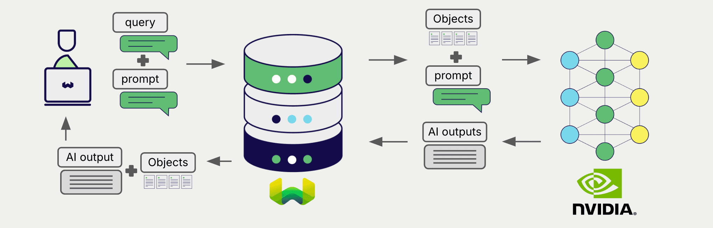

# Weaviate での NVIDIA 生成 AI

:::info `v1.28.5`、`v1.29.0` で追加
:::

import Tabs from '@theme/Tabs';
import TabItem from '@theme/TabItem';
import FilteredTextBlock from '@site/src/components/Documentation/FilteredTextBlock';
import PyConnect from '!!raw-loader!../_includes/provider.connect.py';
import TSConnect from '!!raw-loader!../_includes/provider.connect.ts';
import PyCode from '!!raw-loader!../_includes/provider.generative.py';
import TSCode from '!!raw-loader!../_includes/provider.generative.ts';

Weaviate の NVIDIA NIM API 連携を利用すると、Weaviate から直接 NVIDIA のモデル機能にアクセスできます。

[Weaviate コレクションを設定](#configure-collection)して NVIDIA の生成 AI モデルを使用すると、Weaviate が 検索拡張生成 (RAG) を行います。指定したモデルとお客様の NVIDIA NIM API キーを用いて処理します。

具体的には、Weaviate が検索を実行して最も関連性の高いオブジェクトを取得し、それらを NVIDIA の生成モデルに渡して出力を生成します。

## Requirements

### Weaviate の設定

ご利用の Weaviate インスタンスには NVIDIA 生成モジュール (`generative-nvidia`) が有効になっている必要があります。

  
Weaviate Cloud (WCD) ユーザー向け

この連携は Weaviate Cloud (WCD) のサーバーレスインスタンスではデフォルトで有効です。

  
セルフホストユーザー向け

- モジュールが有効かどうかを確認するには、[クラスターメタデータ](/deploy/configuration/meta.md) をチェックしてください。  
- Weaviate でモジュールを有効にする方法は、[モジュール設定ガイド](../../configuration/modules.md) をご覧ください。

### API 資格情報

この連携を利用するには、有効な API キーを Weaviate に提供する必要があります。登録とキー取得は [NVIDIA](https://build.nvidia.com/) で行えます。

以下のいずれかの方法で Weaviate に API キーを渡してください。

- `NVIDIA_APIKEY` 環境変数を設定し、Weaviate から参照できるようにする。  
- 以降の例のように、実行時にトークンを渡す。

<Tabs groupId="languages">

 <TabItem value="py" label="Python API v4">
    <FilteredTextBlock
      text={PyConnect}
      startMarker="# START NVIDIAInstantiation"
      endMarker="# END NVIDIAInstantiation"
      language="py"
    />
  </TabItem>

 <TabItem value="js" label="JS/TS API v3">
    <FilteredTextBlock
      text={TSConnect}
      startMarker="// START NVIDIAInstantiation"
      endMarker="// END NVIDIAInstantiation"
      language="ts"
    />
  </TabItem>

</Tabs>

## コレクションの設定

import MutableGenerativeConfig from '/_includes/mutable-generative-config.md';

<MutableGenerativeConfig />

[NVIDIA の生成 AI モデルを使用するために Weaviate インデックスを設定](../../manage-collections/generative-reranker-models.mdx#specify-a-generative-model-integration)するには、次のようにします。

<Tabs groupId="languages">
  <TabItem value="py" label="Python API v4">
    <FilteredTextBlock
      text={PyCode}
      startMarker="# START BasicGenerativeNVIDIA"
      endMarker="# END BasicGenerativeNVIDIA"
      language="py"
    />
  </TabItem>

  <TabItem value="js" label="JS/TS API v3">
    <FilteredTextBlock
      text={TSCode}
      startMarker="// START BasicGenerativeNVIDIA"
      endMarker="// END BasicGenerativeNVIDIA"
      language="ts"
    />
  </TabItem>

</Tabs>

### モデルの選択

以下の設定例のように、Weaviate に使用させる[利用可能なモデル](#available-models)のいずれかを指定できます。

<Tabs groupId="languages">
  <TabItem value="py" label="Python API v4">
    <FilteredTextBlock
      text={PyCode}
      startMarker="# START GenerativeNVIDIACustomModel"
      endMarker="# END GenerativeNVIDIACustomModel"
      language="py"
    />
  </TabItem>

  <TabItem value="js" label="JS/TS API v3">
    <FilteredTextBlock
      text={TSCode}
      startMarker="// START GenerativeNVIDIACustomModel"
      endMarker="// END GenerativeNVIDIACustomModel"
      language="ts"
    />
  </TabItem>

</Tabs>

[利用可能なモデル](#available-models)のいずれかを[指定](#generative-parameters)できます。モデルを指定しない場合は[デフォルトモデル](#available-models)が使用されます。

### 生成パラメーター

以下の生成パラメーターを設定して、モデルの挙動をカスタマイズします。

<Tabs groupId="languages">
  <TabItem value="py" label="Python API v4">
    <FilteredTextBlock
      text={PyCode}
      startMarker="# START FullGenerativeNVIDIA"
      endMarker="# END FullGenerativeNVIDIA"
      language="py"
    />
  </TabItem>

  <TabItem value="js" label="JS/TS API v3">
    <FilteredTextBlock
      text={TSCode}
      startMarker="// START FullGenerativeNVIDIA"
      endMarker="// END FullGenerativeNVIDIA"
      language="ts"
    />
  </TabItem>

</Tabs>

モデルパラメーターの詳細については、[NVIDIA API ドキュメント](https://docs.api.nvidia.com/nim/reference/llm-apis) を参照してください。

## 実行時のモデル選択

コレクション作成時にデフォルトのモデルプロバイダーを設定するほか、クエリ時に上書きすることも可能です。

<Tabs groupId="languages">
  <TabItem value="py" label="Python API v4">
    <FilteredTextBlock
      text={PyCode}
      startMarker="# START RuntimeModelSelectionNVIDIA"
      endMarker="# END RuntimeModelSelectionNVIDIA"
      language="py"
    />
  </TabItem>
  <TabItem value="js" label="JS/TS Client v3">
    <FilteredTextBlock
      text={TSCode}
      startMarker="// START RuntimeModelSelectionNVIDIA"
      endMarker="// END RuntimeModelSelectionNVIDIA"
      language="ts"
    />
  </TabItem>
</Tabs>

## 検索拡張生成

生成 AI 連携を設定した後、単一プロンプト方式またはグループ化タスク方式で RAG 操作を実行します。

### 単一プロンプト

検索結果内の各オブジェクトに対してテキストを生成するには、単一プロンプト方式を使用します。

次の例では、`limit` パラメーターで指定した `n` 件の検索結果それぞれに対して出力を生成します。

単一プロンプトクエリを作成する際、波かっこ `{}` を使用して、言語モデルに渡したいオブジェクトのプロパティをインターポレートします。たとえばオブジェクトの `title` プロパティを渡したい場合は、クエリに `{title}` を含めます。

<Tabs groupId="languages">

 <TabItem value="py" label="Python API v4">
    <FilteredTextBlock
      text={PyCode}
      startMarker="# START SinglePromptExample"
      endMarker="# END SinglePromptExample"
      language="py"
    />
  </TabItem>

 <TabItem value="js" label="JS/TS API v3">
    <FilteredTextBlock
      text={TSCode}
      startMarker="// START SinglePromptExample"
      endMarker="// END SinglePromptExample"
      language="ts"
    />
  </TabItem>

</Tabs>

### グループ化タスク

検索結果全体に対して 1 つのテキストを生成するには、グループ化タスク方式を使用します。

つまり、`n` 件の検索結果がある場合でも、生成モデルはグループ全体に対して 1 つの出力を生成します。

<Tabs groupId="languages">

 <TabItem value="py" label="Python API v4">
    <FilteredTextBlock
      text={PyCode}
      startMarker="# START GroupedTaskExample"
      endMarker="# END GroupedTaskExample"
      language="py"
    />
  </TabItem>

 <TabItem value="js" label="JS/TS API v3">
    <FilteredTextBlock
      text={TSCode}
      startMarker="// START GroupedTaskExample"
      endMarker="// END GroupedTaskExample"
      language="ts"
    />
  </TabItem>

</Tabs>

## 参考情報

### 利用可能なモデル

Weaviate では、[NVIDIA NIM APIs](https://build.nvidia.com/models) 上の任意の生成モデルを利用できます。

デフォルトのモデルは `nvidia/llama-3.1-nemotron-51b-instruct` です。

## 参考リソース

### その他のインテグレーション

- [ NVIDIA テキスト埋め込みモデル + Weaviate ](./embeddings.md).
- [ NVIDIA マルチモーダル埋め込みモデル + Weaviate ](./embeddings-multimodal.md)
- [ NVIDIA リランカーモデル + Weaviate ](./reranker.md).

### コード例

コレクションでインテグレーションを設定すると、 Weaviate におけるデータ管理および検索操作は他のコレクションとまったく同じように動作します。以下のモデル非依存の例をご覧ください。

- [ハウツー: コレクションの管理](../../manage-collections/index.mdx) と [ハウツー: オブジェクトの管理](../../manage-objects/index.mdx) のガイドでは、データ操作（つまりコレクションとその中のオブジェクトの作成・読み取り・更新・削除）の方法を紹介しています。
- [ハウツー: クエリと検索](../../search/index.mdx) のガイドでは、検索操作（ベクトル、キーワード、ハイブリッド）および 検索拡張生成 を実行する方法を説明しています。

### リファレンス

- [ NVIDIA NIM API ドキュメント](https://docs.api.nvidia.com/nim/reference/llm-apis)

import DocsFeedback from '/_includes/docs-feedback.mdx';

<DocsFeedback/>

