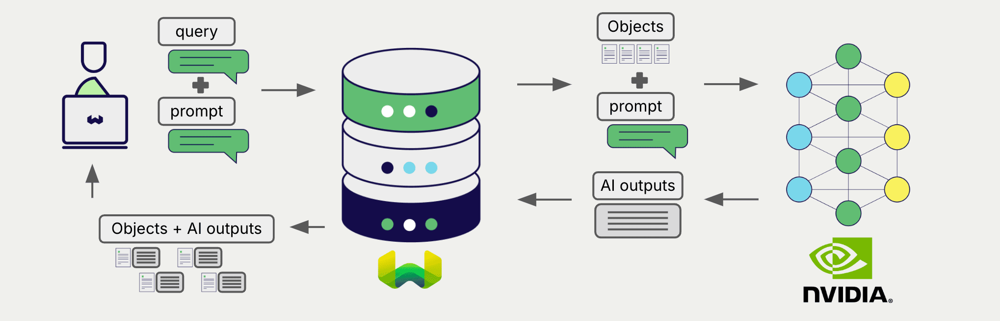
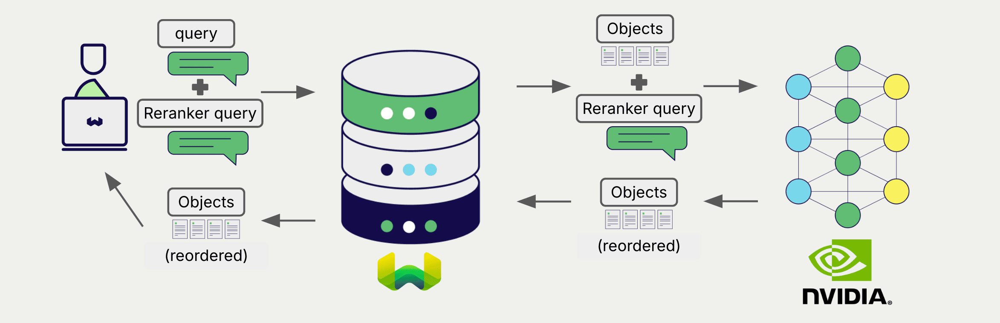

<!-- Note: for images, use https://docs.google.com/presentation/d/15opIcJuaIjEEcs_1Zm8B6pccox2p7_MHSjCnRv4dPfU/edit?usp=sharing -->

NVIDIA NIM マイクロサービスは、自然言語処理および生成のための幅広いモデルを提供します。Weaviate は NVIDIA とシームレスに統合されており、Weaviate Database 内で推論エンジンを活用できます。  

これらの統合により、開発者は高度な AI 駆動アプリケーションを簡単に構築できます。

## NVIDIA との統合

### ベクトル検索用埋め込みモデル

NVIDIA の埋め込みモデルは、テキストデータを高次元の ベクトル 表現へ変換し、意味と文脈を捉えます。  

[Weaviate は NVIDIA の埋め込みモデルと統合](./embeddings.md)しており、データのシームレスなベクトル化を実現します。これにより、追加の前処理やデータ変換ステップを行わずに、セマンティック検索やハイブリッド検索を実行できます。

[NVIDIA 埋め込み統合ページ](./embeddings.md)  
[NVIDIA マルチモーダル埋め込み統合ページ](./embeddings-multimodal.md)

### RAG 向け生成 AI モデル

NVIDIA 上の生成 AI モデルは、与えられたプロンプトとコンテキストに基づき、人間らしいテキストを生成します。  

[Weaviate の生成 AI 統合](./generative.md)により、Weaviate Database から直接 検索拡張生成 (RAG) を実行できます。Weaviate の高効率なストレージと高速検索機能を、NVIDIA の生成 AI モデルと組み合わせて、パーソナライズされた文脈適応型の応答を生成します。

[NVIDIA 生成 AI 統合ページ](./generative.md)

### リランカー モデル

NVIDIA のリランカーモデルは、検索結果の関連度と順位付けを改善するために設計されています。  

[Weaviate のリランカー統合](./reranker.md)を利用すると、NVIDIA のリランカーモデルで検索結果を簡単に洗練できます。

[NVIDIA リランカー統合ページ](./reranker.md)

## 概要

この統合により、開発者は Weaviate 内で NVIDIA の推論エンジンのパワーを活用できます。  

結果として、AI 駆動アプリケーションの構築プロセスが簡素化され、開発スピードが向上し、革新的なソリューションの創出に集中できます。

## 開始方法

この統合を利用するには、有効な NVIDIA API キーを Weaviate に提供する必要があります。[NVIDIA](https://build.nvidia.com/) にアクセスしてサインアップし、API キーを取得してください。  

次に、該当する統合ページに移動し、Cohere モデルで Weaviate を設定してアプリケーションで使用する方法を学びましょう。

- [テキスト埋め込み](./embeddings.md)
- [マルチモーダル埋め込み](./embeddings-multimodal.md)
- [生成 AI](./generative.md)
<!-- TODO - Add link back to reranker.md; removed because the link checker still sees it as a broken link -->
<!-- - [Reranker](./) -->

## 質問とフィードバック

import DocsFeedback from '/_includes/docs-feedback.mdx';

<DocsFeedback/>

